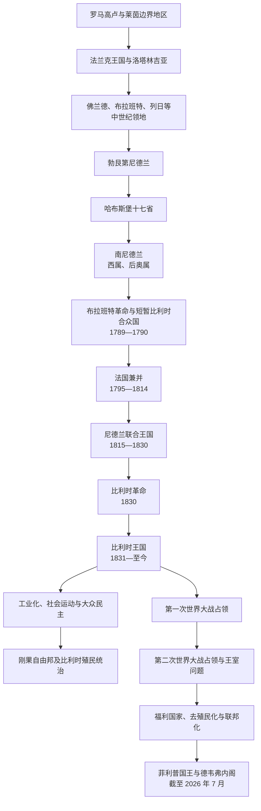

# 比利时

## 时间

现代比利时国家始于 1830 年革命，1831 年建立王国，1839 年获荷兰正式承认。现状核验截至 2026 年 7 月 14 日。

## 概括

比利时并非从一个中世纪统一王国直接延续而来。其领土长期分属佛兰德、布拉班特、埃诺、那慕尔、列日主教领等政治共同体，后来先后进入勃艮第尼德兰、哈布斯堡尼德兰、西属与奥属尼德兰、法国和尼德兰联合王国。1830 年，天主教徒与自由派因宗教教育、新闻自由、代表权、语言政策和南北财政经济利益联合反对威廉一世，革命在列强均势下建立了独立的君主立宪国家。

19 世纪比利时以煤炭、钢铁、机械、铁路和金融成为欧洲大陆较早工业化的国家，但财富增长伴随恶劣劳动条件、有限选举权和激烈社会冲突。利奥波德二世控制的刚果自由邦以及其后的比属刚果、卢旺达—乌隆地殖民统治依靠强迫劳动、种族等级和资源攫取。两次德国占领、战后福利建设、殖民解体及佛兰德—瓦隆—布鲁塞尔关系重组，推动比利时由单一制国家逐步转为联邦国家。

## 前史与南尼德兰形成

- 罗马时代的“比利时高卢”范围远大于今日比利时，不能把古代 Belgae 直接等同现代比利时民族。莱茵边界、通往海峡和高卢内陆的道路促进城市与贸易发展。
- 西罗马帝国衰落后，萨利安法兰克人以今日比利时北部为重要基地并扩张到高卢。843 年《凡尔登条约》后，今日比利时地区横跨西法兰克、洛塔林吉亚及后来的神圣罗马帝国边缘。
- 中世纪佛兰德伯国与法国王权关系密切，布拉班特、埃诺、那慕尔等多在帝国框架内，列日则为采邑主教领。根特、布鲁日、伊普尔、布鲁塞尔等城市凭纺织、市场和自治特许发展，城市、行会、贵族和领主间长期协商或冲突。
- 14—15 世纪勃艮第公爵通过婚姻、继承和战争汇集低地领地，建立三级会议和中央机构。1477 年“大胆查理”战死后，勃艮第的玛丽颁布《大特权》以争取各省支持，并与哈布斯堡的马克西米连结婚。
- 查理五世完成十七省的大部分整合。1555 年后腓力二世的集权、税收和宗教镇压引发尼德兰革命；但南方天主教贵族、城市与北方加尔文宗主导地区的选择逐渐分化。
- 1579 年阿拉斯联盟与国王和解，帕尔马公爵随后收复安特卫普等地。1585 年安特卫普陷落和斯海尔德航运受阻促使商人、工匠与新教徒北迁；南方继续在西班牙哈布斯堡治下，形成“西属尼德兰”。
- 西班牙王位继承战争后，1713—1714 年和约把南尼德兰转给奥地利哈布斯堡。地方省份、教会与城市仍保有特权，奥地利政府则推动财政、行政和经济改革。
- 1780 年代约瑟夫二世试图统一司法、削减教会和地方特权，引发布拉班特革命。1789 年起义者驱逐奥军，1790 年建立松散的“比利时合众国”，但保守“法农派”与较激进“冯克派”内斗，奥军同年恢复统治。
- 法国革命军于 1794 年取胜，1795 年正式兼并。法国废除封建权利、重划省区、推行政教分离、征兵和成文法；税收、征兵与反教会措施又引发 1798 年农民战争。拿破仑时期道路、港口和行政整合加强，但地方承担战争人力和物资。

## 尼德兰联合王国与 1830 年革命

### 1815 年联合安排

维也纳会议为遏制法国，把原荷兰共和国和南尼德兰合为尼德兰联合王国。威廉一世以国王主导行政，鼓励根特纺织、列日煤铁、安特卫普港和国家铁路、运河、银行建设。南方工业从国家信贷与北方殖民贸易中获益，却出现以下政治裂痕：

- 南方人口多于北方，在议会席位上却大体各占一半，许多高级官职和国家机构被认为偏向北方。
- 天主教会反对国王控制教育和神职培养，自由派反对新闻审查、行政集权及部长不向议会负责。
- 荷兰语推广触及法语精英利益，政策又无法立即解决佛兰德大众、瓦隆方言区及双语布鲁塞尔的复杂语言现实。
- 国债合并、税制和贸易政策造成地区利益争论；经济衰退和失业使城市不满更易转化为革命。
- 1828 年天主教徒与自由派形成“反对派联合”，暂时搁置彼此在教会问题上的分歧，以共同要求宪政自由。

### 革命与独立

- 1830 年 8 月布鲁塞尔歌剧演出后爆发骚乱，工人、民兵和政治反对派的行动迅速结合。王军 9 月进入布鲁塞尔失败，南方多地转向临时政府。
- 临时政府于 10 月宣布独立，国民议会制定自由色彩浓厚的宪法，并排除奥兰治—拿骚家族。列强会议接受比利时作为独立缓冲国，但对边界、债务和君主选择反复谈判。
- 1831 年 2 月，国民议会议长埃拉斯姆-路易·叙尔莱·德绍基耶任摄政；萨克森-科堡的利奥波德接受宪法并于 7 月 21 日宣誓为王。
- 威廉一世在 1831 年 8 月发动“十日战役”，荷军一度击败比利时军队；法国军队介入迫其撤退。安特卫普城堡的荷军至 1832 年才投降。
- 1839 年《伦敦条约》使荷兰正式承认比利时。林堡与卢森堡被分割，比利时承担部分联合王国债务；列强保证比利时永久中立，这一安排在 1914 年被德国入侵打破。

## 国家建立与民主化

1831 年宪法确立世袭君主、两院制议会、部长副署、司法独立、出版和宗教自由，但实际选举权限于缴纳较高税额的少数男性。天主教—自由派“联合主义”帮助新国家渡过早期外交和制度危机，1840 年代后两派竞争加强。国家最初以法语运作，尽管多数人口使用荷兰语方言；19 世纪佛兰德运动推动荷兰语逐步取得司法、行政、教育和立法平等地位，1898 年《平等法》确认荷法文本同等效力。

1893 年在罢工压力下采用男性普选但附加“复数票”，财富、教育和家庭条件仍可增加票数。1919 年实际实行男性一人一票，1948 年女性获得同等全国选举权。比例代表制、工会、互助会、学校和媒体围绕天主教、社会主义、自由主义等社会“支柱”组织，使冲突通过政党联盟进入国家制度。

## 国家元首完整序列

1830 年临时政府由集体执政，国民议会制定宪法后才设摄政和世袭王位。国王去世至继承人宣誓之间，宪法规定部长会议以比利时人民名义行使王权，故短暂间隔不是新君主在位。

| 顺序 | 国家元首 | 在位 / 任职 | 王室或身份 | 关键事件与备注 |
|---:|---|---|---|---|
| 前置 | 临时政府 | 1830 年 9 月—1831 年 2 月 | 革命集体机关 | 宣布独立、组织国民议会并推动宪法 |
| 摄政 | 埃拉斯姆-路易·叙尔莱·德绍基耶 | 1831 年 2 月 24 日—7 月 21 日 | 国民议会议长、摄政 | 在国王就位前行使国家元首职能 |
| 1 | **利奥波德一世** | 1831 年 7 月 21 日—1865 年 12 月 10 日 | 萨克森-科堡-哥达王朝；建国君主 | 十日战役、1839 年条约、巩固君主立宪与列强外交 |
| 2 | **利奥波德二世** | 1865 年 12 月 17 日—1909 年 12 月 17 日 | 利奥波德一世之子 | 工业与城市建设；个人控制刚果自由邦，暴行争议迫使 1908 年转为国家殖民地 |
| 3 | **阿尔贝一世** | 1909 年 12 月 23 日—1934 年 2 月 17 日 | 利奥波德二世之侄 | 一战中统率军队、战后普选与社会协商；登山事故去世 |
| 4 | 利奥波德三世 | 1934 年 2 月 23 日—1951 年 7 月 16 日 | 阿尔贝一世之子 | 1940 年投降并留在国内，引发与流亡政府冲突及战后“王室问题”；最终退位 |
| 摄政 | 夏尔亲王 | 1944 年 9 月 20 日—1950 年 7 月 20 日 | 利奥波德三世之弟 | 国王无法履职期间摄政，见证重建、妇女普选与北约创建 |
| 王室代理 | 博杜安王储 | 1950 年 8 月 11 日—1951 年 7 月 16 日 | 利奥波德三世长子，称“王家亲王” | 在王室问题妥协中代行王权；父退位后正式继位 |
| 5 | **博杜安** | 1951 年 7 月 17 日—1993 年 7 月 31 日 | 利奥波德三世之子 | 刚果独立、欧洲共同体、国家改革；1990 年因拒绝签署堕胎法而短暂被依法宣告不能统治，部长会议完成颁布 |
| 6 | 阿尔贝二世 | 1993 年 8 月 9 日—2013 年 7 月 21 日 | 博杜安之弟 | 联邦制度深化、长期组阁危机；主动退位 |
| 7 | **菲利普** | 2013 年 7 月 21 日—至今 | 阿尔贝二世之子 | 联邦多党政治与王室代表职能；截至 2026 年 7 月 14 日在位 |

## 政府首脑完整序列

1831—1918 年，政府领导人通常称“内阁首长”或由一位部长主导部长会议，首相职务尚未以现代方式固定；1918 年莱昂·德拉克鲁瓦开始正式使用“首相”称号。下表按官方政府序列列出全部内阁领导人，重复任期合并；战争中合法流亡政府与占领当局另表区分。

| 顺序 | 政府首脑 | 任期 | 主要阶段 / 备注 |
|---:|---|---|---|
| 1 | Étienne de Gerlache | 1831 年 | 独立后首届短命内阁 |
| 2 | Joseph Lebeau | 1831 年；1840—1841 年 | 利奥波德一世就位；后任自由派内阁 |
| 3 | Félix de Mûelenaere | 1831—1832 年 | 十日战役及安特卫普问题 |
| 4 | Albert Goblet d'Alviella | 1832—1834 年 | 建国外交与条约谈判 |
| 5 | Barthélémy de Theux de Meylandt | 1834—1840、1846—1847、1871—1874 年 | 联合主义、天主教内阁；第三任内去世 |
| 6 | Jean-Baptiste Nothomb | 1841—1845 年 | 建国制度巩固 |
| 7 | Sylvain Van de Weyer | 1845—1846 年 | 短期联合主义内阁 |
| 8 | Charles Rogier | 1847—1852、1857—1868 年 | 自由派执政、铁路与经济政策 |
| 9 | Henri de Brouckère | 1852—1855 年 | 自由派温和内阁 |
| 10 | Pieter de Decker | 1855—1857 年 | 最后联合主义尝试之一 |
| 11 | Walthère Frère-Orban | 1868—1870、1878—1884 年 | 自由派财政、教育及第一次学校战争 |
| 12 | Jules d'Anethan | 1870—1871 年 | 普法战争中立及政治危机 |
| 13 | Jules Malou | 1874—1878 年；1884 年 | 天主教党组织化、教育冲突 |
| 14 | Auguste Beernaert | 1884—1894 年 | 工业与社会立法，1893 年选举改革 |
| 15 | Jules de Burlet | 1894—1896 年 | 复数票制初期 |
| 16 | Paul de Smet de Naeyer | 1896—1899、1899—1907 年 | 经济扩张、殖民与社会问题 |
| 17 | Jules Vandenpeereboom | 1899 年 | 选举法争议导致短期执政 |
| 18 | Jules de Trooz | 1907 年 | 任内去世 |
| 19 | Frans Schollaert | 1908—1911 年 | 教育和兵役改革 |
| 20 | Charles de Broqueville | 1911—1918、1932—1934 年 | 一战政府及战间期危机内阁 |
| 21 | Gérard Cooreman | 1918 年 | 战争结束与回国过渡 |
| 22 | Léon Delacroix | 1918—1920 年 | 首位正式称首相者；男性一人一票与社会协商 |
| 23 | Henri Carton de Wiart | 1920—1921 年 | 战后联合政府 |
| 24 | Georges Theunis | 1921—1925、1934—1935 年 | 财政稳定及大萧条期技术内阁 |
| 25 | Aloys Van de Vyvere | 1925 年 | 仅维持约一个月的天主教内阁 |
| 26 | Prosper Poullet | 1925—1926 年 | 天主教—社会主义联盟 |
| 27 | Henri Jaspar | 1926—1931 年 | 货币稳定、战后经济治理 |
| 28 | Jules Renkin | 1931—1932 年 | 大萧条初期 |
| 29 | Paul van Zeeland | 1935—1937 年 | 金融危机后的联合与经济调整 |
| 30 | Paul-Émile Janson | 1937—1938 年 | 短期自由派主导联盟 |
| 31 | Paul-Henri Spaak | 1938—1939 年；1946 年 3 月；1947—1949 年 | 战前首相、战后短期及欧洲合作 |
| 32 | Hubert Pierlot | 1939—1945 年 | 1940 年与国王决裂后领导伦敦流亡政府 |
| 33 | Achille Van Acker | 1945—1946、1946 年 3—8 月、1954—1958 年 | 战后重建、煤炭战役和社会保障 |
| 34 | Camille Huysmans | 1946—1947 年 | 社会党—自由党联盟 |
| 35 | Gaston Eyskens | 1949—1950、1958—1961、1968—1973 年 | 王室问题、刚果独立与首次国家改革 |
| 36 | Jean Duvieusart | 1950 年 | 利奥波德三世回国与王室问题高潮 |
| 37 | Joseph Pholien | 1950—1952 年 | 王位交接和朝鲜战争时期 |
| 38 | Jean Van Houtte | 1952—1954 年 | 财政与学校争议 |
| 39 | Théo Lefèvre | 1961—1965 年 | 学校协定后的大联合；语言边界与社会改革 |
| 40 | Pierre Harmel | 1965—1966 年 | 短期基督教民主—社会党联盟 |
| 41 | Paul Vanden Boeynants | 1966—1968、1978—1979 年 | 地区矛盾与第一次国家改革前夜；后任过渡政府 |
| 42 | Edmond Leburton | 1973—1974 年 | 石油危机与三党联盟 |
| 43 | Leo Tindemans | 1974—1978 年 | 地区自治谈判、经济危机与欧洲合作 |
| 44 | Wilfried Martens | 1979—1981、1981—1992 年 | 多届联盟、1980 年国家改革、财政调整与联邦化 |
| 45 | Mark Eyskens | 1981 年 | Martens 两组任期之间的短期政府 |
| 46 | Jean-Luc Dehaene | 1992—1999 年 | 1993 年联邦国家确立、财政整顿与欧元准备 |
| 47 | Guy Verhofstadt | 1999—2008 年 | “彩虹”及自由—社会党联盟、社会改革与第五次国家改革 |
| 48 | Yves Leterme | 2008 年；2009—2011 年 | 长期组阁危机、金融危机和看守政府；两次任期被范龙佩任期分隔 |
| 49 | Herman Van Rompuy | 2008—2009 年 | 稳定金融危机后的联盟，后任欧洲理事会主席 |
| 50 | Elio Di Rupo | 2011—2014 年 | 第六次国家改革；541 天组阁危机后成立政府 |
| 51 | Charles Michel | 2014—2019 年 | 中右翼联盟；2018 年联盟破裂后看守执政 |
| 52 | Sophie Wilmès | 2019—2020 年 | 首位女性首相；看守政府及疫情初期特别授权 |
| 53 | Alexander De Croo | 2020—2025 年 2 月 3 日 | 七党“维瓦尔第”联盟；2024 年选举后长期看守 |
| 54 | **Bart De Wever** | 2025 年 2 月 3 日—至今 | N-VA 领导的五党联盟；首位出任联邦首相的佛兰德民族主义政党领袖，截至 2026 年 7 月 14 日在任 |

Gaston Eyskens、Achille Van Acker 等人的多届任期已在其首次出现的行内合并。表中顺序按每位政府首脑首次就任排列，任期栏保留全部复任；若要追踪每届内阁的交替，应以任期日期而非行号判断。

### 战时合法政府与占领实际权力

| 时期 | 法定国家权力 | 占领行政首脑与实际结构 | 说明 |
|---|---|---|---|
| 1914—1918 年德国占领 | 阿尔贝一世在伊瑟河未占区统率军队；德布罗克维尔、后科雷曼政府驻法国勒阿弗尔附近 | 德国总督莫里茨·冯·比辛（1914—1917），后路德维希·冯·法尔肯豪森（1917—1918）；总督府、军队和分区行政控制大部分国土 | 比利时政府未投降，国王、军队和政府仍保持法统；占领者实行征用、强迫劳动和分化佛兰德—瓦隆的“火焰政策” |
| 1940—1944 年德国占领 | 皮埃洛政府与议会授权体系最终转至伦敦；利奥波德三世作为战俘留在比利时且不参加流亡政府 | 军事司令亚历山大·冯·法尔肯豪森和行政长官埃格特·雷德尔掌握军政；1944 年改设帝国专员区，由约瑟夫·格罗厄领导 | 国王未经政府同意投降造成宪政冲突；占领行政、德国军警及本地合作者共同执行经济掠夺、镇压、强迫劳动和犹太人迫害 |
| 1944—1950 年国王不能统治期 | 议会确认利奥波德三世不能履职，由夏尔亲王摄政；政府对议会负责 | 解放后盟军短期承担军事安全，随后权力回归比利时宪政机构 | “不能统治”不是废黜；1950 年国王返国后由博杜安代理王权，1951 年利奥波德三世退位 |

## 工业化、社会冲突与民主化

- 19 世纪瓦隆煤田、铁矿、焦炭冶金、玻璃、机械和列日—沙勒罗瓦工业带，加上根特纺织、安特卫普港和国家支持的铁路网，使比利时成为欧洲大陆最早完成工业突破的国家之一。银行、股份公司和出口市场把小国领土接入跨国资本网络。
- 崛起并不意味着均衡繁荣。工厂劳动时间长、工资低、童工和住房卫生问题严重；1886 年瓦隆工业区暴动及镇压揭示社会危机。工会、合作社、天主教社会组织和比利时工人党推动劳动法、社会保险与选举改革。
- 1889 年后童工、妇女夜工和劳动保护逐步进入法律，1903 年工伤赔偿、战间期集体谈判以及 1944 年“社会契约”奠定现代社会保障。制度形成来自罢工、政党竞争、雇主协商和战争动员，并非一次性由国家赐予。
- 工业重心在 20 世纪后半叶由衰退的瓦隆煤钢区转向佛兰德港口、石化、汽车装配、服务和技术产业。区域经济差距改变财政转移和自治政治，却不能简化为“富裕佛兰德对贫困瓦隆”的单一矛盾。
- 普选、比例代表和社会支柱使天主教、社会主义、自由主义及后来地区政党通过联盟分享权力。政党自 1960—1970 年代沿语言线分裂后，联邦组阁必须跨越荷语与法语政党体系，导致谈判漫长但也形成妥协机制。

## 殖民扩张、行政结构与解体

### 刚果自由邦：国王的个人国家

利奥波德二世以国际协会、探险和亨利·莫顿·斯坦利取得的条约建立领土声索。1884—1885 年柏林会议并未把“刚果殖民地”赠给比利时，而是列强承认与利奥波德相关组织的主权安排；1885 年比利时议会许可国王另任刚果自由邦元首。两地由同一君主联系，但刚果自由邦不是当时比利时宪法下的殖民地。

自由邦以公地声明、武装部队、特许公司和橡胶、象牙配额扩张。殖民军及公司人员以人质、鞭刑、毁村和肢体残害迫使社区交付产品，战争、饥荒、疾病、逃亡和低生育共同造成人口灾难。刚果人的抵抗、传教士与调查者的证词、国际反暴行运动及经营债务削弱利奥波德的地位，1908 年比利时国家在巨大压力下接管。

### 比属刚果：国家、教会与公司的“殖民三位一体”

1908 年《殖民宪章》把立法最终置于比利时议会，殖民大臣在布鲁塞尔制定政策，总督在博马、后在利奥波德维尔统辖地方行政。矿业和种植园公司掌握资本与生产，天主教传教体系承担大量教育、医疗和社会规训，殖民官员、军队与被改造的地方权威执行征税和劳动力政策。所谓“家长式治理”修建铁路、医院、学校并提高部分生活指标，却以种族隔离、政治无权和限制高等教育为基础。

加丹加铜、钻石、橡胶、棉花、棕榈油以及二战时期战略矿产把殖民地接入全球市场，利润、税收和企业收益并不等同于刚果社会自主发展。城市工人、退伍军人、教会教育形成的“进化者”、地方协会和民族主义组织在战后迅速成长。1959 年利奥波德维尔骚乱后，比利时政府在准备不足和政治压力下加速退出；1960 年 6 月 30 日刚果独立，行政与军队非洲化不足随即加剧国家危机。

### 卢旺达—乌隆地托管统治

比利时军队在第一次世界大战中占领德国控制的卢旺达和布隆迪，1922 年起依国际联盟委任统治，1946 年改为联合国托管。驻地官员借国王、酋长和副酋长实行间接统治，同时集中和重组地方权力。殖民人口分类、学校与身份证制度把原有且可变的胡图、图西、特瓦社会区分固化为近似种族等级；1950 年代后比利时支持重心转变，又使政治竞争迅速激化。1962 年卢旺达和布隆迪分别独立。

### 殖民最高权力与行政首脑

| 政体 / 时期 | 名义最高权力 | 殖民行政首脑与实际权力 | 终结 |
|---|---|---|---|
| 刚果自由邦（1885—1908） | 利奥波德二世为主权者，与比利时王位构成个人联系 | 布鲁塞尔中央机关、驻刚果总督、殖民军及特许公司分掌政令、征收和武力；国王对制度负最终责任 | 国际抗议、财政压力及比利时议会接管 |
| 比属刚果（1908—1960） | 比利时国家、国王与议会依《殖民宪章》行使主权 | 殖民大臣负责本土政策，总督为当地最高行政首脑；省长、地区官、殖民军、公司和传教组织构成实际统治网络 | 刚果民族主义、殖民秩序合法性崩溃和仓促权力移交 |
| 卢旺达—乌隆地（1922—1962） | 国际联盟委任、后联合国托管下的比利时管理国 | 总督层级与驻地官员监督两地王国和酋长体系；教会教育、行政分类与地方精英共同治理 | 联合国监督、群众政治和两个国家分别独立 |

更完整的中非本地过程见[刚果民主共和国：前殖民社会与殖民统治](/%E4%BA%BA%E6%96%87%E7%A7%91%E5%AD%A6/%E5%8E%86%E5%8F%B2/%E9%9D%9E%E6%B4%B2/%E4%B8%AD%E9%9D%9E/%E5%88%9A%E6%9E%9C%E6%B0%91%E4%B8%BB%E5%85%B1%E5%92%8C%E5%9B%BD/%E5%89%8D%E6%AE%96%E6%B0%91%E7%A4%BE%E4%BC%9A%E4%B8%8E%E6%AE%96%E6%B0%91%E7%BB%9F%E6%B2%BB.md)与[殖民资源体系、独立与中非冲突](/%E4%BA%BA%E6%96%87%E7%A7%91%E5%AD%A6/%E5%8E%86%E5%8F%B2/%E9%9D%9E%E6%B4%B2/%E4%B8%AD%E9%9D%9E/%E6%AE%96%E6%B0%91%E8%B5%84%E6%BA%90%E4%BD%93%E7%B3%BB%E3%80%81%E7%8B%AC%E7%AB%8B%E4%B8%8E%E4%B8%AD%E9%9D%9E%E5%86%B2%E7%AA%81.md)；这里保留比利时国家与殖民机关的关系，避免在欧洲国家页重复维护非洲通史。

## 两次世界大战、王室问题与战后重建

- 1914 年德国以施里芬计划需要通道为由入侵中立比利时。列日、那慕尔等要塞抵抗未能阻止推进，德军在迪南、鲁汶等地杀害平民并毁坏文化财产。比利时军队退至伊瑟河防线，国土大部受总督府占领，强迫劳动、征用和封锁造成社会苦难。
- 战后比利时收回东部小片领土，取得卢旺达—乌隆地委任统治，并以男性一人一票、工会谈判和社会政策缓和冲突。赔款、重建和货币问题仍使战间期经济脆弱。
- 1940 年 5 月德国发动进攻，比利时军队进行十八日战役后，利奥波德三世以军队统帅身份投降；皮埃洛政府主张继续战争并最终在伦敦恢复运作。国王与政府的分裂在占领后演变为“王室问题”。
- 纳粹占领者掠夺工业和劳动力，约两万五千名从比利时及法国北部被驱逐的犹太人经梅赫伦转运，多数遇害。抵抗网络从事地下出版、情报、逃生线和武装破坏，本地合作者则参与征募、行政和迫害；两者都不能代表整个语言群体。
- 1944 年大部国土解放，阿登战役又重创东部。流亡政府、雇主和工会达成的社会保障安排于战后实施，重建、煤钢合作和马歇尔援助推动复苏。
- 1950 年咨询性公投全国多数支持利奥波德三世返国，但佛兰德与瓦隆投票差异显著；返国后的罢工、冲突及人员死亡使国家接近危机。利奥波德先让博杜安代理王权，1951 年正式退位。这是宪政合法性、战争记忆和地区分歧交织的结果，不能只归因于国王个人选择。

## 语言政治与联邦化

语言平等经历了法律承认、领土划界和权力下放三个阶段。19 世纪国家精英主要使用法语，佛兰德运动推动荷兰语进入刑事审判、行政、教育和立法；瓦隆运动则逐渐把法语文化与地区经济自治联系起来。1962—1963 年语言边界大体固定，布鲁塞尔成为法荷双语区，东部保留德语区。1968 年鲁汶大学语言冲突及政党分裂表明单一制已难调和地区诉求。

1970、1980、1988—1989、1993、2001 和 2012—2014 年六轮国家改革逐步建立共同体与大区；1993 年宪法正式称比利时为联邦国家。改革既是国家“离心”的表现，也是通过自治、防止冲突升级并维持共同社会保障、财政、国防和外交的续存机制。

## 当代联邦统治结构

| 层级 | 构成 / 产生方式 | 主要权力与实际关系 |
|---|---|---|
| 国王 | 世袭国家元首 | 与联邦部长共同构成行政权；所有政治行为须部长副署，组阁咨询与国家代表作用受宪政惯例约束 |
| 联邦政府 | 首相领导、依众议院多数或信任组成；部长除首相外须保持荷法语人数相等 | 外交、国防、司法、社会保障、联邦财政及部分卫生和内政；多党、跨语言联盟是常态 |
| 联邦议会 | 众议院直接选举；参议院主要由共同体和大区议会派出 | 众议院掌握信任、预算和主要立法；参议院集中处理宪制及联邦实体相关事项 |
| 三个共同体 | 佛兰德、法语、德语共同体，各有议会和政府；佛兰德共同体与佛兰德大区机构合并运作 | 文化、教育、语言及面向个人的卫生与社会事务；权力按人群和语言联系组织 |
| 三个大区 | 佛兰德、瓦隆、布鲁塞尔首都大区，各具立法和政府机构 | 经济、就业、环境、空间规划、住房、交通等领土事务；布鲁塞尔具有双语和特殊保障 |
| 省与市镇 | 地方民选机关，受相应大区监督 | 地方公共服务；不与共同体或大区处于同一主权层级 |
| 欧盟、比荷卢与跨境合作 | 通过条约和国内权限分工参与 | 联邦实体可在自身权限内开展对外关系；欧盟决策常需内部协调，不能视为仅由联邦政府垄断 |

## 重要事件

| 时间 | 事件 | 结果与长期影响 |
|---|---|---|
| 1477 年 | 《大特权》与勃艮第继承危机 | 省份特权重新确认，低地遗产转向哈布斯堡 |
| 1579—1585 年 | 阿拉斯联盟、南北分化与安特卫普陷落 | 南尼德兰留在哈布斯堡体系，商业人口大量北迁 |
| 1713—1714 年 | 西班牙王位继承战争和约 | 南尼德兰由西班牙支系转入奥地利哈布斯堡 |
| 1789—1790 年 | 布拉班特革命与比利时合众国 | 反集中改革成功但内部冲突使政权迅速失败 |
| 1795 年 | 法国兼并 | 废封建、行政法制统一，也带来征兵与宗教冲突 |
| 1815 年 | 尼德兰联合王国建立 | 北南尼德兰被纳入共同王国，结构矛盾累积 |
| 1830—1831 年 | 革命、独立与利奥波德一世宣誓 | 建立君主立宪国家 |
| 1839 年 | 《伦敦条约》 | 荷兰正式承认独立并确定林堡、卢森堡分割 |
| 1886—1893 年 | 工业暴动、工人运动与选举改革 | 社会问题进入国家政治，男性普选但仍有复数票 |
| 1885—1908 年 | 刚果自由邦 | 国王个人国家的强制资源体系引发国际反暴行运动 |
| 1908 年 | 比利时接管刚果 | 私人国家变为国家殖民地，殖民责任转归议会与政府 |
| 1914—1918 年 | 德国入侵、伊瑟防线与占领 | 中立被破坏，国土重创，战后政治社会改革加速 |
| 1919—1948 年 | 一人一票、比例代表及妇女普选 | 大众民主和联盟政治逐步完成 |
| 1940—1944 年 | 第二次德国占领 | 大屠杀、强迫劳动、抵抗与合作留下长期记忆冲突 |
| 1950—1951 年 | 王室问题与利奥波德三世退位 | 王朝延续但国王直接政治空间进一步收缩 |
| 1951—1958 年 | 欧洲煤钢共同体、比荷卢及学校协定 | 战后欧洲整合与社会支柱妥协制度化 |
| 1960—1962 年 | 刚果、卢旺达和布隆迪独立 | 比利时殖民帝国终结，殖民遗产延续 |
| 1962—1968 年 | 语言边界与鲁汶危机 | 领土语言制度固定，政党和大学沿语言分裂 |
| 1970—1993 年 | 前四次国家改革 | 单一制转为联邦国家 |
| 2001、2012—2014 年 | 第五、第六次国家改革 | 财政、就业和社会等更多权力转移至联邦实体 |
| 2010—2011 年 | 541 天联邦组阁危机 | 显示分裂政党体系的协调成本，也以制度连续性渡过危机 |
| 2025 年 | 德韦弗政府成立 | 首位佛兰德民族主义政党领袖出任联邦首相 |

## 崛起、危机与转型原因

- **工业崛起的结构条件**：煤铁资源、密集城市和运河、安特卫普港、法国与德意志之间的市场位置，以及银行和国家铁路投资共同推动早期工业化。
- **国家巩固机制**：1831 年自由宪法、列强承认、王朝外交和天主教—自由派联合，使新国家在荷兰压力和内部差异下获得制度连续性。
- **社会冲突与民主化**：工业财富分配不均、工人组织和大罢工迫使精英扩大选举权和劳动保护；比例代表、社会支柱及联盟政府把阶级冲突纳入协商。
- **殖民扩张条件**：利奥波德二世的个人外交、欧洲瓜分非洲、武装公司和全球橡胶矿产需求促成扩张；暴力制度与国际揭露是 1908 年接管的直接原因。
- **外部压力**：两次德国入侵证明永久中立不足以保障安全，战争破坏也推动战后比荷卢、北约和欧洲共同体选择。
- **单一制衰落的结构因素**：语言权利、经济重心转移、教育文化自治和语言化政党竞争使中央同质化方案失效；鲁汶危机等事件成为改革触发点。
- **联邦国家延续条件**：共同体与大区自治降低零和冲突，联邦社会保障、财政、王室、首都布鲁塞尔和欧洲制度又维持共同利益。
- **现代脆弱性**：多层级权限交错、政党体系分裂、财政转移、公共债务和产业转型增加决策成本；但长期看守政府仍受议会、法律和行政连续性约束，不能等同无政府状态。

## 关键辨析

- “比利时”在早期近代常是尼德兰地区的拉丁或地理称呼；现代比利时国家始于 1830 年革命，不能把古代 Belgae 或勃艮第尼德兰直接当作同一民族国家。
- 刚果自由邦是利奥波德二世另任主权者的个人国家，不是 1885 年即由比利时政府统治；1908 年以后才是比属刚果。
- 国王拥有被咨询、鼓励和警告的影响及组阁中的象征—程序作用，但政治行为须部长负责；利奥波德三世危机反而强化了这一界限。
- 共同体按语言文化和面向个人事务组织，大区按领土经济事务组织，两者不是同一套三级行政区；佛兰德机构合并也不意味着全国均如此。
- 布鲁塞尔在领土上构成独立大区并实行法荷双语，不是佛兰德或瓦隆的普通城市；德语共同体也是联邦结构中有自治权的第三共同体。
- 联邦化既包含地区分权，也是一套维持国家共同体的妥协；不能简单写成比利时已经解体或必然走向解体。

## 演变关系

- 共同统治者与总督专表：[勃艮第与哈布斯堡尼德兰统治者和总督表](/%E4%BA%BA%E6%96%87%E7%A7%91%E5%AD%A6/%E5%8E%86%E5%8F%B2/%E6%AC%A7%E6%B4%B2/%E4%BD%8E%E5%9C%B0%E5%9B%BD%E5%AE%B6/%E5%8B%83%E8%89%AE%E7%AC%AC%E4%B8%8E%E5%93%88%E5%B8%83%E6%96%AF%E5%A0%A1%E5%B0%BC%E5%BE%B7%E5%85%B0%E7%BB%9F%E6%B2%BB%E8%80%85%E5%92%8C%E6%80%BB%E7%9D%A3%E8%A1%A8.md)。
- 上级总览：[低地国家历史](/%E4%BA%BA%E6%96%87%E7%A7%91%E5%AD%A6/%E5%8E%86%E5%8F%B2/%E6%AC%A7%E6%B4%B2/%E4%BD%8E%E5%9C%B0%E5%9B%BD%E5%AE%B6/README.md)。
- 联合王国的前后节点：[荷兰](/%E4%BA%BA%E6%96%87%E7%A7%91%E5%AD%A6/%E5%8E%86%E5%8F%B2/%E6%AC%A7%E6%B4%B2/%E4%BD%8E%E5%9C%B0%E5%9B%BD%E5%AE%B6/%E8%8D%B7%E5%85%B0.md)、[卢森堡](/%E4%BA%BA%E6%96%87%E7%A7%91%E5%AD%A6/%E5%8E%86%E5%8F%B2/%E6%AC%A7%E6%B4%B2/%E4%BD%8E%E5%9C%B0%E5%9B%BD%E5%AE%B6/%E5%8D%A2%E6%A3%AE%E5%A0%A1.md)。
- 哈布斯堡背景：[西班牙哈布斯堡王朝](/%E4%BA%BA%E6%96%87%E7%A7%91%E5%AD%A6/%E5%8E%86%E5%8F%B2/%E6%AC%A7%E6%B4%B2/%E4%BC%8A%E6%AF%94%E5%88%A9%E4%BA%9A%E5%8D%8A%E5%B2%9B/%E8%A5%BF%E7%8F%AD%E7%89%99/%E8%A5%BF%E7%8F%AD%E7%89%99%E5%93%88%E5%B8%83%E6%96%AF%E5%A0%A1%E7%8E%8B%E6%9C%9D.md)、[哈布斯堡君主国](/%E4%BA%BA%E6%96%87%E7%A7%91%E5%AD%A6/%E5%8E%86%E5%8F%B2/%E6%AC%A7%E6%B4%B2/%E5%BE%B7%E6%84%8F%E5%BF%97/%E5%A5%A5%E5%9C%B0%E5%88%A9/%E5%93%88%E5%B8%83%E6%96%AF%E5%A0%A1%E5%90%9B%E4%B8%BB%E5%9B%BD.md)。
- 殖民地本地主线：[刚果民主共和国](/%E4%BA%BA%E6%96%87%E7%A7%91%E5%AD%A6/%E5%8E%86%E5%8F%B2/%E9%9D%9E%E6%B4%B2/%E4%B8%AD%E9%9D%9E/%E5%88%9A%E6%9E%9C%E6%B0%91%E4%B8%BB%E5%85%B1%E5%92%8C%E5%9B%BD/README.md)、[卢旺达](/%E4%BA%BA%E6%96%87%E7%A7%91%E5%AD%A6/%E5%8E%86%E5%8F%B2/%E9%9D%9E%E6%B4%B2/%E4%B8%9C%E9%9D%9E/%E5%8D%A2%E6%97%BA%E8%BE%BE/README.md)、[布隆迪](/%E4%BA%BA%E6%96%87%E7%A7%91%E5%AD%A6/%E5%8E%86%E5%8F%B2/%E9%9D%9E%E6%B4%B2/%E4%B8%9C%E9%9D%9E/%E5%B8%83%E9%9A%86%E8%BF%AA/README.md)。
