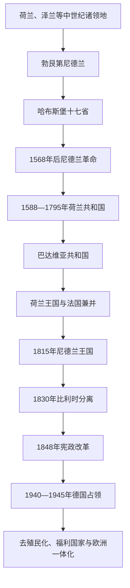

# 荷兰

## 概括

荷兰国家史形成于低地国家北部诸省反抗哈布斯堡统治的长期战争。17世纪荷兰共和国成为海上贸易、金融、科学与殖民扩张的重要中心；法国革命战争后经历政体重组，1815年建立尼德兰王国。19—20世纪的宪政、工业化、殖民统治、战争占领与欧洲一体化构成现代主线。

## 演变关系

## 统治结构与政治阶段

| 阶段 | 时间 | 统治结构 |
|---|---|---|
| 哈布斯堡尼德兰 | 15世纪末—16世纪 | 君主通过总督和地方机构统治，各省保留不同特权。 |
| 荷兰共和国 | 1588—1795年 | 七省联合，各省议会、联省议会、省督与城市寡头分享权力。 |
| 革命与法国时期 | 1795—1813年 | 巴达维亚共和国、拿破仑扶植的荷兰王国及法国直接统治先后出现。 |
| 尼德兰王国 | 1815年至今 | 世袭君主立宪制；1848年后议会责任内阁逐步确立。 |
| 战后政治 | 1945年至今 | 议会民主、福利国家、欧洲合作与殖民帝国解体。 |

## 重要事件

- 1568年后尼德兰革命演变为反抗西班牙哈布斯堡统治的长期战争，1648年荷兰共和国的独立获得国际承认。
- 17世纪荷兰东印度公司和西印度公司参与亚洲、大西洋贸易、殖民战争和奴隶贸易。
- 1815年北南尼德兰合并；1830年比利时革命后，荷兰王国范围重新确定。
- 1848年宪法改革强化议会与内阁责任，削弱君主直接政治权力。
- 第二次世界大战期间荷兰遭德国占领，犹太人和其他群体遭受迫害与驱逐。
- 1949年荷兰承认印度尼西亚主权转移，战后殖民体系逐步结束。

## 关键辨析

- “荷兰”常被口语用来指整个尼德兰，但历史上的荷兰只是共和国和王国内的重要省区之一。
- 荷兰商业繁荣与殖民征服、奴隶贸易和强迫劳动同时存在。
- 所谓“黄金时代”主要描述17世纪部分城市和行业，不代表社会各阶层同等繁荣。

## 上级

- [低地国家](/%E4%BA%BA%E6%96%87%E7%A7%91%E5%AD%A6/%E5%8E%86%E5%8F%B2/%E6%AC%A7%E6%B4%B2/%E4%BD%8E%E5%9C%B0%E5%9B%BD%E5%AE%B6/README.md)
