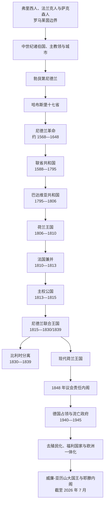

# 荷兰

## 时间

作为独立政治共同体约始于 1588 年；现代尼德兰王国始于 1815 年。现状核验截至 2026 年 7 月 14 日。

## 概括

现代荷兰形成于低地国家北部诸省反抗西班牙哈布斯堡统治的长期战争。中世纪的“尼德兰”由伯国、公国、主教领和自治城市构成，并不等于今日荷兰；16 世纪末，北方七省在宗教、财政、地方特权和战争动员的共同压力下组成联省共和国。17 世纪共和国依靠北海航运、波罗的海贸易、城市制造业、金融制度和武装特许公司成为世界性商业强国，但繁荣同时建立在殖民战争、奴隶贸易、强迫劳动和亚洲既有贸易网络之上。

18 世纪相对衰落并非突然“失去海权”，而是英国、法国等中央集权国家的财政军事能力上升、荷兰产业和贸易优势缩小、国内寡头政治僵化及多次战争损耗共同造成。1795—1813 年间，荷兰先后经历巴达维亚共和国、拿破仑扶植的荷兰王国和法国直接兼并。1815 年北南尼德兰被合并为王国，1830 年比利时革命使其分裂；1848 年改革奠定责任内阁。两次世界大战、去殖民化、福利国家、治水工程和欧洲一体化则塑造了当代荷兰。

## 前史与低地诸领地

- 罗马时代，莱茵河下游大体构成帝国北部边界。其南有城市、道路和军营，北部则有弗里西等群体；“荷兰民族”尚未形成。
- 5—9 世纪，法兰克势力扩张并将南部纳入墨洛温、加洛林王国，沿海弗里西贸易区和东部萨克森地区逐步基督教化。843 年《凡尔登条约》后，低地国家在西法兰克、洛塔林吉亚与东法兰克之间反复重组。
- 约 10—14 世纪，荷兰伯国、泽兰伯国、海尔德公国、乌得勒支主教领、弗里斯兰自由地区和上艾瑟尔等形成不同制度。围海造田、水利委员会、港口和城市特许，使地方合作与自治比固定国界更重要。
- 14—15 世纪，勃艮第公爵通过婚姻、继承和战争集中低地领地，建立跨省议会和共同财政机构，但各省仍坚持特权。1477 年勃艮第的玛丽与哈布斯堡的马克西米连结婚，尼德兰遗产进入哈布斯堡体系。
- 查理五世陆续取得十七省，并以 1549 年《国事诏书》强调共同继承；这促进政治整合，却没有消除省际法律、税制、语言和宗教差异。1555 年后，腓力二世从西班牙遥控统治，集权、战争税负、主教区改革和镇压新教共同扩大矛盾。

## 尼德兰革命与共和国建立

### 起因

- **宗教冲突**：路德宗、再洗礼派和加尔文宗传播，1566 年破坏圣像运动引发大规模镇压；但反抗阵营并非全为新教徒。
- **地方特权**：贵族、城市和省议会反对君主绕过传统协商征税、任官和重组教区。
- **财政军事压力**：哈布斯堡与法国、奥斯曼等长期战争需要税收和驻军，欠饷部队又多次掠夺尼德兰城市。
- **政治动员**：奥兰治的威廉把维护地方自由、宗教宽容和反对暴政结合起来，为分散的省份提供领袖与外交网络。

### 过程

- 1567 年阿尔瓦公爵率军入境，设“除暴委员会”并处决埃格蒙特、霍恩等贵族。1568 年奥兰治的威廉军事行动通常被视为八十年战争开端。
- 1572 年“海上乞丐”夺取布里勒，荷兰、泽兰多座城市转向反叛；战争由流亡者行动转为拥有城镇、税基和舰队的长期斗争。
- 1576 年西班牙军队因欠饷劫掠安特卫普，南北各省以《根特和约》要求外国军队撤离。宗教政策和地方利益分歧很快使共同阵线破裂。
- 1579 年南方部分省份组成阿拉斯联盟并与国王和解；北方以《乌得勒支同盟》建立军事财政联盟。1581 年《断绝法案》宣布腓力二世丧失统治权。
- 反叛省份曾寻找法国安茹公爵和英格兰莱斯特伯爵等外国保护者，但均未建立稳定君主制。1588 年联省议会接管主权事务，共和国由此成形。
- 1609—1621 年十二年休战使共和国得到事实承认。战争恢复后，联省继续依靠海军、要塞和法国联盟作战；1648 年《明斯特和约》确认其独立，并关闭斯海尔德河口，巩固阿姆斯特丹相对安特卫普的贸易优势。

## 联省共和国

### 联邦结构

共和国不是由一位总统领导的现代民族国家。七省各有省议会，城市摄政寡头控制许多席位；联省议会处理外交、战争和共同财政，重大事项通常须省份同意。荷兰省人口和税收最多，其“大议长”常主导外交与日常协调。省督原为君主的省级代表，革命后由各省任命，通常兼任军队统帅；奥兰治家族的省督与城市摄政派既合作又竞争。

| 角色 | 产生与权力 | 关键限制 |
|---|---|---|
| 联省议会 | 各省派代表，负责外交、战争、共同领地与特许公司 | 代表受省议会训令，联邦税收和决策常需复杂协商 |
| 各省议会 | 由城市和贵族等地方团体组成 | 荷兰省最强，但不能合法吞并其他省份主权 |
| 荷兰省大议长 | 荷兰省高级文官，约翰·德·维特等人曾主导政策 | 不是共和国“首相”，权力依赖省议会与城市联盟 |
| 省督 | 各省任命，多由奥兰治—拿骚家族担任，兼具军事和任官权 | 1747 年前并非统一的世袭全国职位；无省督期不等于无政府 |
| 海军部与陆军统帅 | 五个海军部筹建舰队，省督常任陆军统帅 | 分散财政导致战略协调困难 |
| 特许公司 | 东印度公司、西印度公司获贸易、建堡、缔约和战争权 | 名义受国家授权，实际由董事会、地方分部与殖民官员共同运作 |

### 省督完整序列

1747 年以前各省可任命不同省督，下表分别列出政治影响最大的荷兰—泽兰主线与在两次“无省督时期”仍延续的弗里斯兰主线，不能把其中任何一人简单称为共和国世袭国家元首。

| 时段 | 荷兰、泽兰等省主线 | 范围与备注 |
|---|---|---|
| 1572—1584 年 | **奥兰治的威廉一世** | 荷兰、泽兰、乌得勒支等反叛省省督；1584 年遇刺 |
| 1585—1625 年 | **毛里茨** | 威廉一世之子；先后任荷兰、泽兰、乌得勒支等省省督并统率陆军 |
| 1625—1647 年 | **弗雷德里克·亨德里克** | 毛里茨异母弟；夺取多座边境要塞，提升奥兰治家族宫廷地位 |
| 1647—1650 年 | 威廉二世 | 弗雷德里克·亨德里克之子；与荷兰城市摄政派冲突，早逝 |
| 1650—1672 年 | 第一次无省督时期 | 荷兰、泽兰等不设省督；弗里斯兰与格罗宁根仍有拿骚支系省督 |
| 1672—1702 年 | **威廉三世** | 法荷战争“灾难年”中获任；1689 年起兼任英格兰、苏格兰和爱尔兰国王，两国并未合并 |
| 1702—1747 年 | 第二次无省督时期 | 荷兰等省不设省督；弗里斯兰支系继续任职 |
| 1747—1751 年 | **威廉四世** | 法军入侵危机中成为七省首位统一、世袭的总省督 |
| 1751—1795 年 | 威廉五世 | 威廉四世之子；未成年时先后由安妮长公主、拿骚-魏尔堡的玛丽·路易丝和不伦瑞克公爵摄政；1795 年流亡 |

| 时段 | 弗里斯兰—格罗宁根拿骚支线 | 备注 |
|---|---|---|
| 1584—1620 年 | 威廉·路易 | 弗里斯兰省督，毛里茨的重要军事合作者 |
| 1620—1632 年 | 恩斯特·卡西米尔 | 拿骚-迪茨伯爵，后兼格罗宁根、德伦特省督 |
| 1632—1640 年 | 亨德里克·卡西米尔一世 | 恩斯特·卡西米尔之子 |
| 1640—1664 年 | 威廉·弗雷德里克 | 继续弗里斯兰省督，并在 1650 年后任格罗宁根、德伦特省督 |
| 1664—1696 年 | 亨德里克·卡西米尔二世 | 威廉·弗雷德里克之子；未成年初期由母亲摄政 |
| 1696—1711 年 | 约翰·威廉·弗里索 | 继承弗里斯兰、格罗宁根省督；被威廉三世指定为私人财产继承人之一但未继承其全部政治职位 |
| 1711—1747 年 | 威廉四世 | 出生后继位，由母亲玛丽·路易丝摄政；陆续取得更多省督职位，1747 年统一七省省督职 |

### 崛起、鼎盛与相对衰落

- 16 世纪末安特卫普受战争封锁，大量商人、工匠和知识人才迁往北方；阿姆斯特丹同时承接波罗的海粮食、木材、盐和鲱鱼贸易。
- 东印度公司于 1602 年成立，阿姆斯特丹银行于 1609 年成立，西印度公司于 1621 年成立。股份融资、海上保险、票据、交易所和可预测税收提高远洋战争与商业的动员能力。
- 共和国具有高城市化、识字和出版水平，造船、地图、光学、绘画及科学网络繁荣；但乡村、海员、士兵、妇女、移民和殖民地劳动者并未平均分享财富。
- 1652—1674 年三次英荷战争与法国扩张迫使共和国持续提高军费。1672 年英国、法国及德意志盟友同时进攻的“灾难年”击垮德·维特政权，威廉三世恢复省督职位。
- 18 世纪英国获得更大国内市场、工业和海军财政能力，法国亦能长期维持庞大军队；荷兰资本更多转向国际借贷，部分制造业和转口贸易竞争力下降。
- 1780—1784 年第四次英荷战争严重破坏航运与殖民据点。爱国者运动要求民兵和城市政治改革，1787 年在普鲁士干预下失败；旧制度失去改革机会，1795 年难以抵挡法国军队与流亡爱国者回归。

## 革命、拿破仑与国家重组

| 阶段 | 时间 | 国家元首 / 最高机关 | 政府与实际权力 |
|---|---|---|---|
| 巴达维亚临时体制 | 1795—1796 年 | 临时人民代表机构及改组后的联省议会 | 法国军队在境内，爱国者废除旧省督制并推动公民平等 |
| 国民议会 | 1796—1798 年 | 民选国民议会 | 首次为整个共和国制宪；联邦派与单一国家派竞争 |
| 执政委员会 | 1798—1801 年 | 五人执政委员会 | 法国支持的政变建立单一制共和国；随后内部政变缓和激进政策 |
| 国政委员会 | 1801—1805 年 | 十二人国政委员会 | 恢复较多地方和精英影响，仍受法国外交军事支配 |
| 大议长政体 | 1805—1806 年 | 鲁特格尔·扬·斯希默尔彭宁克 | 拿破仑要求强化行政；推行财政、教育与行政改革 |
| 荷兰王国 | 1806—1810 年 | 路易·波拿巴；1810 年路易二世短暂名义继位 | 拿破仑扶植君主制；路易试图维护本地利益，因大陆封锁执行不力被迫退位 |
| 法国直接统治 | 1810—1813 年 | 法兰西皇帝拿破仑一世 | 并入帝国省制；勒布伦任总督，征兵、税收和大陆封锁加重负担 |
| 临时政府 | 1813 年 11—12 月 | 范霍亨多普与范德杜因·范马斯丹 | 法军撤退后恢复独立，邀请奥兰治家族回国 |
| 尼德兰主权公国 | 1813—1815 年 | **主权亲王威廉·弗雷德里克** | 以宪法和精英会议建立集中行政；1815 年称王 |

革命时期废除省际主权、行会特权和部分宗教限制，建立统一税制、行政区和成文宪法。尽管政体频繁变化且受法国控制，现代中央国家的许多制度并非 1813 年凭空恢复，而是在这一时期形成。

## 王国建立、比利时分离与宪政

### 1815—1839 年联合王国

维也纳会议为在法国北部建立屏障，把原共和国、南尼德兰和列日主教领合为尼德兰联合王国，威廉一世兼任卢森堡大公。北方拥有行政与王朝中心，南方人口更多、工业较发达且以天主教为主。威廉一世推动运河、贸易、教育和工业投资，却以集中的语言、宗教、财政与人事政策激怒南方天主教徒和自由派。

1830 年布鲁塞尔革命迅速扩散。荷军在“十日战役”中一度反攻，但法国介入和列强调停使比利时维持独立。威廉一世至 1839 年才接受《伦敦条约》；林堡与卢森堡被分割，联合王国的法定解体晚于 1830 年实际分离。

### 1848 年改革与民主化

1848 年欧洲革命压力下，威廉二世接受约翰·鲁道夫·托尔贝克主持修宪。部长对议会负责，国王不再直接决定政策，众议院改由选举产生，议会权利扩大。此后普选并非一次完成：1917 年男性普选与学校问题妥协，1919 年妇女取得选举权；比例代表制和“柱状化”社会组织塑造 20 世纪联盟政治。

## 国王完整序列

| 顺序 | 国王 | 在位 | 王室 / 与前任关系 | 关键事件与备注 |
|---:|---|---|---|---|
| 前置 | 威廉·弗雷德里克 | 1813—1815 年任主权亲王 | 奥兰治—拿骚；威廉五世之子 | 结束法国统治后建立主权公国，1815 年称威廉一世 |
| 1 | **威廉一世** | 1815—1840 年 | 王国创建者 | 联合北南尼德兰，推动国家投资；1830 年失去比利时，1839 年接受分离 |
| 2 | **威廉二世** | 1840—1849 年 | 威廉一世之子 | 1848 年接受自由宪法，开启责任内阁 |
| 3 | 威廉三世 | 1849—1890 年 | 威廉二世之子 | 君权继续受议会实践约束；其死后卢森堡按不同继承法转给拿骚旁支 |
| 4 | **威廉明娜** | 1890—1948 年 | 威廉三世之女 | 1890—1898 年由母亲埃玛摄政；二战流亡伦敦并成为抵抗象征 |
| 5 | 朱丽安娜 | 1948—1980 年 | 威廉明娜之女 | 印度尼西亚主权移交、福利国家和去殖民化；主动退位 |
| 6 | 贝娅特丽克丝 | 1980—2013 年 | 朱丽安娜之女 | 欧洲一体化、社会自由化和王国关系调整；主动退位 |
| 7 | **威廉-亚历山大** | 2013 年 4 月 30 日—至今 | 贝娅特丽克丝之子 | 现代礼仪性国家元首；截至 2026 年 7 月 14 日在位 |

## 政府首脑完整序列

1848 年以前，部长主要向国王负责，没有可连续对应现代首相的职位。1848 年后形成议会内阁，但“首相”称号至 1945 年才正式采用；此前表中人物是部长会议主席或实际领导内阁的部长。重复任期合并列示，短期看守期包含在相应任期内。

| 顺序 | 政府首脑 | 任期 | 主要阶段 / 备注 |
|---:|---|---|---|
| 1 | 赫里特·斯希默尔彭宁克 | 1848 年 | 修宪过渡内阁 |
| 2 | 雅各布·德肯佩纳尔 | 1848—1849 年 | 首届新宪法内阁 |
| 3 | **约翰·鲁道夫·托尔贝克** | 1849—1853、1862—1866、1871—1872 年 | 落实议会责任制与地方治理改革 |
| 4 | 弗洛里斯·阿德里安·范哈尔 | 1853—1856、1860—1861 年 | 保守—自由派协调 |
| 5 | 于斯蒂努斯·范德布吕亨 | 1856—1858 年 | 教育争议 |
| 6 | 扬·雅各布·罗许森 | 1858—1860 年 | 殖民与财政政治 |
| 7 | 雅各布·范泽伊伦·范奈费尔特 | 1861 年 | 短期内阁 |
| 8 | 斯海尔托·范海姆斯特拉 | 1861—1862 年 | 短期保守内阁 |
| 9 | 伊萨克·迪格努斯·弗兰森·范德皮特 | 1866 年 | 短期自由派内阁 |
| 10 | 尤利乌斯·范泽伊伦·范奈费尔特 | 1866—1868 年 | 卢森堡危机时期 |
| 11 | 彼得·菲利普·范博斯 | 1868—1871 年 | 自由派财政与殖民改革 |
| 12 | 赫里特·德弗里斯 | 1872—1874 年 | 自由派联合内阁 |
| 13 | 扬·海姆斯凯尔克 | 1874—1877、1883—1888 年 | 保守派内阁与宪法修订 |
| 14 | 扬·卡佩纳·范德科佩洛 | 1877—1879 年 | 自由派教育改革 |
| 15 | 特奥·范林登·范桑登堡 | 1879—1883 年 | 保守联合内阁 |
| 16 | 埃内阿斯·马凯 | 1888—1891 年 | 首届宗教政党联合内阁 |
| 17 | 海斯贝特·范蒂恩霍芬 | 1891—1894 年 | 自由派内阁 |
| 18 | 琼·勒尔 | 1894—1897 年 | 选举法过渡 |
| 19 | 尼古拉斯·皮尔松 | 1897—1901 年 | 社会立法与财政改革 |
| 20 | **亚伯拉罕·凯珀** | 1901—1905 年 | 反革命党、柱状化政治 |
| 21 | 特奥·德梅斯特 | 1905—1908 年 | 自由派少数内阁 |
| 22 | 特奥·海姆斯凯尔克 | 1908—1913 年 | 基督教政党联合执政 |
| 23 | 彼得·科特·范德林登 | 1913—1918 年 | 一战中立与 1917 年宪政妥协 |
| 24 | 夏尔·勒伊斯·德贝伦布鲁克 | 1918—1925、1929—1933 年 | 普选、社会改革与大萧条初期 |
| 25 | **亨德里克·科莱恩** | 1925—1926、1933—1939 年 | 金本位、紧缩与危机政治 |
| 26 | 德克·扬·德海尔 | 1926—1929、1939—1940 年 | 德军入侵后随政府流亡，因主和倾向被撤换 |
| 27 | **彼得·斯约尔兹·赫尔布兰迪** | 1940—1945 年 | 伦敦流亡政府首脑 |
| 28 | 威廉·斯海默霍恩 | 1945—1946 年 | 解放后重建与政治更新 |
| 29 | 路易·贝尔 | 1946—1948、1958—1959 年 | 印度尼西亚战争与战后过渡 |
| 30 | **威廉·德雷斯** | 1948—1958 年 | 福利国家奠基、北约与欧洲共同体 |
| 31 | 扬·德夸伊 | 1959—1963 年 | 天然气开发与去殖民化末期 |
| 32 | 维克托·马雷宁 | 1963—1965 年 | 联合政府与广播制度争议 |
| 33 | 约·卡尔斯 | 1965—1966 年 | 福利支出冲突 |
| 34 | 耶勒·泽尔斯特拉 | 1966—1967 年 | 技术官僚过渡内阁 |
| 35 | 皮特·德容 | 1967—1971 年 | 社会文化转型 |
| 36 | 巴伦德·比斯赫费尔 | 1971—1973 年 | 联盟破裂与经济压力 |
| 37 | **约普·登厄伊尔** | 1973—1977 年 | 石油危机与社会民主改革 |
| 38 | 德里斯·范阿赫特 | 1977—1982 年 | 基督教民主联盟形成 |
| 39 | **吕德·吕贝尔斯** | 1982—1994 年 | 财政调整、就业协商与欧洲单一市场 |
| 40 | **维姆·科克** | 1994—2002 年 | “紫色联盟”、福利和劳动力市场改革 |
| 41 | 扬·彼得·巴尔克嫩德 | 2002—2010 年 | 联盟频繁更替、欧盟宪法公投与金融危机 |
| 42 | **马克·吕特** | 2010—2024 年 | 四届内阁、欧债危机、疫情与多党联盟 |
| 43 | 迪克·斯霍夫 | 2024 年 7 月 2 日—2026 年 2 月 23 日 | 无党籍技术官僚式首相，四党联盟 |
| 44 | **罗布·耶滕** | 2026 年 2 月 23 日—至今 | 联盟政府首相；截至 2026 年 7 月 14 日在任 |

### 1940—1945 年占领期实际权力

| 角色 | 人物 / 机关 | 作用 |
|---|---|---|
| 法定国家元首 | 威廉明娜女王 | 驻伦敦，维持王国法统并通过广播号召抵抗 |
| 法定政府首脑 | 德海尔，后赫尔布兰迪 | 流亡政府管理外交、海军和海外领地并与盟军合作 |
| 德国最高占领行政首脑 | 阿图尔·赛斯-英夸特 | 1940—1945 年任“荷兰帝国专员”，掌握境内民政、经济掠夺和迫害政策 |
| 军警与党卫队系统 | 德国军政、党卫队及荷兰合作者 | 执行镇压、强迫劳动、犹太人登记、集中和驱逐 |
| 地下抵抗与地方行政 | 多个分散网络及受控市政机构 | 伪造证件、藏匿人员、情报和罢工；并非统一替代政府 |

## 现代统治结构

| 层级 | 产生方式 | 实际作用 |
|---|---|---|
| 国王 | 奥兰治—拿骚家族世袭 | 国家元首与国家象征；法律、任命和国事行为须部长副署 |
| 首相与部长会议 | 依据众议院多数及组阁协商形成 | 决定政策并对议会负责 |
| 国会二院 | 直接比例代表选举 | 立法、预算、质询和信任关系的核心 |
| 国会一院 | 由省议会选举团间接选出 | 审议并接受或否决法案，通常不逐条修正 |
| 司法与国务委员会 | 法官独立；国务委员会由法定安排组成 | 司法、行政法审查及立法咨询 |
| 省、市镇与水利委员会 | 不同形式民选 | 地方行政、空间规划与水务；水利委员会延续低地治水合作传统 |
| 荷兰王国层级 | 荷兰、阿鲁巴、库拉索、圣马丁依《王国宪章》合作 | 国防、外交和国籍等为王国事务；各构成国有自身政府 |

## 殖民扩张、统治与解体

### 公司帝国

东印度公司在亚洲以巴达维亚为中心，通过条约、堡垒、垄断、战争和地方盟友控制香料及区域贸易；班达群岛屠杀和强制种植显示其商业利润依赖暴力。西印度公司在巴西、加勒比、北美和西非活动，并深度参与大西洋奴隶贸易。1652 年开普补给站发展为殖民定居区。公司并非现代私人企业：它们由国家授予主权性权力，又由各地董事与殖民官员分散治理。

### 国家殖民体系

1799 年东印度公司破产后，国家逐步接收其领地。19 世纪荷属东印度通过爪哇战争等军事征服扩张；1830—1870 年“强迫种植制度”要求农民为出口作物提供土地和劳力，收入支撑荷兰财政，同时造成地方负担和饥荒。其后所谓“伦理政策”扩大教育、灌溉和行政，却没有消除种族等级、政治压制和经济控制。

荷兰在加勒比和苏里南维持种植园奴隶制，1863 年正式废奴；苏里南获释者又经历十年国家监督。第二次世界大战中日本占领荷属东印度，殖民军政威信崩溃。1945 年 8 月印度尼西亚宣布独立，荷兰试图恢复统治并于 1947、1948 年发动大规模军事行动；印度尼西亚抵抗、国际压力和荷兰自身成本最终促成 1949 年主权移交。西新几内亚至 1962 年才转交联合国临时机构，随后由印度尼西亚接管。

1954 年《荷兰王国宪章》重组荷兰、苏里南和荷属安的列斯关系。苏里南于 1975 年独立；阿鲁巴 1986 年成为单独构成国。2010 年荷属安的列斯解体，库拉索、圣马丁成为构成国，博奈尔、圣尤斯特歇斯和萨巴成为荷兰加勒比公共实体。去殖民化结束大部分直接统治，却留下移民、财富、文化遗产、战争记忆和宪政关系问题。

### 殖民统治机构

| 区域 / 时期 | 名义最高权力 | 当地行政首脑与实际结构 |
|---|---|---|
| 荷属东印度公司时期 | 联省议会授予公司特许权 | 十七人董事会掌握总体政策，巴达维亚总督及委员会统辖亚洲据点；地方领主、盟友和公司军队共同执行 |
| 荷属东印度 | 荷兰君主与殖民部 | 总督为最高殖民行政首脑，居民官与土著官僚分层治理；军队和种植制度是控制支柱 |
| 苏里南及加勒比殖民地 | 荷兰君主、殖民部及不同时期的公司机构 | 总督代表宗主国，种植园主、殖民议会和行政官分享地方权力；被奴役者与契约劳工无平等政治权 |
| 1954 年后王国关系 | 王国宪章与各构成国政府 | 已不属于传统殖民总督制；全权部长、岛屿或构成国政府参与王国事务，但权力不对称仍是争议焦点 |

## 战争、治水与战后社会

- 第一次世界大战中荷兰保持中立，但接收大量比利时难民，遭封锁和物资短缺；国内以 1917 年宪政妥协解决学校经费和男性普选问题。
- 1940 年德国入侵，鹿特丹遭轰炸，政府和王室流亡。占领当局驱逐十万余名荷兰犹太人，多数遇害；1941 年二月罢工是反迫害的重要公开抗议。
- 1944—1945 年盟军“市场花园行动”未能立即突破莱茵河，西部在“饥饿之冬”遭严重粮食和燃料危机，1945 年 5 月解放。
- 1953 年北海风暴潮造成重大灾害，三角洲工程此后以堤坝、闸门和开放式屏障重塑防洪体系；治水既是技术成就，也持续面对生态影响和海平面上升。
- 战后基督教民主、社会民主与自由派通过联盟政治扩建社会保障和公共住房。“柱状化”自 1960 年代逐渐松动，社会在宗教、性别、移民和个人权利方面快速转型。
- 荷兰是比荷卢、北约、欧洲煤钢共同体和欧洲经济共同体的创建参与者。格罗宁根天然气支持福利和工业，也造成地震、赔偿和能源转型难题。
- 21 世纪政治围绕住房、氮排放、农业、移民、欧洲合作、殖民记忆和联盟碎片化展开；责任内阁和比例代表制仍迫使多党协商。

## 重要事件

| 时间 | 事件 | 影响 |
|---|---|---|
| 1549 年 | 《国事诏书》 | 强化十七省共同继承，但未取消省份特权 |
| 1566—1568 年 | 破坏圣像、阿尔瓦镇压与战争开端 | 宗教和宪政冲突转为长期武装反抗 |
| 1572 年 | 海上乞丐夺取布里勒 | 反叛获得北方城市、港口与稳定税源 |
| 1579 年 | 《乌得勒支同盟》 | 北方军事财政联盟成为共和国基础 |
| 1581 年 | 《断绝法案》 | 反叛省份否定腓力二世统治权 |
| 1588 年 | 联省共和国成形 | 联省议会接管共同主权事务 |
| 1602 年 | 东印度公司成立 | 公司化远洋贸易、战争和殖民扩张制度化 |
| 1648 年 | 《明斯特和约》 | 独立获国际承认，八十年战争结束 |
| 1672 年 | “灾难年” | 多国入侵、德·维特政权倒台，威廉三世掌权 |
| 1780—1787 年 | 第四次英荷战争与爱国者运动 | 海权受损，改革失败削弱共和国 |
| 1795 年 | 巴达维亚革命 | 省督制终结，单一中央国家建设开始 |
| 1810—1813 年 | 法国直接兼并 | 征兵与大陆封锁加重，行政法制进一步统一 |
| 1815 年 | 尼德兰联合王国建立 | 北南尼德兰及王朝领地重新组合 |
| 1830—1839 年 | 比利时革命与条约承认 | 王国分裂，现代荷比边界逐步确定 |
| 1848 年 | 托尔贝克宪法改革 | 责任内阁和议会主导原则确立 |
| 1863 年 | 加勒比与苏里南废奴 | 法律奴隶制结束，但苏里南监督劳动延续至 1873 年 |
| 1917—1919 年 | 普选和比例代表改革 | 大众政党与联盟政治形成 |
| 1940—1945 年 | 德国占领 | 大规模迫害、抵抗、饥荒与社会破坏 |
| 1945—1949 年 | 印度尼西亚独立战争 | 荷兰殖民帝国核心解体 |
| 1953 年 | 北海风暴潮 | 推动三角洲工程和长期防洪体系 |
| 1954—2010 年 | 王国宪章及加勒比重组 | 殖民关系转化为多构成国王国 |
| 1975 年 | 苏里南独立 | 南美殖民统治结束，大规模移民加速 |
| 1992 年 | 《马斯特里赫特条约》 | 荷兰深度参与欧盟与货币一体化 |
| 2026 年 | 耶滕内阁成立 | 多党联盟再次完成政府更替 |

## 崛起、衰落与转型原因

- **共和国崛起的结构条件**：莱茵—马斯—斯海尔德河口交通、波罗的海基础贸易、高城市化和移民技术，为商业扩张提供底盘。
- **国家动员机制**：分散共和体制虽决策缓慢，却能借城市信用、可预测税收、商人网络和海军部持续筹资；战争压力反而促进财政军事创新。
- **海外优势与暴力**：远洋公司把资本市场同武装垄断结合，抢占港口和商品链；这不是仅靠“自由贸易”取得的和平繁荣。
- **相对衰落的结构因素**：英法人口、工业、财政与海军规模上升，荷兰国内市场较小，产业优势缩窄，资本更多转向海外债权。
- **外部压力与触发因素**：英荷战争、法国战争和 1672、1780—1784 年危机耗损舰队与殖民据点；1787 年改革失败和 1795 年法军进入直接终结共和国。
- **联合王国分裂**：南北在宗教、政治代表、财政利益、语言与行政传统上不一致，威廉一世集中政策激化矛盾；1830 年起义、法国干预和列强均势共同造成分离。
- **王国延续条件**：1848 年后君主制与议会责任相容，比例代表和联盟政治吸纳社会分歧，工业、港口和教育支撑现代国家。
- **殖民帝国灭亡**：被占领地区民族主义和政治组织成长、二战摧毁殖民威望、军事镇压成本及美国和联合国压力共同作用；1945 年独立宣言是直接转折。
- **现代脆弱性**：海平面、能源转型、住房、农业环境约束和高度外贸依赖，使协商制度仍须不断调整，而非完成于某一“黄金时代”。

## 关键辨析

- 历史上的“尼德兰”包括今日荷兰、比利时、卢森堡及邻近地区；“荷兰”本来主要指荷兰省，不能代表所有低地国家历史。
- 联省共和国没有一条类似君主世系的全国国家元首线。省督是省级职位，联省议会和各省才是主权结构核心。
- 1689 年威廉三世同时成为英格兰、苏格兰和爱尔兰国王，是共主与联盟，不是英国兼并荷兰或两国合并。
- 17 世纪“黄金时代”描述商业、艺术和科学高峰，也必须同时看到贫富差异、殖民战争、奴隶制与强迫劳动。
- 今日“荷兰王国”包含四个构成国；欧洲本土的荷兰只是王国中人口和面积最大的构成国。

## 演变关系

- 共同统治者与总督专表：[勃艮第与哈布斯堡尼德兰统治者和总督表](/%E4%BA%BA%E6%96%87%E7%A7%91%E5%AD%A6/%E5%8E%86%E5%8F%B2/%E6%AC%A7%E6%B4%B2/%E4%BD%8E%E5%9C%B0%E5%9B%BD%E5%AE%B6/%E5%8B%83%E8%89%AE%E7%AC%AC%E4%B8%8E%E5%93%88%E5%B8%83%E6%96%AF%E5%A0%A1%E5%B0%BC%E5%BE%B7%E5%85%B0%E7%BB%9F%E6%B2%BB%E8%80%85%E5%92%8C%E6%80%BB%E7%9D%A3%E8%A1%A8.md)。
- 上级总览：[低地国家历史](/%E4%BA%BA%E6%96%87%E7%A7%91%E5%AD%A6/%E5%8E%86%E5%8F%B2/%E6%AC%A7%E6%B4%B2/%E4%BD%8E%E5%9C%B0%E5%9B%BD%E5%AE%B6/README.md)。
- 联合王国分支：[比利时](/%E4%BA%BA%E6%96%87%E7%A7%91%E5%AD%A6/%E5%8E%86%E5%8F%B2/%E6%AC%A7%E6%B4%B2/%E4%BD%8E%E5%9C%B0%E5%9B%BD%E5%AE%B6/%E6%AF%94%E5%88%A9%E6%97%B6.md)、[卢森堡](/%E4%BA%BA%E6%96%87%E7%A7%91%E5%AD%A6/%E5%8E%86%E5%8F%B2/%E6%AC%A7%E6%B4%B2/%E4%BD%8E%E5%9C%B0%E5%9B%BD%E5%AE%B6/%E5%8D%A2%E6%A3%AE%E5%A0%A1.md)。
- 哈布斯堡背景：[西班牙哈布斯堡王朝](/%E4%BA%BA%E6%96%87%E7%A7%91%E5%AD%A6/%E5%8E%86%E5%8F%B2/%E6%AC%A7%E6%B4%B2/%E4%BC%8A%E6%AF%94%E5%88%A9%E4%BA%9A%E5%8D%8A%E5%B2%9B/%E8%A5%BF%E7%8F%AD%E7%89%99/%E8%A5%BF%E7%8F%AD%E7%89%99%E5%93%88%E5%B8%83%E6%96%AF%E5%A0%A1%E7%8E%8B%E6%9C%9D.md)、[哈布斯堡君主国](/%E4%BA%BA%E6%96%87%E7%A7%91%E5%AD%A6/%E5%8E%86%E5%8F%B2/%E6%AC%A7%E6%B4%B2/%E5%BE%B7%E6%84%8F%E5%BF%97/%E5%A5%A5%E5%9C%B0%E5%88%A9/%E5%93%88%E5%B8%83%E6%96%AF%E5%A0%A1%E5%90%9B%E4%B8%BB%E5%9B%BD.md)。
