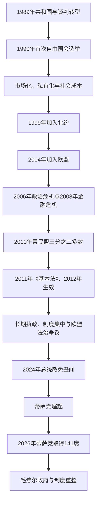

# 1989年后的匈牙利

## 时间

1989年10月23日—2026年7月14日

## 概括

1989年的谈判转型把一党人民共和国改造成议会民主、法治国家和市场经济。1990年自由选举后，匈牙利完成多次政党轮替，1999年加入北约、2004年加入欧洲联盟。转型也伴随国企关闭、失业、地区差距、私有化争议和社会保障重组，旧体制干部与新经济精英的连续性成为长期政治议题。

2010年青民盟取得三分之二议席后，以新《基本法》和一系列组织法重塑宪法法院、媒体、司法、选举与中央行政。支持者强调多数授权、国家主权、家庭政策和长期政府能力，反对者及欧洲联盟机构则批评制衡、媒体多元和法治倒退。2024年总统赦免丑闻促使诺瓦克·卡塔琳辞职，也推动毛焦尔·彼得和蒂萨党崛起。蒂萨党在2026年4月12日选举取得141个国会议席，毛焦尔于5月9日出任总理，完成16年来首次政府更替。

截至2026年7月14日，舒尤克·道马什仍由总统府列为在任总统。国会7月13日已通过《基本法》第十七次修正案，文本拟在公布生效后终止其总统任期；因公布及可能的宪法审查程序尚未完成，本笔记不把国会议长福尔斯特霍费尔·阿格奈什提前写成已经就任的代总统。

## 演变关系

## 谈判转型与第一轮民主巩固（1989—1998年）

1989年修改后的宪法建立议会共和国、竞争选举、宪法法院和基本权利保障。总统由国会选举，主要承担礼仪、法律审查和有限任命职能；总理由国会多数支持，并以建设性不信任案机制维持政府稳定。1990年匈牙利民主论坛胜选，安陶尔·约瑟夫组成中右翼联合政府。

市场转型包括价格放开、贸易开放、国企私有化、银行重组和外资引入。它改善长期供给短缺并重建出口产业，也造成旧工业区失业、实际收入下降、罗姆人和低技能劳动者长期边缘化。补偿私有财产、处理社会主义时期安全档案和评价1956年历史成为政治分歧。

1994年原执政党改革派组成的社会党赢得多数，却同自由民主联盟联合，以证明不会恢复一党统治。霍恩政府1995年实施紧缩和货币调整，稳定外债并吸引投资，但社会代价帮助青年民主主义者联盟转型为中右翼青民盟。1998年欧尔班·维克托首次出任总理。

## 西方制度整合与政治两极化（1998—2010年）

匈牙利1999年加入北约，2004年加入欧盟。加入过程推动市场监管、司法和行政规则与欧洲接轨；制造业进入德奥供应链，欧盟市场、投资与后来的结构基金成为增长来源。与此同时，农业、东部地区和小城镇受益不均，人口外流与地区差距持续。

2002年社会党—自由派联盟重新执政，迈杰希后由久尔恰尼·费伦茨接任。扩张性财政承诺推高赤字。2006年久尔恰尼承认政府在竞选中隐瞒财政状况的厄谢德讲话泄露，引发大规模示威、警民冲突和长期信任危机。

2008年全球金融危机使高外债、外币住房贷款和财政脆弱暴露。匈牙利接受国际援助，2009年鲍伊瑙伊·戈尔东组建危机内阁实施紧缩。社会党支持崩溃、反对派分裂和对转型精英的不满，为青民盟2010年取得三分之二议席创造条件。

## 青民盟长期执政与制度重构（2010—2024年）

### 宪法与国家机构

2011年国会通过《基本法》，2012年生效并把国名由“匈牙利共和国”改为“匈牙利”，共和政体本身并未取消。政府扩大宪法法院法官人数、调整司法行政与退休规则、建立集中媒体监管，并以基本法和“枢要法”固定税收、家庭、宗教及机构安排。

新的混合选举制减少议席总数、重划选区并设置胜者补偿；青民盟在2014、2018和2022年继续取得国会三分之二左右多数。支持者认为集中决策结束了转型期不稳定、提高危机应对并维护民族主权；反对者指出公共媒体、国家广告、司法任命、紧急状态和行政资源削弱公平竞争与权力制衡。

欧洲联盟分别通过侵权程序、预算条件和法治审查要求匈牙利调整。政府则把移民、家庭政策、俄罗斯能源和欧盟权限界线表述为主权争议。欧盟资金既支撑基础设施和地方发展，也因采购、利益冲突与法治条件被部分冻结。

### 社会经济与对外议题

政府实行单一税率、家庭税收优惠、公共就业、公共事业价格管制和鼓励生育政策，国有或本国资本在银行、能源和媒体中的比重上升。就业率和工资在2010年代增长，但劳动力外流、教育医疗压力、地区差异和通货膨胀引起持续争论。

2015年欧洲难民危机中，匈牙利在南部边境修建围栏并把反移民立场作为国内外政策核心。2020年新冠疫情后，紧急授权和法令治理范围扩大。2022年俄乌全面战争后，匈牙利留在北约与欧盟共同框架内，却在制裁、能源和对乌援助上采取更保留立场，同盟内部矛盾加深。

## 2024—2026年的政治转折

2024年2月，诺瓦克·卡塔琳因赦免一名掩盖儿童性侵案的从犯而辞职，前司法部长沃尔高·尤迪特退出公共政治。其前夫毛焦尔·彼得公开指控执政体系并创建蒂萨党，把反腐、恢复公共服务和修复欧盟关系同保守国家认同结合，迅速吸收原青民盟与传统反对派选民。

蒂萨党在2024年欧洲议会选举成为最大反对力量。生活成本、欧盟资金冻结、公共服务压力、长期执政疲劳和反对阵营重新集中，使2026年国会选举成为实质竞争。4月12日蒂萨党赢得141／199席，达到三分之二门槛；欧尔班政府于5月9日交权，毛焦尔·彼得成为总理，福尔斯特霍费尔·阿格奈什当选国会议长。

新多数着手重建制度制衡、处理欧盟争议和审查公共采购，并在2026年6月确立总理累计八年任期限制。改革面临的重要约束包括：许多枢要机构任期跨越选举周期、基本法和枢要法修改需要合格多数、预算与欧盟资金恢复需谈判，以及经济高度依赖欧洲制造业和能源进口。

2026年7月13日，国会以合格多数通过《基本法》第十七次修正案，拟终止舒尤克总统任期。总统依法有公布或提交宪法审查的程序空间；在职位实际空缺后，才由国会议长临时代行职权并等待国会选出新总统。截至7月14日，该过渡尚未完成。

## 统治结构

| 角色 | 产生方式与权限 | 截至2026年7月14日 |
|---|---|---|
| 国会 | 199名议员，以单席选区和政党名单混合选举；制定法律、预算并选举总统、总理 | 蒂萨党拥有141席，达到修宪所需三分之二。 |
| 总理与政府 | 国会根据总统提名选举总理；政府掌握行政与政策主导 | 毛焦尔·彼得自2026年5月9日起任总理。 |
| 总统 | 国会选举，主要为礼仪元首；可把法律退回国会或提交宪法法院 | 舒尤克·道马什仍列在任，终止任期修正案处于待完成程序状态。 |
| 国会议长 | 主持国会；总统职位空缺时依法代行总统职权 | 福尔斯特霍费尔·阿格奈什自2026年5月9日起任议长，尚未因该修宪自动成为代总统。 |
| 宪法法院 | 审查法律和基本法争议 | 在制度更替中承担修宪与法律程序的关键审查角色。 |
| 地方政府与欧盟层级 | 地方议会负责本地事务；欧盟法、资金和法院形成外部约束 | 中央集权程度、地方财政和欧盟条件仍是改革议题。 |

完整历任总统、代总统和总理见[匈牙利国家元首与政府首脑表](/%E4%BA%BA%E6%96%87%E7%A7%91%E5%AD%A6/%E5%8E%86%E5%8F%B2/%E6%AC%A7%E6%B4%B2/%E5%8C%88%E7%89%99%E5%88%A9/%E5%8C%88%E7%89%99%E5%88%A9%E5%9B%BD%E5%AE%B6%E5%85%83%E9%A6%96%E4%B8%8E%E6%94%BF%E5%BA%9C%E9%A6%96%E8%84%91%E8%A1%A8.md)。

## 重要事件

| 时间 | 事件 | 具体过程 | 结果与长期影响 |
|---|---|---|---|
| 1989年10月23日 | 第三共和国成立 | 修宪废除一党国家机构 | 建立议会民主法律框架。 |
| 1990年 | 首次自由国会选举 | 民主论坛组织联合政府 | 完成执政权和平移交。 |
| 1995年 | 财政稳定方案 | 汇率、支出和进口政策调整 | 改善外部平衡，也加深社会阵痛。 |
| 1999年 | 加入北约 | 完成军事与政治谈判 | 纳入西方安全体系。 |
| 2004年 | 加入欧盟 | 完成入盟法规与公投程序 | 获得共同市场、人员流动和结构基金。 |
| 2006年 | 厄谢德讲话危机 | 讲话泄露后爆发示威和警民冲突 | 政府信任长期受损，政治两极化加剧。 |
| 2008—2009年 | 金融危机 | 外债与外币贷款风险爆发，接受国际援助 | 危机内阁紧缩，青民盟支持大增。 |
| 2010年 | 青民盟三分之二胜选 | 反对派分裂和经济不满叠加 | 开始全面制度重构。 |
| 2011／2012年 | 《基本法》通过并生效 | 多项组织法同步改写 | 国家机构、选举和权利框架改变。 |
| 2015年 | 难民危机与边境围栏 | 南部边境管制和紧急法规 | 移民与主权成为政府核心动员。 |
| 2020年 | 疫情紧急治理 | 扩大法令行政 | 危机应对与议会监督争议并存。 |
| 2024年2月 | 总统赦免丑闻 | 诺瓦克辞职，执政阵营发生裂缝 | 蒂萨党崛起的直接政治契机。 |
| 2026年4—5月 | 蒂萨党胜选并组阁 | 取得141席，毛焦尔就任总理 | 16年后首次政府轮替。 |
| 2026年7月13日 | 第十七次修宪案获国会通过 | 合格多数拟终止总统任期 | 截至次日仍待完成公布生效及可能审查程序。 |

## 政治阶段兴衰分析

### 1990年代制度巩固条件

- 圆桌谈判让旧执政党与反对派对选举、宪法和非暴力交权形成最低共识。
- 北约与欧盟加入目标提供外部规则、资金和改革激励。
- 建设性不信任案、宪法法院和比例较高的选举制度帮助形成稳定但竞争性的政府。

### 2010年后长期执政机制

- 2006年信任危机和2008年经济衰退瓦解社会党阵营，青民盟以统一中右翼对抗分裂反对派。
- 三分之二多数允许同时修改宪法、选举制度和长期任命机构，制度优势在后续选举中自我强化。
- 家庭补贴、就业增长、民族主权与反移民议题形成稳定社会联盟。
- 国家资源、公共媒体和集中化商业网络提高执政党议程控制，也成为欧盟法治争议核心。

### 2026年政府更替原因

- **结构因素**：长期执政疲劳、公共服务压力、生活成本和欧盟资金受限削弱原联盟。
- **政治机制**：毛焦尔来自执政阵营内部，能够吸引保守选民；蒂萨党又整合长期分裂的反对票。
- **直接触发**：2024年赦免丑闻打击执政集团的家庭保护叙事，并使新反对力量获得全国关注。
- **选举结果**：2026年蒂萨党不仅赢得多数，还取得141席的修宪能力，使政府更替能够进入制度重构阶段。

### 新政府的风险与约束

政府拥有合格多数，但不能自动消除经济、社会和法律连续性。机构长期任命、欧盟谈判、公共债务、能源依赖以及如何在追责和法治程序之间平衡，决定改革能否稳定。总统任期修宪的公布与审查争议正是这种制度过渡的首个重大检验。

## 前后关系

- 前一节点：[社会主义匈牙利](/%E4%BA%BA%E6%96%87%E7%A7%91%E5%AD%A6/%E5%8E%86%E5%8F%B2/%E6%AC%A7%E6%B4%B2/%E5%8C%88%E7%89%99%E5%88%A9/%E7%A4%BE%E4%BC%9A%E4%B8%BB%E4%B9%89%E5%8C%88%E7%89%99%E5%88%A9.md)。
- 国家元首与政府首脑：[匈牙利国家元首与政府首脑表](/%E4%BA%BA%E6%96%87%E7%A7%91%E5%AD%A6/%E5%8E%86%E5%8F%B2/%E6%AC%A7%E6%B4%B2/%E5%8C%88%E7%89%99%E5%88%A9/%E5%8C%88%E7%89%99%E5%88%A9%E5%9B%BD%E5%AE%B6%E5%85%83%E9%A6%96%E4%B8%8E%E6%94%BF%E5%BA%9C%E9%A6%96%E8%84%91%E8%A1%A8.md)。
- 总览：[匈牙利历史](/%E4%BA%BA%E6%96%87%E7%A7%91%E5%AD%A6/%E5%8E%86%E5%8F%B2/%E6%AC%A7%E6%B4%B2/%E5%8C%88%E7%89%99%E5%88%A9/README.md)。
