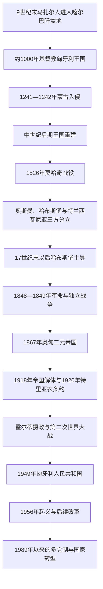

# 匈牙利历史

## 概括

匈牙利国家史从9世纪末马扎尔人进入喀尔巴阡盆地和中世纪王国形成开始，经历蒙古入侵、奥斯曼征服、哈布斯堡统治、1848年革命、奥匈帝国、两次世界大战、社会主义国家和1989年政治转型。匈牙利历史与克罗地亚、斯洛伐克、罗马尼亚、塞尔维亚和奥地利长期交错。

## 目录定位

匈牙利在欧洲目录下维护独立国家线，因为其历史以马扎尔人进入喀尔巴阡盆地和匈牙利王国形成为连续主轴，不能归入斯拉夫民族分支，也不能只作为奥地利或巴尔干历史的附属阶段。哈布斯堡、奥斯曼、西斯拉夫和东南欧联系分别通过相关笔记互链。

## 演变关系

## 统治结构与政治阶段

| 阶段 | 时间 | 统治结构 |
|---|---|---|
| 中世纪匈牙利王国 | 约1000—1526年 | 以国王、贵族会议、教会和地方领地构成的王国。 |
| 分裂时期 | 1526—17世纪末 | 王国西北部受哈布斯堡统治，中部受奥斯曼统治，东部特兰西瓦尼亚保持较大自主。 |
| 哈布斯堡与奥匈时期 | 17世纪末—1918年 | 先处于哈布斯堡君主国，1867年后成为二元帝国的匈牙利部分。 |
| 摄政王国 | 1920—1944年 | 名义上维持王国，由摄政霍尔蒂掌权，没有在位国王。 |
| 社会主义时期 | 1949—1989年 | 一党社会主义国家，1956年起义被苏联军事干预镇压。 |
| 1989年以来 | 1989年至今 | 多党议会政治与市场经济转型，后加入北约和欧洲联盟；2012年国名由“匈牙利共和国”改为“匈牙利”。 |

## 重要事件

- 伊什特万一世约在1000年前后加冕，推动基督教王国与拉丁教会制度形成。
- 1241—1242年蒙古入侵造成严重破坏，随后王国加强城堡和地方重建。
- 1526年莫哈奇战役后匈牙利长期分裂，奥斯曼与哈布斯堡竞争重塑中欧。
- 1848年革命提出宪政和民族国家诉求，1849年在哈布斯堡与俄国军事干预下失败。
- 1867年妥协建立奥匈二元帝国，匈牙利政府获得广泛内政权。
- 1920年特里亚农条约大幅改变匈牙利边界，境外匈牙利人口问题成为长期政治议题。
- 1944年德国占领和战争时期迫害导致匈牙利犹太人遭大规模驱逐与杀害。
- 1956年起义、1989年转型和2004年加入欧盟是现代政治的重要节点。

## 关键辨析

- 中世纪匈牙利王国是多语言、多地区王国，不能等同于现代匈牙利民族国家。
- 奥匈帝国不是奥地利吞并匈牙利的简单称呼，而是1867年后共享君主和部分共同事务的二元体制。
- 特里亚农边界改变必须与奥匈帝国解体、民族自决的选择性实施和地区人口混居一并理解。

## 相关入口

- [欧洲历史](/%E4%BA%BA%E6%96%87%E7%A7%91%E5%AD%A6/%E5%8E%86%E5%8F%B2/%E6%AC%A7%E6%B4%B2/README.md)
- [中欧历史空间](/%E4%BA%BA%E6%96%87%E7%A7%91%E5%AD%A6/%E5%8E%86%E5%8F%B2/%E6%AC%A7%E6%B4%B2/_%E9%80%9A%E5%8F%B2/%E4%B8%AD%E6%AC%A7%E5%8E%86%E5%8F%B2%E7%A9%BA%E9%97%B4.md)
- [奥地利](/%E4%BA%BA%E6%96%87%E7%A7%91%E5%AD%A6/%E5%8E%86%E5%8F%B2/%E6%AC%A7%E6%B4%B2/%E5%BE%B7%E6%84%8F%E5%BF%97/%E5%A5%A5%E5%9C%B0%E5%88%A9/README.md)
- [南斯拉夫历史](/%E4%BA%BA%E6%96%87%E7%A7%91%E5%AD%A6/%E5%8E%86%E5%8F%B2/%E6%AC%A7%E6%B4%B2/%E4%B8%9C%E5%8D%97%E6%AC%A7%E4%B8%8E%E5%B7%B4%E5%B0%94%E5%B9%B2/%E5%8D%97%E6%96%AF%E6%8B%89%E5%A4%AB%E5%8E%86%E5%8F%B2/README.md)
