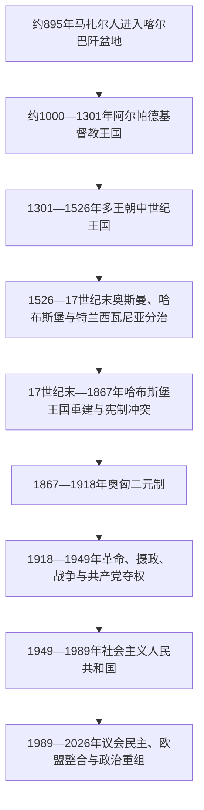

# 匈牙利历史

## 概括

匈牙利历史以马扎尔部落联盟进入喀尔巴阡盆地、基督教王国形成和圣史蒂芬王冠法统为早期主轴，随后经历阿尔帕德王朝断绝、多王朝中世纪王国、奥斯曼—哈布斯堡—特兰西瓦尼亚三分、哈布斯堡王国重建、奥匈二元制、两次世界大战、社会主义国家和1989年后的议会政治。王国疆域长期包含多语言、多宗教人口，不能把中世纪与近代“匈牙利王国”直接等同于现代匈牙利民族国家。

## 演进图

## 历史主线

- **建国与制度化**：草原部落联盟在喀尔巴阡盆地定居，盖萨与伊什特万一世把大公权力转化为拉丁基督教王国。
- **王权、等级与边防**：王产国家逐步演变为贵族等级王国；蒙古入侵后重建，十五世纪又以南部要塞应对奥斯曼扩张。
- **分治与复合君主国**：莫哈奇战败造成两王并立和三方分治，哈布斯堡在驱逐奥斯曼后以王朝—等级妥协重建王国。
- **民族国家与现代政治**：1848年革命和1867年妥协建立现代责任政府，帝国解体与特里亚农边界把历史王国问题转化为现代民族国家问题。
- **战争、党国与民主转型**：霍尔蒂摄政、轴心国依赖、德国与苏联占领改变政体；1949年一党国家建立，1989年经谈判转为议会民主。
- **当代变动**：匈牙利1999年加入北约、2004年加入欧盟；2010—2026年经历青民盟长期执政，2026年蒂萨党胜选并开始新一轮制度重整。

## 分期导航

| 顺序 | 阶段 | 时间 | 主线概括 |
|---|---|---|---|
| 1 | [马扎尔迁徙与阿尔帕德王朝](/%E4%BA%BA%E6%96%87%E7%A7%91%E5%AD%A6/%E5%8E%86%E5%8F%B2/%E6%AC%A7%E6%B4%B2/%E5%8C%88%E7%89%99%E5%88%A9/%E9%A9%AC%E6%89%8E%E5%B0%94%E8%BF%81%E5%BE%99%E4%B8%8E%E9%98%BF%E5%B0%94%E5%B8%95%E5%BE%B7%E7%8E%8B%E6%9C%9D.md) | 约9世纪中叶—1301年 | 马扎尔迁徙、远征转型、基督教建国、蒙古入侵与王朝男系断绝。 |
| 2 | [中世纪匈牙利王国](/%E4%BA%BA%E6%96%87%E7%A7%91%E5%AD%A6/%E5%8E%86%E5%8F%B2/%E6%AC%A7%E6%B4%B2/%E5%8C%88%E7%89%99%E5%88%A9/%E4%B8%AD%E4%B8%96%E7%BA%AA%E5%8C%88%E7%89%99%E5%88%A9%E7%8E%8B%E5%9B%BD.md) | 1301—1526年 | 安茹王权复兴、匈雅提父子、奥斯曼边防与莫哈奇战败。 |
| 3 | [奥斯曼—哈布斯堡分治与王国重建](/%E4%BA%BA%E6%96%87%E7%A7%91%E5%AD%A6/%E5%8E%86%E5%8F%B2/%E6%AC%A7%E6%B4%B2/%E5%8C%88%E7%89%99%E5%88%A9/%E5%A5%A5%E6%96%AF%E6%9B%BC%E2%80%94%E5%93%88%E5%B8%83%E6%96%AF%E5%A0%A1%E5%88%86%E6%B2%BB%E4%B8%8E%E7%8E%8B%E5%9B%BD%E9%87%8D%E5%BB%BA.md) | 1526—1867年 | 两王并立、三方分治、哈布斯堡收复、1848年革命及1867年妥协。 |
| 4 | [奥匈帝国与第一次世界大战](/%E4%BA%BA%E6%96%87%E7%A7%91%E5%AD%A6/%E5%8E%86%E5%8F%B2/%E6%AC%A7%E6%B4%B2/%E5%8C%88%E7%89%99%E5%88%A9/%E5%A5%A5%E5%8C%88%E5%B8%9D%E5%9B%BD%E4%B8%8E%E7%AC%AC%E4%B8%80%E6%AC%A1%E4%B8%96%E7%95%8C%E5%A4%A7%E6%88%98.md) | 1867—1918年 | 二元体制、工业化、多民族矛盾、总体战争与帝国解体。 |
| 5 | [两次世界大战与霍尔蒂摄政](/%E4%BA%BA%E6%96%87%E7%A7%91%E5%AD%A6/%E5%8E%86%E5%8F%B2/%E6%AC%A7%E6%B4%B2/%E5%8C%88%E7%89%99%E5%88%A9/%E4%B8%A4%E6%AC%A1%E4%B8%96%E7%95%8C%E5%A4%A7%E6%88%98%E4%B8%8E%E9%9C%8D%E5%B0%94%E8%92%82%E6%91%84%E6%94%BF.md) | 1918—1949年 | 革命与反革命、特里亚农、无王摄政、轴心国依赖、大屠杀及共产党夺权。 |
| 6 | [社会主义匈牙利](/%E4%BA%BA%E6%96%87%E7%A7%91%E5%AD%A6/%E5%8E%86%E5%8F%B2/%E6%AC%A7%E6%B4%B2/%E5%8C%88%E7%89%99%E5%88%A9/%E7%A4%BE%E4%BC%9A%E4%B8%BB%E4%B9%89%E5%8C%88%E7%89%99%E5%88%A9.md) | 1949—1989年 | 拉科西高压、1956年革命、卡达尔妥协、经济改革与谈判转型。 |
| 7 | [1989年后的匈牙利](/%E4%BA%BA%E6%96%87%E7%A7%91%E5%AD%A6/%E5%8E%86%E5%8F%B2/%E6%AC%A7%E6%B4%B2/%E5%8C%88%E7%89%99%E5%88%A9/1989%E5%B9%B4%E5%90%8E%E7%9A%84%E5%8C%88%E7%89%99%E5%88%A9.md) | 1989年10月23日—2026年7月14日 | 市场与民主转型、北约和欧盟整合、2010年后制度重构及2026年政府更替。 |

## 世系与政权专表

| 专表 | 覆盖范围 | 使用方式 |
|---|---|---|
| [匈牙利君主与摄政世系表](/%E4%BA%BA%E6%96%87%E7%A7%91%E5%AD%A6/%E5%8E%86%E5%8F%B2/%E6%AC%A7%E6%B4%B2/%E5%8C%88%E7%89%99%E5%88%A9/%E5%8C%88%E7%89%99%E5%88%A9%E5%90%9B%E4%B8%BB%E4%B8%8E%E6%91%84%E6%94%BF%E4%B8%96%E7%B3%BB%E8%A1%A8.md) | 马扎尔大公、历代国王、对立国王、共治者、革命元首与无王摄政 | 查询王朝连续性、复位、并立王权及1526年后控制区差异。 |
| [匈牙利国家元首与政府首脑表](/%E4%BA%BA%E6%96%87%E7%A7%91%E5%AD%A6/%E5%8E%86%E5%8F%B2/%E6%AC%A7%E6%B4%B2/%E5%8C%88%E7%89%99%E5%88%A9/%E5%8C%88%E7%89%99%E5%88%A9%E5%9B%BD%E5%AE%B6%E5%85%83%E9%A6%96%E4%B8%8E%E6%94%BF%E5%BA%9C%E9%A6%96%E8%84%91%E8%A1%A8.md) | 1848—2026年国家元首、首相／总理、临时政府和社会主义时期实际党魁 | 查询近现代职位连续性、并行政权和法定职位与实际权力差异。 |
| [特兰西瓦尼亚亲王与统治者世系表](/%E4%BA%BA%E6%96%87%E7%A7%91%E5%AD%A6/%E5%8E%86%E5%8F%B2/%E6%AC%A7%E6%B4%B2/%E5%8C%88%E7%89%99%E5%88%A9/%E7%89%B9%E5%85%B0%E8%A5%BF%E7%93%A6%E5%B0%BC%E4%BA%9A%E4%BA%B2%E7%8E%8B%E4%B8%8E%E7%BB%9F%E6%B2%BB%E8%80%85%E4%B8%96%E7%B3%BB%E8%A1%A8.md) | 1540—1711年东部王国摄政、特兰西瓦尼亚亲王、复位者、并行政权与哈布斯堡行政 | 查询选举亲王、奥斯曼认可、哈布斯堡占领与争议继承的重叠关系。 |

## 重要转折与时间节点

| 时间 | 转折 | 导航 |
|---|---|---|
| 约895年 | 马扎尔联盟进入喀尔巴阡盆地 | [早期国家形成](/%E4%BA%BA%E6%96%87%E7%A7%91%E5%AD%A6/%E5%8E%86%E5%8F%B2/%E6%AC%A7%E6%B4%B2/%E5%8C%88%E7%89%99%E5%88%A9/%E9%A9%AC%E6%89%8E%E5%B0%94%E8%BF%81%E5%BE%99%E4%B8%8E%E9%98%BF%E5%B0%94%E5%B8%95%E5%BE%B7%E7%8E%8B%E6%9C%9D.md) |
| 1000／1001年 | 伊什特万一世加冕，基督教王国制度化 | [阿尔帕德王朝](/%E4%BA%BA%E6%96%87%E7%A7%91%E5%AD%A6/%E5%8E%86%E5%8F%B2/%E6%AC%A7%E6%B4%B2/%E5%8C%88%E7%89%99%E5%88%A9/%E9%A9%AC%E6%89%8E%E5%B0%94%E8%BF%81%E5%BE%99%E4%B8%8E%E9%98%BF%E5%B0%94%E5%B8%95%E5%BE%B7%E7%8E%8B%E6%9C%9D.md) |
| 1241—1242年 | 蒙古入侵与贝拉四世重建 | [蒙古入侵与重建](/%E4%BA%BA%E6%96%87%E7%A7%91%E5%AD%A6/%E5%8E%86%E5%8F%B2/%E6%AC%A7%E6%B4%B2/%E5%8C%88%E7%89%99%E5%88%A9/%E9%A9%AC%E6%89%8E%E5%B0%94%E8%BF%81%E5%BE%99%E4%B8%8E%E9%98%BF%E5%B0%94%E5%B8%95%E5%BE%B7%E7%8E%8B%E6%9C%9D.md) |
| 1301年 | 阿尔帕德男系断绝 | [王位竞争](/%E4%BA%BA%E6%96%87%E7%A7%91%E5%AD%A6/%E5%8E%86%E5%8F%B2/%E6%AC%A7%E6%B4%B2/%E5%8C%88%E7%89%99%E5%88%A9/%E4%B8%AD%E4%B8%96%E7%BA%AA%E5%8C%88%E7%89%99%E5%88%A9%E7%8E%8B%E5%9B%BD.md) |
| 1456年 | 贝尔格莱德防御暂缓奥斯曼北进 | [匈雅提时期](/%E4%BA%BA%E6%96%87%E7%A7%91%E5%AD%A6/%E5%8E%86%E5%8F%B2/%E6%AC%A7%E6%B4%B2/%E5%8C%88%E7%89%99%E5%88%A9/%E4%B8%AD%E4%B8%96%E7%BA%AA%E5%8C%88%E7%89%99%E5%88%A9%E7%8E%8B%E5%9B%BD.md) |
| 1526／1541年 | 莫哈奇战败与布达被占，三分格局形成 | [三方分治](/%E4%BA%BA%E6%96%87%E7%A7%91%E5%AD%A6/%E5%8E%86%E5%8F%B2/%E6%AC%A7%E6%B4%B2/%E5%8C%88%E7%89%99%E5%88%A9/%E5%A5%A5%E6%96%AF%E6%9B%BC%E2%80%94%E5%93%88%E5%B8%83%E6%96%AF%E5%A0%A1%E5%88%86%E6%B2%BB%E4%B8%8E%E7%8E%8B%E5%9B%BD%E9%87%8D%E5%BB%BA.md) |
| 1686／1699年 | 收复布达与《卡尔洛维茨条约》 | [王国重建](/%E4%BA%BA%E6%96%87%E7%A7%91%E5%AD%A6/%E5%8E%86%E5%8F%B2/%E6%AC%A7%E6%B4%B2/%E5%8C%88%E7%89%99%E5%88%A9/%E5%A5%A5%E6%96%AF%E6%9B%BC%E2%80%94%E5%93%88%E5%B8%83%E6%96%AF%E5%A0%A1%E5%88%86%E6%B2%BB%E4%B8%8E%E7%8E%8B%E5%9B%BD%E9%87%8D%E5%BB%BA.md) |
| 1848—1849年 | 革命、责任政府与独立战争 | [1848年革命](/%E4%BA%BA%E6%96%87%E7%A7%91%E5%AD%A6/%E5%8E%86%E5%8F%B2/%E6%AC%A7%E6%B4%B2/%E5%8C%88%E7%89%99%E5%88%A9/%E5%A5%A5%E6%96%AF%E6%9B%BC%E2%80%94%E5%93%88%E5%B8%83%E6%96%AF%E5%A0%A1%E5%88%86%E6%B2%BB%E4%B8%8E%E7%8E%8B%E5%9B%BD%E9%87%8D%E5%BB%BA.md) |
| 1867年 | 奥匈妥协建立二元体制 | [奥匈二元制](/%E4%BA%BA%E6%96%87%E7%A7%91%E5%AD%A6/%E5%8E%86%E5%8F%B2/%E6%AC%A7%E6%B4%B2/%E5%8C%88%E7%89%99%E5%88%A9/%E5%A5%A5%E5%8C%88%E5%B8%9D%E5%9B%BD%E4%B8%8E%E7%AC%AC%E4%B8%80%E6%AC%A1%E4%B8%96%E7%95%8C%E5%A4%A7%E6%88%98.md) |
| 1918／1920年 | 帝国解体与特里亚农边界 | [战间期](/%E4%BA%BA%E6%96%87%E7%A7%91%E5%AD%A6/%E5%8E%86%E5%8F%B2/%E6%AC%A7%E6%B4%B2/%E5%8C%88%E7%89%99%E5%88%A9/%E4%B8%A4%E6%AC%A1%E4%B8%96%E7%95%8C%E5%A4%A7%E6%88%98%E4%B8%8E%E9%9C%8D%E5%B0%94%E8%92%82%E6%91%84%E6%94%BF.md) |
| 1944年 | 德国占领、犹太人驱逐与箭十字党夺权 | [战争与占领](/%E4%BA%BA%E6%96%87%E7%A7%91%E5%AD%A6/%E5%8E%86%E5%8F%B2/%E6%AC%A7%E6%B4%B2/%E5%8C%88%E7%89%99%E5%88%A9/%E4%B8%A4%E6%AC%A1%E4%B8%96%E7%95%8C%E5%A4%A7%E6%88%98%E4%B8%8E%E9%9C%8D%E5%B0%94%E8%92%82%E6%91%84%E6%94%BF.md) |
| 1949年 | 匈牙利人民共和国成立 | [社会主义国家](/%E4%BA%BA%E6%96%87%E7%A7%91%E5%AD%A6/%E5%8E%86%E5%8F%B2/%E6%AC%A7%E6%B4%B2/%E5%8C%88%E7%89%99%E5%88%A9/%E7%A4%BE%E4%BC%9A%E4%B8%BB%E4%B9%89%E5%8C%88%E7%89%99%E5%88%A9.md) |
| 1956年 | 革命与苏军干预 | [1956年革命](/%E4%BA%BA%E6%96%87%E7%A7%91%E5%AD%A6/%E5%8E%86%E5%8F%B2/%E6%AC%A7%E6%B4%B2/%E5%8C%88%E7%89%99%E5%88%A9/%E7%A4%BE%E4%BC%9A%E4%B8%BB%E4%B9%89%E5%8C%88%E7%89%99%E5%88%A9.md) |
| 1989年 | 一党体制终结、共和国成立 | [谈判转型](/%E4%BA%BA%E6%96%87%E7%A7%91%E5%AD%A6/%E5%8E%86%E5%8F%B2/%E6%AC%A7%E6%B4%B2/%E5%8C%88%E7%89%99%E5%88%A9/1989%E5%B9%B4%E5%90%8E%E7%9A%84%E5%8C%88%E7%89%99%E5%88%A9.md) |
| 1999／2004年 | 加入北约与欧洲联盟 | [西方制度整合](/%E4%BA%BA%E6%96%87%E7%A7%91%E5%AD%A6/%E5%8E%86%E5%8F%B2/%E6%AC%A7%E6%B4%B2/%E5%8C%88%E7%89%99%E5%88%A9/1989%E5%B9%B4%E5%90%8E%E7%9A%84%E5%8C%88%E7%89%99%E5%88%A9.md) |
| 2010／2012年 | 三分之二多数与《基本法》生效 | [制度重构](/%E4%BA%BA%E6%96%87%E7%A7%91%E5%AD%A6/%E5%8E%86%E5%8F%B2/%E6%AC%A7%E6%B4%B2/%E5%8C%88%E7%89%99%E5%88%A9/1989%E5%B9%B4%E5%90%8E%E7%9A%84%E5%8C%88%E7%89%99%E5%88%A9.md) |
| 2026年 | 蒂萨党胜选、毛焦尔政府就任 | [2026年政治转折](/%E4%BA%BA%E6%96%87%E7%A7%91%E5%AD%A6/%E5%8E%86%E5%8F%B2/%E6%AC%A7%E6%B4%B2/%E5%8C%88%E7%89%99%E5%88%A9/1989%E5%B9%B4%E5%90%8E%E7%9A%84%E5%8C%88%E7%89%99%E5%88%A9.md) |

## 相关入口

- [欧洲历史](/%E4%BA%BA%E6%96%87%E7%A7%91%E5%AD%A6/%E5%8E%86%E5%8F%B2/%E6%AC%A7%E6%B4%B2/README.md)
- [中欧历史空间](/%E4%BA%BA%E6%96%87%E7%A7%91%E5%AD%A6/%E5%8E%86%E5%8F%B2/%E6%AC%A7%E6%B4%B2/_%E9%80%9A%E5%8F%B2/%E4%B8%AD%E6%AC%A7%E5%8E%86%E5%8F%B2%E7%A9%BA%E9%97%B4.md)
- [奥地利历史](/%E4%BA%BA%E6%96%87%E7%A7%91%E5%AD%A6/%E5%8E%86%E5%8F%B2/%E6%AC%A7%E6%B4%B2/%E5%BE%B7%E6%84%8F%E5%BF%97/%E5%A5%A5%E5%9C%B0%E5%88%A9/README.md)
- [克罗地亚的匈牙利联合与哈布斯堡时期](/%E4%BA%BA%E6%96%87%E7%A7%91%E5%AD%A6/%E5%8E%86%E5%8F%B2/%E6%AC%A7%E6%B4%B2/%E4%B8%9C%E5%8D%97%E6%AC%A7%E4%B8%8E%E5%B7%B4%E5%B0%94%E5%B9%B2/%E5%85%8B%E7%BD%97%E5%9C%B0%E4%BA%9A/%E5%8C%88%E7%89%99%E5%88%A9%E8%81%94%E5%90%88%E4%B8%8E%E5%93%88%E5%B8%83%E6%96%AF%E5%A0%A1%E6%97%B6%E6%9C%9F.md)
