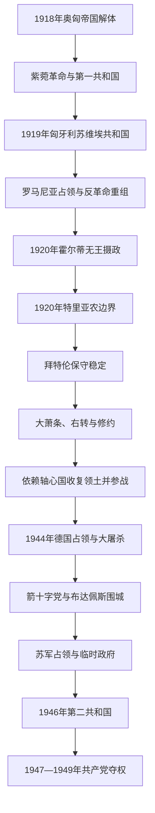

# 两次世界大战与霍尔蒂摄政

## 时间

1918—1949年

## 概括

这一时期不是从奥匈帝国直接平稳过渡到社会主义国家，而是经历第一共和国、苏维埃共和国、罗马尼亚占领、反革命临时政府、无王的摄政王国、德国占领与箭十字党政权、苏军占领区临时政府、第二共和国以及共产党夺权。

1920年《特里亚农条约》确认历史王国大部分非马扎尔地区归入周边国家，也使大量匈牙利语人口留在新边界之外。领土修约成为霍尔蒂体制的核心合法性资源。拜特伦时期恢复议会、货币和国际经济联系，但以有限选举、行政控制和社会等级秩序维持威权保守政治。1930年代经济危机和修约诉求推动对德国、意大利依赖，反犹法律与战争介入逐步升级。1944年德国占领后，匈牙利当局在数周内协助驱逐约43.7万名犹太人；箭十字党政变又在布达佩斯实施恐怖。战后小农党虽在1945年选举胜出，共产党凭苏联军事存在、内务警察和“切香肠”策略逐步排除对手，1949年建立人民共和国。

## 演变关系

## 革命、反革命与外国占领（1918—1920年）

### 第一共和国

1918年10月紫菀革命中，卡罗伊·米哈伊组阁并于11月宣布人民共和国。政府希望以民主化、裁军和协约国善意维持历史边界，同时推动普选、土地改革和民族自治；但旧军队已经瓦解，邻国军队在协约国许可或默许下进入争议区，政府没有足够行政和军事力量执行方案。

1919年3月的维克斯照会要求匈军进一步撤退，卡罗伊集团认为无法接受。社会民主党转而同狱中的共产党合作，宣布苏维埃共和国，期望苏俄援助并以革命战争恢复边界。

### 苏维埃共和国

加尔鲍伊·山多尔为革命执政委员会名义主席，库恩·贝拉掌握核心路线。政权迅速国有化工业、银行和大地产，却没有把土地分给农民；“红色恐怖”和强制征发削弱支持。匈牙利红军一度进入斯洛伐克并建立短命苏维埃政权，但在协约国外交承诺后撤出；罗马尼亚军随后突破蒂萨河。1919年8月政权垮台。

与此同时，反革命政治家在法国占领的阿拉德于1919年5月5日建立卡罗伊·久洛政府，5月末迁至塞格德；7月12日由帕坦秋什-阿布拉哈姆·德热接任。该并行政权的控制区有限，却汇集旧军官与保守政治力量，霍尔蒂任战争部长期间组织“国民军”。

苏维埃共和国倒台后，短命的佩德尔政府被反革命政变推翻，罗马尼亚军占领布达佩斯并大量征用物资。霍尔蒂的军官分队及其他地方武装实施针对共产党人、犹太人和乡村左翼的“白色恐怖”。协约国推动组成较广泛政府和选举，1920年国会恢复王国并选霍尔蒂为摄政。

## 特里亚农与霍尔蒂体制

1920年6月4日《特里亚农条约》确认匈牙利边界。历史王国约三分之二领土和多数人口划归捷克斯洛伐克、罗马尼亚、南斯拉夫及奥地利；新国境外约有数百万匈牙利语人口。边界大体追随民族分布与战略交通、协约国盟友利益，但许多混居区不可能形成纯粹民族边界。

条约限制军队并规定赔款。难民、失业军官、失去市场和行政中心的经济冲击，使“特里亚农创伤”成为跨党派政治记忆。修约目标有真实的境外匈牙利人问题，也常被扩展为恢复历史王国的整体诉求。

国家名义上仍为“匈牙利王国”，但没有国王。霍尔蒂任摄政，拥有军队统帅、任命首相、解散国会和对法律施加影响等权力。卡罗伊四世1921年两次复辟失败后，国会排除哈布斯堡复位。

## 拜特伦稳定与有限议会政治（1921—1931年）

拜特伦·伊什特万把保守派和小农党部分力量合并为统一党，以公开投票的乡村选区、行政控制和有限选举权确保多数；布达佩斯等城市仍有秘密投票、反对党、报刊和议会辩论。体制因此不同于完全一党独裁，却也不是平等竞争的议会民主。

政府与社会民主党达成限制性协议，以容许合法工会和城市政治换取放弃农村组织与反君主制动员。1924年国际贷款、中央银行和货币改革稳定财政，匈牙利加入国际联盟。大庄园结构基本未变，无地农民和城市贫困问题延续。

文化政策强调基督教民族国家并扩大学校。1920年大学名额限制是战后欧洲早期反犹立法之一，后虽形式调整，犹太公民的平等地位已被削弱。修约外交在1920年代谨慎推进，1927年同意大利结盟后更公开。

## 大萧条、右转与对轴心国依赖（1931—1944年）

农产品价格崩溃、债务和失业冲击拜特伦体系。根伯什·久洛1932年上台，倡导更群众化、军国主义和社团式国家，扩大同意大利、德国贸易。德国成为匈牙利农产品主要市场，也获得越来越大政治杠杆。

1938、1939和1941年的反犹法律按宗教后又按“种族”限制犹太人在专业、经济和婚姻中的权利。强迫劳动营把犹太男性置于军队控制和致命环境。政策由匈牙利政府主动制定，不能只归因于1944年德国占领。

在德意支持下，1938年第一次维也纳裁决把斯洛伐克南部和喀尔巴阡鲁塞尼亚南部划给匈牙利；1939年匈军占领其余喀尔巴阡乌克兰，1940年第二次维也纳裁决取得北特兰西瓦尼亚，1941年参与进攻南斯拉夫并取得部分南部领土。这些变化满足修约诉求，却使外交和经济依赖轴心国，并在混居区制造新的少数民族问题。

1941年匈牙利参加对苏战争。1942—1943年第二集团军在顿河遭毁灭性损失后，卡拉伊政府秘密接触西方盟国，同时继续对德合作。希特勒担心匈牙利退出战争，于1944年3月19日实施军事占领。

## 德国占领、大屠杀与箭十字党（1944—1945年）

德国占领后，斯托尧伊政府、宪兵、行政官员和铁路系统与德国党卫队合作，对外省犹太人集中、剥夺财产并驱逐。1944年5月至7月约43.7万人被送走，绝大多数抵达奥斯维辛—比克瑙后被杀。霍尔蒂在国际压力、军事形势和布达佩斯驱逐计划争议下于7月叫停大规模运输，但此前外省社群已几乎毁灭。

8月霍尔蒂换上洛卡托什政府，10月宣布停战。德军绑架其子并发动“铁拳行动”，迫使霍尔蒂退位，扶植萨拉希·费伦茨和箭十字党。箭十字党在布达佩斯枪杀犹太人、强迫死亡行军并继续战争。苏军包围布达佩斯，1944年12月至1945年2月的围城摧毁城市并造成大量军民伤亡。

同一时期，苏军控制的德布勒森临时国民议会建立米克洛什·贝拉政府并向德国宣战。因此1944年12月至1945年3月存在两个控制不同地区的政府，不能把其任期误排为先后无重叠。

## 战后联合政府与共产党夺权（1945—1949年）

1945年土地改革拆分大地产，既回应农民诉求，也摧毁旧地主精英。苏军占领和盟国管制委员会使苏联拥有决定性安全权力。11月选举中独立小农党获得约57%选票，但苏联迫使其与共产党、社会民主党和民族农民党联合，并让共产党掌握内务部和警察。

共产党领袖拉科西把逐段孤立对手称为“切香肠”策略：以战争罪、共和国阴谋和警察案件清除右翼，再分裂小农党，迫使总理纳吉·费伦茨流亡。1946年废除王国、建立第二共和国；恶性通货膨胀后发行福林稳定货币。

1947年“蓝票”选举中，行政操纵和流动选票舞弊削弱反对派，但共产党仍未取得绝对多数。此后反对党被解散或合并，社会民主党在1948年被迫同共产党合并为劳动人民党；银行、工业和教会学校被国有化，明曾蒂枢机受审。1949年单一名单选举和苏式宪法建立匈牙利人民共和国。

## 重要事件

| 时间 | 事件 | 过程 | 结果与长期影响 |
|---|---|---|---|
| 1918年10—11月 | 紫菀革命 | 军事崩溃、群众示威和国民委员会夺权 | 第一共和国成立。 |
| 1919年3月 | 苏维埃共和国建立 | 维克斯照会、社民与共产党合并 | 革命战争和国有化开始。 |
| 1919年8月 | 苏维埃政权垮台 | 罗马尼亚军突破蒂萨河 | 占领、白色恐怖和反革命重组。 |
| 1920年3月 | 霍尔蒂当选摄政 | 国会恢复王国但不迎回国王 | 建立无王王国。 |
| 1920年6月 | 《特里亚农条约》 | 和平会议确认新边界和军备限制 | 修约主义成为长期国家目标。 |
| 1921年 | 卡罗伊四世复辟失败 | 两次尝试均未获霍尔蒂与协约国支持 | 哈布斯堡被正式废黜。 |
| 1924年 | 国际贷款与货币稳定 | 国际联盟监督下重建财政 | 拜特伦体制巩固。 |
| 1938—1941年 | 领土修约与反犹立法 | 依赖德意裁决收复领土，同时逐级排斥犹太人 | 对轴心国依赖和国内迫害同步上升。 |
| 1941年 | 加入对苏战争 | 宣战并派第二集团军 | 顿河惨败和退出战争压力。 |
| 1944年3月 | 德国占领 | 德军进入，亲德政府上台 | 主权大幅丧失，大规模驱逐启动。 |
| 1944年5—7月 | 外省犹太人被驱逐 | 匈牙利行政和宪兵配合德国组织运输 | 约43.7万人被送走，多数遇害。 |
| 1944年10月 | 箭十字党夺权 | 霍尔蒂停战失败，德国扶植萨拉希 | 恐怖统治和战争延续。 |
| 1945年11月 | 战后选举 | 小农党获绝对多数但被迫联合 | 选举结果受苏联安全权力限制。 |
| 1947—1949年 | 共产党夺权 | 警察、案件、选举操纵和强制合并 | 多党政治终结，人民共和国成立。 |

## 体制兴衰与政权更替原因

### 霍尔蒂体制的稳定条件

- 摄政、军队、官僚和传统精英提供反革命秩序，拜特伦又恢复有限议会和国际金融信用。
- 特里亚农修约把保守派、军官、难民与许多普通选民团结在共同目标下。
- 公开投票、行政影响和受限选举权保证政府多数，同时保留有限反对派作为合法性装饰。

### 结构性衰落

- 土地高度集中、贫困和政治排斥没有得到根本解决。
- 修约目标难以靠自身力量实现，必然把外交绑定于愿意改边界的德意轴心国。
- 反犹主义由政治排斥升级为经济掠夺和种族法律，削弱法治并为大规模迫害准备行政条件。
- 霍尔蒂在君主式权限与议会内阁之间维持的平衡，面对德国军事占领时缺乏可靠独立力量。

### 外部压力与直接崩溃

德国在1944年直接占领，苏军随后进入，匈牙利政府丧失自主退出战争的能力。霍尔蒂10月停战失败和箭十字党上台是摄政体制的直接终点；1945年军事战败与苏军占领结束旧王国。

### 共产党夺权的机制

战后旧精英失势、土地改革和社会重建给左翼扩张机会，但共产党并非凭自由选举多数上台。其决定性优势来自苏联占领、内务警察、对联盟伙伴逐个分裂，以及1947年后的选举操纵；1948年强制党合并和1949年苏式宪法是直接完成步骤。

## 统治结构与前后关系

完整的摄政、并行元首、历届首相与临时政府见[匈牙利国家元首与政府首脑表](/%E4%BA%BA%E6%96%87%E7%A7%91%E5%AD%A6/%E5%8E%86%E5%8F%B2/%E6%AC%A7%E6%B4%B2/%E5%8C%88%E7%89%99%E5%88%A9/%E5%8C%88%E7%89%99%E5%88%A9%E5%9B%BD%E5%AE%B6%E5%85%83%E9%A6%96%E4%B8%8E%E6%94%BF%E5%BA%9C%E9%A6%96%E8%84%91%E8%A1%A8.md)；君主制法统与卡罗伊四世复辟见[匈牙利君主与摄政世系表](/%E4%BA%BA%E6%96%87%E7%A7%91%E5%AD%A6/%E5%8E%86%E5%8F%B2/%E6%AC%A7%E6%B4%B2/%E5%8C%88%E7%89%99%E5%88%A9/%E5%8C%88%E7%89%99%E5%88%A9%E5%90%9B%E4%B8%BB%E4%B8%8E%E6%91%84%E6%94%BF%E4%B8%96%E7%B3%BB%E8%A1%A8.md)。

- 前一节点：[奥匈帝国与第一次世界大战](/%E4%BA%BA%E6%96%87%E7%A7%91%E5%AD%A6/%E5%8E%86%E5%8F%B2/%E6%AC%A7%E6%B4%B2/%E5%8C%88%E7%89%99%E5%88%A9/%E5%A5%A5%E5%8C%88%E5%B8%9D%E5%9B%BD%E4%B8%8E%E7%AC%AC%E4%B8%80%E6%AC%A1%E4%B8%96%E7%95%8C%E5%A4%A7%E6%88%98.md)。
- 后一节点：[社会主义匈牙利](/%E4%BA%BA%E6%96%87%E7%A7%91%E5%AD%A6/%E5%8E%86%E5%8F%B2/%E6%AC%A7%E6%B4%B2/%E5%8C%88%E7%89%99%E5%88%A9/%E7%A4%BE%E4%BC%9A%E4%B8%BB%E4%B9%89%E5%8C%88%E7%89%99%E5%88%A9.md)。
- 总览：[匈牙利历史](/%E4%BA%BA%E6%96%87%E7%A7%91%E5%AD%A6/%E5%8E%86%E5%8F%B2/%E6%AC%A7%E6%B4%B2/%E5%8C%88%E7%89%99%E5%88%A9/README.md)。
