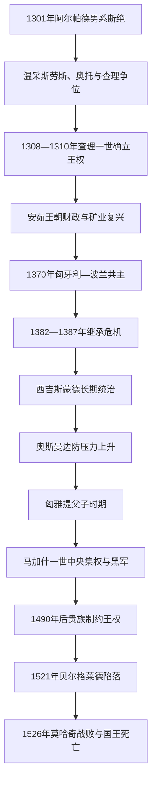

# 中世纪匈牙利王国

## 时间

1301—1526年

## 概括

阿尔帕德王朝断绝后，匈牙利经历近十年的王位竞争。安茹王朝的查理一世借圣冠合法性、教会与部分贵族支持，逐一击败控制各地区的寡头，恢复铸币、矿山、关税和王室官职。十四世纪的王国凭贵金属、跨区域贸易和贵族军役成为中欧强国；拉约什一世还兼任波兰国王。

十五世纪的奥斯曼扩张把南部边防变成国家生存问题。匈雅提·亚诺什组织反奥斯曼战争，其子马加什一世以非常税、职业军队和官僚网络达到后期王权高峰。1490年马加什无合法婚生继承人，贵族推举接受限制条件的乌拉斯洛二世；财政、常备军和边防随之衰退。1521年贝尔格莱德失守，1526年拉约什二世在莫哈奇战败身亡，王位和国土同时分裂。

## 演变关系

## 王位竞争与安茹王权重建（1301—1382年）

安德拉什三世死后，温采斯劳斯、奥托和查理都凭阿尔帕德女性后裔关系争位。圣冠、塞克什白堡和合法主教主持三项传统使“加冕”具有决定性：查理虽早有加冕仪式，直到1310年取得圣冠并按完整礼制加冕，合法性才稳定。

王位合法并不等于控制全国。马太·查克、奥鲍家和其他寡头掌握城堡、税源和私人军队。1312年罗日戈尼战役打破奥鲍家军事核心，此后查理以逐个结盟、没收叛乱领地、任命亲信掌握“荣职”的方式恢复王室网络。

### 查理一世的统治机制

| 机制 | 具体做法 | 效果 |
|---|---|---|
| 官职领地 | 高级官员在任期内使用王室城堡与收入，而非永久占有 | 让权力与官职绑定，削弱世袭寡头。 |
| 矿业与货币 | 鼓励地主开发金银矿，改革金币和铸币制度 | 匈牙利成为欧洲重要黄金产区，王室获得稳定收入。 |
| 税收 | 以门户税、关税和盐业等现金收入替代旧式王产依赖 | 支持宫廷、外交和军役。 |
| 外交 | 1335年维谢格拉德会晤协调波希米亚、波兰与匈牙利 | 绕开维也纳贸易壁垒，增强中欧合作。 |

拉约什一世继承稳固财政，向那不勒斯、巴尔干和达尔马提亚用兵，1370年又继承波兰王位。其扩张声望很高，但长期战争依靠贵族军役与王室收入，并未形成统一行政帝国；波兰与匈牙利仅共享君主。

## 继承危机、西吉斯蒙德与奥斯曼边防（1382—1437年）

拉约什无子，女儿玛丽亚以“国王”身份继位。贵族派系围绕玛丽亚、那不勒斯的查理二世和卢森堡的西吉斯蒙德冲突，王后母女一度被俘，查理则遭刺杀。1387年西吉斯蒙德加冕，与玛丽亚共治至1395年，此后单独统治。

1396年西吉斯蒙德组织的十字军在尼科波利斯被奥斯曼击败，暴露西欧骑士战法、指挥协调与后勤问题。他随后加强南部要塞、同塞尔维亚等邻国建立附庸和防御关系，并以“龙骑士团”等联盟约束贵族。其同时介入德意志、波希米亚和教会大分裂，提升国际地位，却也长期离境并依赖国内贵族联盟。

## 匈雅提时期与马加什王权（1437—1490年）

西吉斯蒙德死后，王位在哈布斯堡的阿尔布雷希特、雅盖隆的乌拉斯洛一世和遗腹子拉斯洛五世之间更替。1440—1444年两位国王并立；乌拉斯洛在1444年瓦尔纳战役阵亡后，匈雅提·亚诺什被选为幼王摄政。

匈雅提以南部领地、私人军队和王国资源持续抗击奥斯曼。1448年第二次科索沃战役失败，但1456年贝尔格莱德防御战阻止穆罕默德二世沿多瑙河深入。胜利后匈雅提死于疫病，其子马加什在1458年由等级会议推举为王。

马加什通过没收叛乱贵族领地、提拔较低出身官员、征收“王室金库税”等非常收入维持常备“黑军”。他巩固摩拉维亚、西里西亚并于1485年占领维也纳。不过其西向战争没有消除奥斯曼威胁，税负引起反感；黑军和高度个人化的官僚财政又依赖强势国王持续统筹。

## 雅盖隆王朝与防线崩溃（1490—1526年）

马加什无合法婚生子，贵族拒绝其私生子科尔温·亚诺什，转而推举波希米亚国王乌拉斯洛二世。新王接受限制加税、依赖等级会议和解散黑军等条件。王国并非立即“完全无政府”，但王室收入、职业军队和边防维修明显下降，权贵派系对官职与土地的控制增强。

1514年，原为十字军征募的农民在多饶·捷尔吉领导下转为大起义。贵族镇压后强化农民劳役和领主权，《三部法典》把贵族法权系统化，扩大了社会裂缝。与此同时，奥斯曼帝国在苏莱曼一世统治下集中进攻多瑙河防线；1521年贝尔格莱德失守，南部门户洞开。

1526年，拉约什二世仓促集结的军队在莫哈奇平原迎战。匈军人数、协同与增援均不足，奥斯曼火器和纵深部署瓦解其冲锋；国王撤退时溺亡。奥斯曼军当年撤离大部内地，但无嗣国王之死使扎波尧伊·亚诺什与哈布斯堡的费迪南分别被拥立，内战为1541年奥斯曼长期占领布达创造条件。

## 统治结构

| 层级 | 角色 | 演变 |
|---|---|---|
| 国王与王廷 | 掌握加冕合法性、城堡、官职、铸币和外交 | 查理一世与马加什时期较强；无嗣与选举君主时更依赖贵族条件。 |
| 等级议会 | 高级教士、男爵及逐渐扩大的贵族代表 | 决定税收、征兵和王位承认，十五世纪影响明显上升。 |
| 郡与贵族 | 地方司法、军役和税收执行 | 中小贵族通过郡维护政治身份，大贵族则经营跨郡城堡网络。 |
| 教会 | 主教兼官员、地主和文化机构 | 提供文书行政与财政资源，也卷入王位和外交斗争。 |
| 城市与矿区 | 王家自由城市、矿业城镇和商贸中心 | 提供现金税与技术人口，但政治代表权仍弱于贵族。 |
| 边防体系 | 南部要塞、边疆领主和附庸网络 | 随奥斯曼扩张成为国家财政核心，1490年后维护不足。 |

## 重要事件

| 时间 | 事件 | 具体过程 | 结果与影响 |
|---|---|---|---|
| 1301—1310年 | 王位竞争 | 三位外来王族争夺圣冠和贵族支持 | 强化“合法加冕”与贵族承认的双重原则。 |
| 1312年 | 罗日戈尼战役 | 查理一世击败奥鲍家及其盟友 | 开始系统清除地方寡头。 |
| 1335年 | 维谢格拉德会晤 | 匈牙利、波兰、波希米亚君主协调贸易和争端 | 中欧王国合作加深。 |
| 1370年 | 匈牙利—波兰共主 | 拉约什一世继承波兰王位 | 形成个人联合，未合并两国制度。 |
| 1382—1387年 | 玛丽亚继承危机 | 女性继承、贵族派系与外来候选人冲突 | 西吉斯蒙德最终确立统治。 |
| 1396年 | 尼科波利斯战役 | 十字军被巴耶济德一世击败 | 奥斯曼威胁转为长期边防问题。 |
| 1444年 | 瓦尔纳战役 | 乌拉斯洛一世违反停战后战败阵亡 | 幼王法统恢复，匈雅提影响上升。 |
| 1456年 | 贝尔格莱德之战 | 匈雅提与卡皮斯特拉诺组织守军和民兵反击 | 暂缓奥斯曼北进。 |
| 1458年 | 马加什当选 | 贵族在多瑙河冰面集会支持匈雅提之子 | 开启强势选举君主统治。 |
| 1485年 | 马加什占领维也纳 | 黑军击败哈布斯堡势力 | 王权达到军事高峰，但财政负担加重。 |
| 1514年 | 多饶农民起义 | 十字军征募转成反领主战争 | 残酷镇压和劳役强化扩大社会矛盾。 |
| 1521年 | 贝尔格莱德陷落 | 边防经费和援军不足，奥斯曼夺取要塞 | 多瑙河南部防线破口。 |
| 1526年 | 莫哈奇战役 | 匈军主力仓促决战，拉约什二世战败身亡 | 王位并立、内战和三方分治的起点。 |

## 兴盛与衰亡原因

### 兴盛条件

- **资源**：黄金、白银、盐和跨多瑙河贸易为安茹王权提供现金财政。
- **制度**：官职领地和可撤换官员使国王能够利用城堡网络而不永久赏赐王产。
- **政治联盟**：国王联合教会、中小贵族与部分大族，逐一孤立寡头。
- **军事创新**：匈雅提的边疆动员与马加什的常备军提高了应对奥斯曼和中欧战争的能力。

### 结构性衰落

- 王权财政高度依赖强势君主和非常税，没有稳定转化为由各等级共同承担的长期边防预算。
- 马加什无合法继承人，选举继承使贵族得以用限制王权换取支持。
- 大贵族、郡贵族、城市和依附农民之间权利不均，1514年镇压后社会动员更加困难。
- 黑军解散、官僚网络流失和城堡维护不足，使中央军力迅速退化。

### 外部压力

- 奥斯曼拥有更大的常备军、火器、财政与巴尔干后勤基地，并能逐段夺取多瑙河要塞。
- 哈布斯堡、波兰—立陶宛、威尼斯和波希米亚等王朝竞争分散了外交注意力，王位候选人又把外部势力引入国内。

### 直接灭亡过程

1521年贝尔格莱德失守使核心边防破裂；1526年王国未等各地与盟军集结就选择莫哈奇决战，主力被歼且国王死亡。国家机构未立即消失，但扎波尧伊与费迪南的双重选举把失败转化为内战。因而“中世纪统一王国”的终结既有长期财政—边防失衡，也有无嗣国王战死这一直接触发因素。

## 王朝世系与演变关系

完整国王、共治者、对立国王和摄政次序见[匈牙利君主与摄政世系表](/%E4%BA%BA%E6%96%87%E7%A7%91%E5%AD%A6/%E5%8E%86%E5%8F%B2/%E6%AC%A7%E6%B4%B2/%E5%8C%88%E7%89%99%E5%88%A9/%E5%8C%88%E7%89%99%E5%88%A9%E5%90%9B%E4%B8%BB%E4%B8%8E%E6%91%84%E6%94%BF%E4%B8%96%E7%B3%BB%E8%A1%A8.md)。

- 前一节点：[马扎尔迁徙与阿尔帕德王朝](/%E4%BA%BA%E6%96%87%E7%A7%91%E5%AD%A6/%E5%8E%86%E5%8F%B2/%E6%AC%A7%E6%B4%B2/%E5%8C%88%E7%89%99%E5%88%A9/%E9%A9%AC%E6%89%8E%E5%B0%94%E8%BF%81%E5%BE%99%E4%B8%8E%E9%98%BF%E5%B0%94%E5%B8%95%E5%BE%B7%E7%8E%8B%E6%9C%9D.md)。
- 后一节点：[奥斯曼—哈布斯堡分治与王国重建](/%E4%BA%BA%E6%96%87%E7%A7%91%E5%AD%A6/%E5%8E%86%E5%8F%B2/%E6%AC%A7%E6%B4%B2/%E5%8C%88%E7%89%99%E5%88%A9/%E5%A5%A5%E6%96%AF%E6%9B%BC%E2%80%94%E5%93%88%E5%B8%83%E6%96%AF%E5%A0%A1%E5%88%86%E6%B2%BB%E4%B8%8E%E7%8E%8B%E5%9B%BD%E9%87%8D%E5%BB%BA.md)。
- 总览：[匈牙利历史](/%E4%BA%BA%E6%96%87%E7%A7%91%E5%AD%A6/%E5%8E%86%E5%8F%B2/%E6%AC%A7%E6%B4%B2/%E5%8C%88%E7%89%99%E5%88%A9/README.md)。
