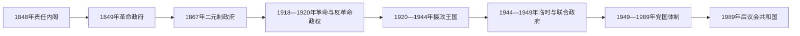

# 匈牙利国家元首与政府首脑表

## 范围与说明

本表以1848年责任内阁为起点，连续列出近现代匈牙利的国家元首、政府首脑和社会主义时期实际最高党务领导。革命、外国占领和内战造成若干并行政权，表中以“名义职位—实际权力—控制区域”分开说明，不把总理、摄政、总统和党魁混作同一角色。

截至2026年7月14日，彼得·毛焦尔（Péter Magyar）为总理。总统府仍将舒尤克·道马什（Tamás Sulyok）列为在任总统；国会已于7月13日通过《基本法》第十七次修正案，拟在公布生效后终止其任期，但总统公布及可能的宪法审查程序尚未完成，因此本表不提前把国会议长写成已经就任的代总统。

## 职位演变

## 1848—1867年：责任内阁、革命与新专制

### 政府首脑

| 顺序 | 人物 | 职位 | 任期 | 权力结构与关键事件 |
|---|---|---|---|---|
| 1 | **鲍特亚尼·拉约什（Lajos Batthyány）** | 首相 | 1848年3月17日—10月2日 | 首位对匈牙利议会负责的首相；《四月法令》建立宪政政府，后因王廷与匈牙利军政冲突辞职。 |
| 2 | 雷采伊·亚当（Ádám Récsey） | 王室任命首相 | 1848年10月3—7日 | 由皇室在军事接管背景下任命，匈牙利议会不承认。 |
| — | 科苏特·拉约什 | 国防委员会主席 | 1848年10月2日—1849年5月1日 | 不是首相；在战争中成为实际政府领袖，1849年4月改任总督总统。 |
| 3 | 塞迈雷·贝尔陶隆（Bertalan Szemere） | 首相 | 1849年5月2日—8月11日 | 独立宣言后的政府首脑；俄奥联军取胜后流亡。 |
| — | 无独立责任内阁 | 哈布斯堡中央政府直接统治 | 1849年8月—1867年2月 | 新专制及其后过渡期内，匈牙利没有按1848年制度运作的独立责任首相。 |

### 国家元首

| 人物 | 职位 | 任期 | 说明 |
|---|---|---|---|
| 费迪南五世 | 匈牙利国王 | 至1848年12月2日 | 批准《四月法令》后退位。 |
| 费伦茨·约瑟夫一世 | 哈布斯堡君主／匈牙利王位主张者 | 1848年12月2日起；1867年完成匈牙利加冕 | 革命政府不承认其继位；1849年在俄军支援下恢复控制。 |
| **科苏特·拉约什** | 总督总统 | 1849年4月14日—8月11日 | 独立宣言废黜哈布斯堡后成为革命国家元首，与费伦茨·约瑟夫的王权主张并立。 |

详情见[奥斯曼—哈布斯堡分治与王国重建](/%E4%BA%BA%E6%96%87%E7%A7%91%E5%AD%A6/%E5%8E%86%E5%8F%B2/%E6%AC%A7%E6%B4%B2/%E5%8C%88%E7%89%99%E5%88%A9/%E5%A5%A5%E6%96%AF%E6%9B%BC%E2%80%94%E5%93%88%E5%B8%83%E6%96%AF%E5%A0%A1%E5%88%86%E6%B2%BB%E4%B8%8E%E7%8E%8B%E5%9B%BD%E9%87%8D%E5%BB%BA.md)。

## 1867—1918年：奥匈二元制下的首相

共同君主兼匈牙利国王为费伦茨·约瑟夫一世（1867年加冕—1916年）和卡罗伊四世（1916—1918年）。匈牙利首相向本国议会负责，但君主任命首相并保留重要军政权力；外交、共同军队及相应财政由二元帝国共同机构处理。

| 顺序 | 首相 | 任期 | 继任背景与关键事件 |
|---|---|---|---|
| 4 | **安德拉希·久洛（Gyula Andrássy）** | 1867年2月20日—1871年11月14日 | 妥协后的首任首相；建立二元制匈牙利政府并完成1868年克罗地亚—匈牙利协议。 |
| 5 | 洛尼奥伊·迈涅赫特（Menyhért Lónyay） | 1871年11月14日—1872年12月4日 | 财政与利益冲突争议中辞职。 |
| 6 | 斯拉维·约瑟夫（József Szlávy） | 1872年12月4日—1874年3月1日 | 经济危机与执政联盟分裂下下台。 |
| 7 | 比托·伊什特万（István Bittó） | 1874年3月1日—1875年3月2日 | 旧自由派过渡政府。 |
| 8 | 文克海姆·贝拉（Béla Wenckheim） | 1875年3月2日—10月20日 | 自由党形成前的短期首相。 |
| 9 | **蒂萨·卡尔曼（Kálmán Tisza）** | 1875年10月20日—1890年3月13日 | 长期自由党统治；建设行政国家、铁路和资本主义经济，同时维持有限选举权并强化马扎尔化。 |
| 10 | 萨帕里·久洛（Gyula Szapáry） | 1890年3月13日—1892年11月17日 | 因教会—国家改革分歧辞职。 |
| 11 | 韦克勒·山多尔（Sándor Wekerle） | 1892年11月17日—1895年1月14日 | 首位非贵族首相；推动民事婚姻等自由主义教会政策。 |
| 12 | 班菲·德热（Dezső Bánffy） | 1895年1月14日—1899年2月26日 | 强硬民族政策和议会冲突加剧。 |
| 13 | 塞尔·卡尔曼（Kálmán Széll） | 1899年2月26日—1903年6月27日 | 以议会缓和与财政整顿著称，后因军队语言争议下台。 |
| 14 | 胡恩-海代尔瓦里·卡罗伊（Károly Khuen-Héderváry） | 1903年6月27日—11月3日 | 首次组阁，仅维持数月。 |
| 15 | 蒂萨·伊什特万（István Tisza） | 1903年11月3日—1905年6月18日 | 以程序手段压制议会阻挠；1905年选举失去多数。 |
| 16 | 费耶尔瓦里·盖萨（Géza Fejérváry） | 1905年6月18日—1906年4月8日 | 君主任命的“达拉班政府”，缺乏议会多数，引发宪政危机。 |
| 17 | 韦克勒·山多尔 | 1906年4月8日—1910年1月17日 | 反对派联盟与王廷妥协后执政。 |
| 18 | 胡恩-海代尔瓦里·卡罗伊 | 1910年1月17日—1912年4月22日 | 第二次组阁，为全国工作党长期执政铺路。 |
| 19 | 卢卡奇·拉斯洛（László Lukács） | 1912年4月22日—1913年6月10日 | 因选举资金与政治丑闻辞职。 |
| 20 | 蒂萨·伊什特万 | 1913年6月10日—1917年6月15日 | 第二次组阁，带领匈牙利进入第一次世界大战；因战争改革与选举权争议辞职。 |
| 21 | 埃斯泰哈齐·莫里茨（Móric Esterházy） | 1917年6月15日—8月20日 | 改革派短期政府。 |
| 22 | 韦克勒·山多尔 | 1917年8月20日—1918年10月30日 | 第三次组阁；帝国战败与民族分离中辞职。 |
| 23 | 哈迪克·亚诺什（János Hadik） | 1918年10月30—31日 | 任期不足一天，紫菀革命使其无法建立有效政府。 |

详情见[奥匈帝国与第一次世界大战](/%E4%BA%BA%E6%96%87%E7%A7%91%E5%AD%A6/%E5%8E%86%E5%8F%B2/%E6%AC%A7%E6%B4%B2/%E5%8C%88%E7%89%99%E5%88%A9/%E5%A5%A5%E5%8C%88%E5%B8%9D%E5%9B%BD%E4%B8%8E%E7%AC%AC%E4%B8%80%E6%AC%A1%E4%B8%96%E7%95%8C%E5%A4%A7%E6%88%98.md)。

## 1918—1946年：共和国、苏维埃、摄政王国与战争政权

### 国家元首与并行权力

| 顺序 | 人物／机构 | 职位 | 任期 | 实际权力与并立关系 |
|---|---|---|---|---|
| 1 | **卡罗伊·米哈伊（Mihály Károlyi）** | 国民委员会领袖；临时总统 | 1918年11月16日—1919年3月21日；1919年1月11日起正式称临时总统 | 第一共和国元首；因边界、军事和协约国照会危机交权。 |
| 2 | 加尔鲍伊·山多尔（Sándor Garbai） | 革命执政委员会主席 | 1919年3月21日—8月1日 | 苏维埃共和国名义元首兼政府首脑；库恩·贝拉掌握主要党务和外交路线。 |
| — | 佩德尔·久洛（Gyula Peidl） | 事实上的临时国家元首，兼部长会议主席 | 1919年8月1—6日 | 苏维埃共和国倒台后的工会社会主义过渡；法统和控制力都很有限。 |
| — | 布达佩斯政权交接 | 无稳定国家元首 | 1919年8月6—7日 | 佩德尔政府被推翻，反革命力量在罗马尼亚占领背景下夺权。 |
| 3 | 约瑟夫·奥古斯特大公 | 摄政 | 1919年8月7—23日 | 反革命政府拥立；在协约国压力下辞职。 |
| — | 临时内阁与协约国监督 | 无统一元首 | 1919年8月23日—1920年3月1日 | 由连续临时政府组织选举并恢复王国。 |
| 4 | **霍尔蒂·米克洛什** | 王国摄政 | 1920年3月1日—1944年10月16日 | 无王王国元首；有任免首相、军队统帅与解散议会等广泛权限，权力强弱随内阁与战争变化。 |
| 5 | 萨拉希·费伦茨 | “民族领袖” | 1944年10月16日—1945年3月28日 | 德国扶持的箭十字党政权元首兼政府首脑；10月16日起实际掌权，11月3日正式宣誓为“民族领袖”。 |
| — | 临时国民议会与临时国民政府 | 尚未设专任国家元首 | 1944年12月22日—1945年4月17日 | 在苏军控制区建立；至1945年3月与萨拉希政权分区并行。 |
| 6 | 高等国民委员会 | 集体国家元首 | 1945年4月17日—1946年2月1日 | 依法在总统产生前行使国家元首职权，第二共和国成立后结束。 |
| 7 | 蒂尔迪·佐尔坦（Zoltán Tildy） | 第二共和国总统 | 1946年2月1日起 | 共和国成立后成为首任总统，续任见下一节。 |

### 政府首脑

| 顺序 | 人物 | 职位 | 任期 | 关键事件／备注 |
|---|---|---|---|---|
| 24 | 卡罗伊·米哈伊 | 首相 | 1918年10月31日—1919年1月11日 | 紫菀革命后组阁，随后转任总统。 |
| 25 | 拜林凯伊·德奈什（Dénes Berinkey） | 首相 | 1919年1月11日—3月21日 | 无力接受维克斯照会提出的撤军线，内阁辞职。 |
| 26 | 加尔鲍伊·山多尔 | 革命执政委员会主席 | 1919年3月21日—8月1日 | 苏维埃共和国名义政府首脑；库恩·贝拉是关键实际领导者。 |
| — | 卡罗伊·久洛（Gyula Károlyi） | 阿拉德／塞格德反革命政府首脑 | 1919年5月5日—7月12日 | 在法国占领区建立，与苏维埃共和国并行；5月末由阿拉德迁至塞格德。 |
| — | 帕坦秋什-阿布拉哈姆·德热（Dezső Pattantyús-Ábrahám） | 塞格德反革命政府首脑 | 1919年7月12日—8月12日 | 继续并行政权，容纳军官集团；苏维埃政权倒台后并入新的反革命国家结构。 |
| 27 | 佩德尔·久洛（Gyula Peidl） | 部长会议主席 | 1919年8月1—6日 | 工会社会主义过渡政府，被反革命政变推翻。 |
| 28 | 弗里德里希·伊什特万（István Friedrich） | 首相 | 1919年8月7日—11月24日 | 反革命政府，在罗马尼亚占领和协约国压力下执政。 |
| 29 | 胡萨尔·卡罗伊（Károly Huszár） | 首相 | 1919年11月24日—1920年3月15日 | 组织国民议会选举并恢复王国体制。 |
| 30 | 希莫尼-谢毛道姆·山多尔（Sándor Simonyi-Semadam） | 首相 | 1920年3月15日—7月19日 | 签署《特里亚农条约》。 |
| 31 | **泰莱基·帕尔（Pál Teleki）** | 首相 | 1920年7月19日—1921年4月14日 | 首次组阁；卡罗伊四世第一次复辟危机后辞职。 |
| 32 | **拜特伦·伊什特万（István Bethlen）** | 首相 | 1921年4月14日—1931年8月24日 | 稳定摄政体制、限制选举竞争并争取国际金融恢复；以修约主义整合政治。 |
| 33 | 卡罗伊·久洛（Gyula Károlyi） | 首相 | 1931年8月24日—1932年10月1日 | 大萧条紧缩政府。 |
| 34 | **根伯什·久洛（Gyula Gömbös）** | 首相 | 1932年10月1日—1936年10月6日 | 推动威权群众政治并靠近意大利、德国。 |
| 35 | 达拉尼·卡尔曼（Kálmán Darányi） | 首相 | 1936年10月12日—1938年5月14日 | 扩军并通过第一部反犹法律的准备阶段。 |
| 36 | 伊姆雷迪·贝拉（Béla Imrédy） | 首相 | 1938年5月14日—1939年2月16日 | 进一步右转并颁布反犹限制；因自身家族血统争议辞职。 |
| 37 | 泰莱基·帕尔 | 首相 | 1939年2月16日—1941年4月3日 | 第二次组阁；在轴心依赖与保持回旋之间挣扎，德军进攻南斯拉夫前自杀。 |
| 38 | 巴尔多希·拉斯洛（László Bárdossy） | 首相 | 1941年4月3日—1942年3月7日 | 匈牙利参加对苏战争并对英美进入战争状态。 |
| 39 | 卡拉伊·米克洛什（Miklós Kállay） | 首相 | 1942年3月9日—1944年3月22日 | 秘密寻求脱离轴心；德国占领后被迫下台。 |
| 40 | 斯托尧伊·德迈（Döme Sztójay） | 首相 | 1944年3月22日—8月29日 | 德国占领下组阁，配合大规模驱逐犹太人。 |
| 41 | 洛卡托什·盖萨（Géza Lakatos） | 首相 | 1944年8月29日—10月16日 | 试图停战；霍尔蒂行动失败后被箭十字党取代。 |
| 42 | 萨拉希·费伦茨 | 民族团结政府首脑 | 1944年10月16日—1945年3月28日 | 箭十字党恐怖统治并继续战争。 |
| 43 | **米克洛什·贝拉（Béla Miklós）** | 临时国民政府首脑 | 1944年12月22日—1945年11月15日 | 苏军控制区成立，1945年3月前与萨拉希政府并行；对德宣战并开始战后重建。 |
| 44 | 蒂尔迪·佐尔坦 | 首相 | 1945年11月15日—1946年2月1日；内阁看守至2月4日 | 小农党赢得选举后组阁，2月1日转任共和国总统，纳吉·费伦茨政府于2月4日接任。 |

详情见[两次世界大战与霍尔蒂摄政](/%E4%BA%BA%E6%96%87%E7%A7%91%E5%AD%A6/%E5%8E%86%E5%8F%B2/%E6%AC%A7%E6%B4%B2/%E5%8C%88%E7%89%99%E5%88%A9/%E4%B8%A4%E6%AC%A1%E4%B8%96%E7%95%8C%E5%A4%A7%E6%88%98%E4%B8%8E%E9%9C%8D%E5%B0%94%E8%92%82%E6%91%84%E6%94%BF.md)。

## 1946—1989年：共和国与社会主义国家

### 国家元首

| 顺序 | 人物／机构 | 职位 | 任期 | 说明 |
|---|---|---|---|---|
| 7 | 蒂尔迪·佐尔坦 | 共和国总统 | 1946年2月1日—1948年8月3日 | 在共产党逐步排除竞争党派的过程中被迫辞职。 |
| 8 | 萨卡希奇·阿尔帕德（Árpád Szakasits） | 共和国总统；后任主席团主席 | 1948年8月3日—1950年4月26日 | 1949年8月23日新宪法后，国家元首改为集体“人民共和国主席团”，他任首任主席。 |
| 9 | 罗瑙伊·山多尔（Sándor Rónai） | 主席团主席 | 1950年4月26日—1952年8月14日 | 名义国家元首，实权在党领导。 |
| 10 | 多比·伊什特万（István Dobi） | 主席团主席 | 1952年8月14日—1967年4月14日 | 经拉科西、1956年革命和卡达尔巩固期，职位保持礼仪性。 |
| 11 | 洛松齐·帕尔（Pál Losonczi） | 主席团主席 | 1967年4月14日—1987年6月25日 | 卡达尔时期长期名义国家元首。 |
| 12 | 内迈特·卡罗伊（Károly Németh） | 主席团主席 | 1987年6月25日—1988年6月29日 | 改革压力上升时任职。 |
| 13 | 施特劳布·布鲁诺（Brunó Straub） | 主席团主席 | 1988年6月29日—1989年10月23日 | 共和国改制后主席团撤销。 |
| 14 | 叙勒什·马加什（Mátyás Szűrös） | 临时共和国总统 | 1989年10月23日—1990年5月2日 | 在国会宣布第三共和国成立，主持首次自由选举前过渡。 |

### 政府首脑

| 顺序 | 人物 | 任期 | 关键事件／备注 |
|---|---|---|---|
| 45 | 纳吉·费伦茨（Ferenc Nagy） | 1946年2月4日—1947年5月31日 | 小农党政府首脑，在共产党压力和“阴谋案”中流亡辞职。 |
| 46 | 迪涅什·拉约什（Lajos Dinnyés） | 1947年5月31日—1948年12月10日 | 操纵选举与党派合并期间的联合政府。 |
| 47 | 多比·伊什特万 | 1948年12月10日—1952年8月14日 | 完成国有化、集体化和人民共和国体制建立。 |
| 48 | **拉科西·马加什（Mátyás Rákosi）** | 1952年8月14日—1953年7月4日 | 兼党魁，斯大林主义高压达到顶点。 |
| 49 | **纳吉·伊姆雷（Imre Nagy）** | 1953年7月4日—1955年4月18日 | 推行“新阶段”缓和政策，后被拉科西集团排挤。 |
| 50 | 海盖迪什·安德拉什（András Hegedüs） | 1955年4月18日—1956年10月24日 | 革命爆发后下台，并签署请求苏军干预的文件。 |
| 51 | 纳吉·伊姆雷 | 1956年10月24日—11月4日 | 革命政府宣布多党化、中立和退出华沙条约；苏军入侵后被捕，1958年处决。 |
| 52 | **卡达尔·亚诺什（János Kádár）** | 1956年11月4日—1958年1月28日 | 在苏军支持下建立“工农革命政府”，镇压革命。 |
| 53 | 明尼赫·费伦茨（Ferenc Münnich） | 1958年1月28日—1961年9月13日 | 完成镇压后的政权巩固。 |
| 54 | 卡达尔·亚诺什 | 1961年9月13日—1965年6月30日 | 第二次任政府首脑，推动有限缓和。 |
| 55 | 卡拉伊·久洛（Gyula Kállai） | 1965年6月30日—1967年4月14日 | 为经济改革做制度准备。 |
| 56 | 福克·耶内（Jenő Fock） | 1967年4月14日—1975年5月15日 | 1968年实施“新经济机制”，后因苏东压力和国内保守派而收缩。 |
| 57 | 拉扎尔·捷尔吉（György Lázár） | 1975年5月15日—1987年6月25日 | 债务驱动的生活水平政策逐渐失去可持续性。 |
| 58 | 格罗斯·卡罗伊（Károly Grósz） | 1987年6月25日—1988年11月24日 | 后兼任党总书记；试图以有限改革挽救体制。 |
| 59 | **内迈特·米克洛什（Miklós Németh）** | 1988年11月24日—1990年5月23日 | 推动边界开放、圆桌谈判和向议会民主过渡；1990年自由选举后交权。 |

### 实际最高党务领导

| 人物 | 党内最高职位期 | 与国家机构的关系 |
|---|---|---|
| **拉科西·马加什** | 1948年党合并后—1956年7月18日 | 以劳动人民党总书记／第一书记控制干部、警察和政府；1953年后虽不任总理仍保持最高实权。 |
| 格罗·埃尔诺（Ernő Gerő） | 1956年7月18日—10月25日 | 接替拉科西，革命爆发后迅速失势。 |
| **卡达尔·亚诺什** | 1956年10月25日—1988年5月22日 | 以社会主义工人党第一书记／总书记长期掌握实际最高权力。 |
| 格罗斯·卡罗伊 | 1988年5月22日—1989年10月7日 | 党内最高职位后期受到内迈特政府和改革派集体主席团分权，已非稳定的个人最高统治。 |

详情见[社会主义匈牙利](/%E4%BA%BA%E6%96%87%E7%A7%91%E5%AD%A6/%E5%8E%86%E5%8F%B2/%E6%AC%A7%E6%B4%B2/%E5%8C%88%E7%89%99%E5%88%A9/%E7%A4%BE%E4%BC%9A%E4%B8%BB%E4%B9%89%E5%8C%88%E7%89%99%E5%88%A9.md)。

## 1989年以来：第三共和国／匈牙利

### 国家元首

| 顺序 | 人物 | 职位 | 任期 | 关键事件／备注 |
|---|---|---|---|---|
| 14 | 叙勒什·马加什 | 临时共和国总统 | 1989年10月23日—1990年5月2日 | 过渡期元首。 |
| 15 | **根茨·阿尔帕德（Árpád Göncz）** | 代总统；共和国总统 | 1990年5月2日—2000年8月4日；8月3日前为代总统 | 由新国会选出，连续两届任职。 |
| 16 | 马德尔·费伦茨（Ferenc Mádl） | 共和国总统 | 2000年8月4日—2005年8月5日 | 任内完成加入北约后的制度巩固并加入欧盟。 |
| 17 | 肖约姆·拉斯洛（László Sólyom） | 共和国总统 | 2005年8月5日—2010年8月6日 | 前宪法法院院长，强调宪政审查。 |
| 18 | 施米特·帕尔（Pál Schmitt） | 共和国总统 | 2010年8月6日—2012年4月2日 | 因博士论文抄袭争议辞职。 |
| — | 克韦尔·拉斯洛（László Kövér） | 代总统 | 2012年4月2日—5月10日 | 以国会议长身份代理。 |
| 19 | 阿戴尔·亚诺什（János Áder） | 总统 | 2012年5月10日—2022年5月10日 | 《基本法》生效后国名改为“匈牙利”，连任两届。 |
| 20 | **诺瓦克·卡塔琳（Katalin Novák）** | 总统 | 2022年5月10日—2024年2月26日 | 首位女性总统；因儿童性侵案从犯赦免争议辞职。 |
| — | 克韦尔·拉斯洛 | 代总统 | 2024年2月26日—3月5日 | 第二次以国会议长身份代理。 |
| 21 | **舒尤克·道马什（Tamás Sulyok）** | 总统 | 2024年3月5日—截至2026年7月14日仍列在任 | 2026年7月13日国会通过修宪拟终止其任期；截至核验日，公布、生效及可能司法审查尚未完成。 |

若总统职位依法空缺，按《基本法》由国会议长临时代行总统职权；2026年5月9日起的国会议长是福尔斯特霍费尔·阿格奈什（Ágnes Forsthoffer）。这是一项法律上的继任安排，不表示她在2026年7月14日已经成为代总统。

### 政府首脑

| 顺序 | 总理 | 任期 | 执政阶段与关键事件 |
|---|---|---|---|
| 60 | **安陶尔·约瑟夫（József Antall）** | 1990年5月23日—1993年12月12日 | 转型后首位民选政府首脑；推进市场化、私有化与西方制度接轨，任内病逝。 |
| 61 | 博罗什·彼得（Péter Boross） | 1993年12月12日—1994年7月15日 | 完成安陶尔内阁余下任期。 |
| 62 | 霍恩·久洛（Gyula Horn） | 1994年7月15日—1998年7月6日 | 社会党—自由民主派联合政府；实施财政稳定方案并推进北约、欧盟加入。 |
| 63 | **欧尔班·维克托（Viktor Orbán）** | 1998年7月6日—2002年5月27日 | 第一次执政，完成加入北约并强化中右翼政党整合。 |
| 64 | 迈杰希·彼得（Péter Medgyessy） | 2002年5月27日—2004年9月29日 | 任内加入欧盟，因联盟矛盾辞职。 |
| 65 | 久尔恰尼·费伦茨（Ferenc Gyurcsány） | 2004年9月29日—2009年4月14日 | 2006年“厄谢德讲话”泄露引发抗议；金融危机中辞职。 |
| 66 | 鲍伊瑙伊·戈尔东（Gordon Bajnai） | 2009年4月14日—2010年5月29日 | 技术型危机政府，执行财政调整。 |
| 67 | **欧尔班·维克托** | 2010年5月29日—2026年5月9日 | 连续执政近16年；2010年获三分之二多数，重写宪法并集中行政、媒体和选举制度权力，同时与欧盟发生长期法治争议。 |
| 68 | **毛焦尔·彼得（Péter Magyar）** | 2026年5月9日—至今 | 蒂萨党在4月12日选举取得141／199席后组阁；新多数启动制度改革，并于2026年6月确立总理累计任期上限。 |

详情见[1989年后的匈牙利](/%E4%BA%BA%E6%96%87%E7%A7%91%E5%AD%A6/%E5%8E%86%E5%8F%B2/%E6%AC%A7%E6%B4%B2/%E5%8C%88%E7%89%99%E5%88%A9/1989%E5%B9%B4%E5%90%8E%E7%9A%84%E5%8C%88%E7%89%99%E5%88%A9.md)。

## 连续性与权力辨析

- 1919年苏维埃共和国中，加尔鲍伊拥有名义元首和政府主席职务，库恩·贝拉才是掌握党务与外交路线的核心人物。
- 1919年5—8月，阿拉德／塞格德反革命政府同布达佩斯的苏维埃或过渡政府并立；卡罗伊·久洛和帕坦秋什-阿布拉哈姆·德热不是全国单线继任的首相。
- 1920—1944年国家元首是摄政霍尔蒂，不是总理；拜特伦、泰莱基等内阁虽有政策空间，关键军政任命仍受摄政影响。
- 1944年12月至1945年3月，萨拉希政府与米克洛什临时政府在不同占领区并存，不能排成无重叠的一条线。
- 1949—1989年主席团主席是法定国家元首，实际最高权力通常属于执政党第一书记／总书记；总理主要负责政府行政。
- 1989年后总统由国会选举、权限以礼仪和宪法制衡为主；政府与议会多数的实际政策权力集中于总理。
- “至今”统一以2026年7月14日为核验截止；总统任期修宪处于已经议会通过、尚待完成公布生效程序的过渡状态。

## 相关笔记

- [匈牙利历史总览](/%E4%BA%BA%E6%96%87%E7%A7%91%E5%AD%A6/%E5%8E%86%E5%8F%B2/%E6%AC%A7%E6%B4%B2/%E5%8C%88%E7%89%99%E5%88%A9/README.md)
- [匈牙利君主与摄政世系表](/%E4%BA%BA%E6%96%87%E7%A7%91%E5%AD%A6/%E5%8E%86%E5%8F%B2/%E6%AC%A7%E6%B4%B2/%E5%8C%88%E7%89%99%E5%88%A9/%E5%8C%88%E7%89%99%E5%88%A9%E5%90%9B%E4%B8%BB%E4%B8%8E%E6%91%84%E6%94%BF%E4%B8%96%E7%B3%BB%E8%A1%A8.md)
- [奥匈帝国与第一次世界大战](/%E4%BA%BA%E6%96%87%E7%A7%91%E5%AD%A6/%E5%8E%86%E5%8F%B2/%E6%AC%A7%E6%B4%B2/%E5%8C%88%E7%89%99%E5%88%A9/%E5%A5%A5%E5%8C%88%E5%B8%9D%E5%9B%BD%E4%B8%8E%E7%AC%AC%E4%B8%80%E6%AC%A1%E4%B8%96%E7%95%8C%E5%A4%A7%E6%88%98.md)
- [两次世界大战与霍尔蒂摄政](/%E4%BA%BA%E6%96%87%E7%A7%91%E5%AD%A6/%E5%8E%86%E5%8F%B2/%E6%AC%A7%E6%B4%B2/%E5%8C%88%E7%89%99%E5%88%A9/%E4%B8%A4%E6%AC%A1%E4%B8%96%E7%95%8C%E5%A4%A7%E6%88%98%E4%B8%8E%E9%9C%8D%E5%B0%94%E8%92%82%E6%91%84%E6%94%BF.md)
- [社会主义匈牙利](/%E4%BA%BA%E6%96%87%E7%A7%91%E5%AD%A6/%E5%8E%86%E5%8F%B2/%E6%AC%A7%E6%B4%B2/%E5%8C%88%E7%89%99%E5%88%A9/%E7%A4%BE%E4%BC%9A%E4%B8%BB%E4%B9%89%E5%8C%88%E7%89%99%E5%88%A9.md)
- [1989年后的匈牙利](/%E4%BA%BA%E6%96%87%E7%A7%91%E5%AD%A6/%E5%8E%86%E5%8F%B2/%E6%AC%A7%E6%B4%B2/%E5%8C%88%E7%89%99%E5%88%A9/1989%E5%B9%B4%E5%90%8E%E7%9A%84%E5%8C%88%E7%89%99%E5%88%A9.md)
