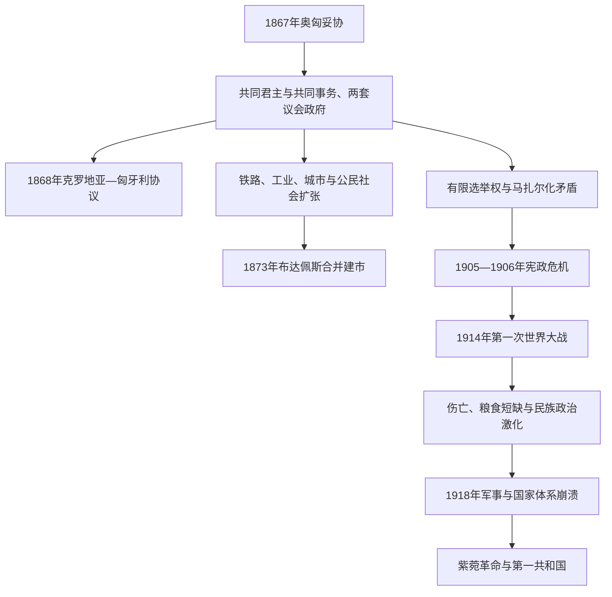

# 奥匈帝国与第一次世界大战

## 时间

1867—1918年

## 概括

1867年奥匈妥协把哈布斯堡君主国重组为二元体制：奥地利部分与匈牙利部分各有议会、责任内阁、法律和行政体系，共享君主、外交、共同军队以及相应财政。匈牙利并非奥地利的一个省，也不是完全主权独立国家；共同事务、王室军权和定期经济协议把两部分连接起来。

二元制为匈牙利带来半个世纪的国家建设、铁路工业化、布达佩斯都市化和公民法改革。与此同时，有限选举权、地主与资产阶级精英联盟、马扎尔化政策和对非马扎尔人口自治要求的压制，使政治参与远落后于社会变化。第一次世界大战把军队、粮食、交通与民族关系的矛盾集中放大。1918年军事失败、物资崩溃和各民族委员会脱离，使二元体制迅速解体；紫菀革命终结王国政府与哈布斯堡君主的实际联系。

## 演变关系

## 二元体制如何运作

1867年妥协恢复1848年责任政府的核心，安德拉希·久洛出任首相，费伦茨·约瑟夫一世在布达完成匈牙利加冕。法律上，圣史蒂芬王冠领地与“帝国议会代表的王国和领地”分别构成匈牙利、奥地利两个国家部分。

| 层级 | 匈牙利自主事务 | 共同或受约束事务 |
|---|---|---|
| 君主 | 以匈牙利国王身份任命本国首相、批准法律 | 同时为奥地利皇帝，掌握共同军队最高统帅权。 |
| 议会与政府 | 匈牙利国会制定内政、司法、教育、农业和本国预算 | 两国议会各选代表团审议共同外交、战争及相应财政。 |
| 军事 | 有匈牙利国土防卫军；征兵和部分军政由本国法律执行 | 帝国与王家共同军队由共同战争部管理，指挥语言和军权长期引发争议。 |
| 经济 | 本国财政、税制执行和经济政策 | 关税同盟、共同货币、中央银行与共同开支份额定期协商，通常每十年续订。 |
| 法律地位 | 匈牙利保留历史王国法统和独立行政 | 外交条约和战争决策仍由共同层面及君主主导。 |

这一结构依赖持续谈判。奥地利自由派希望维持经济共同体，匈牙利精英以承担共同开支换取内政控制；双方都把斯拉夫、罗马尼亚等民族的联邦化要求排除在二元核心之外。

## 克罗地亚与王国内部多民族结构

1868年《克罗地亚—匈牙利协议》承认克罗地亚—斯拉沃尼亚在内政、司法、宗教和教育方面的自治，设萨博尔议会与总督；财政、交通和多数经济事务仍由布达佩斯控制，克罗地亚代表进入匈牙利国会。协议既说明王国不是单一行政国家，也因代表权、里耶卡地位和财政分配不断引发争端。

1868年《民族法》宣称公民平等并允许地方、教会和学校有限使用少数民族语言，但把政治民族定义为统一的“匈牙利民族”。随着国家学校、铁路、行政和选举政治扩张，政府越来越以匈牙利语同化作为国家整合手段。斯洛伐克、罗马尼亚、塞尔维亚和鲁塞尼亚等政治团体要求文化自治或领土安排，却难在受限选举制度中取得相称代表。

犹太居民在1867年取得公民平等，城市商业、专业和文化生活迅速发展；同化为匈牙利语使用者使其在国家现代化中地位突出，也引发宗教保守与现代政治反犹主义。罗姆人、农民和无地劳动者则更少进入正式政治体系。

## 国家建设与经济社会转型

1873年布达、佩斯和老布达合并为布达佩斯。多瑙河桥梁、环形大道、议会大厦、地铁和公共事业把首都塑造成二元帝国的重要都市。铁路把谷物产区、矿业区与亚得里亚海和维也纳市场相连，食品加工、机械、金融和电气产业增长。

工业化并不均衡。首都和北部矿工区增长迅速，广大乡村仍由大庄园、小农和无地农业劳动者构成；人口增长与土地不足推动数百万人迁往城市或赴美洲。教育和识字率改善，国家学校又成为语言同化的主要场域。

蒂萨·卡尔曼1875—1890年长期执政，通过自由党、郡行政和有限选举维持稳定。政府建设现代官僚国家，却以公开投票、选区差异和行政影响控制乡村选举。政治制度因此能够连续运转，但难吸收工人、农民与非马扎尔民族的大规模参与。

## 政治危机与改革受阻

1890年代民事婚姻、宗教平等和犹太教承认等改革完成国家—教会关系现代化。与此同时，反对派把建立独立关税、匈牙利语军队指挥和扩大国家象征作为动员议题。

1905年选举中执政自由派失败，费伦茨·约瑟夫拒绝立即任命要求军队让步的反对派联盟，改任费耶尔瓦里组织缺乏议会多数的政府。各郡以拒税和抵制征兵反抗，王廷则考虑以普选削弱传统精英。1906年双方妥协，反对派放弃核心军队要求后入阁。危机显示匈牙利议会能制约政府，却也显示君主军权和狭窄选举权限制民主化。

1910年蒂萨·伊什特万的全国工作党取得压倒多数，强行克服议会阻挠并准备战争财政。反对派、社会民主党和民族组织继续要求普选，但在战争前未获根本改革。

## 第一次世界大战

### 从七月危机到总体战争

1914年萨拉热窝刺杀后，蒂萨最初担心吞并塞尔维亚会增加王国内斯拉夫人口，反对立即开战；在获得“不吞并塞尔维亚”的承诺后，他接受对塞最后通牒。战争决定形式上由共同外交和君主层面作出，匈牙利政府是关键参与者，但不应写成匈牙利单独发动战争。

匈牙利征召军队投入塞尔维亚、加利西亚、意大利和罗马尼亚等战线。前线伤亡、战俘和劳动力流失巨大；军需优先、运输瓶颈、通货膨胀与城乡征粮使平民生活恶化。匈牙利农业仍供应帝国，但奥地利城市的粮食危机加剧两部分互相指责。

### 战争中的民族与社会政治

俄军推进加利西亚、1916年罗马尼亚参战以及南斯拉夫、捷克斯洛伐克流亡运动，使民族自决从国内自治要求转为国际外交方案。匈牙利政府坚持历史王国领土完整，拒绝联邦化，越来越难争取非马扎尔政治精英。

1916年费伦茨·约瑟夫去世，卡罗伊四世试图秘密议和并推动有限改革。1917年蒂萨辞职，但后继政府无法同时解决选举权、军队补给和和平问题。1918年春夏军事攻势失败、保加利亚退出战争和协约国推进，使共同军队瓦解，士兵大量离队返乡。

### 1918年解体

1918年10月，各民族委员会在萨格勒布、马丁、克卢日等地宣告脱离或与邻国联合；王国政府对地方军队、铁路和行政失去控制。10月31日布达佩斯紫菀革命推翻旧政府，卡罗伊·米哈伊受命组阁，蒂萨被士兵刺杀。11月国王卡罗伊四世声明不再参与匈牙利国政，但没有正式退位；匈牙利随后宣布人民共和国。

帝国解体不是一份和约突然“肢解”一个仍能正常运作的国家，而是战场失败、军队解散、民族政府建立和协约国承认共同发生的过程。战后边界则在这一既成权力变化上由和平会议进一步确定。

## 重要事件

| 时间 | 事件 | 过程与转折 | 结果与影响 |
|---|---|---|---|
| 1867年 | 奥匈妥协 | 王廷与戴阿克派交换共同事务承认和匈牙利内政自治 | 二元帝国建立，责任内阁恢复。 |
| 1868年 | 克罗地亚—匈牙利协议与民族法 | 处理克罗地亚自治和王国内语言权利 | 留下财政、领土和统一政治民族的长期争议。 |
| 1873年 | 布达佩斯建市 | 三城合并并进行基础设施建设 | 成为国家行政、金融和文化中心。 |
| 1875—1890年 | 蒂萨·卡尔曼长期执政 | 自由党结合行政网络与有限选举 | 国家稳定现代化，同时压缩政治竞争。 |
| 1892—1895年 | 教会政治改革 | 民事婚姻、户籍和宗教平等立法 | 现代世俗国家制度扩大。 |
| 1905—1906年 | 宪政危机 | 反对派胜选、君主拒绝其军队条件，郡抵制政府 | 以反对派退让收场，军权问题未解决。 |
| 1914年 | 参加第一次世界大战 | 七月危机中匈牙利政府由犹豫转为支持最后通牒 | 大规模动员和总体战争开始。 |
| 1916年 | 罗马尼亚参战与新王继位 | 特兰西瓦尼亚受攻，卡罗伊四世继位 | 改革与议和压力增加。 |
| 1917年 | 蒂萨辞职 | 选举权和战争政策分歧 | 旧政治支柱动摇，但改革未能完成。 |
| 1918年10—11月 | 国家与君主制解体 | 军事失败、民族委员会分离、紫菀革命 | 二元制终结，第一共和国成立。 |

## 兴盛与解体原因

### 发展条件

- 1867年妥协结束长期宪制对抗，使精英愿意投资国家行政和经济建设。
- 共同关税、货币与大市场便利铁路、银行、农业出口和工业资本形成。
- 城市化、教育和犹太公民解放扩大专业人才与中产社会。
- 匈牙利政府拥有广泛内政权，可按本国精英目标建设统一官僚国家。

### 结构性矛盾

- 二元制只在奥地利德意志精英与匈牙利马扎尔精英间分权，没有为帝国其他民族提供同等国家地位。
- 匈牙利境内选举权狭窄且行政干预严重，工人、农民和少数民族难以通过议会改变政策。
- 共同军队、关税续约和经费份额不断引发两国部分之间冲突。
- 工业与城市增长同乡村贫困、土地高度集中并存，战时承受能力不均。

### 外部压力与直接终结

巴尔干民族国家扩张、俄国与德奥集团对抗以及总体战争把国内民族问题国际化。1918年同盟国战败、共同军队溃散、粮食和交通体系崩溃，是直接终结；各民族委员会取得地方权力并获得协约国支持，使恢复历史王国边界失去现实条件。

## 统治结构与前后关系

完整共同君主与历届匈牙利首相见[匈牙利君主与摄政世系表](/%E4%BA%BA%E6%96%87%E7%A7%91%E5%AD%A6/%E5%8E%86%E5%8F%B2/%E6%AC%A7%E6%B4%B2/%E5%8C%88%E7%89%99%E5%88%A9/%E5%8C%88%E7%89%99%E5%88%A9%E5%90%9B%E4%B8%BB%E4%B8%8E%E6%91%84%E6%94%BF%E4%B8%96%E7%B3%BB%E8%A1%A8.md)和[匈牙利国家元首与政府首脑表](/%E4%BA%BA%E6%96%87%E7%A7%91%E5%AD%A6/%E5%8E%86%E5%8F%B2/%E6%AC%A7%E6%B4%B2/%E5%8C%88%E7%89%99%E5%88%A9/%E5%8C%88%E7%89%99%E5%88%A9%E5%9B%BD%E5%AE%B6%E5%85%83%E9%A6%96%E4%B8%8E%E6%94%BF%E5%BA%9C%E9%A6%96%E8%84%91%E8%A1%A8.md)。

- 前一节点：[奥斯曼—哈布斯堡分治与王国重建](/%E4%BA%BA%E6%96%87%E7%A7%91%E5%AD%A6/%E5%8E%86%E5%8F%B2/%E6%AC%A7%E6%B4%B2/%E5%8C%88%E7%89%99%E5%88%A9/%E5%A5%A5%E6%96%AF%E6%9B%BC%E2%80%94%E5%93%88%E5%B8%83%E6%96%AF%E5%A0%A1%E5%88%86%E6%B2%BB%E4%B8%8E%E7%8E%8B%E5%9B%BD%E9%87%8D%E5%BB%BA.md)。
- 后一节点：[两次世界大战与霍尔蒂摄政](/%E4%BA%BA%E6%96%87%E7%A7%91%E5%AD%A6/%E5%8E%86%E5%8F%B2/%E6%AC%A7%E6%B4%B2/%E5%8C%88%E7%89%99%E5%88%A9/%E4%B8%A4%E6%AC%A1%E4%B8%96%E7%95%8C%E5%A4%A7%E6%88%98%E4%B8%8E%E9%9C%8D%E5%B0%94%E8%92%82%E6%91%84%E6%94%BF.md)。
- 相关主题：[奥匈帝国](/%E4%BA%BA%E6%96%87%E7%A7%91%E5%AD%A6/%E5%8E%86%E5%8F%B2/%E6%AC%A7%E6%B4%B2/%E5%BE%B7%E6%84%8F%E5%BF%97/%E5%A5%A5%E5%9C%B0%E5%88%A9/%E5%A5%A5%E5%8C%88%E5%B8%9D%E5%9B%BD.md)。
- 总览：[匈牙利历史](/%E4%BA%BA%E6%96%87%E7%A7%91%E5%AD%A6/%E5%8E%86%E5%8F%B2/%E6%AC%A7%E6%B4%B2/%E5%8C%88%E7%89%99%E5%88%A9/README.md)。
