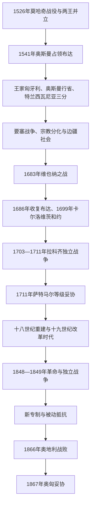

# 奥斯曼—哈布斯堡分治与王国重建

## 时间

1526—1867年

## 概括

莫哈奇战役后，扎波尧伊·亚诺什与哈布斯堡的费迪南分别被拥立。1541年奥斯曼占领布达，历史匈牙利形成三个相互关联而制度不同的政治空间：奥斯曼直接统治的中部行省、哈布斯堡控制的“王家匈牙利”，以及在奥斯曼宗主权下保持内政自主的东部王国／特兰西瓦尼亚公国。三个部分之间既战争、移民和人口损失，也持续贸易、贵族网络与宗教传播。

1683年维也纳之战后，神圣同盟逐步夺取奥斯曼领地；1699年《卡尔洛维茨条约》和1718年后，哈布斯堡基本控制整个王国历史空间。军事收复没有恢复独立王权，而是引出中央集权、反宗教改革、移民重建和等级妥协。拉科齐独立战争以1711年《萨特马尔和约》结束，保留贵族特权与王国法统。十八至十九世纪的改革、语言民族主义和社会转型最终促成1848年革命；革命被奥地利与俄国军队镇压，但新专制也无法长期解决财政和民族问题。1866年奥地利战败后，1867年妥协建立奥匈二元体制。

## 演变关系

## 莫哈奇后的两王并立（1526—1541年）

1526年拉约什二世无嗣战死后，匈牙利等级没有形成统一继承方案。多数本地贵族依据“应选本国人”的政治诉求推举特兰西瓦尼亚总督扎波尧伊·亚诺什；另一派依据哈布斯堡—雅盖隆婚约及王后玛丽亚的关系拥立费迪南。两人分别加冕并争夺布达。

费迪南依靠哈布斯堡资源一度驱逐亚诺什，后者转而向苏莱曼一世称臣。1538年《大瓦劳德条约》秘密约定亚诺什死后由费迪南继承，但1540年亚诺什之子出生，支持者推举婴儿为亚诺什二世。1541年费迪南围攻布达，奥斯曼以救援为名进入并直接占领城市；从此王位内战转化为长期三分。

## 三个政治空间

| 区域 | 统治结构 | 社会与制度特点 |
|---|---|---|
| 王家匈牙利 | 哈布斯堡国王、匈牙利等级议会和驻维也纳中央机关并存；首府和加冕中心转向波若尼／普雷斯堡 | 既是匈牙利王国法统载体，也是哈布斯堡对奥斯曼军事边疆；贵族税免与宗教权利成为反复谈判对象。 |
| 奥斯曼匈牙利 | 布达、泰梅什堡等行省，由帕夏、桑贾克和驻军管理 | 重点控制城市、要塞、道路与税收；乡村在战争、双重征税和人口迁移中变化，穆斯林城市文化与基督徒社区并存。 |
| 东部王国／特兰西瓦尼亚公国 | 扎波尧伊继承政权；1570年后以亲王名义统治，承认奥斯曼宗主权并向苏丹纳贡 | 等级会议、匈牙利贵族、塞凯人和特兰西瓦尼亚萨克森人构成多元政治；在奥斯曼与哈布斯堡间寻求平衡。 |

1568年特兰西瓦尼亚议会在托尔道承认若干“获准宗教”，为天主教、路德宗、归正宗和一位一体派提供相对宽容的制度空间，但东正教多数农民并未取得同等政治代表。宗教分化与哈布斯堡反宗教改革，使信仰自由成为贵族反抗的重要议题。

## 边疆战争与特兰西瓦尼亚平衡（1541—1683年）

1552年奥斯曼夺取多座要塞，但埃格尔守军成功抵抗；1566年苏莱曼一世在围攻西盖特堡期间去世，守将兹里尼·米克洛什最终全军覆没。要塞线把战争变成驻军、炮兵、补给和地方征税的长期消耗，而非连续推进的单一征服。

1593—1606年的“十五年战争”使战区广泛破坏。哈布斯堡军费、没收贵族领地和反新教措施触发博奇考伊·伊什特万起义；1606年《维也纳和约》确认部分宗教与等级权利，同年对奥斯曼的日托瓦托罗克和约暂时稳定边界。

三十年战争时期，贝特伦·加博尔等特兰西瓦尼亚亲王利用欧洲战争多次进入王家匈牙利，迫使哈布斯堡让步。特兰西瓦尼亚的回旋空间取决于两大帝国平衡；1657年拉科齐·捷尔吉二世未经苏丹许可进攻波兰后，奥斯曼惩罚性入侵削弱公国，平衡开始向哈布斯堡倾斜。

1664年哈布斯堡在圣哥特哈德取胜后仍同奥斯曼签订《沃什瓦尔和约》，许多匈牙利贵族认为王廷牺牲了边疆利益。贵族密谋失败后，中央政府处决首领、加强军政与反宗教改革；流亡的库鲁茨武装持续反抗。特克伊·伊姆雷于1682年在奥斯曼支持下建立上匈牙利亲王政权，成为1683年奥斯曼攻维也纳前的重要并行力量，但不能代表所有匈牙利等级的共同立场。

## 奥斯曼退出与哈布斯堡重建（1683—1711年）

1683年奥斯曼围攻维也纳失败，哈布斯堡、波兰—立陶宛、威尼斯等组成神圣同盟。1686年联军攻占布达，1697年森塔战役后，1699年《卡尔洛维茨条约》使奥斯曼割让除巴纳特以外的大部分匈牙利领地；1718年后哈布斯堡又取得巴纳特。

“收复”伴随新的军事占领、土地登记和王室没收委员会。许多旧贵族必须证明产权，大片土地转给军官、宫廷贵族和移民经营者；德意志人、南斯拉夫人、斯洛伐克人、罗马尼亚人和匈牙利人迁入人口稀疏地区，使王国继续保持多语言结构。东正教塞尔维亚移民获得部分教会与军事特权，军事边疆直接受中央军政管理。

哈布斯堡中央集权、驻军负担和宗教政策激起反抗。1703年拉科齐·费伦茨二世发动独立战争，得到部分贵族、边民和农民支持；1705年邦联等级推举他为执政亲王。战争受制于财政、社会诉求差异和缺乏可靠大国援助，1711年主要将领在萨特马尔与王廷议和。和约赦免参与者、确认贵族和王国宪制权利，以承认哈布斯堡王权换取等级妥协。

## 十八世纪王国：王朝继承、重建与改革

1722—1723年匈牙利等级接受《国事诏书》，在哈布斯堡男性绝嗣时承认女性继承，同时强调王国自身法律和不可分割性。1740年玛丽亚·特蕾莎继位危机中，匈牙利等级提供军力，王后则维护贵族特权；此后她改革军队、教育和行政，增加国家能力，但没有取消贵族免税。

约瑟夫二世为避开加冕誓约而不以圣冠加冕，试图用德语行政、宗教宽容、农民政策和统一官僚制重塑君主国。改革触犯贵族地方自治、语言与教会利益，临终前撤回大部分命令。其失败显示：王廷可以扩张行政，却难在没有等级合作的情况下统一多族群君主国。

十八世纪的农业商品化、庄园扩张与城镇恢复带来人口增长，同时加重部分农民劳役。玛丽亚·特蕾莎的《敕定农役章程》（Urbarium）规范领主—农民义务，既限制过度索取，也确认封建依附。国家重建因地区、族群与社会等级而收益不均。

## 改革时代与1848年革命（1825—1849年）

1825年议会恢复定期召开，塞切尼·伊什特万倡导交通、信贷、匈牙利科学院和渐进改革；科苏特·拉约什则通过报刊和郡政治推动责任政府、保护性经济与更广泛民族动员。匈牙利语逐步取代拉丁语成为官方语言，促进现代公共领域，也使克罗地亚人、斯洛伐克人、罗马尼亚人、塞尔维亚人等担忧马扎尔化。

1848年维也纳革命给匈牙利改革派创造窗口。《四月法令》废除农奴义务与封建税役、建立对议会负责的内阁、扩大选举权并整合王国行政。然而王廷对军队和财政控制的保留、克罗地亚总督耶拉契奇的抵制，以及各民族对领土自治的不同诉求，使宪政争端转为战争。

1848年秋，耶拉契奇进入匈牙利；国防委员会在科苏特领导下组织国民军。1849年春季战役一度收复大部领土，议会于4月宣布废黜哈布斯堡，科苏特任总督总统。奥皇请求俄国大规模干预后，匈军陷入两线压力，8月在维拉戈什投降。王廷处决鲍特亚尼和阿拉德十三将领，革命被军事镇压。

## 新专制、有限恢复与1867年妥协（1849—1867年）

革命后，巴赫体系取消匈牙利独立政府，以德语官僚、警察、税制和直接行政统治；农奴制废除继续有效，但土地补偿、税负和政治压制引发“被动抵抗”。克罗地亚、特兰西瓦尼亚和军事边疆被分别治理，王廷试图绕开历史王国结构。

1859年奥地利在意大利战争失败，迫使王廷寻求宪制支持；1860年《十月诏书》和1861年《二月专利》提供有限代议安排，但匈牙利政治家戴阿克·费伦茨坚持1848年法律连续性。1866年奥地利在普奥战争中战败并被排除出德意志事务，财政与国际压力使双方妥协。

1867年协议恢复匈牙利责任内阁和议会，费伦茨·约瑟夫按匈牙利传统加冕。匈牙利取得内政、司法和财政的广泛自主，同奥地利共享君主、外交、共同军队及其财政；这不是完全独立，也不是奥地利单方面吞并。

## 重要事件

| 时间 | 事件 | 过程 | 结果与长期影响 |
|---|---|---|---|
| 1526年 | 两王并立 | 扎波尧伊与费迪南分别获等级支持 | 内战使奥斯曼干预制度化。 |
| 1541年 | 布达陷落 | 奥斯曼以援助幼王为名控制首都 | 王国形成三方分治。 |
| 1552年 | 埃格尔防御 | 小规模守军抵挡奥斯曼围攻 | 成为边疆抵抗象征，但同年多处要塞失守。 |
| 1566年 | 西盖特堡之战 | 兹里尼守军拖延苏莱曼大军 | 双方损失惨重，苏莱曼在营中去世。 |
| 1568年 | 托尔道宗教法令 | 特兰西瓦尼亚等级承认多种宗教 | 形成有限、等级化的宗教多元。 |
| 1593—1606年 | 十五年战争与博奇考伊起义 | 帝国战争、没收和宗教压制叠加 | 1606年和约确认部分等级与宗教权利。 |
| 1664—1682年 | 沃什瓦尔和约、贵族密谋与库鲁茨战争 | 王廷强化中央与宗教政策，特克伊在奥斯曼支持下控制上匈牙利 | 哈布斯堡—等级冲突同奥斯曼战争重新合流。 |
| 1683年 | 维也纳围城失败 | 神圣同盟反攻 | 奥斯曼在匈牙利的战略退潮开始。 |
| 1686／1699年 | 收复布达与卡尔洛维茨和约 | 联军逐步夺取要塞 | 哈布斯堡成为王国主要统治者。 |
| 1703—1711年 | 拉科齐独立战争 | 邦联反抗中央集权与军事负担 | 《萨特马尔和约》建立王朝—等级妥协。 |
| 1722—1723年 | 接受国事诏书 | 等级承认女性继承 | 巩固哈布斯堡世袭，同时确认王国法统。 |
| 1825年 | 改革时代开端 | 议会恢复，语言、经济与宪政改革公开化 | 形成现代民族政治。 |
| 1848年 | 《四月法令》 | 革命压力下君主批准责任政府与废除封建义务 | 现代国家制度奠基。 |
| 1849年 | 独立战争失败 | 俄奥联军击败匈牙利军 | 新专制建立，民族问题长期化。 |
| 1867年 | 奥匈妥协 | 奥地利战败后王廷与匈牙利精英谈判 | 建立二元帝国。 |

## 分治结束、革命失败与妥协原因

### 哈布斯堡扩张的结构条件

- 王家匈牙利的圣冠法统、等级机构和要塞线为其提供长期立足点。
- 哈布斯堡能调动奥地利、波希米亚和帝国资源维持炮兵与驻军，奥斯曼则在十七世纪后面临多战线和财政压力。
- 特兰西瓦尼亚在两强之间的自主依赖均势；奥斯曼直接干预增多后，其独立行动能力下降。

### 外部压力与直接转折

1683年奥斯曼围攻维也纳失败使欧洲联盟获得战略主动；随后神圣同盟持续攻城，1697年森塔失败迫使奥斯曼议和。1699与1718年的条约是三分格局结束的法律节点。

### 1848—1849年革命失败原因

- **结构因素**：新政府必须同时建立财政、军队和行政，旧王国多民族人口对统一马扎尔政治国家的设想存在不同诉求。
- **外部压力**：哈布斯堡可调动克罗地亚、奥地利和波希米亚资源，并最终获得俄国大军干预。
- **直接触发**：王廷撤销匈牙利政府权力、耶拉契奇进军和1849年俄军入境，把宪政争端升级为无法匹敌的全面战争。

### 1867年妥协的原因

匈牙利精英无法单独推翻哈布斯堡，王廷也无法在财政困境、意大利与德意志战争失败后继续低成本直接统治。戴阿克派接受共同君主和共同事务，换取1848年责任政府核心；这是一项双方力量有限条件下的政治交易，也把非马扎尔民族的自治诉求留给匈牙利政府处理。

## 统治结构与世系

完整的两王并立、哈布斯堡国王、共治者和拉科齐执政亲王说明见[匈牙利君主与摄政世系表](/%E4%BA%BA%E6%96%87%E7%A7%91%E5%AD%A6/%E5%8E%86%E5%8F%B2/%E6%AC%A7%E6%B4%B2/%E5%8C%88%E7%89%99%E5%88%A9/%E5%8C%88%E7%89%99%E5%88%A9%E5%90%9B%E4%B8%BB%E4%B8%8E%E6%91%84%E6%94%BF%E4%B8%96%E7%B3%BB%E8%A1%A8.md)；东部王国摄政、历任特兰西瓦尼亚亲王、复位者和并行政权见[特兰西瓦尼亚亲王与统治者世系表](/%E4%BA%BA%E6%96%87%E7%A7%91%E5%AD%A6/%E5%8E%86%E5%8F%B2/%E6%AC%A7%E6%B4%B2/%E5%8C%88%E7%89%99%E5%88%A9/%E7%89%B9%E5%85%B0%E8%A5%BF%E7%93%A6%E5%B0%BC%E4%BA%9A%E4%BA%B2%E7%8E%8B%E4%B8%8E%E7%BB%9F%E6%B2%BB%E8%80%85%E4%B8%96%E7%B3%BB%E8%A1%A8.md)；1848—1867年的国家元首与责任内阁见[匈牙利国家元首与政府首脑表](/%E4%BA%BA%E6%96%87%E7%A7%91%E5%AD%A6/%E5%8E%86%E5%8F%B2/%E6%AC%A7%E6%B4%B2/%E5%8C%88%E7%89%99%E5%88%A9/%E5%8C%88%E7%89%99%E5%88%A9%E5%9B%BD%E5%AE%B6%E5%85%83%E9%A6%96%E4%B8%8E%E6%94%BF%E5%BA%9C%E9%A6%96%E8%84%91%E8%A1%A8.md)。

- 前一节点：[中世纪匈牙利王国](/%E4%BA%BA%E6%96%87%E7%A7%91%E5%AD%A6/%E5%8E%86%E5%8F%B2/%E6%AC%A7%E6%B4%B2/%E5%8C%88%E7%89%99%E5%88%A9/%E4%B8%AD%E4%B8%96%E7%BA%AA%E5%8C%88%E7%89%99%E5%88%A9%E7%8E%8B%E5%9B%BD.md)。
- 后一节点：[奥匈帝国与第一次世界大战](/%E4%BA%BA%E6%96%87%E7%A7%91%E5%AD%A6/%E5%8E%86%E5%8F%B2/%E6%AC%A7%E6%B4%B2/%E5%8C%88%E7%89%99%E5%88%A9/%E5%A5%A5%E5%8C%88%E5%B8%9D%E5%9B%BD%E4%B8%8E%E7%AC%AC%E4%B8%80%E6%AC%A1%E4%B8%96%E7%95%8C%E5%A4%A7%E6%88%98.md)。
- 总览：[匈牙利历史](/%E4%BA%BA%E6%96%87%E7%A7%91%E5%AD%A6/%E5%8E%86%E5%8F%B2/%E6%AC%A7%E6%B4%B2/%E5%8C%88%E7%89%99%E5%88%A9/README.md)。
