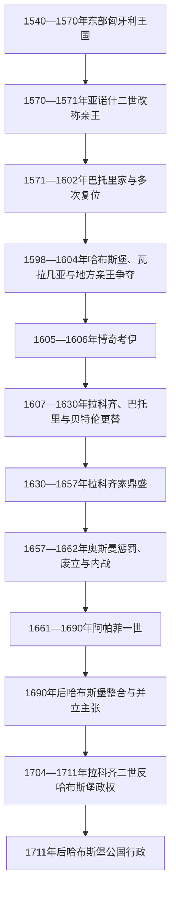

# 特兰西瓦尼亚亲王与统治者世系表

## 范围与读法

本表覆盖1540—1711年东部匈牙利王国向特兰西瓦尼亚公国演化的统治者、摄政、亲王、复位者和主要并行政权。1570年的《施派尔条约》由扎波尧伊·亚诺什二世放弃“匈牙利当选国王”称号，改称“特兰西瓦尼亚及匈牙利部分地区的亲王”；条约于1571年落实。因此公国既继承莫哈奇战役后的东部王国，也不是中世纪特兰西瓦尼亚总督区的简单改名。

亲王原则上由等级会议选举，但当选者往往需要奥斯曼苏丹认可并纳贡；哈布斯堡国王则始终把该地视为圣史蒂芬王冠领地。1598—1604年、1657—1662年和1690年以后，选举、奥斯曼任命、哈布斯堡军事占领与地方实际控制反复重叠。表中把正式亲王、未能就任的当选继承人和外国占领行政分列，避免制造不存在的单线世系。

## 世系主线

## 东部匈牙利王国与公国形成

| 顺序 | 人物／机构 | 身份 | 统治或执政期 | 与前任关系 | 关键事件与法统说明 |
|---|---|---|---|---|---|
| 1 | 扎波尧伊·亚诺什一世 | 匈牙利国王，主要控制东部 | 1526—1540年 | 莫哈奇后由一派等级推举 | 与哈布斯堡费迪南并立，依靠奥斯曼支持；其死后东部政权由幼子继承。 |
| 2 | **扎波尧伊·亚诺什二世·西吉斯蒙德** | 匈牙利“当选国王” | 1540—1551年、1556—1570年 | 亚诺什一世之子 | 幼年由母亲和顾问摄政；1551年短暂让位哈布斯堡，1556年获召回。 |
| — | 雅盖隆的伊莎贝拉 | 王太后、幼王摄政 | 1540—1551年、1556—1559年 | 亚诺什二世之母 | 以特兰西瓦尼亚和帕尔蒂乌姆维持东部王国；1559年去世后儿子亲政。 |
| — | 马丁努齐·捷尔吉 | 国库官、主教与事实摄政 | 1541—1551年 | 幼王政权首席大臣 | 在奥斯曼与哈布斯堡间周旋，促成1551年交接，后被哈布斯堡军官刺杀。 |
| — | 哈布斯堡军事行政 | 费迪南一世名义下的占领政府 | 1551—1556年 | 由东部政权交出统治 | 驻军和财政不足，未能有效防御奥斯曼；1556年等级重新迎回伊莎贝拉母子。 |
| 3 | **亚诺什二世·西吉斯蒙德** | 特兰西瓦尼亚及匈牙利部分地区亲王 | 1570—1571年 | 同一统治者改称号 | 《施派尔条约》确认其放弃匈牙利王号；无嗣去世后，等级重新选举统治者。 |

## 巴托里时期与十五年战争危机

这一阶段的“亲王”称号尚未完全固定。巴托里·伊什特万最初以总督／沃伊沃德名义当选，成为波兰国王后仍掌握公国最高权威；其兄和侄先后在当地执政。下表把法定称号和实际治理写在同一行的备注中。

| 顺序 | 人物／机构 | 王室或身份 | 在位／执政 | 继承关系 | 关键事件／备注 |
|---|---|---|---|---|---|
| 4 | **巴托里·伊什特万** | 巴托里家；当选总督，后称亲王兼波兰国王 | 1571—1576年在地统治；1576—1586年从波兰保持最高权威 | 等级在亚诺什二世死后选举 | 击败哈布斯堡支持的贝凯什；成为波兰国王后没有把两国合并。 |
| — | 巴托里·克里什托夫 | 特兰西瓦尼亚总督／沃伊沃德 | 1576—1581年 | 伊什特万之兄 | 代表在波兰的伊什特万治理，维持等级与奥斯曼关系。 |
| 5 | **巴托里·日格蒙德** | 巴托里家亲王 | 1581年被选；1588年亲政；第一次统治至1598年 | 克里什托夫之子、伊什特万之侄 | 幼年由摄政委员会执政；亲政后加入反奥斯曼同盟，国内清洗和外交摇摆引发危机。 |
| — | 哈布斯堡帝国委员会 | 鲁道夫二世名义下的接收行政 | 1598年 | 日格蒙德首次让位 | 日格蒙德以西里西亚领地交换公国，交接很快因不满和权力真空失败。 |
| 5 | 巴托里·日格蒙德 | 复位亲王 | 1598—1599年（第二次） | 收回此前让出的权力 | 再次退位，将权力交给堂兄安德拉什。 |
| 6 | 巴托里·安德拉什 | 巴托里家；亲王、枢机 | 1599年 | 日格蒙德堂兄 | 在舍林贝尔克战败，逃亡中被塞凯武装杀死。 |
| — | **勇敢者米哈伊** | 瓦拉几亚大公、鲁道夫二世名义下的帝国代理人 | 1599—1600年 | 击败安德拉什后占领 | 等级一度承认其帝国总督地位；他还占领摩尔达维亚，但没有建立稳定世袭公国。 |
| — | 乔尔乔·巴斯塔 | 哈布斯堡将领与帝国行政首脑 | 1600—1601年 | 帝国军排挤米哈伊 | 以军队和征敛统治，地方反抗加剧。 |
| 5 | 巴托里·日格蒙德 | 复位亲王 | 1601—1602年（第三次） | 反帝国派迎回 | 在戈罗兹洛等战事失败后再次退位并离境。 |
| — | 乔尔乔·巴斯塔 | 帝国行政首脑 | 1601—1603年并行、1603—1604年恢复 | 鲁道夫二世任命 | 与地方势力反复争夺，军事占领、饥荒和宗教压迫共同破坏公国。 |
| 7 | 塞凯伊·莫热什 | 奥斯曼支持的当选亲王 | 1603年 | 反巴斯塔集团在军营议会推举 | 统治不足数月，在布拉索夫战役中败亡。 |
| — | 拉杜·谢尔班 | 瓦拉几亚大公、短期占领者 | 1603年7—9月 | 击败塞凯伊 | 没有成为特兰西瓦尼亚法定亲王，随后由巴斯塔恢复帝国行政。 |

## 十七世纪亲王与复位次序

| 顺序 | 亲王 | 王室／身份 | 在位 | 继承与选举关系 | 关键事件／备注 |
|---|---|---|---|---|---|
| 8 | **博奇考伊·伊什特万** | 博奇考伊家 | 1605—1606年 | 反哈布斯堡起义中由特兰西瓦尼亚及匈牙利部分等级推举 | 获奥斯曼赠冠但拒绝成为奥斯曼式匈牙利国王；《维也纳和约》保障部分宗教与等级权利。 |
| 9 | 拉科齐·日格蒙德 | 拉科齐家 | 1607—1608年 | 博奇考伊死后由等级选举 | 在巴托里支持者与奥斯曼压力下退位；是拉科齐·捷尔吉一世之父。 |
| 10 | 巴托里·加博尔 | 巴托里家 | 1608—1613年 | 以海杜武装和奥斯曼认可取得王位 | 强行干预萨克森城市和瓦拉几亚，失去等级与奥斯曼支持后被杀。 |
| 11 | **贝特伦·加博尔** | 贝特伦家 | 1613—1629年 | 奥斯曼支持下由等级选举 | 重建财政、矿业、教育和宫廷；三十年战争中数次进入王家匈牙利，1620—1621年还被推举为匈牙利国王但未加冕。 |
| 12 | 勃兰登堡的卡塔琳 | 贝特伦遗孀、经等级预先承认的继承者 | 1629—1630年 | 贝特伦指定并获议会承认 | 女性亲王的法理地位罕见；因派系和外交压力退位。 |
| 13 | 贝特伦·伊什特万 | 贝特伦家 | 1630年 | 贝特伦·加博尔之弟，由一派等级推举 | 仅短期执政，被拉科齐·捷尔吉一世击败并放弃亲王位。 |
| 14 | **拉科齐·捷尔吉一世** | 拉科齐家 | 1630—1648年 | 拉科齐·日格蒙德之子；经战争与选举确立 | 维持财政和宗教文化，参加三十年战争；使儿子在本人在世时获选继承。 |
| 15 | **拉科齐·捷尔吉二世** | 拉科齐家 | 1648—1657年（第一次） | 捷尔吉一世之子；1642年已获预选 | 未经苏丹许可进攻波兰，远征失败后被奥斯曼废黜。 |
| — | 拉科齐·费伦茨一世 | 预选继承人，未实际就任 | 1652年获选 | 捷尔吉二世之子 | 父亲失势后未能安装为亲王，应记为未就任而非一段在位。 |
| 16 | 里代伊·费伦茨 | 奥斯曼要求下由等级选举的亲王 | 1657—1658年 | 取代被废的捷尔吉二世 | 控制力有限，捷尔吉二世返国后退位。 |
| 15 | 拉科齐·捷尔吉二世 | 复位亲王 | 1658年（第二次） | 等级重新推举 | 很快被奥斯曼军驱逐。 |
| 17 | 巴尔乔伊·阿科什 | 奥斯曼任命并经等级承认的亲王 | 1658—1659年（第一次） | 奥斯曼用以取代拉科齐 | 承担巨额贡赋和赔款；离境会见奥斯曼官员时失去控制。 |
| 15 | 拉科齐·捷尔吉二世 | 再次复位亲王 | 1659—1660年（第三次） | 反巴尔乔伊集团迎回 | 战败重伤后去世，个人复位路线终结。 |
| 17 | 巴尔乔伊·阿科什 | 恢复的亲王 | 1660年（第二次） | 奥斯曼重新扶立 | 随后退位，1661年遭政敌杀害。 |
| 18 | 凯梅尼·亚诺什 | 反奥斯曼、转向哈布斯堡的亲王 | 1661—1662年 | 等级推举 | 与奥斯曼所立阿帕菲并立，在讷吉瑟勒什战役阵亡。 |
| 19 | **阿帕菲·米哈伊一世** | 阿帕菲家 | 1661—1690年 | 奥斯曼在凯梅尼反叛时扶立，后获等级承认 | 1662年前与凯梅尼并立；后期受大臣、奥斯曼与扩张中的哈布斯堡多重制约。 |
| 20 | 阿帕菲·米哈伊二世 | 阿帕菲家；预选及名义亲王 | 1690—1696年或以1701年正式放弃称号计 | 阿帕菲一世之子，1681年已获预选 | 未能独立安装；1696年被带往维也纳，1701年放弃称号。 |
| — | 特克伊·伊姆雷 | 奥斯曼支持的竞争亲王 | 1690年 | 以军事胜利和苏丹授权提出主张 | 短期控制南部，未获稳定全国承认；哈布斯堡反攻后退出。 |
| 21 | **拉科齐·费伦茨二世** | 反哈布斯堡邦联的特兰西瓦尼亚亲王 | 1704—1711年 | 1704年由特兰西瓦尼亚等级推举 | 其政权同哈布斯堡行政并立；1711年独立战争失败后，公国成为哈布斯堡体系中的独立行政单位。 |

## 1690—1711年的哈布斯堡行政与并行政权

| 时段 | 名义主权与行政结构 | 实际权力关系 |
|---|---|---|
| 1690—1691年 | 利奥波德一世以匈牙利国王和征服者身份扩张控制；《利奥波德文凭》确认特兰西瓦尼亚等级、宗教与独立行政 | 哈布斯堡驻军成为决定性力量，阿帕菲二世和特克伊仍有相互竞争的合法性主张。 |
| 1691—1708年 | 班菲·捷尔吉任首任哈布斯堡时期总督，政府委员会处理日常行政 | 维也纳掌握军队与外交，地方等级保留有限立法、司法和宗教特权。 |
| 1704—1711年 | 拉科齐二世亲王政权与哈布斯堡总督、驻军并行 | 邦联控制随战局伸缩；不能把拉科齐的在位理解为哈布斯堡行政已经完全消失。 |
| 1711年后 | 哈布斯堡君主以匈牙利国王兼特兰西瓦尼亚亲王身份主张统治，后于1765年提升为“大公国” | 特兰西瓦尼亚长期保持与匈牙利王国分开的中央行政，直至1867年前后重新整合。 |

## 统治机制

| 机构 | 法定作用 | 实际限制 |
|---|---|---|
| 亲王 | 统军、外交、任官、管理财政领地并召集议会 | 选举须与等级、奥斯曼认可及哈布斯堡压力协调，强弱高度依赖个人资源。 |
| 一院制等级会议 | 选举亲王、立法、同意税收并确认宗教与特权 | 危机时常在军队或外国压力下表决，对外交和军事的持续控制有限。 |
| “三个民族”政治共同体 | 匈牙利贵族、塞凯人和萨克森特权团体分别组织代表 | “民族”在此是等级法团而非现代民族；东正教罗马尼亚多数居民没有同等法团代表。 |
| “四种获准宗教” | 天主教、路德宗、归正宗和一位一体派具有不同程度的法律承认 | 宽容是等级化和时期性安排；东正教仅获容忍，实际政策随亲王改变。 |
| 奥斯曼宗主权 | 认可选举、颁发委任文书并征收贡赋 | 公国常有自主外交，但越过苏丹战略界线可能遭废黜和军事惩罚。 |
| 哈布斯堡王权 | 以圣冠法统主张公国属于匈牙利王国 | 1690年前多只能通过战争、条约和候选人施压；1690年后才形成常驻军事行政。 |

## 兴盛、衰落与终结原因

### 稳定与兴盛条件

- 公国处在奥斯曼与哈布斯堡之间，均势使强势亲王能够用纳贡、条约和有限参战换取自治。
- 帕尔蒂乌姆、盐矿、金属矿、关税和庞大财政领地为亲王提供不完全依赖等级税收的资源。
- 宗教多元和城市、学校、印刷文化吸引不同背景人才；贝特伦和拉科齐一世时期宫廷成为匈牙利语新教文化中心。
- 亲王利用王家匈牙利的等级反抗和欧洲战争扩大谈判筹码，却通常在和约中放弃匈牙利王号或占领地，以保存公国本体。

### 结构性脆弱

- 选举君主制没有形成稳定继承规则，预选继承人、遗孀继位、奥斯曼另立和哈布斯堡候选可同时出现。
- 公国军队和财政足以维持区域自主，却难长期对抗任一大帝国；对外远征一旦失败便迅速耗尽资源。
- 等级特权、宗教法团和族群分布不完全重合，政治共同体没有覆盖全部居民。
- 亲王权力依赖个人领地、家族网络和外国认可，强势统治者去世后常出现派系斗争。

### 直接转折与终结

1657年拉科齐二世未经奥斯曼同意进攻波兰，触发废黜、鞑靼俘掠和奥斯曼军事惩罚；1658—1662年的反复废立削弱公国人口、要塞和财政。1683年后奥斯曼在中欧战略退潮，哈布斯堡军队逐步进入特兰西瓦尼亚；1690—1691年的军事控制和《利奥波德文凭》把独立亲王选举转化为王朝行政下的等级自治。拉科齐二世1704年恢复亲王称号，但1711年失败后再无独立选举亲王，政治实体从边疆缓冲国转为哈布斯堡复合君主国的一部分。

## 与匈牙利主线的关系

- 前身与并行节点：[奥斯曼—哈布斯堡分治与王国重建](/%E4%BA%BA%E6%96%87%E7%A7%91%E5%AD%A6/%E5%8E%86%E5%8F%B2/%E6%AC%A7%E6%B4%B2/%E5%8C%88%E7%89%99%E5%88%A9/%E5%A5%A5%E6%96%AF%E6%9B%BC%E2%80%94%E5%93%88%E5%B8%83%E6%96%AF%E5%A0%A1%E5%88%86%E6%B2%BB%E4%B8%8E%E7%8E%8B%E5%9B%BD%E9%87%8D%E5%BB%BA.md)。
- 同期哈布斯堡国王、匈牙利对立国王与拉科齐邦联见[匈牙利君主与摄政世系表](/%E4%BA%BA%E6%96%87%E7%A7%91%E5%AD%A6/%E5%8E%86%E5%8F%B2/%E6%AC%A7%E6%B4%B2/%E5%8C%88%E7%89%99%E5%88%A9/%E5%8C%88%E7%89%99%E5%88%A9%E5%90%9B%E4%B8%BB%E4%B8%8E%E6%91%84%E6%94%BF%E4%B8%96%E7%B3%BB%E8%A1%A8.md)。
- 总览：[匈牙利历史](/%E4%BA%BA%E6%96%87%E7%A7%91%E5%AD%A6/%E5%8E%86%E5%8F%B2/%E6%AC%A7%E6%B4%B2/%E5%8C%88%E7%89%99%E5%88%A9/README.md)。
