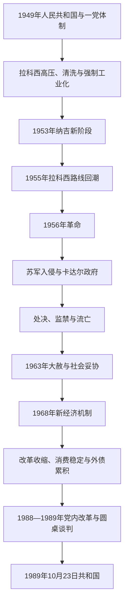

# 社会主义匈牙利

## 时间

1949—1989年

## 概括

1949年宪法把第二共和国改造成以苏联模式为蓝本的匈牙利人民共和国。拉科西时期由劳动人民党垄断政治，国家安全局实施监控、审判和清洗，重工业优先与强制集体化给社会造成巨大压力。斯大林去世后改革与复辟反复，1956年学生示威发展为全国革命；纳吉·伊姆雷政府宣布多党化、中立和退出华沙条约，苏军于11月再次入侵并扶植卡达尔政府。

卡达尔先以处决、监禁和流亡巩固政权，1960年代后以大赦、消费改善和有限经济改革换取社会顺从。1968年“新经济机制”引入企业自主、价格和小规模私人活动，使匈牙利成为东欧相对灵活的社会主义经济体，但改革受苏东政治约束且越来越依赖西方贷款。1980年代债务、增长停滞、苏联改革和国内反对力量共同削弱党国。1989年圆桌谈判、纳吉重新安葬、开放奥匈边界和宪法改制和平结束一党体制。

## 演变关系

## 拉科西体制（1949—1953年）

1949年宪法规定国民议会和人民共和国主席团等国家机关，实际权力集中于劳动人民党总书记拉科西·马加什及政治警察。统一候选名单、民主集中制和干部任命制度消除公开政治竞争；国家元首主席团和部长会议主要执行党决策。

国家安全局以“阶级敌人”、间谍和党内偏差为名实施监视、酷刑与展示审判。外长拉伊克·拉斯洛1949年被构陷处决，显示清洗不仅针对旧制度人物，也针对共产党内部。数以万计人员被监禁、迁居或送入劳改营，教会学校国有化，明曾蒂枢机等宗教领袖受审。

经济上，银行和工业全面国有化，五年计划把资源投入钢铁、军工和重工业；农业以征购和强制合作社化压低农民消费。实际资源、技术与能源不足，指标压力造成短缺和低质量，生活水平下降。

## “新阶段”与路线斗争（1953—1956年）

斯大林去世后，苏联领导层批评拉科西的极端路线，纳吉·伊姆雷出任部长会议主席。他减缓重工业投资、放松征购、允许农民退出部分合作社，关闭若干拘禁营并承诺法制恢复，称为“新阶段”。

拉科西仍掌握党务，利用苏联政策摇摆削弱纳吉。1955年纳吉被免职并开除出党，强制经济政策部分恢复。1956年苏共二十大揭露斯大林罪行、波兰改革和拉伊克重新安葬，使知识分子、学生和工人公开要求改革；7月苏联迫使拉科西下台，但继任者格罗·埃尔诺无法恢复信任。

## 1956年革命

10月23日，布达佩斯学生声援波兰改革并提出苏军撤离、言论自由、纳吉执政等要求。示威者推倒斯大林像，国家保安警察在广播大楼开火，抗议迅速转为武装起义。政府重新任命纳吉，苏军一度进入首都后又撤出，地方工人委员会和革命委员会接管工厂与行政。

纳吉政府先承认运动的民族民主性质，继而恢复多党政治、解散国家保安机关，并于11月1日宣布中立和退出华沙条约。苏联领导层在担心军事联盟瓦解、共产党统治崩溃和西方影响后决定再次干预。11月4日苏军大规模进攻，卡达尔·亚诺什宣布成立“工农革命政府”。

武装抵抗在数日到数周内被镇压。约有数千匈牙利人死亡，近二十万人逃往国外。纳吉被诱出南斯拉夫使馆后拘押，1958年秘密审判并处决。1956年革命的性质同时包含民族独立、工人民主、议会多党制和不同社会主义改革诉求，不宜简化为单一政治纲领。

## 卡达尔巩固与社会妥协（1956—1967年）

卡达尔政权最初依赖苏军和大规模报复：数百人被处决，数万人监禁或受行政惩罚。工人委员会被解散，社会主义工人党重建一党统治。与拉科西不同，卡达尔逐步停止无休止的阶级斗争，以“反对我们的人”与“不反对我们的人”相区分。

1963年大赦释放多数1956年政治犯，为国际缓和创造条件。政府提高农业收购价，允许家庭副业、消费品和有限文化空间；农业合作社化在物质激励下重新完成。社会以不挑战党权和苏联联盟换取私人生活、职业稳定和相对较高消费，被称为“卡达尔式妥协”。

## 新经济机制与“古拉什共产主义”（1968—1980年代）

1968年新经济机制减少强制产量指标，让企业依据利润、价格和市场信号作部分决策，扩大合作社副业、小企业和服务活动。改革提高供应与灵活性，但关键投资、外贸、金融和干部任命仍由国家与党控制，不是资本主义转型。

1968年匈牙利参与华沙条约入侵捷克斯洛伐克，表明国内改革不能突破苏联盟体系。1970年代初，苏联和国内保守派压力使部分市场改革收缩；政府仍通过进口、补贴和西方贷款维持消费与充分就业。

石油危机、低效率企业和价格补贴让外债迅速增加。1982年匈牙利加入国际货币基金组织和世界银行，以取得融资和改革空间。第二经济、私人副业和灰色市场扩大，缓解短缺，也造成收入差距与制度双轨。

## 1980年代危机与体制转型

卡达尔的合法性依赖增长和稳定，债务与停滞使这种交换失效。环境、和平、人权、民族与青年团体形成新的反对网络；境外匈牙利人尤其罗马尼亚政策也成为公共议题。党内经济改革派主张企业、银行和所有制变革。

1988年卡达尔被免去总书记，格罗斯·卡罗伊接任；内迈特·米克洛什政府加快改革，承认1956年不是“反革命”。1989年反对派圆桌与执政党谈判修改宪法、建立宪法法院、竞争选举和议会政府。6月16日纳吉·伊姆雷公开重新安葬，象征国家否定1958年审判。

匈牙利拆除奥地利边境设施，9月允许东德难民经奥地利离境，推动东欧边界体系崩解。10月执政党重组为社会党，10月23日国会主席叙勒什·马加什宣布匈牙利共和国成立。一党体制在谈判和法律改制中结束，首次自由国会选举于1990年举行。

## 统治结构

| 层级 | 法定角色 | 实际运行 |
|---|---|---|
| 执政党 | 1949—1956年劳动人民党；1956年后社会主义工人党 | 政治局、中央委员会和第一书记／总书记决定干部、政策和安全路线。 |
| 国民议会 | 最高国家权力机关 | 一党候选与短会期下主要确认党决策；1980年代末才恢复实质立法。 |
| 主席团 | 集体国家元首 | 主席承担礼仪角色，主席团可在议会休会期间发布法令。 |
| 部长会议 | 政府行政机关 | 总理处理经济与行政，但须服从党内最高领导。 |
| 安全部门 | 内务部、政治警察和军警体系 | 拉科西时期实行恐怖清洗；卡达尔时期转为选择性监控与压制。 |
| 社会组织 | 工会、青年团、爱国人民阵线 | 被纳入党国体系，后期为有限协商和候选差额提供空间。 |

完整法定国家元首、政府首脑与实际党魁见[匈牙利国家元首与政府首脑表](/%E4%BA%BA%E6%96%87%E7%A7%91%E5%AD%A6/%E5%8E%86%E5%8F%B2/%E6%AC%A7%E6%B4%B2/%E5%8C%88%E7%89%99%E5%88%A9/%E5%8C%88%E7%89%99%E5%88%A9%E5%9B%BD%E5%AE%B6%E5%85%83%E9%A6%96%E4%B8%8E%E6%94%BF%E5%BA%9C%E9%A6%96%E8%84%91%E8%A1%A8.md)。

## 重要事件

| 时间 | 事件 | 过程与转折 | 结果与长期影响 |
|---|---|---|---|
| 1949年 | 新宪法与人民共和国 | 单一名单选举、苏式国家机构建立 | 一党体制制度化。 |
| 1949年 | 拉伊克审判 | 党内构陷与展示审判 | 清洗扩大，安全国家强化。 |
| 1953年 | 纳吉“新阶段” | 苏联压力下调整工业与农业政策 | 高压短暂缓和，形成党内路线斗争。 |
| 1956年10月23日 | 革命爆发 | 学生示威、警察开火、工人与军人加入 | 政权迅速失去全国控制。 |
| 1956年11月4日 | 苏军再次入侵 | 纳吉宣布中立后，苏军扶植卡达尔 | 革命被镇压，大规模流亡。 |
| 1958年 | 纳吉被处决 | 秘密审判后执行死刑 | 成为政权合法性的长期创伤。 |
| 1963年 | 大赦 | 卡达尔释放多数政治犯 | 从报复转向社会妥协。 |
| 1968年 | 新经济机制 | 企业自主、价格和小规模市场机制扩大 | 形成东欧较灵活经济模式。 |
| 1968年 | 参与入侵捷克斯洛伐克 | 履行华沙条约盟国行动 | 显示改革受苏联盟边界限制。 |
| 1982年 | 加入国际金融机构 | 外债压力下寻求融资 | 与世界经济联系加深，也暴露财政脆弱。 |
| 1988年 | 卡达尔下台 | 党内改革派取代长期领袖 | 一党权力开始快速分散。 |
| 1989年 | 圆桌谈判与共和国成立 | 朝野谈判、纳吉改葬、修宪 | 和平过渡到竞争性议会制度。 |

## 建立、调整与终结原因

### 体制建立条件

- 苏军占领和苏联在盟国管制体系中的决定性权力，为共产党排除选举多数党提供外部保障。
- 战后旧国家、地主和军官精英崩溃，土地改革与国有化重组社会资源。
- 警察、干部任命和强制党合并使共产党能把少数支持转化为制度垄断。

### 1956年危机的结构因素

- 高速重工业化、征购与生活水平下降造成广泛经济不满。
- 安全警察恐怖、展示审判和苏联依赖摧毁政权合法性。
- 去斯大林化提高改革预期，党内反复又使渐进渠道失效。
- 波兰危机和苏联政策变化提供外部示范；广播大楼开火成为武装冲突的直接触发点。

### 卡达尔时期稳定条件

- 取消大规模恐怖、1963年大赦和有限文化空间降低社会恐惧。
- 消费改善、家庭副业和市场机制使日常生活优于早期斯大林主义。
- 苏联安全保证与一党干部体系阻止有组织权力竞争。

### 终结原因

- **结构因素**：国企低效率、补贴和外债使消费型社会契约不可持续；教育水平和信息流通又提高政治参与要求。
- **外部压力**：戈尔巴乔夫时期苏联不再承诺武力维护东欧旧政权，世界金融联系约束国内经济。
- **直接过程**：1988年卡达尔下台后，改革政府、反对派和党内派系通过圆桌谈判完成法律改制；1989年10月23日宣布共和国是法定终点。

## 前后关系

- 前一节点：[两次世界大战与霍尔蒂摄政](/%E4%BA%BA%E6%96%87%E7%A7%91%E5%AD%A6/%E5%8E%86%E5%8F%B2/%E6%AC%A7%E6%B4%B2/%E5%8C%88%E7%89%99%E5%88%A9/%E4%B8%A4%E6%AC%A1%E4%B8%96%E7%95%8C%E5%A4%A7%E6%88%98%E4%B8%8E%E9%9C%8D%E5%B0%94%E8%92%82%E6%91%84%E6%94%BF.md)。
- 后一节点：[1989年后的匈牙利](/%E4%BA%BA%E6%96%87%E7%A7%91%E5%AD%A6/%E5%8E%86%E5%8F%B2/%E6%AC%A7%E6%B4%B2/%E5%8C%88%E7%89%99%E5%88%A9/1989%E5%B9%B4%E5%90%8E%E7%9A%84%E5%8C%88%E7%89%99%E5%88%A9.md)。
- 总览：[匈牙利历史](/%E4%BA%BA%E6%96%87%E7%A7%91%E5%AD%A6/%E5%8E%86%E5%8F%B2/%E6%AC%A7%E6%B4%B2/%E5%8C%88%E7%89%99%E5%88%A9/README.md)。
