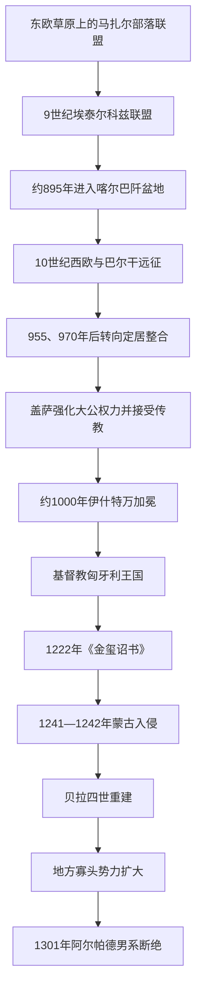

# 马扎尔迁徙与阿尔帕德王朝

## 时间

约9世纪中叶—1301年

## 概括

这一阶段经历马扎尔部落联盟从东欧草原迁入喀尔巴阡盆地、以远征掠夺维持的军事联盟转化为定居王国，以及阿尔帕德王朝男系断绝。马扎尔人的语言属于乌拉尔语系，但形成部落联盟的过程吸收了突厥草原政治、可萨宗主关系、斯拉夫农业人口和喀尔巴阡盆地既有制度经验；因此“语言来源”“部落联盟形成”和“现代民族形成”不是同一个问题。

伊什特万一世约在1000／1001年加冕，把大公权力改造成拉丁基督教王权。此后王国以郡、王室领地、主教区和军事侍从为骨架，逐步嵌入中欧。十二至十三世纪的土地封赐和贵族权利扩大削弱旧式王产国家，1241—1242年蒙古入侵又摧毁大量聚落；贝拉四世的城堡、城镇和移民政策完成重建，却也强化地方大领主。1301年安德拉什三世死后男系断绝，王位进入跨王朝竞争。

## 演变关系

## 建立背景：草原联盟与喀尔巴阡盆地

- 马扎尔语的远源属于乌拉尔语系，但9世纪马扎尔政治共同体是在南俄—黑海草原环境中形成的。部落名称、军事组织和统治称号显示其长期受到突厥语草原集团影响。
- 部落联盟曾处于可萨汗国势力范围，并吸收脱离可萨的卡巴尔集团。较晚传统所说“七部落”适合用来理解政治联盟，不宜当作血缘纯一的七个民族祖先。
- 9世纪后半联盟活动于第聂伯河与下多瑙河之间的埃泰尔科兹。约895年前后，马扎尔首领一方面参与拜占庭与保加利亚战争，另一方面遭到佩切涅格人和保加利亚反击；军事压力与主动寻找更稳定基地共同促成迁徙，不能简化成一次突然逃亡。
- 喀尔巴阡盆地处在东法兰克、大摩拉维亚、保加利亚和地方斯拉夫政权交界。马扎尔集团分批进入、夺取平原与交通线，再把当地斯拉夫、阿瓦尔后裔及其他人口纳入统治。

## 分阶段发展

### 占领、联盟与远征（约895—970年）

阿尔帕德与库尔桑可能分别代表早期双重首领体系。904年库尔桑遇害后，阿尔帕德家逐渐取得优势；907年普雷斯堡之战击退东法兰克军队，巩固盆地西部。随后数十年，马扎尔骑兵以贡赋、雇佣和掠夺方式进入德意志、意大利、法兰西与巴尔干，远征所得维持首领和战士网络，却不表示对远方地区进行持久占领。

955年莱希费尔德战败终止向西方的大规模远征，970年阿卡迪奥波利斯失败又压缩巴尔干方向。外部军事环境变化、盆地内农业税源和继承竞争推动首领从机动掠夺转向固定领地与国家化。

### 盖萨与伊什特万的国家转型（约972—1038年）

盖萨接受西方传教、与奥托王朝联姻并压服部分部落首领，但其统治仍混合基督教仪式和草原权威。997年盖萨死后，考波尼依据年长宗族继承惯例挑战其子沃伊克；沃伊克依靠本族追随者、德意志骑士和基督教长子继承观念取胜，并以伊什特万之名约在1000／1001年加冕。

新王国的制度基础包括：

| 领域 | 机制 | 作用 |
|---|---|---|
| 地方治理 | 以王堡为中心的郡，由伊什潘管理 | 征税、司法、征兵，并把王权延伸到地方。 |
| 土地与军队 | 大量土地仍为王室所有，王堡民和侍从承担军役 | 为早期国王提供不完全依赖世袭贵族的资源。 |
| 教会 | 建立总主教区、主教区、修道院和什一税 | 连接拉丁基督教世界，训练书吏并强化王权合法性。 |
| 继承 | 推动父子继承和加冕圣礼 | 取代部落联盟的年长宗亲竞争，但因伊什特万无成年继承人而未立刻稳定。 |

### 十一世纪继承战争与王权巩固

伊什特万之子伊姆雷早逝，1038年以后彼得、萨穆埃尔、安德拉什、贝拉及其后代反复废立。德意志皇帝曾以军事干预扶立彼得，1046年异教起义又把流亡宗室迎回。安德拉什一世虽借反叛复位，却继续维护基督教国家，说明社会反抗并没有逆转制度方向。

拉斯洛一世和卡尔曼以立法、圣徒崇拜、教会会议与边疆扩张重新稳定王权。1091年拉斯洛进入克罗地亚，1102年卡尔曼在克罗地亚加冕；此后匈牙利与克罗地亚共享君主而保留不同机构。所谓《协约条款》的成文年代与真实性有争议，但两地并非简单吞并关系。

### 十二至十三世纪的等级化

十二世纪王室继续向达尔马提亚、巴尔干和罗斯诸公国介入，同时招徕德意志移民、塞凯伊人和其他边疆群体。安德拉什二世大规模赏赐王产，以关税、铸币和特别收入弥补；这种“新制度”培养世袭大贵族，也使国王更依赖现金财政。

1222年王室侍从迫使国王颁布《金玺诏书》，确认免税、司法和抵抗非法命令等权利。它后来成为贵族宪制象征，但最初保护的并非所有居民，而是逐渐形成的特权军事地主群体。

### 蒙古入侵与“第二次建国”（1241—1270年）

1241年拔都与速不台军队突破东北山口，在莫希战役击溃贝拉四世。国王逃往达尔马提亚，蒙古军队越过多瑙河；开放聚落、木土防御和分散动员使人口与农业遭到严重破坏。1242年蒙古撤退既受大汗窝阔台去世后的政治因素影响，也与补给、地形和持续抵抗有关，不能只归于单一原因。

贝拉四世回国后允许贵族、教会和城镇修筑石堡，扩建布达等城市，招徕德意志、库曼和其他移民，并以土地换取重装骑兵。重建提高防御和商业能力，却把更多军事与财政资源交给地方领主，为晚期寡头化埋下伏笔。

### 王朝末期（1270—1301年）

伊什特万五世与拉斯洛四世时期，权贵家族争夺幼王和官职；拉斯洛的库曼亲缘、游牧盟友及与教廷冲突使中央权力进一步弱化。安德拉什三世试图联合中小贵族和城市遏制寡头，但1301年去世且无男性继承人。地方大领主已形成近似区域统治，外国王族则凭阿尔帕德女性后裔身份争夺圣冠。

## 重要事件

| 时间 | 事件 | 过程与转折 | 结果与长期影响 |
|---|---|---|---|
| 约895年 | 马扎尔人进入喀尔巴阡盆地 | 草原联盟在战争压力和战略选择下分批迁入 | 建立新的政治中心，逐步整合盆地人口。 |
| 907年 | 普雷斯堡之战 | 马扎尔军击败东法兰克远征 | 阻止巴伐利亚收复盆地西部。 |
| 955年 | 莱希费尔德战役 | 奥托一世击败马扎尔远征军 | 西向远征衰退，促进定居与外交转型。 |
| 997年 | 考波尼之乱 | 考波尼与伊什特万围绕继承和制度方向交战 | 伊什特万胜出，父子继承与基督教王权占优。 |
| 1000／1001年 | 伊什特万加冕 | 王冠、教会与郡制结合 | 匈牙利成为拉丁基督教王国。 |
| 1046年 | 瓦塔起义 | 反彼得集团与异教势力迎回阿尔帕德宗室 | 彼得被废，但新王继续基督教制度。 |
| 1091／1102年 | 克罗地亚王权结合 | 军事介入后，卡尔曼在克罗地亚加冕 | 形成共享君主、制度有别的长期联合。 |
| 1222年 | 《金玺诏书》 | 王室侍从与权贵迫使安德拉什二世让步 | 贵族特权与等级政治获得制度支点。 |
| 1241年 | 莫希战役 | 蒙古军迂回包围并摧毁王国主力 | 王国大部遭占领与人口损失。 |
| 1242年后 | 贝拉四世重建 | 兴建石堡、城市、移民聚落与新军役体系 | 增强边防，也加速地方领主军事化。 |
| 1270—1301年 | 寡头政治扩张 | 大贵族利用幼王、短暂在位和土地资源建立地区势力 | 王权碎片化，王朝断绝后爆发继承战争。 |

## 崛起、衰落与终结原因

### 崛起机制

- **地缘条件**：喀尔巴阡盆地兼具草原式牧地、农业区、河网和山地屏障，便于马扎尔联盟建立可持续基地。
- **军事与联盟**：机动骑兵、贡赋远征及吸纳卡巴尔等集团，使首领在早期积累资源。
- **制度转型**：盖萨、伊什特万把草原首领权威与基督教加冕、郡制、教会书写行政结合，避免停留在松散部落联盟。
- **整合能力**：王国没有驱逐全部既有人口，而是把斯拉夫、德意志、库曼等群体纳入税役和边防体系。

### 王朝衰落的结构因素

- 王产不断转为世袭领地，国王失去直接财政和军役基础。
- 继承制度虽趋向长子制，幼主、无嗣和宗族分支竞争仍反复出现。
- 贵族特权与地方司法军事权扩大，王廷难以稳定约束大型家族。
- 蒙古入侵后的石堡和私人军队虽提升国防，却也让地方领主更能独立行动。

### 外部压力

- 德意志皇帝、拜占庭、教廷、威尼斯、草原游牧集团和蒙古帝国持续介入王位、边疆与宗教政策。
- 1241—1242年的军事和人口冲击打断旧王产体系，重建成本改变了权力分配。

### 直接终结

安德拉什三世于1301年去世且无男性继承人，是阿尔帕德男系断绝的直接触发点；更深层原因是寡头割据和圣冠合法性依赖，使多位具有母系血缘的外国王族都能提出主张。王国没有灭亡，而是进入继承战争，最终由安茹的查理一世重新统一。

## 统治世系与前后关系

完整大公、国王、对立国王及复位次序见[匈牙利君主与摄政世系表](/%E4%BA%BA%E6%96%87%E7%A7%91%E5%AD%A6/%E5%8E%86%E5%8F%B2/%E6%AC%A7%E6%B4%B2/%E5%8C%88%E7%89%99%E5%88%A9/%E5%8C%88%E7%89%99%E5%88%A9%E5%90%9B%E4%B8%BB%E4%B8%8E%E6%91%84%E6%94%BF%E4%B8%96%E7%B3%BB%E8%A1%A8.md)。

- 前一节点：东欧草原的马扎尔部落联盟和喀尔巴阡盆地诸地方政权。
- 后一节点：[1301—1526年的中世纪后期匈牙利王国](/%E4%BA%BA%E6%96%87%E7%A7%91%E5%AD%A6/%E5%8E%86%E5%8F%B2/%E6%AC%A7%E6%B4%B2/%E5%8C%88%E7%89%99%E5%88%A9/%E4%B8%AD%E4%B8%96%E7%BA%AA%E5%8C%88%E7%89%99%E5%88%A9%E7%8E%8B%E5%9B%BD.md)。
- 总览：[匈牙利历史](/%E4%BA%BA%E6%96%87%E7%A7%91%E5%AD%A6/%E5%8E%86%E5%8F%B2/%E6%AC%A7%E6%B4%B2/%E5%8C%88%E7%89%99%E5%88%A9/README.md)。
