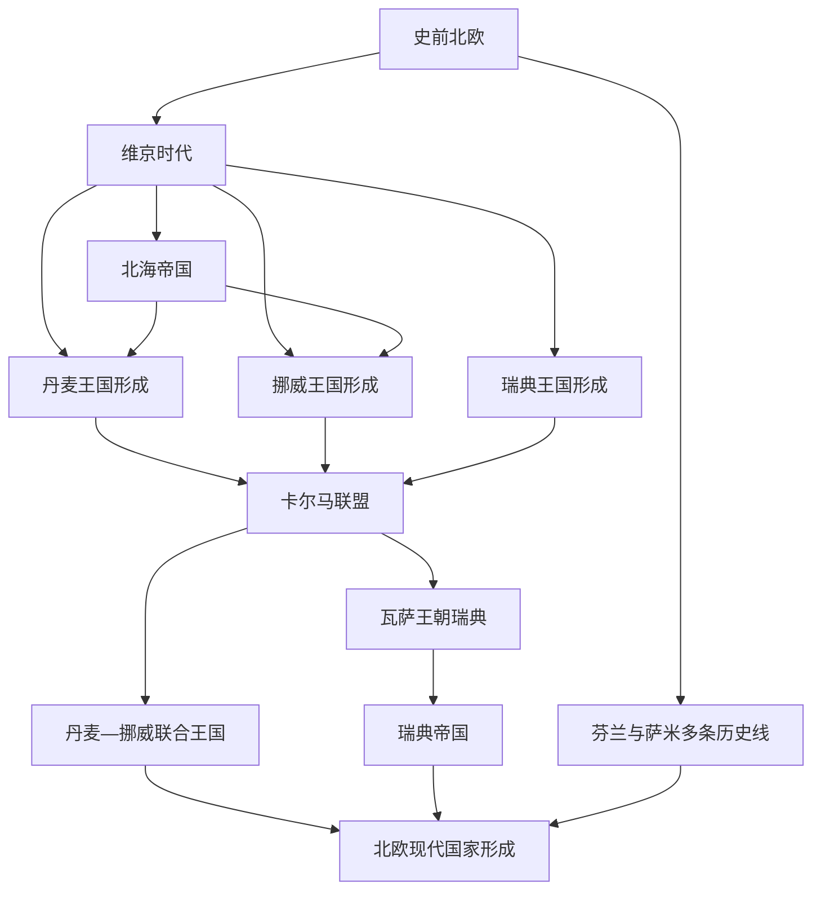

# 北欧历史

[返回欧洲历史](/%E4%BA%BA%E6%96%87%E7%A7%91%E5%AD%A6/%E5%8E%86%E5%8F%B2/%E6%AC%A7%E6%B4%B2/README.md)

## 范围与历史主线

本目录以丹麦、挪威、瑞典、芬兰和冰岛五国为国家入口，同时追踪斯堪的纳维亚、芬诺斯坎迪亚、北大西洋、波罗的海和跨境萨米地区的共同历史。它是地区框架，不代表五国拥有相同族源、语言或国家发展道路。

史前北欧形成多样的渔猎、农业、金属交换和海上网络；维京时代把这些网络扩展至北大西洋、英格兰、法兰克、罗斯与拜占庭。中世纪丹麦、挪威、瑞典王权逐渐整合，北海帝国和卡尔马联盟曾以共同君主联结多个王国，但均未取消各地法律和政治共同体。近世形成丹麦—挪威复合君主制与瑞典波罗的海帝国两大体系；19世纪以来的战争、制宪、联合解体、独立和议会化，最终形成五个现代国家及多层次的北欧合作。

## 按时间排序的共同阶段

| 顺序 | 名称 | 时间 | 简要概括 |
|---:|---|---|---|
| 1 | [史前北欧](/%E4%BA%BA%E6%96%87%E7%A7%91%E5%AD%A6/%E5%8E%86%E5%8F%B2/%E6%AC%A7%E6%B4%B2/%E5%8C%97%E6%AC%A7/%E5%8F%B2%E5%89%8D%E5%8C%97%E6%AC%A7.md) | 约前11000年—公元750/800年 | 冰后定居、农业与金属交换发展，海上交通和区域权力中心形成。 |
| 2 | [维京时代](/%E4%BA%BA%E6%96%87%E7%A7%91%E5%AD%A6/%E5%8E%86%E5%8F%B2/%E6%AC%A7%E6%B4%B2/%E5%8C%97%E6%AC%A7/%E7%BB%B4%E4%BA%AC%E6%97%B6%E4%BB%A3.md) | 约750/793—1066/1100年 | 经商、迁徙、殖民、服役和战争构成跨欧亚海陆网络，区域王权逐渐国家化。 |
| 3 | [北海帝国](/%E4%BA%BA%E6%96%87%E7%A7%91%E5%AD%A6/%E5%8E%86%E5%8F%B2/%E6%AC%A7%E6%B4%B2/%E5%8C%97%E6%AC%A7/%E5%8C%97%E6%B5%B7%E5%B8%9D%E5%9B%BD.md) | 1013—1042年 | 丹麦王族短暂联结英格兰、丹麦和挪威；三王位仅在克努特时期同时控制。 |
| 4 | [卡尔马联盟](/%E4%BA%BA%E6%96%87%E7%A7%91%E5%AD%A6/%E5%8E%86%E5%8F%B2/%E6%AC%A7%E6%B4%B2/%E5%8C%97%E6%AC%A7/%E5%8D%A1%E5%B0%94%E9%A9%AC%E8%81%94%E7%9B%9F.md) | 1389/1397—1523年 | 三国共戴君主而保留本国法律、议会与税制，瑞典控制权多次中断。 |
| 5 | [丹麦—挪威联合王国](/%E4%BA%BA%E6%96%87%E7%A7%91%E5%AD%A6/%E5%8E%86%E5%8F%B2/%E6%AC%A7%E6%B4%B2/%E5%8C%97%E6%AC%A7/%E4%B8%B9%E9%BA%A6-%E6%8C%AA%E5%A8%81%E8%81%94%E5%90%88%E7%8E%8B%E5%9B%BD.md) | 1536/1537—1814年 | 哥本哈根居主导的复合君主制，联结丹麦、挪威、北大西洋领地和另具地位的公国。 |
| 6 | [瑞典帝国](/%E4%BA%BA%E6%96%87%E7%A7%91%E5%AD%A6/%E5%8E%86%E5%8F%B2/%E6%AC%A7%E6%B4%B2/%E5%8C%97%E6%AC%A7/%E7%91%9E%E5%85%B8%E5%B8%9D%E5%9B%BD.md) | 1611—1721年 | 瑞典—芬兰核心与海外省份组成军事财政强权，后在大北方战争中失去波罗的海霸权。 |
| 7 | [北欧现代国家形成](/%E4%BA%BA%E6%96%87%E7%A7%91%E5%AD%A6/%E5%8E%86%E5%8F%B2/%E6%AC%A7%E6%B4%B2/%E5%8C%97%E6%AC%A7/%E5%8C%97%E6%AC%A7%E7%8E%B0%E4%BB%A3%E5%9B%BD%E5%AE%B6%E5%BD%A2%E6%88%90.md) | 19世纪初—2026年 | 制宪、联合解体、独立、战争、福利国家及欧洲与安全制度分流。 |

## 国家历史入口

| 国家 | 全史入口 | 主线 |
|---|---|---|
| 丹麦 | [丹麦历史](/%E4%BA%BA%E6%96%87%E7%A7%91%E5%AD%A6/%E5%8E%86%E5%8F%B2/%E6%AC%A7%E6%B4%B2/%E5%8C%97%E6%AC%A7/%E4%B8%B9%E9%BA%A6/README.md) | 王国形成 → 卡尔马联盟 → 丹麦—挪威 → 1849年立宪 → 1864年战败 → 欧洲一体化 |
| 挪威 | [挪威历史](/%E4%BA%BA%E6%96%87%E7%A7%91%E5%AD%A6/%E5%8E%86%E5%8F%B2/%E6%AC%A7%E6%B4%B2/%E5%8C%97%E6%AC%A7/%E6%8C%AA%E5%A8%81/README.md) | 王国形成 → 联合王权 → 1814年宪法 → 1905年独立 → 北约与石油时代 |
| 瑞典 | [瑞典历史](/%E4%BA%BA%E6%96%87%E7%A7%91%E5%AD%A6/%E5%8E%86%E5%8F%B2/%E6%AC%A7%E6%B4%B2/%E5%8C%97%E6%AC%A7/%E7%91%9E%E5%85%B8/README.md) | 中世纪王国 → 1523年瓦萨王朝 → 瑞典帝国 → 1809年重组 → 福利国家 → 2024年加入北约 |
| 芬兰 | [芬兰历史](/%E4%BA%BA%E6%96%87%E7%A7%91%E5%AD%A6/%E5%8E%86%E5%8F%B2/%E6%AC%A7%E6%B4%B2/%E5%8C%97%E6%AC%A7/%E8%8A%AC%E5%85%B0/README.md) | 瑞典王国东部 → 1809年大公国 → 1917年独立 → 战后外交 → 欧盟与北约 |
| 冰岛 | [冰岛历史](/%E4%BA%BA%E6%96%87%E7%A7%91%E5%AD%A6/%E5%8E%86%E5%8F%B2/%E6%AC%A7%E6%B4%B2/%E5%8C%97%E6%AC%A7/%E5%86%B0%E5%B2%9B/README.md) | 定居与自由邦 → 挪威、丹麦王权 → 1918年主权王国 → 1944年共和国 → 欧洲经济区 |

## 跨境原住民与王国内部自治专题

| 专题 | 时间范围 | 阅读重点 |
|---|---|---|
| [萨米人的跨境历史](/%E4%BA%BA%E6%96%87%E7%A7%91%E5%AD%A6/%E5%8E%86%E5%8F%B2/%E6%AC%A7%E6%B4%B2/%E5%8C%97%E6%AC%A7/%E8%90%A8%E7%B1%B3%E4%BA%BA%E7%9A%84%E8%B7%A8%E5%A2%83%E5%8E%86%E5%8F%B2.md) | 史前背景—2026年 | 语言与多种生计、重叠征税、国界关闭、同化、萨米议会、土地与绿色转型。 |
| [法罗群岛与格陵兰历史](/%E4%BA%BA%E6%96%87%E7%A7%91%E5%AD%A6/%E5%8E%86%E5%8F%B2/%E6%AC%A7%E6%B4%B2/%E5%8C%97%E6%AC%A7/%E6%B3%95%E7%BD%97%E7%BE%A4%E5%B2%9B%E4%B8%8E%E6%A0%BC%E9%99%B5%E5%85%B0%E5%8E%86%E5%8F%B2.md) | 史前 / 定居—2026年 | 法罗自治、格陵兰因纽特与诺斯多线历史、殖民—自治转型及完整自治政府首脑表。 |
