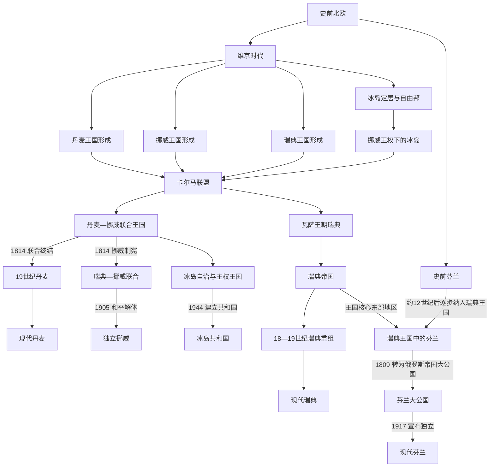

# 北欧历史

[返回欧洲历史](/%E4%BA%BA%E6%96%87%E7%A7%91%E5%AD%A6/%E5%8E%86%E5%8F%B2/%E6%AC%A7%E6%B4%B2/README.md)

## 概括

北欧历史由斯堪的纳维亚、北大西洋和芬兰方向的多条主线构成。史前社会与维京时代形成跨海网络，丹麦、挪威和瑞典王权随后发展；卡尔马联盟短暂把三国置于共同君主之下，近世又分化为丹麦—挪威与瑞典两大体系。19—20世纪的宪政、民族运动、联合解体、独立、战争和福利国家建设，最终形成丹麦、挪威、瑞典、冰岛与芬兰五条相互关联但并不相同的国家史。

## 北欧历史演进图

## 历史主线

北欧共同史适合用于理解跨国现象：维京海上网络、卡尔马联盟、丹麦—挪威、瑞典帝国和现代国家形成。五国目录则负责各自在共同阶段中的制度、社会和后续走向。共同主笔记与国家视角互相链接，但不重复维护同一段完整通史。

## 共同阶段导航

| 顺序 | 名称 | 时间 | 简要概括 |
|---:|---|---|---|
| 1 | [史前北欧](/%E4%BA%BA%E6%96%87%E7%A7%91%E5%AD%A6/%E5%8E%86%E5%8F%B2/%E6%AC%A7%E6%B4%B2/%E5%8C%97%E6%AC%A7/%E5%8F%B2%E5%89%8D%E5%8C%97%E6%AC%A7.md) | 史前—8世纪 | 斯堪的纳维亚、日德兰和波罗的海周边社会形成海上网络基础。 |
| 2 | [维京时代](/%E4%BA%BA%E6%96%87%E7%A7%91%E5%AD%A6/%E5%8E%86%E5%8F%B2/%E6%AC%A7%E6%B4%B2/%E5%8C%97%E6%AC%A7/%E7%BB%B4%E4%BA%AC%E6%97%B6%E4%BB%A3.md) | 约8世纪末—11世纪 | 北欧商人、武装集团和移民进入北海、北大西洋、罗斯和欧洲各地。 |
| 3 | [北海帝国](/%E4%BA%BA%E6%96%87%E7%A7%91%E5%AD%A6/%E5%8E%86%E5%8F%B2/%E6%AC%A7%E6%B4%B2/%E5%8C%97%E6%AC%A7/%E5%8C%97%E6%B5%B7%E5%B8%9D%E5%9B%BD.md) | 1013—1042年 | 克努特时期丹麦、英格兰和挪威等地的短暂跨海王权。 |
| 4 | [卡尔马联盟](/%E4%BA%BA%E6%96%87%E7%A7%91%E5%AD%A6/%E5%8E%86%E5%8F%B2/%E6%AC%A7%E6%B4%B2/%E5%8C%97%E6%AC%A7/%E5%8D%A1%E5%B0%94%E9%A9%AC%E8%81%94%E7%9B%9F.md) | 1397—1523年 | 丹麦、挪威、瑞典共戴君主但保留各自王国制度。 |
| 5 | [丹麦—挪威联合王国](/%E4%BA%BA%E6%96%87%E7%A7%91%E5%AD%A6/%E5%8E%86%E5%8F%B2/%E6%AC%A7%E6%B4%B2/%E5%8C%97%E6%AC%A7/%E4%B8%B9%E9%BA%A6-%E6%8C%AA%E5%A8%81%E8%81%94%E5%90%88%E7%8E%8B%E5%9B%BD.md) | 1536—1814年 | 哥本哈根中心的复合君主国，连接挪威及北大西洋领地。 |
| 6 | [瑞典帝国](/%E4%BA%BA%E6%96%87%E7%A7%91%E5%AD%A6/%E5%8E%86%E5%8F%B2/%E6%AC%A7%E6%B4%B2/%E5%8C%97%E6%AC%A7/%E7%91%9E%E5%85%B8%E5%B8%9D%E5%9B%BD.md) | 1611—1721年 | 瑞典成为波罗的海军事财政强权，后在大北方战争中衰落。 |
| 7 | [北欧现代国家形成](/%E4%BA%BA%E6%96%87%E7%A7%91%E5%AD%A6/%E5%8E%86%E5%8F%B2/%E6%AC%A7%E6%B4%B2/%E5%8C%97%E6%AC%A7/%E5%8C%97%E6%AC%A7%E7%8E%B0%E4%BB%A3%E5%9B%BD%E5%AE%B6%E5%BD%A2%E6%88%90.md) | 19—20世纪 | 拿破仑战争、宪政、民族运动、联合解体和独立重塑北欧。 |

## 国家历史入口

| 国家 | 全史入口 | 核心转折 |
|---|---|---|
| 丹麦 | [丹麦历史](/%E4%BA%BA%E6%96%87%E7%A7%91%E5%AD%A6/%E5%8E%86%E5%8F%B2/%E6%AC%A7%E6%B4%B2/%E5%8C%97%E6%AC%A7/%E4%B8%B9%E9%BA%A6/README.md) | 王国形成 → 卡尔马联盟 → 丹麦—挪威 → 1849年立宪 → 1864年战败 → 欧洲一体化 |
| 挪威 | [挪威历史](/%E4%BA%BA%E6%96%87%E7%A7%91%E5%AD%A6/%E5%8E%86%E5%8F%B2/%E6%AC%A7%E6%B4%B2/%E5%8C%97%E6%AC%A7/%E6%8C%AA%E5%A8%81/README.md) | 王国形成 → 联合王权 → 1814年宪法 → 1905年独立 → 北约 → 石油时代 |
| 瑞典 | [瑞典历史](/%E4%BA%BA%E6%96%87%E7%A7%91%E5%AD%A6/%E5%8E%86%E5%8F%B2/%E6%AC%A7%E6%B4%B2/%E5%8C%97%E6%AC%A7/%E7%91%9E%E5%85%B8/README.md) | 中世纪王国 → 1523年瓦萨王朝 → 瑞典帝国 → 1809年重组 → 福利国家 → 2024年加入北约 |
| 冰岛 | [冰岛历史](/%E4%BA%BA%E6%96%87%E7%A7%91%E5%AD%A6/%E5%8E%86%E5%8F%B2/%E6%AC%A7%E6%B4%B2/%E5%8C%97%E6%AC%A7/%E5%86%B0%E5%B2%9B/README.md) | 定居与自由邦 → 挪威／丹麦统治 → 1918年主权王国 → 1944年共和国 → 欧洲经济区 |
| 芬兰 | [芬兰历史](/%E4%BA%BA%E6%96%87%E7%A7%91%E5%AD%A6/%E5%8E%86%E5%8F%B2/%E6%AC%A7%E6%B4%B2/%E5%8C%97%E6%AC%A7/%E8%8A%AC%E5%85%B0/README.md) | 瑞典王国东部 → 1809年大公国 → 1917年独立 → 战后中立 → 欧盟 → 2023年加入北约 |

## 关键辨析

- “北欧”是历史与地理框架，不代表五国具有相同族源。芬兰语属于乌拉尔语系，芬兰和萨米历史也不能并入北日耳曼直系谱系。
- “维京人”是特定时代的海上活动者及社会网络，不是一个统一国家或现代民族的旧称。
- 卡尔马联盟、丹麦—挪威和瑞典—挪威联合都是复合政治结构，各成员的法律和制度地位不同。
- 冰岛在1918年成为主权王国、1944年成为共和国；两个时点对应不同层次的国家变化。
- 北欧福利国家具有共同特征，但形成时间、国际结盟、资源基础和欧洲一体化方式并不一致。
- 当代丹麦、挪威和冰岛是北约创始成员；芬兰和瑞典分别于2023年、2024年加入。丹麦、瑞典和芬兰属于欧洲联盟，挪威和冰岛通过欧洲经济区参与内部市场。

## 相关欧洲历史

- 维京时代与[不列颠群岛](/%E4%BA%BA%E6%96%87%E7%A7%91%E5%AD%A6/%E5%8E%86%E5%8F%B2/%E6%AC%A7%E6%B4%B2/%E4%B8%8D%E5%88%97%E9%A2%A0%E7%BE%A4%E5%B2%9B/README.md)、[法兰克王国](/%E4%BA%BA%E6%96%87%E7%A7%91%E5%AD%A6/%E5%8E%86%E5%8F%B2/%E6%AC%A7%E6%B4%B2/_%E9%80%9A%E5%8F%B2/%E5%90%8E%E7%BD%97%E9%A9%AC%E6%97%B6%E4%BB%A3%E7%9A%84%E6%97%A5%E8%80%B3%E6%9B%BC%E8%AF%B8%E5%9B%BD/%E6%B3%95%E5%85%B0%E5%85%8B%E7%8E%8B%E5%9B%BD/README.md)和[基辅罗斯](/%E4%BA%BA%E6%96%87%E7%A7%91%E5%AD%A6/%E5%8E%86%E5%8F%B2/%E6%AC%A7%E6%B4%B2/%E6%96%AF%E6%8B%89%E5%A4%AB/%E4%B8%9C%E6%96%AF%E6%8B%89%E5%A4%AB/%E5%9F%BA%E8%BE%85%E7%BD%97%E6%96%AF.md)关系密切。
- 瑞典帝国、芬兰和波罗的海争霸应与[波罗的海](/%E4%BA%BA%E6%96%87%E7%A7%91%E5%AD%A6/%E5%8E%86%E5%8F%B2/%E6%AC%A7%E6%B4%B2/%E6%B3%A2%E7%BD%97%E7%9A%84%E6%B5%B7/README.md)对读。
