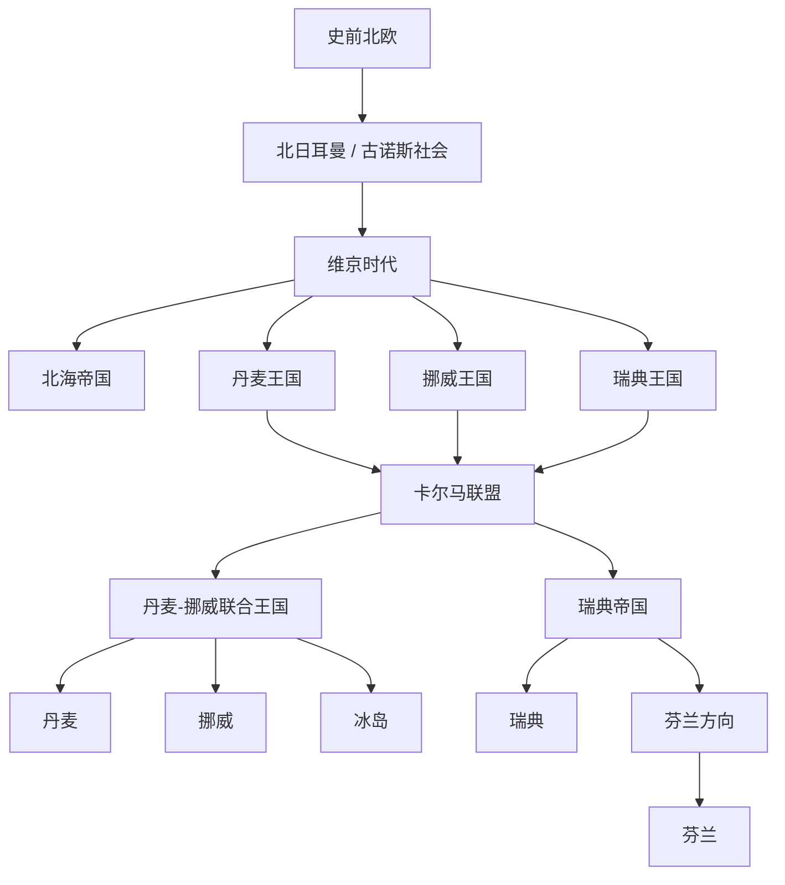

# 北欧历史

## 历史主线

北欧历史可以按“史前北欧 → 北日耳曼 / 古诺斯社会 → 维京时代 → 丹麦、挪威、瑞典王国形成 → 卡尔马联盟 → 丹麦-挪威与瑞典分化 → 瑞典帝国和波罗的海争霸 → 拿破仑战争后的北欧重组 → 现代北欧国家”来理解。芬兰虽然语言和族源不同于北日耳曼国家，但历史上长期受瑞典和俄罗斯影响，通常放入北欧历史框架内阅读。

## 北欧历史演变脉络图

## 导航表

| 顺序 | 名称 | 时间 | 简要概括 |
|---:|---|---|---|
| 1 | [史前北欧](/%E4%BA%BA%E6%96%87%E7%A7%91%E5%AD%A6/%E5%8E%86%E5%8F%B2/%E6%AC%A7%E6%B4%B2/%E5%8C%97%E6%AC%A7/%E5%8F%B2%E5%89%8D%E5%8C%97%E6%AC%A7.md) | 史前-8世纪 | 斯堪的纳维亚半岛和北海、波罗的海周边形成北日耳曼社会与海上活动基础。 |
| 2 | [维京时代](/%E4%BA%BA%E6%96%87%E7%A7%91%E5%AD%A6/%E5%8E%86%E5%8F%B2/%E6%AC%A7%E6%B4%B2/%E5%8C%97%E6%AC%A7/%E7%BB%B4%E4%BA%AC%E6%97%B6%E4%BB%A3.md) | 约8世纪末-11世纪 | 北欧海盗、商人和移民扩展到不列颠、法兰克、罗斯、冰岛、格陵兰等地区。 |
| 3 | [北海帝国](/%E4%BA%BA%E6%96%87%E7%A7%91%E5%AD%A6/%E5%8E%86%E5%8F%B2/%E6%AC%A7%E6%B4%B2/%E5%8C%97%E6%AC%A7/%E5%8C%97%E6%B5%B7%E5%B8%9D%E5%9B%BD.md) | 1013年-1042年 | 克努特大帝时期丹麦、英格兰、挪威等地短暂整合。 |
| 4 | [卡尔马联盟](/%E4%BA%BA%E6%96%87%E7%A7%91%E5%AD%A6/%E5%8E%86%E5%8F%B2/%E6%AC%A7%E6%B4%B2/%E5%8C%97%E6%AC%A7/%E5%8D%A1%E5%B0%94%E9%A9%AC%E8%81%94%E7%9B%9F.md) | 1397年-1523年 | 丹麦、挪威、瑞典在同一君主下联合，是北欧中世纪后期关键政治框架。 |
| 5 | [丹麦-挪威联合王国](/%E4%BA%BA%E6%96%87%E7%A7%91%E5%AD%A6/%E5%8E%86%E5%8F%B2/%E6%AC%A7%E6%B4%B2/%E5%8C%97%E6%AC%A7/%E4%B8%B9%E9%BA%A6-%E6%8C%AA%E5%A8%81%E8%81%94%E5%90%88%E7%8E%8B%E5%9B%BD.md) | 1536年-1814年 | 丹麦与挪威长期合并，冰岛、格陵兰、法罗群岛等北大西洋属地也在其体系内。 |
| 6 | [瑞典帝国](/%E4%BA%BA%E6%96%87%E7%A7%91%E5%AD%A6/%E5%8E%86%E5%8F%B2/%E6%AC%A7%E6%B4%B2/%E5%8C%97%E6%AC%A7/%E7%91%9E%E5%85%B8%E5%B8%9D%E5%9B%BD.md) | 17世纪-18世纪初 | 瑞典成为波罗的海强权，与丹麦、波兰-立陶宛、俄罗斯竞争。 |
| 7 | [北欧现代国家形成](/%E4%BA%BA%E6%96%87%E7%A7%91%E5%AD%A6/%E5%8E%86%E5%8F%B2/%E6%AC%A7%E6%B4%B2/%E5%8C%97%E6%AC%A7/%E5%8C%97%E6%AC%A7%E7%8E%B0%E4%BB%A3%E5%9B%BD%E5%AE%B6%E5%BD%A2%E6%88%90.md) | 19世纪-20世纪 | 拿破仑战争、民族主义、宪政改革和独立运动塑造现代北欧国家。 |
| 8 | [丹麦](/%E4%BA%BA%E6%96%87%E7%A7%91%E5%AD%A6/%E5%8E%86%E5%8F%B2/%E6%AC%A7%E6%B4%B2/%E5%8C%97%E6%AC%A7/%E4%B8%B9%E9%BA%A6/README.md) | 中世纪至今 | 从维京王国、卡尔马联盟、丹麦-挪威到现代丹麦。 |
| 9 | [挪威](/%E4%BA%BA%E6%96%87%E7%A7%91%E5%AD%A6/%E5%8E%86%E5%8F%B2/%E6%AC%A7%E6%B4%B2/%E5%8C%97%E6%AC%A7/%E6%8C%AA%E5%A8%81/README.md) | 中世纪至今 | 从维京王国、丹麦统治、瑞典-挪威联合到1905年独立。 |
| 10 | [瑞典](/%E4%BA%BA%E6%96%87%E7%A7%91%E5%AD%A6/%E5%8E%86%E5%8F%B2/%E6%AC%A7%E6%B4%B2/%E5%8C%97%E6%AC%A7/%E7%91%9E%E5%85%B8/README.md) | 中世纪至今 | 从中世纪王国、卡尔马联盟脱离、瑞典帝国到现代瑞典。 |
| 11 | [冰岛](/%E4%BA%BA%E6%96%87%E7%A7%91%E5%AD%A6/%E5%8E%86%E5%8F%B2/%E6%AC%A7%E6%B4%B2/%E5%8C%97%E6%AC%A7/%E5%86%B0%E5%B2%9B/README.md) | 9世纪至今 | 从定居时代、冰岛自由邦、挪威 / 丹麦统治到现代冰岛共和国。 |
| 12 | [芬兰](/%E4%BA%BA%E6%96%87%E7%A7%91%E5%AD%A6/%E5%8E%86%E5%8F%B2/%E6%AC%A7%E6%B4%B2/%E5%8C%97%E6%AC%A7/%E8%8A%AC%E5%85%B0/README.md) | 中世纪至今 | 从瑞典东部地区、俄罗斯大公国到1917年独立和现代芬兰。 |

## 相关欧洲历史

- 维京时代与[不列颠群岛](/%E4%BA%BA%E6%96%87%E7%A7%91%E5%AD%A6/%E5%8E%86%E5%8F%B2/%E6%AC%A7%E6%B4%B2/%E4%B8%8D%E5%88%97%E9%A2%A0%E7%BE%A4%E5%B2%9B/README.md)、[法兰克王国](/%E4%BA%BA%E6%96%87%E7%A7%91%E5%AD%A6/%E5%8E%86%E5%8F%B2/%E6%AC%A7%E6%B4%B2/_%E9%80%9A%E5%8F%B2/%E5%90%8E%E7%BD%97%E9%A9%AC%E6%97%B6%E4%BB%A3%E7%9A%84%E6%97%A5%E8%80%B3%E6%9B%BC%E8%AF%B8%E5%9B%BD/%E6%B3%95%E5%85%B0%E5%85%8B%E7%8E%8B%E5%9B%BD/README.md)和[基辅罗斯](/%E4%BA%BA%E6%96%87%E7%A7%91%E5%AD%A6/%E5%8E%86%E5%8F%B2/%E6%AC%A7%E6%B4%B2/%E6%96%AF%E6%8B%89%E5%A4%AB/%E4%B8%9C%E6%96%AF%E6%8B%89%E5%A4%AB/%E5%9F%BA%E8%BE%85%E7%BD%97%E6%96%AF.md)关系密切。
- 瑞典帝国、芬兰和波罗的海争霸应与[波罗的海](/%E4%BA%BA%E6%96%87%E7%A7%91%E5%AD%A6/%E5%8E%86%E5%8F%B2/%E6%AC%A7%E6%B4%B2/%E6%B3%A2%E7%BD%97%E7%9A%84%E6%B5%B7/README.md)对读。
