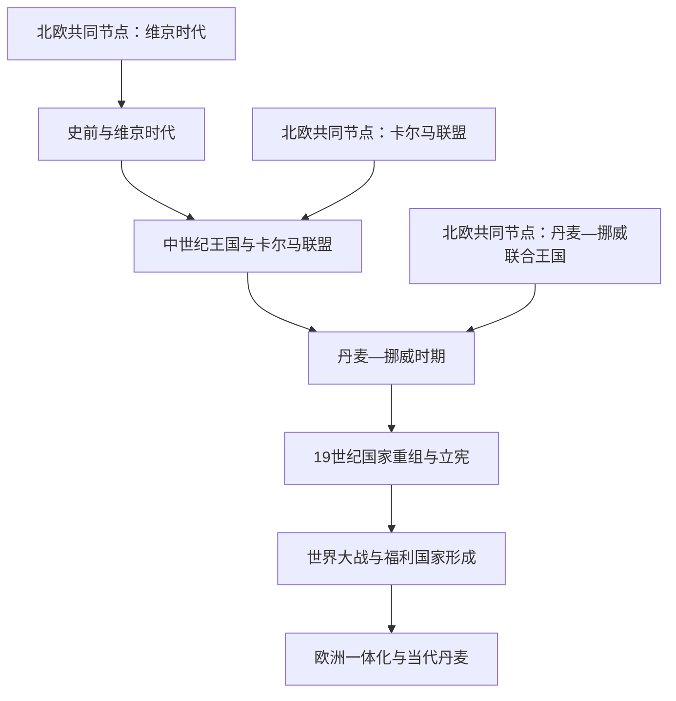

# 丹麦历史

## 概括

丹麦历史以日德兰半岛和丹麦群岛为核心，从史前北海—波罗的海网络、维京王权和中世纪王国，经过卡尔马联盟与丹麦—挪威复合君主国，转向19世纪的立宪民族国家，再发展为嵌入北约、欧洲联盟和北欧合作的现代福利国家。

## 历史演进图

## 历史主线

丹麦的长期变化并不是从维京人直接延续为现代民族国家。早期首领网络经过基督教化和王权整合才形成中世纪王国；卡尔马联盟和丹麦—挪威则是多个王国、领地共戴君主的复合结构。1814年失去挪威、1849年立宪和1864年失去石勒苏益格—荷尔斯泰因后，丹麦的发展重心转向较小范围的本土国家。20世纪的民主化、占领经验、国际结盟和福利制度共同塑造当代丹麦。

## 按时间导航

| 顺序 | 阶段 | 时间 | 历史走向 |
|---:|---|---|---|
| 1 | [史前与维京时代](/%E4%BA%BA%E6%96%87%E7%A7%91%E5%AD%A6/%E5%8E%86%E5%8F%B2/%E6%AC%A7%E6%B4%B2/%E5%8C%97%E6%AC%A7/%E4%B8%B9%E9%BA%A6/%E5%8F%B2%E5%89%8D%E4%B8%8E%E7%BB%B4%E4%BA%AC%E6%97%B6%E4%BB%A3.md) | 史前—约1050年 | 日德兰和群岛社会、海上网络、基督教化与早期王权汇合。 |
| 2 | [中世纪王国与卡尔马联盟](/%E4%BA%BA%E6%96%87%E7%A7%91%E5%AD%A6/%E5%8E%86%E5%8F%B2/%E6%AC%A7%E6%B4%B2/%E5%8C%97%E6%AC%A7/%E4%B8%B9%E9%BA%A6/%E4%B8%AD%E4%B8%96%E7%BA%AA%E7%8E%8B%E5%9B%BD%E4%B8%8E%E5%8D%A1%E5%B0%94%E9%A9%AC%E8%81%94%E7%9B%9F.md) | 约1050—1536年 | 王权、贵族与教会竞争，丹麦王室推动北欧联合。 |
| 3 | [丹麦—挪威时期](/%E4%BA%BA%E6%96%87%E7%A7%91%E5%AD%A6/%E5%8E%86%E5%8F%B2/%E6%AC%A7%E6%B4%B2/%E5%8C%97%E6%AC%A7/%E4%B8%B9%E9%BA%A6/%E4%B8%B9%E9%BA%A6-%E6%8C%AA%E5%A8%81%E6%97%B6%E6%9C%9F.md) | 1536—1814年 | 宗教改革、绝对君主制、对瑞典战争与复合王国解体。 |
| 4 | [19世纪国家重组与立宪](/%E4%BA%BA%E6%96%87%E7%A7%91%E5%AD%A6/%E5%8E%86%E5%8F%B2/%E6%AC%A7%E6%B4%B2/%E5%8C%97%E6%AC%A7/%E4%B8%B9%E9%BA%A6/19%E4%B8%96%E7%BA%AA%E5%9B%BD%E5%AE%B6%E9%87%8D%E7%BB%84%E4%B8%8E%E7%AB%8B%E5%AE%AA.md) | 1814—1914年 | 失去挪威、立宪、1864年战败和社会经济转型。 |
| 5 | [世界大战与福利国家形成](/%E4%BA%BA%E6%96%87%E7%A7%91%E5%AD%A6/%E5%8E%86%E5%8F%B2/%E6%AC%A7%E6%B4%B2/%E5%8C%97%E6%AC%A7/%E4%B8%B9%E9%BA%A6/%E4%B8%96%E7%95%8C%E5%A4%A7%E6%88%98%E4%B8%8E%E7%A6%8F%E5%88%A9%E5%9B%BD%E5%AE%B6%E5%BD%A2%E6%88%90.md) | 1914—1973年 | 普选、占领、北约结盟与福利制度扩张。 |
| 6 | [欧洲一体化与当代丹麦](/%E4%BA%BA%E6%96%87%E7%A7%91%E5%AD%A6/%E5%8E%86%E5%8F%B2/%E6%AC%A7%E6%B4%B2/%E5%8C%97%E6%AC%A7/%E4%B8%B9%E9%BA%A6/%E6%AC%A7%E6%B4%B2%E4%B8%80%E4%BD%93%E5%8C%96%E4%B8%8E%E5%BD%93%E4%BB%A3%E4%B8%B9%E9%BA%A6.md) | 1973年至今 | 欧洲共同体与欧盟、王国内部自治和当代政策转型。 |

## 北欧共同节点

| 共同主题 | 入口 | 本国阅读重点 |
|---|---|---|
| 史前背景 | [史前北欧](/%E4%BA%BA%E6%96%87%E7%A7%91%E5%AD%A6/%E5%8E%86%E5%8F%B2/%E6%AC%A7%E6%B4%B2/%E5%8C%97%E6%AC%A7/%E5%8F%B2%E5%89%8D%E5%8C%97%E6%AC%A7.md) | 日德兰、群岛和海峡在区域网络中的位置。 |
| 海上扩张 | [维京时代](/%E4%BA%BA%E6%96%87%E7%A7%91%E5%AD%A6/%E5%8E%86%E5%8F%B2/%E6%AC%A7%E6%B4%B2/%E5%8C%97%E6%AC%A7/%E7%BB%B4%E4%BA%AC%E6%97%B6%E4%BB%A3.md) | 丹麦方向的英格兰、北海和早期王权。 |
| 跨海王权 | [北海帝国](/%E4%BA%BA%E6%96%87%E7%A7%91%E5%AD%A6/%E5%8E%86%E5%8F%B2/%E6%AC%A7%E6%B4%B2/%E5%8C%97%E6%AC%A7/%E5%8C%97%E6%B5%B7%E5%B8%9D%E5%9B%BD.md) | 克努特时期丹麦王权的跨海整合。 |
| 北欧联盟 | [卡尔马联盟](/%E4%BA%BA%E6%96%87%E7%A7%91%E5%AD%A6/%E5%8E%86%E5%8F%B2/%E6%AC%A7%E6%B4%B2/%E5%8C%97%E6%AC%A7/%E5%8D%A1%E5%B0%94%E9%A9%AC%E8%81%94%E7%9B%9F.md) | 丹麦王室的主导及联盟内部冲突。 |
| 复合君主国 | [丹麦—挪威联合王国](/%E4%BA%BA%E6%96%87%E7%A7%91%E5%AD%A6/%E5%8E%86%E5%8F%B2/%E6%AC%A7%E6%B4%B2/%E5%8C%97%E6%AC%A7/%E4%B8%B9%E9%BA%A6-%E6%8C%AA%E5%A8%81%E8%81%94%E5%90%88%E7%8E%8B%E5%9B%BD.md) | 哥本哈根中心、挪威与北大西洋领地。 |
| 现代国家比较 | [北欧现代国家形成](/%E4%BA%BA%E6%96%87%E7%A7%91%E5%AD%A6/%E5%8E%86%E5%8F%B2/%E6%AC%A7%E6%B4%B2/%E5%8C%97%E6%AC%A7/%E5%8C%97%E6%AC%A7%E7%8E%B0%E4%BB%A3%E5%9B%BD%E5%AE%B6%E5%BD%A2%E6%88%90.md) | 1814年以后丹麦与其他北欧国家的分化。 |

## 关键辨析

- “丹麦王国形成”“北海帝国”和“卡尔马联盟”是不同层次的历史现象，不能画成一个疆域不断扩大的单一国家。
- 丹麦—挪威是复合君主国；挪威、冰岛等地具有各自历史，不是现代丹麦本土的简单延伸。
- 1864年是现代丹麦国家走向的重要转折，但宪政、民族认同和经济转型均跨越这一时点。
- 当代“丹麦王国”包含丹麦本土、法罗群岛和格陵兰，不等于三者政治制度完全一致。

## 上级

- [北欧历史](/%E4%BA%BA%E6%96%87%E7%A7%91%E5%AD%A6/%E5%8E%86%E5%8F%B2/%E6%AC%A7%E6%B4%B2/%E5%8C%97%E6%AC%A7/README.md)
