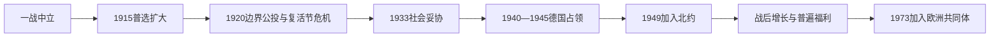

# 世界大战与丹麦福利国家形成

## 时间

1914年—1973年

## 概括

两次世界大战、1920年边界调整、德国占领和战后国际结盟塑造了现代丹麦。与此同时，普选、社会妥协和公共福利制度逐步扩展。

## 历史走向

- 第一次世界大战期间丹麦保持中立，但贸易、物资供应和北海安全受到战争影响。
- 1915年宪法改革扩大选举权，妇女和更多社会群体获得全国选举权。
- 1920年石勒苏益格公投后，北石勒苏并入丹麦，形成今日丹德边界的基本格局。
- 1940年4月德国占领丹麦。政府最初实行合作政策，1943年后公开抵抗增强；大多数丹麦犹太人经海路逃往瑞典。
- 1945年解放后，丹麦放弃战前中立路线，1949年成为北约创始成员国。
- 战间期社会改革和战后经济增长推动社会保险、公共医疗、教育与劳资协商扩展，福利国家逐渐成为政治共识的重要部分。
- 1953年宪法取消上议院并调整王位继承规则，形成现代一院制议会框架。

## 政治与社会结构

| 领域 | 主要变化 |
|---|---|
| 民主 | 普选扩大，议会制和政党竞争稳定化 |
| 安全 | 从中立转向北大西洋集体防务 |
| 社会政策 | 税收支持的普遍福利和地方公共服务扩展 |
| 劳资关系 | 工会、雇主组织和国家协商共同塑造社会妥协 |

## 演变关系

- 前一节点：[19世纪丹麦的国家重组与立宪](/%E4%BA%BA%E6%96%87%E7%A7%91%E5%AD%A6/%E5%8E%86%E5%8F%B2/%E6%AC%A7%E6%B4%B2/%E5%8C%97%E6%AC%A7/%E4%B8%B9%E9%BA%A6/19%E4%B8%96%E7%BA%AA%E5%9B%BD%E5%AE%B6%E9%87%8D%E7%BB%84%E4%B8%8E%E7%AB%8B%E5%AE%AA.md)。
- 后一节点：[欧洲一体化与当代丹麦](/%E4%BA%BA%E6%96%87%E7%A7%91%E5%AD%A6/%E5%8E%86%E5%8F%B2/%E6%AC%A7%E6%B4%B2/%E5%8C%97%E6%AC%A7/%E4%B8%B9%E9%BA%A6/%E6%AC%A7%E6%B4%B2%E4%B8%80%E4%BD%93%E5%8C%96%E4%B8%8E%E5%BD%93%E4%BB%A3%E4%B8%B9%E9%BA%A6.md)。

## 演进图

## 两次大战的具体过程

一战中丹麦维持中立，封锁、矿雷和交战国贸易需求却使经济分配和物价承压。1915年宪法使妇女、家庭佣工等获得全国选举权。战后依据公投，北石勒苏于1920年回归；国王克里斯蒂安十世因南部边界和内阁问题罢免萨勒政府，引发复活节危机。工会、政党和公众压力迫使国王退让，议会制从政治惯例上压倒个人王权。

1930年代大萧条冲击农业出口与就业。1933年斯陶宁政府与自由党达成坎斯勒街妥协，通过货币、农业支持和社会改革，以跨阶级交易维持制度稳定。1940年4月9日德国快速占领丹麦，国王、议会和政府留境并实行合作政策，希望保存行政和减少伤亡。合作并非全民认同；抵抗、破坏和情报活动逐渐增加。

1943年8月罢工和德国要求导致政府停止运作，部门首长维持行政，抵抗运动扩大。1943年10月，在社会动员和瑞典接收下，大多数丹麦犹太人成功渡海逃亡，但仍有人被捕。1945年5月解放时，国内政治精英与抵抗委员会组成联合政府；博恩霍尔姆遭苏军轰炸并短期驻军至1946年。

## 战后制度形成

战前中立未能阻止占领，丹麦遂于1949年成为北约创始成员；同时加入联合国、欧洲经合安排和北欧委员会。1953年宪法取消上院、允许女性王位继承并确立公投等制度。城市化、女性就业、税基增长和劳资协商支持医疗、养老金、教育、失业保障和地方服务普遍化。福利扩张同时依赖高就业与出口竞争力，并非只有社会民主党单方面推动。

## 重要事件与权力结构

| 时间 | 事件 | 结果 |
|---|---|---|
| 1915年 | 宪法改革 | 普选范围显著扩大，民主代表性增强 |
| 1917年 | 丹属西印度群岛售予美国 | 丹麦加勒比殖民统治终结，殖民遗产仍存 |
| 1920年 | 石勒苏益格公投 | 今日丹德边界大体确定，形成少数族群保障问题 |
| 1920年 | 复活节危机 | 国王政治干预失败，议会政府原则巩固 |
| 1933年 | 坎斯勒街妥协 | 社会改革、农业救济与劳资政治相互结合 |
| 1940年4月9日 | 德军占领 | 政府合作以保存有限自治，实际主权受到占领权限制 |
| 1943年8月29日 | 合作政府终止 | 德国实施军事紧急状态，部门行政与抵抗并存 |
| 1943年10月 | 犹太人救援 | 大多数丹麦犹太人逃往瑞典，仍有被捕和驱逐者 |
| 1945年5月 | 解放 | 联合政府处理清算、重建和国际转向 |
| 1948、1949年 | 法罗自治、加入北约 | 王国内部权力下放和安全结盟同步发生 |
| 1953年 | 新宪法 | 一院制议会与现代继承制度建立 |
| 1960年代 | 福利与教育扩张 | 普遍服务、消费社会和文化变迁加速 |
| 1972—1973年 | 公投并加入欧洲共同体 | 经济制度转入欧洲一体化框架 |

占领期政府、部门行政和历任政府首脑的连续性见[丹麦君主与政府首脑表](/%E4%BA%BA%E6%96%87%E7%A7%91%E5%AD%A6/%E5%8E%86%E5%8F%B2/%E6%AC%A7%E6%B4%B2/%E5%8C%97%E6%AC%A7/%E4%B8%B9%E9%BA%A6/%E4%B8%B9%E9%BA%A6%E5%90%9B%E4%B8%BB%E4%B8%8E%E6%94%BF%E5%BA%9C%E9%A6%96%E8%84%91%E8%A1%A8.md)。
