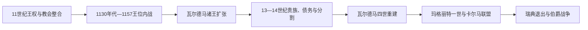

# 中世纪丹麦王国与卡尔马联盟

## 时间

约1050年—1536年

## 概括

维京时代结束后，丹麦逐步成为拉丁基督教世界中的中世纪王国。王权、贵族和教会长期竞争，又在瓦尔德马诸王时期扩张；14世纪末，丹麦王室推动建立卡尔马联盟，并在联盟中居于主导地位。

## 历史走向

- 11—12世纪王位竞争频繁，教区、修道院和贵族领地同时发展，王国的制度化并非单向加强。
- 瓦尔德马一世、克努特六世和瓦尔德马二世时期，王权向波罗的海南岸扩展；1227年博恩赫费德战役后，大陆扩张受到限制。
- 1241年《日德兰法》体现王权与地区法律传统的整合，但丹麦各地仍保有不同法律和政治惯例。
- 14世纪中叶，瓦尔德马四世重建因分割和抵押而削弱的王权。其女玛格丽特一世以王朝继承和贵族协商整合丹麦、挪威和瑞典。
- 1397年卡尔马联盟建立。丹麦王室的优势、瑞典贵族的反复抵抗以及汉萨同盟竞争，使联盟始终是复合君主联合而非统一国家。
- 1523年瑞典退出联盟；1536年宗教改革与挪威政治地位变化，使丹麦历史进入丹麦—挪威阶段。

## 统治结构

| 阶段 | 王权与政治结构 | 主要制约 |
|---|---|---|
| 中世纪王国 | 君主、王国议会、贵族和教会共同构成政治秩序 | 王位争夺、地方法律与贵族权力 |
| 卡尔马联盟 | 三国共戴君主，各王国保留法律与政治共同体 | 瑞典反抗、汉萨势力和王朝继承问题 |
| 宗教改革前夕 | 王室试图加强财政与任命权 | 天主教会和贵族集团仍具重要资源 |

## 与北欧共同主线的关系

卡尔马联盟的跨国制度和三国关系由[卡尔马联盟](/%E4%BA%BA%E6%96%87%E7%A7%91%E5%AD%A6/%E5%8E%86%E5%8F%B2/%E6%AC%A7%E6%B4%B2/%E5%8C%97%E6%AC%A7/%E5%8D%A1%E5%B0%94%E9%A9%AC%E8%81%94%E7%9B%9F.md)集中说明；本页关注丹麦王权如何成为联盟的推动者和主要受益者。

## 演变关系

- 前一节点：[史前与维京时代的丹麦](/%E4%BA%BA%E6%96%87%E7%A7%91%E5%AD%A6/%E5%8E%86%E5%8F%B2/%E6%AC%A7%E6%B4%B2/%E5%8C%97%E6%AC%A7/%E4%B8%B9%E9%BA%A6/%E5%8F%B2%E5%89%8D%E4%B8%8E%E7%BB%B4%E4%BA%AC%E6%97%B6%E4%BB%A3.md)。
- 后一节点：[丹麦—挪威时期的丹麦](/%E4%BA%BA%E6%96%87%E7%A7%91%E5%AD%A6/%E5%8E%86%E5%8F%B2/%E6%AC%A7%E6%B4%B2/%E5%8C%97%E6%AC%A7/%E4%B8%B9%E9%BA%A6/%E4%B8%B9%E9%BA%A6-%E6%8C%AA%E5%A8%81%E6%97%B6%E6%9C%9F.md)。

## 演进图

## 分阶段过程

### 王位内战与瓦尔德马重建

斯文二世诸子和后裔的竞争令11—12世纪王位继承长期依赖选举、军事和教会支持。1131年克努特·拉瓦德被杀引发持续内战，1146年后斯文三世、克努特五世和瓦尔德马一世并立。1157年罗斯基勒血宴与格拉特荒原战役使瓦尔德马成为唯一君主。他与大主教阿布萨隆合作，打击文德海盗、建设要塞并把教会网络用于行政。

瓦尔德马二世时期丹麦在波罗的海南岸和爱沙尼亚北部建立支配，但1223年国王被俘和1227年博恩赫费德失败使大部分大陆霸权崩溃。1241年《日德兰法》总结地区法律，却没有消灭西兰法、斯科讷法等差异。其子辈争位、贵族和教会扩权，使王国多次陷入内战。

### 抵押危机与王权恢复

14世纪初战争和债务使克里斯托弗二世把税收和领土抵押给荷尔斯泰因伯爵，1332—1340年甚至没有公认国王。瓦尔德马四世通过征税、战争、赎回和没收逐步恢复控制，1361年夺取哥特兰，却遭汉萨城市联盟反击；1370年《施特拉尔松德和约》确认汉萨的贸易特权。

瓦尔德马四世无存活男性继承人，其外孙奥拉夫在母亲玛格丽特摄政下兼有丹麦和挪威王位。奥拉夫早逝后，玛格丽特以贵族承认、收养继承人和击败瑞典国王阿尔布雷希特建立三国共同王权。1397年卡尔马加冕并未建立统一行政；丹麦王室借人口、财政和地理中心取得优势，瑞典贵族则反复拥立摄政。

### 联盟危机与宗教改革前夜

埃里克七世与汉萨战争、海峡税和任用外来官员激化贵族反对，1439年被丹麦废黜。奥尔登堡王朝自1448年起控制丹麦与挪威，但瑞典王位断续。克里斯蒂安二世1520年恢复瑞典统治后处决反对者，斯德哥尔摩惨案反而促成瓦萨起义。1523年瑞典永久退出；丹麦贵族又废黜克里斯蒂安二世。弗雷德里克一世死后，围绕宗教、城市利益和王位的伯爵战争直到1536年才以克里斯蒂安三世胜利结束。

## 重要事件

| 时间 | 事件 | 结果 |
|---|---|---|
| 1131—1157年 | 王位内战 | 王族、贵族、教会与德意志盟友反复结盟，瓦尔德马一世最终胜出 |
| 1168年 | 阿科纳被征服 | 丹麦王权和教会扩大对波罗的海斯拉夫地区影响 |
| 1219年 | 爱沙尼亚远征 | 建立丹属爱沙尼亚统治，后于1346年售予条顿骑士团 |
| 1227年 | 博恩赫费德战役 | 丹麦在德意志北部的霸权基本终结 |
| 1241年 | 《日德兰法》 | 王权认可并整理区域法律传统 |
| 1286年 | 埃里克五世遇刺 | 贵族反对与继承危机加深 |
| 1332—1340年 | 王位空缺 | 抵押政治达到顶点，国家并未消失但中央王权失效 |
| 1361—1370年 | 哥特兰战争与汉萨冲突 | 王权扩张遭贸易城市联盟制约 |
| 1389—1397年 | 三国王权汇合 | 玛格丽特击败阿尔布雷希特并完成卡尔马安排 |
| 1434—1439年 | 恩格尔布雷克起义与废王 | 联盟中瑞典的抵抗制度化 |
| 1520—1523年 | 斯德哥尔摩惨案与瓦萨起义 | 瑞典退出卡尔马联盟 |
| 1534—1536年 | 伯爵战争 | 克里斯蒂安三世胜利，宗教改革和集权开始 |

完整并立、复位和空位说明见[丹麦君主与政府首脑表](/%E4%BA%BA%E6%96%87%E7%A7%91%E5%AD%A6/%E5%8E%86%E5%8F%B2/%E6%AC%A7%E6%B4%B2/%E5%8C%97%E6%AC%A7/%E4%B8%B9%E9%BA%A6/%E4%B8%B9%E9%BA%A6%E5%90%9B%E4%B8%BB%E4%B8%8E%E6%94%BF%E5%BA%9C%E9%A6%96%E8%84%91%E8%A1%A8.md)。
