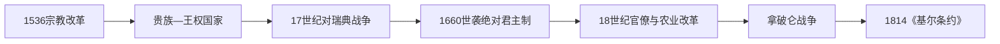

# 丹麦—挪威时期的丹麦

## 时间

1536年—1814年

## 概括

宗教改革后，丹麦王权以哥本哈根为中心统治丹麦、挪威及北大西洋领地。与瑞典的长期战争、1660年绝对君主制的建立以及拿破仑战争最终改变了这一复合王国。

## 历史走向

- 1536年宗教改革确立路德宗国教，王室接收大量教会财产，强化财政与行政能力。
- 丹麦与瑞典围绕海峡通行、挪威边疆和波罗的海控制权多次战争。1658年《罗斯基勒条约》使丹麦失去斯科讷等地区，北欧力量对比转向瑞典。
- 1660年政变后建立世袭绝对君主制，中央官僚体系和常备军进一步发展；贵族议会的旧有政治作用明显下降。
- 哥本哈根是复合君主国的行政中心，挪威、冰岛、法罗群岛和格陵兰在不同制度下与王权相连，不能简单理解为一个同质化民族国家。
- 18世纪农业改革、贸易和启蒙官僚制度推动社会变化；丹麦也参与海外殖民与大西洋贸易。
- 拿破仑战争中丹麦站到法国一方。1814年《基尔条约》迫使丹麦国王把挪威让予瑞典，丹麦—挪威政治联合终结。

## 统治结构

| 时期 | 主要结构 | 特征 |
|---|---|---|
| 1536—1660年 | 王权与贵族共同治理 | 宗教改革增强王室资源，贵族仍掌握地方与军政职位 |
| 1660—1814年 | 世袭绝对君主制 | 中央官僚机构、法典和常备军扩展 |
| 复合王国 | 各领地由同一君主统治 | 法律地位、地方制度和语言文化并不相同 |

## 与北欧共同主线的关系

复合王国的整体范围、挪威与北大西洋领地的地位见[丹麦—挪威联合王国](/%E4%BA%BA%E6%96%87%E7%A7%91%E5%AD%A6/%E5%8E%86%E5%8F%B2/%E6%AC%A7%E6%B4%B2/%E5%8C%97%E6%AC%A7/%E4%B8%B9%E9%BA%A6-%E6%8C%AA%E5%A8%81%E8%81%94%E5%90%88%E7%8E%8B%E5%9B%BD.md)。与瑞典争夺波罗的海霸权的另一条主线见[瑞典帝国](/%E4%BA%BA%E6%96%87%E7%A7%91%E5%AD%A6/%E5%8E%86%E5%8F%B2/%E6%AC%A7%E6%B4%B2/%E5%8C%97%E6%AC%A7/%E7%91%9E%E5%85%B8%E5%B8%9D%E5%9B%BD.md)。

## 演变关系

- 前一节点：[中世纪丹麦王国与卡尔马联盟](/%E4%BA%BA%E6%96%87%E7%A7%91%E5%AD%A6/%E5%8E%86%E5%8F%B2/%E6%AC%A7%E6%B4%B2/%E5%8C%97%E6%AC%A7/%E4%B8%B9%E9%BA%A6/%E4%B8%AD%E4%B8%96%E7%BA%AA%E7%8E%8B%E5%9B%BD%E4%B8%8E%E5%8D%A1%E5%B0%94%E9%A9%AC%E8%81%94%E7%9B%9F.md)。
- 后一节点：[19世纪丹麦的国家重组与立宪](/%E4%BA%BA%E6%96%87%E7%A7%91%E5%AD%A6/%E5%8E%86%E5%8F%B2/%E6%AC%A7%E6%B4%B2/%E5%8C%97%E6%AC%A7/%E4%B8%B9%E9%BA%A6/19%E4%B8%96%E7%BA%AA%E5%9B%BD%E5%AE%B6%E9%87%8D%E7%BB%84%E4%B8%8E%E7%AB%8B%E5%AE%AA.md)。

## 演进图

## 具体过程与制度变化

宗教改革不是单纯教义转变。克里斯蒂安三世逮捕天主教主教、没收教产，以路德宗主教和王室监督重建教会，显著增加土地与任官资源。贵族仍控制地方行政、庄园和高级职位，君主的即位宪章继续约束王权。厄勒海峡税、农业出口和挪威资源支持海军，克里斯蒂安四世又发展城市、贸易公司与海外据点。

与瑞典的战争逐渐使体系失衡。1645年丹麦割让耶姆特兰、海里耶达伦、哥特兰等地；1658年瑞军越过冰封海峡，迫使丹麦交出斯科讷、布莱金厄、哈兰和布胡斯等地。战争失败、哥本哈根守城和财政危机削弱贵族声望。1660年弗雷德里克三世联合教士、市民和军队把选举王权改为世袭王权，1665年《国王法》确立极强的绝对君主制。

绝对王权依靠中央署、职业官僚、常备军、土地登记和1683年《丹麦法典》治理。克里斯蒂安七世长期无法稳定理政，施特林泽、古尔德贝格集团和王储弗雷德里克先后掌握实际权力；这说明“绝对君主”制度也可能由大臣和宫廷集团运作。1780年代以后废除农民固定居住义务、调整庄园与土地制度，农业商品化和教育扩展。

1801年和1807年英国两次打击哥本哈根，第二次夺走舰队，迫使丹麦—挪威站在拿破仑一方。英国封锁切断王国各部分贸易，1813年国家财政破产式重整；瑞典王储贝尔纳多特以取得挪威为参战目标。1814年《基尔条约》割让挪威，但冰岛、法罗和格陵兰继续留在丹麦王冠下。

## 重要事件与因果

| 时间 | 事件 | 结构影响 |
|---|---|---|
| 1536年 | 宗教改革 | 王室获得教产和教会任命，丹麦—挪威政治重组 |
| 1563—1570年 | 北方七年战争 | 争夺波罗的海与王室称号，耗费巨大 |
| 1611—1613年 | 卡尔马战争 | 丹麦获赔款但未压服瑞典 |
| 1625—1629年 | 介入三十年战争 | 克里斯蒂安四世战败，瑞典后来取代丹麦成为新教强权 |
| 1645年 | 《布勒姆瑟布鲁和约》 | 瑞典取得重要领土和海峡优势 |
| 1658、1660年 | 《罗斯基勒》《哥本哈根》和约 | 丹麦永久失去东部核心省份，挽回博恩霍尔姆和特伦德拉格 |
| 1660—1665年 | 绝对王权建立 | 贵族议会退出中央政治，官僚集权扩展 |
| 1700—1721年 | 大北方战争 | 瑞典霸权衰落，丹麦却未收复斯科讷 |
| 1770—1772年 | 施特林泽改革与政变 | 启蒙改革、宫廷权力和政治反动集中爆发 |
| 1784—1800年 | 王储摄政与农业改革 | 地主经济和农民权利结构调整 |
| 1807年 | 哥本哈根炮击 | 舰队被夺，外交中立崩溃 |
| 1814年 | 联合解体 | 挪威制宪后与瑞典联合，丹麦转向本土与公国问题 |

本阶段完整君主、摄政和实际掌权者见[丹麦君主与政府首脑表](/%E4%BA%BA%E6%96%87%E7%A7%91%E5%AD%A6/%E5%8E%86%E5%8F%B2/%E6%AC%A7%E6%B4%B2/%E5%8C%97%E6%AC%A7/%E4%B8%B9%E9%BA%A6/%E4%B8%B9%E9%BA%A6%E5%90%9B%E4%B8%BB%E4%B8%8E%E6%94%BF%E5%BA%9C%E9%A6%96%E8%84%91%E8%A1%A8.md)。
