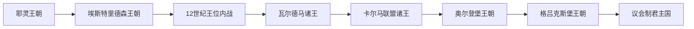

# 丹麦君主与政府首脑表

[返回丹麦历史](/%E4%BA%BA%E6%96%87%E7%A7%91%E5%AD%A6/%E5%8E%86%E5%8F%B2/%E6%AC%A7%E6%B4%B2/%E5%8C%97%E6%AC%A7/%E4%B8%B9%E9%BA%A6/README.md)

## 使用范围

本表以在丹麦王国实际获得承认的统治者为主，从耶灵王朝较可靠的老戈姆开始，依次列出共治、争位、复位、空位和摄政。约10世纪以前的在位年多为推定，12世纪内战中的统治范围也并非全国一致。1848年以前的“大臣”不能等同议会制首相；1848年以后另列议会政府首脑，1943—1945年德国占领下的行政中断单独说明。

## 耶灵王朝、北海王权与继承转折

| 顺序 | 君主 | 王室 | 在位 | 生卒 | 与前任关系 | 关键事件 / 备注 |
|---:|---|---|---|---|---|---|
| 1 | **老戈姆** | 耶灵王朝 | 约936—约958 | 约900—约958 | 早期谱系有争议 | 耶灵核心王权的首位较可靠君主；并非现代疆域的完整统治者 |
| 2 | **蓝牙哈拉尔** | 耶灵王朝 | 约958—约986 | 约910—约986 | 老戈姆之子 | 耶灵碑宣称统一丹麦、挪威并使丹麦人基督教化；实际整合为渐进过程 |
| 3 | 八字胡斯文 | 耶灵王朝 | 约986—1014 | 约960—1014 | 蓝牙哈拉尔之子 | 扩张北海舰队，1013年征服英格兰 |
| 4 | 哈拉尔二世 | 耶灵王朝 | 1014—约1018 | 不详—约1018 | 斯文长子 | 统治丹麦；英格兰由弟克努特争夺 |
| 5 | **克努特大帝** | 耶灵王朝 | 约1018—1035 | 约995—1035 | 哈拉尔二世之弟 | 同时统治英格兰、丹麦和一度控制挪威；详见[北海帝国](/%E4%BA%BA%E6%96%87%E7%A7%91%E5%AD%A6/%E5%8E%86%E5%8F%B2/%E6%AC%A7%E6%B4%B2/%E5%8C%97%E6%AC%A7/%E5%8C%97%E6%B5%B7%E5%B8%9D%E5%9B%BD.md) |
| 6 | 哈德克努特 | 耶灵王朝 | 1035—1042 | 约1018—1042 | 克努特之子 | 兼英格兰国王；无嗣而终 |
| 7 | “善良王”马格努斯 | 挪威王室 | 1042—1047 | 约1024—1047 | 依与哈德克努特的继承约定 | 挪威国王兼丹麦国王；与斯文·埃斯特里德森争夺丹麦 |
| 8 | **斯文二世·埃斯特里德森** | 埃斯特里德森王朝 | 1047—1076 | 约1020—1076 | 克努特大帝外甥 | 建立延续数代的本土王朝，扩展教区和王国行政 |

## 埃斯特里德森王朝与12世纪内战

| 顺序 | 君主 | 在位 | 与前任关系 | 关键事件 / 备注 |
|---:|---|---|---|---|
| 9 | 哈拉尔三世 | 1076—1080 | 斯文二世之子 | 以温和统治著称 |
| 10 | **克努特四世** | 1080—1086 | 哈拉尔三世之弟 | 强化王权和教会，因税役反抗被杀，后封圣 |
| 11 | 奥拉夫一世 | 1086—1095 | 克努特四世之弟 | 饥荒时期在位，绰号“饥饿王” |
| 12 | 埃里克一世 | 1095—1103 | 奥拉夫一世之弟 | 取得丹麦教会较大独立，赴圣地途中去世 |
| 13 | 尼尔斯 | 1104—1134 | 埃里克一世之弟 | 与侄辈争位，1134年福特维克战败后被杀 |
| 14 | 埃里克二世 | 1134—1137 | 埃里克一世之子 | 战胜尼尔斯后即位，后遇刺 |
| 15 | 埃里克三世 | 1137—1146 | 埃里克二世外甥 | 主动退位入修道院 |
| 16a | 斯文三世 | 1146—1157 | 埃里克二世之子 | 与克努特五世长期并立，1157年格拉特荒原战死 |
| 16b | 克努特五世 | 1146—1157 | 马格努斯一世之子 | 与斯文三世并立；1157年“罗斯基勒血宴”遇害 |
| 16c | **瓦尔德马一世** | 1154—1182；1157年起独掌 | 克努特·拉瓦德之子 | 内战第三方；1157年统一王权，重建军事和教会联盟 |
| 17 | 克努特六世 | 1182—1202 | 瓦尔德马一世之子 | 扩张波罗的海南岸影响 |
| 18 | **瓦尔德马二世** | 1202—1241 | 克努特六世之弟 | 1219年征服爱沙尼亚北部；1227年博恩赫费德战败；1241年《日德兰法》 |
| 19 | 埃里克四世 | 1241—1250 | 瓦尔德马二世之子 | 与兄弟争权，遇害 |
| 20 | 阿贝尔 | 1250—1252 | 埃里克四世之弟 | 被指涉兄长之死；对弗里斯兰作战时阵亡 |
| 21 | 克里斯托弗一世 | 1252—1259 | 阿贝尔之弟 | 与教会和大贵族冲突 |
| 22 | 埃里克五世 | 1259—1286 | 克里斯托弗一世之子 | 幼年由母后玛格丽特摄政；1282年接受限制王权的宪章，后遇刺 |
| 23 | 埃里克六世 | 1286—1319 | 埃里克五世之子 | 幼年摄政；战争和抵押使财政恶化 |
| 24 | 克里斯托弗二世 | 1320—1326、1329—1332 | 埃里克六世之弟 | 两度在位；大部分领土抵押给贵族和荷尔斯泰因伯爵 |
| 25 | 瓦尔德马三世 | 1326—1329 | 阿贝尔支系后裔 | 幼主，由荷尔斯泰因伯爵格哈德掌权；后退位 |
| — | 王位空缺 | 1332—1340 | — | 王国领土被抵押和分割，无公认国王 |
| 26 | **瓦尔德马四世** | 1340—1375 | 克里斯托弗二世之子 | 逐步赎回和重建王国，1361年夺哥特兰；与汉萨同盟战争 |
| 27 | 奥拉夫二世 | 1376—1387 | 瓦尔德马四世外孙 | 幼年继位；母亲玛格丽特摄政，兼挪威国王 |
| — | **玛格丽特一世** | 1387—1412 | 奥拉夫二世之母 | 未以通常方式加冕为丹麦女王，但获“全权女主人”等地位并实际统治三国；建立卡尔马联盟 |

## 卡尔马联盟、奥尔登堡王朝与宗教改革

| 顺序 | 君主 | 王室 | 丹麦在位 | 与前任关系 | 关键事件 / 备注 |
|---:|---|---|---|---|---|
| 28 | 埃里克七世 | 波美拉尼亚王室 | 1396—1439 | 玛格丽特一世收养的外甥孙 | 1397年加冕联盟王；对汉萨战争和贵族反抗后被废 |
| 29 | 克里斯托弗三世 | 普法尔茨-诺伊马克特 | 1440—1448 | 埃里克七世外甥 | 先后获丹麦、瑞典、挪威承认；无嗣 |
| 30 | **克里斯蒂安一世** | 奥尔登堡王朝 | 1448—1481 | 经选举继位 | 兼挪威王、石勒苏益格公和荷尔斯泰因伯；瑞典统治不连续 |
| 31 | 汉斯 | 奥尔登堡王朝 | 1481—1513 | 克里斯蒂安一世之子 | 1497—1501年控制瑞典；败于迪特马尔申 |
| 32 | 克里斯蒂安二世 | 奥尔登堡王朝 | 1513—1523 | 汉斯之子 | 1520年恢复联盟后发生斯德哥尔摩惨案；被丹麦贵族废黜 |
| 33 | 弗雷德里克一世 | 奥尔登堡王朝 | 1523—1533 | 克里斯蒂安二世叔父 | 支持路德宗扩展但未正式完成宗教改革；死后王位空缺 |
| — | 王位空缺与伯爵战争 | — | 1533—1536 | — | 各派拥立克里斯蒂安二世或克里斯蒂安三世；吕贝克、贵族与城市卷入 |
| 34 | **克里斯蒂安三世** | 奥尔登堡王朝 | 1534/1536—1559 | 弗雷德里克一世之子 | 赢得伯爵战争，1536年宗教改革并重组丹麦—挪威 |

## 丹麦—挪威、绝对君主制与现代王室

| 顺序 | 君主 | 王室 | 在位 | 与前任关系 | 关键事件 / 备注 |
|---:|---|---|---|---|---|
| 35 | 弗雷德里克二世 | 奥尔登堡 | 1559—1588 | 克里斯蒂安三世之子 | 北方七年战争，扩建海军与宫廷 |
| 36 | 克里斯蒂安四世 | 奥尔登堡 | 1588—1648 | 弗雷德里克二世之子 | 1588—1596年摄政；城市、贸易扩张及多场失败战争 |
| 37 | 弗雷德里克三世 | 奥尔登堡 | 1648—1670 | 克里斯蒂安四世之子 | 1660年建立世袭绝对君主制 |
| 38 | 克里斯蒂安五世 | 奥尔登堡 | 1670—1699 | 弗雷德里克三世之子 | 1683年《丹麦法典》，强化官僚国家 |
| 39 | 弗雷德里克四世 | 奥尔登堡 | 1699—1730 | 克里斯蒂安五世之子 | 参加大北方战争 |
| 40 | 克里斯蒂安六世 | 奥尔登堡 | 1730—1746 | 弗雷德里克四世之子 | 虔敬主义、学校与宫廷建设 |
| 41 | 弗雷德里克五世 | 奥尔登堡 | 1746—1766 | 克里斯蒂安六世之子 | 商贸发展，实际政务依赖大臣 |
| 42 | 克里斯蒂安七世 | 奥尔登堡 | 1766—1808 | 弗雷德里克五世之子 | 因健康与理政能力问题，施特林泽、古尔德贝格集团、王储先后掌权 |
| 43 | 弗雷德里克六世 | 奥尔登堡 | 1808—1839 | 克里斯蒂安七世之子 | 1784年起摄政；1814年失去挪威 |
| 44 | 克里斯蒂安八世 | 奥尔登堡 | 1839—1848 | 弗雷德里克六世堂弟 | 1814年曾短暂为挪威国王；丹麦自由主义兴起 |
| 45 | 弗雷德里克七世 | 奥尔登堡 | 1848—1863 | 克里斯蒂安八世之子 | 1849年结束绝对君主制；无嗣 |
| 46 | 克里斯蒂安九世 | 格吕克斯堡 | 1863—1906 | 经《伦敦议定书》确立的远支继承人 | 1864年失去公国；王室与欧洲多国联姻 |
| 47 | 弗雷德里克八世 | 格吕克斯堡 | 1906—1912 | 克里斯蒂安九世之子 | 议会制已成政治常规 |
| 48 | 克里斯蒂安十世 | 格吕克斯堡 | 1912—1947 | 弗雷德里克八世之子 | 1920年复活节危机后确认君主不得违背议会多数；经历德占 |
| 49 | 弗雷德里克九世 | 格吕克斯堡 | 1947—1972 | 克里斯蒂安十世之子 | 1953年宪法调整继承制度与一院制 |
| 50 | 玛格丽特二世 | 格吕克斯堡 | 1972—2024 | 弗雷德里克九世长女 | 长期担任礼仪性国家元首；2024年主动退位 |
| 51 | **弗雷德里克十世** | 格吕克斯堡 | 2024—至今 | 玛格丽特二世长子 | 2024年1月14日继位；截至2026年7月14日为丹麦王国元首 |

## 1848年以来政府首脑完整表

| 顺序 | 政府首脑 | 任期 | 主要身份 / 备注 |
|---:|---|---|---|
| 1 | 亚当·威廉·莫尔特克 | 1848—1852 | 首任大臣会议主席，1849年宪法过渡 |
| 2 | 克里斯蒂安·阿尔布雷希特·布卢梅 | 1852—1853 | 大臣会议主席；后再任 |
| 3 | 安德斯·桑德厄·厄斯特德 | 1853—1854 | 保守官僚内阁 |
| 4 | 彼得·格奥尔格·邦 | 1854—1856 | 公国危机时期 |
| 5 | 卡尔·克里斯托弗·安德烈 | 1856—1857 | 全国自由派 |
| 6 | 卡尔·克里斯蒂安·霍尔 | 1857—1859、1860—1863 | 两次任职，民族自由派 |
| 7 | 卡尔·爱德华·罗特维特 | 1859—1860 | 任内去世 |
| 8 | 迪特列夫·戈特哈德·蒙拉德 | 1863—1864 | 第二次石勒苏益格战争时期 |
| 9 | 克里斯蒂安·阿尔布雷希特·布卢梅 | 1864—1865 | 战败和割地善后 |
| 10 | C. E. 克拉格-尤尔-温-弗里斯 | 1865—1870 | 保守大地主政府 |
| 11 | 路德维格·霍尔斯坦-霍尔斯坦堡 | 1870—1874 | 国家自由派 |
| 12 | 克里斯滕·丰内斯贝克 | 1874—1875 | 过渡内阁 |
| 13 | J. B. S. 埃斯特鲁普 | 1875—1894 | 长期保守执政，与议会左翼预算冲突 |
| 14 | 塔格·里兹-托特 | 1894—1897 | 议会妥协过渡 |
| 15 | 雨果·赫林 | 1897—1900 | 保守内阁 |
| 16 | 汉尼拔·塞赫斯泰德 | 1900—1901 | 议会制突破前最后一届右派政府 |
| 17 | J. H. 德恩策 | 1901—1905 | 1901年“制度转换”，首个以议会多数为基础的左翼政府 |
| 18 | J. C. 克里斯滕森 | 1905—1908 | 自由党 |
| 19 | 尼尔斯·尼尔高 | 1908—1909、1920—1924 | 两次任职 |
| 20 | 路德维格·霍尔斯坦-莱德雷堡 | 1909 | 短期联合政府 |
| 21 | 卡尔·西奥多·萨勒 | 1909—1910、1913—1920 | 社会自由党；1915年宪改，复活节危机中被罢免 |
| 22 | 克劳斯·伯恩森 | 1910—1913 | 自由党 |
| 23 | 奥托·利贝 | 1920年3—4月 | 国王任命的临时内阁，引发复活节危机 |
| 24 | M. P. 弗里斯 | 1920年4—5月 | 看守内阁，主持选举 |
| 25 | 托瓦尔德·斯陶宁 | 1924—1926、1929—1942 | 社会民主党；危机妥协和福利改革，任内去世 |
| 26 | 托马斯·马森-米格达尔 | 1926—1929 | 自由党 |
| 27 | 维尔赫尔姆·布尔 | 1942、1945 | 德占时期短任，解放后领导联合政府 |
| 28 | 埃里克·斯卡韦纽斯 | 1942—1943 | 合作政策政府；1943年8月29日政府停止运作 |
| — | 部门首长行政 | 1943—1945 | 非正式内阁；在德国占领及王室、议会受限条件下维持日常行政 |
| 29 | 克努兹·克里斯滕森 | 1945—1947 | 自由党 |
| 30 | 汉斯·赫托夫特 | 1947—1950、1953—1955 | 社会民主党；加入北约 |
| 31 | 埃里克·埃里克森 | 1950—1953 | 自由党—保守党联盟 |
| 32 | H. C. 汉森 | 1955—1960 | 社会民主党 |
| 33 | 维戈·坎普曼 | 1960—1962 | 社会民主党 |
| 34 | 延斯·奥托·克拉格 | 1962—1968、1971—1972 | 推动加入欧洲共同体，公投后辞职 |
| 35 | 希尔马·鲍恩斯高 | 1968—1971 | 社会自由党领导中右翼联盟 |
| 36 | 安克尔·约恩森 | 1972—1973、1975—1982 | 社会民主党，经济危机与福利调整 |
| 37 | 保尔·哈特林 | 1973—1975 | 自由党少数政府 |
| 38 | 保尔·施吕特 | 1982—1993 | 保守人民党，长期联盟政府 |
| 39 | 保尔·尼鲁普·拉斯穆森 | 1993—2001 | 社会民主党 |
| 40 | 安诺斯·福格·拉斯穆森 | 2001—2009 | 自由党；任内参加阿富汗与伊拉克战争 |
| 41 | 拉尔斯·勒克·拉斯穆森 | 2009—2011、2015—2019 | 两次任职；先后领导自由党政府 |
| 42 | 赫勒·托宁-施密特 | 2011—2015 | 首位女性政府首脑 |
| 43 | **梅特·弗雷泽里克森** | 2019—至今 | 社会民主党；第一届2019—2022、第二届2022—2026、第三届自2026年6月3日 |

## 截至2026年7月14日的实际权力结构

| 角色 | 人物 / 机构 | 权力性质 |
|---|---|---|
| 国家元首 | 国王弗雷德里克十世 | 按宪法完成任命、签署和礼仪职能；政治责任由大臣承担 |
| 政府首脑 | 首相梅特·弗雷泽里克森 | 领导对议会负责的内阁；第三届政府自2026年6月3日执政 |
| 执政联盟 | 社会民主党、社会主义人民党、温和党、社会自由党 | 2026年组建的广泛联盟 |
| 立法机关 | 丹麦议会 | 一院制，政府须避免形成反对多数 |
| 王国自治层 | 法罗议会与政府、格陵兰议会与政府 | 在自治法范围内行使内部权力；外交、防务等权能分配并非完全一致 |

## 相关阶段

- [史前与维京时代](/%E4%BA%BA%E6%96%87%E7%A7%91%E5%AD%A6/%E5%8E%86%E5%8F%B2/%E6%AC%A7%E6%B4%B2/%E5%8C%97%E6%AC%A7/%E4%B8%B9%E9%BA%A6/%E5%8F%B2%E5%89%8D%E4%B8%8E%E7%BB%B4%E4%BA%AC%E6%97%B6%E4%BB%A3.md)
- [中世纪王国与卡尔马联盟](/%E4%BA%BA%E6%96%87%E7%A7%91%E5%AD%A6/%E5%8E%86%E5%8F%B2/%E6%AC%A7%E6%B4%B2/%E5%8C%97%E6%AC%A7/%E4%B8%B9%E9%BA%A6/%E4%B8%AD%E4%B8%96%E7%BA%AA%E7%8E%8B%E5%9B%BD%E4%B8%8E%E5%8D%A1%E5%B0%94%E9%A9%AC%E8%81%94%E7%9B%9F.md)
- [丹麦—挪威时期](/%E4%BA%BA%E6%96%87%E7%A7%91%E5%AD%A6/%E5%8E%86%E5%8F%B2/%E6%AC%A7%E6%B4%B2/%E5%8C%97%E6%AC%A7/%E4%B8%B9%E9%BA%A6/%E4%B8%B9%E9%BA%A6-%E6%8C%AA%E5%A8%81%E6%97%B6%E6%9C%9F.md)
- [当代丹麦](/%E4%BA%BA%E6%96%87%E7%A7%91%E5%AD%A6/%E5%8E%86%E5%8F%B2/%E6%AC%A7%E6%B4%B2/%E5%8C%97%E6%AC%A7/%E4%B8%B9%E9%BA%A6/%E6%AC%A7%E6%B4%B2%E4%B8%80%E4%BD%93%E5%8C%96%E4%B8%8E%E5%BD%93%E4%BB%A3%E4%B8%B9%E9%BA%A6.md)
