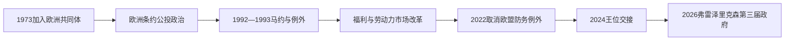

# 欧洲一体化与当代丹麦

## 时间

1973年至今

## 概括

1973年加入欧洲共同体后，丹麦在欧洲一体化、北约安全框架和北欧合作之间寻找平衡。国内政治继续以议会联盟、福利国家改革以及移民、气候和王国内部关系为重要议题。

## 历史走向

- 1973年丹麦加入欧洲经济共同体，经济和法规日益嵌入欧洲共同市场。
- 1992年《马斯特里赫特条约》首次公投未获通过；此后通过爱丁堡安排取得若干例外，并在1993年再次公投后批准条约。
- 丹麦保留本国货币，不参加欧元区；欧洲议题长期通过公投、议会妥协和政党竞争处理。
- 丹麦自1949年属于北约，冷战结束后继续参加欧洲和北大西洋安全合作。2022年公投取消欧盟共同安全与防务政策的防务例外。
- 福利国家仍以高税收、普遍公共服务和较高劳动参与率为基础，同时面对人口老龄化、劳动力、移民融合和财政可持续性等挑战。
- 法罗群岛1948年取得自治，格陵兰1979年实行地方自治、2009年扩大自治权。丹麦王国因此仍是由不同政治共同体组成的复合框架。
- 气候、能源转型和北极事务使丹麦本土政策与格陵兰、法罗群岛及国际安全更加紧密相连。

## 关键辨析

- 丹麦加入欧洲联盟，不等于整个丹麦王国的所有组成部分采用完全相同的欧洲制度安排。
- 当代丹麦是君主立宪制国家；君主承担国家象征职能，政府首脑和实际行政权属于对议会负责的内阁。
- “丹麦福利国家”是长期政治协商和制度演变的结果，不是某一时点一次建成。

## 演变关系

- 前一节点：[世界大战与丹麦福利国家形成](/%E4%BA%BA%E6%96%87%E7%A7%91%E5%AD%A6/%E5%8E%86%E5%8F%B2/%E6%AC%A7%E6%B4%B2/%E5%8C%97%E6%AC%A7/%E4%B8%B9%E9%BA%A6/%E4%B8%96%E7%95%8C%E5%A4%A7%E6%88%98%E4%B8%8E%E7%A6%8F%E5%88%A9%E5%9B%BD%E5%AE%B6%E5%BD%A2%E6%88%90.md)。
- 所属主线：[丹麦历史](/%E4%BA%BA%E6%96%87%E7%A7%91%E5%AD%A6/%E5%8E%86%E5%8F%B2/%E6%AC%A7%E6%B4%B2/%E5%8C%97%E6%AC%A7/%E4%B8%B9%E9%BA%A6/README.md)、[北欧历史](/%E4%BA%BA%E6%96%87%E7%A7%91%E5%AD%A6/%E5%8E%86%E5%8F%B2/%E6%AC%A7%E6%B4%B2/%E5%8C%97%E6%AC%A7/README.md)。

## 演进图

## 分阶段发展

1973年加入欧洲共同体扩大市场，也使农业、竞争、环境和劳动法规日益欧洲化。1970年代石油冲击和失业迫使政府在福利承诺、汇率和财政之间调整；1980年代以后“灵活保障”把较灵活的雇佣解雇、失业保险和再培训组合起来，但不同群体获得保障的能力并不相同。

1992年选民否决《马斯特里赫特条约》，议会主要政党通过“全国妥协”争取在货币、公民身份、防务和司法等领域的例外，1993年第二次公投才通过。2000年选民拒绝采用欧元。移民与难民政策、欧盟主权和福利资格成为21世纪政党竞争主轴；少数政府往往通过跨党派预算和专题协议执政。

2001年以后丹麦参加阿富汗和伊拉克战争，安全政策比冷战时期更外向。2022年俄乌战争后，选民取消欧盟防务例外；丹麦同时提高军费并继续依托北约。能源政策由北海油气收益逐渐转向海上风电、跨境电网和减排，但农业排放、产业成本与地方接受度仍引发争论。

2024年1月玛格丽特二世退位、弗雷德里克十世继位，王位交接依宪政惯例和平完成。2026年6月3日梅特·弗雷泽里克森组成第三届内阁，由社会民主党、社会主义人民党、温和党和社会自由党构成；截至2026年7月14日，她仍为政府首脑。君主是国家元首，政策责任属于首相、内阁与议会，不能将王室活动写成行政决策。

## 丹麦王国的多层政治

| 层次 | 机构与权力 | 关键辨析 |
|---|---|---|
| 丹麦本土 | 议会、首相和中央政府 | 加入欧盟并承担大部分王国外交、防务职能 |
| 法罗群岛 | 法罗议会和法罗政府 | 1948年自治；未加入欧盟，渔业和对外经贸有较大自主空间 |
| 格陵兰 | 格陵兰议会和 Naalakkersuisut | 1979年地方自治、2009年扩大自治；拥有自决与接管更多事务的制度路径 |
| 王室 | 弗雷德里克十世为共同君主 | 礼仪和宪法元首角色不等于对三地日常政策的直接控制 |
| 王国协商 | 丹麦政府与两自治政府 | 北极、防务、资源和外交涉及权限交叠，须协商而非简单上下级命令 |

## 重要事件

| 时间 | 事件 | 长期影响 |
|---|---|---|
| 1973年 | 加入欧洲共同体 | 经济和法规深度欧洲化 |
| 1979年 | 格陵兰地方自治 | 王国内部去中心化进入新阶段 |
| 1985年 | 格陵兰退出欧洲共同体 | 证明王国各部分欧洲制度地位不同 |
| 1992—1993年 | 两次马约公投 | 丹麦获得多项例外，公投成为欧洲政策核心机制 |
| 2000年 | 拒绝欧元 | 保留丹麦克朗并以汇率机制紧密联系欧元 |
| 2001—2011年 | 中右翼长期执政 | 移民、税收和国际军事行动改变政治议程 |
| 2009年 | 格陵兰扩大自治 | 格陵兰语确立并扩大接管权，承认格陵兰人民自决地位 |
| 2019年 | 弗雷泽里克森首届政府 | 气候、福利与严格移民政策并置 |
| 2022年 | 取消欧盟防务例外 | 安全政策进一步欧洲化 |
| 2024年 | 弗雷德里克十世继位 | 君主制完成世代交接 |
| 2026年6月3日 | 弗雷泽里克森第三届政府成立 | 四党广泛联盟重组议会基础 |

完整王位和政府首脑连续表见[丹麦君主与政府首脑表](/%E4%BA%BA%E6%96%87%E7%A7%91%E5%AD%A6/%E5%8E%86%E5%8F%B2/%E6%AC%A7%E6%B4%B2/%E5%8C%97%E6%AC%A7/%E4%B8%B9%E9%BA%A6/%E4%B8%B9%E9%BA%A6%E5%90%9B%E4%B8%BB%E4%B8%8E%E6%94%BF%E5%BA%9C%E9%A6%96%E8%84%91%E8%A1%A8.md)。
