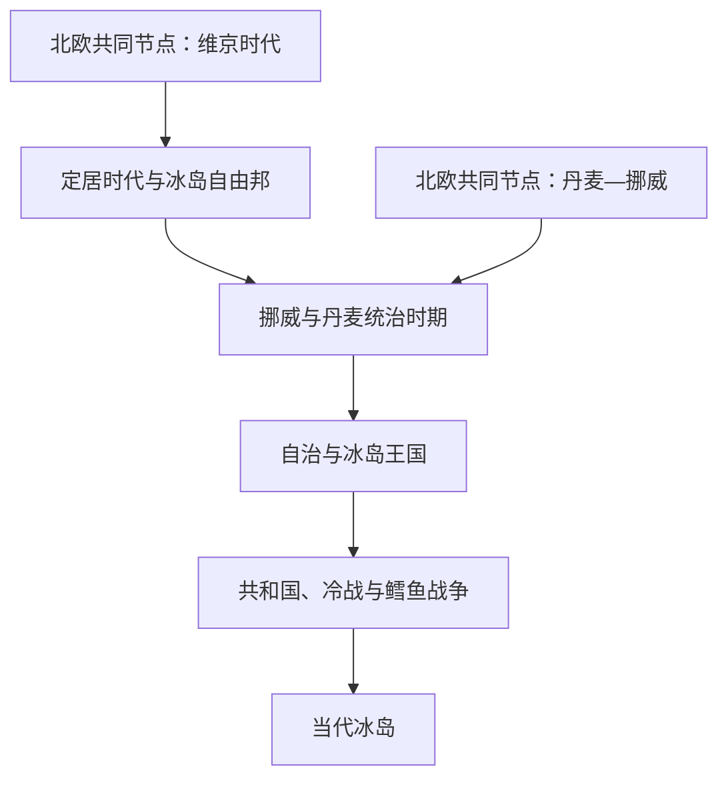

# 冰岛历史

## 概括

冰岛历史从9世纪北欧定居和无王自由邦开始，13世纪接受挪威王权，随后进入丹麦中心的联合君主体系。19—20世纪通过宪法、自治、主权王国和共和国逐步取得完整国家权力；战后渔业、北约安全、欧洲经济区和经济多元化构成主要走向。

## 历史演进图

## 历史主线

冰岛自由邦以阿尔庭、地方首领和法律共同体维持秩序，并非现代共和国的直接制度复制。接受挪威王权后，冰岛随北欧王朝联合进入丹麦统治，但本地法律文化和社会并未消失。1874—1944年的变化应理解为有限宪政、责任政府、主权王国和共和国四步推进。共和国时期的核心则从国家独立转向渔业资源、安全、福利和欧洲经济联系。

## 按时间导航

| 顺序 | 阶段 | 时间 | 历史走向 |
|---:|---|---|---|
| 1 | [定居时代与冰岛自由邦](/%E4%BA%BA%E6%96%87%E7%A7%91%E5%AD%A6/%E5%8E%86%E5%8F%B2/%E6%AC%A7%E6%B4%B2/%E5%8C%97%E6%AC%A7/%E5%86%B0%E5%B2%9B/%E5%AE%9A%E5%B1%85%E6%97%B6%E4%BB%A3%E4%B8%8E%E5%86%B0%E5%B2%9B%E8%87%AA%E7%94%B1%E9%82%A6.md) | 约870—1262／1264年 | 北欧定居、阿尔庭、基督教化和家族内争。 |
| 2 | [挪威与丹麦统治时期](/%E4%BA%BA%E6%96%87%E7%A7%91%E5%AD%A6/%E5%8E%86%E5%8F%B2/%E6%AC%A7%E6%B4%B2/%E5%8C%97%E6%AC%A7/%E5%86%B0%E5%B2%9B/%E6%8C%AA%E5%A8%81%E4%B8%8E%E4%B8%B9%E9%BA%A6%E7%BB%9F%E6%B2%BB%E6%97%B6%E6%9C%9F.md) | 1262／1264—1874年 | 接受挪威王权、丹麦中心联合、宗教改革和自治运动。 |
| 3 | [自治与冰岛王国](/%E4%BA%BA%E6%96%87%E7%A7%91%E5%AD%A6/%E5%8E%86%E5%8F%B2/%E6%AC%A7%E6%B4%B2/%E5%8C%97%E6%AC%A7/%E5%86%B0%E5%B2%9B/%E8%87%AA%E6%B2%BB%E4%B8%8E%E5%86%B0%E5%B2%9B%E7%8E%8B%E5%9B%BD.md) | 1874—1944年 | 宪法、责任政府、1918年主权王国和战时分离。 |
| 4 | [共和国、冷战与鳕鱼战争](/%E4%BA%BA%E6%96%87%E7%A7%91%E5%AD%A6/%E5%8E%86%E5%8F%B2/%E6%AC%A7%E6%B4%B2/%E5%8C%97%E6%AC%A7/%E5%86%B0%E5%B2%9B/%E5%85%B1%E5%92%8C%E5%9B%BD%E3%80%81%E5%86%B7%E6%88%98%E4%B8%8E%E9%B3%95%E9%B1%BC%E6%88%98%E4%BA%89.md) | 1944—1991年 | 共和国、北约、防务安排和渔业管辖扩张。 |
| 5 | [当代冰岛](/%E4%BA%BA%E6%96%87%E7%A7%91%E5%AD%A6/%E5%8E%86%E5%8F%B2/%E6%AC%A7%E6%B4%B2/%E5%8C%97%E6%AC%A7/%E5%86%B0%E5%B2%9B/%E5%BD%93%E4%BB%A3%E5%86%B0%E5%B2%9B.md) | 1991年至今 | 欧洲经济区、2008年危机和经济社会多元化。 |

## 北欧共同节点

| 共同主题 | 入口 | 本国阅读重点 |
|---|---|---|
| 海上迁徙 | [维京时代](/%E4%BA%BA%E6%96%87%E7%A7%91%E5%AD%A6/%E5%8E%86%E5%8F%B2/%E6%AC%A7%E6%B4%B2/%E5%8C%97%E6%AC%A7/%E7%BB%B4%E4%BA%AC%E6%97%B6%E4%BB%A3.md) | 冰岛定居及北大西洋网络。 |
| 三国联合 | [卡尔马联盟](/%E4%BA%BA%E6%96%87%E7%A7%91%E5%AD%A6/%E5%8E%86%E5%8F%B2/%E6%AC%A7%E6%B4%B2/%E5%8C%97%E6%AC%A7/%E5%8D%A1%E5%B0%94%E9%A9%AC%E8%81%94%E7%9B%9F.md) | 冰岛随挪威进入联合，而非独立成员王国。 |
| 复合君主国 | [丹麦—挪威联合王国](/%E4%BA%BA%E6%96%87%E7%A7%91%E5%AD%A6/%E5%8E%86%E5%8F%B2/%E6%AC%A7%E6%B4%B2/%E5%8C%97%E6%AC%A7/%E4%B8%B9%E9%BA%A6-%E6%8C%AA%E5%A8%81%E8%81%94%E5%90%88%E7%8E%8B%E5%9B%BD.md) | 哥本哈根统治、贸易和北大西洋领地关系。 |
| 现代国家比较 | [北欧现代国家形成](/%E4%BA%BA%E6%96%87%E7%A7%91%E5%AD%A6/%E5%8E%86%E5%8F%B2/%E6%AC%A7%E6%B4%B2/%E5%8C%97%E6%AC%A7/%E5%8C%97%E6%AC%A7%E7%8E%B0%E4%BB%A3%E5%9B%BD%E5%AE%B6%E5%BD%A2%E6%88%90.md) | 1874—1944年渐进自治与独立。 |

## 关键辨析

- 阿尔庭历史悠久，但自由邦集会、19世纪咨询机构和现代议会的权限并不相同。
- 1918年冰岛已经成为主权王国；1944年建立共和国主要终结与丹麦共戴君主的关系。
- 冰岛是没有常备军的北约成员国。
- 冰岛参加欧洲经济区但不是欧洲联盟成员国。
- “鳕鱼战争”是海上管辖争端，不是正式宣战。

## 上级

- [北欧历史](/%E4%BA%BA%E6%96%87%E7%A7%91%E5%AD%A6/%E5%8E%86%E5%8F%B2/%E6%AC%A7%E6%B4%B2/%E5%8C%97%E6%AC%A7/README.md)
