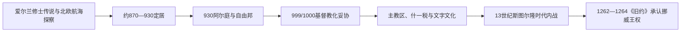

# 定居时代与冰岛自由邦

## 时间

约870年—1262／1264年

## 概括

冰岛在9世纪后期由主要来自挪威和不列颠群岛北欧殖民区的移民定居。930年前后建立的阿尔庭把各地方首领和法律共同体联结起来，形成没有国王和常备行政机构的冰岛自由邦；13世纪内争最终使其接受挪威王权。

## 历史走向

- 约870年以后，北欧移民携家属、依附人口和牲畜抵达冰岛；部分定居者也来自爱尔兰、苏格兰及北大西洋既有维京网络。
- 定居社会以农庄、地方首领和区域集会为基础。土地分配、亲属关系和法律声望决定政治影响。
- 930年前后阿尔庭建立，法律宣讲者和各地首领在年度集会上处理共同法律与争端。它是跨地区议事和司法框架，不是现代议会制国家。
- 1000年前后，阿尔庭以政治妥协方式接受基督教，同时允许部分旧习在过渡期继续存在。
- 口述传统、诗歌与家族记忆在12—13世纪被写成萨迦和历史著作，成为理解北欧世界的重要材料，但其文学叙事不等同于同时代记录。
- 13世纪“斯图尔伦时代”中主要家族争斗加剧，挪威国王介入。1262—1264年各地先后接受挪威王权，自由邦终结。

## 统治结构

| 层次 | 主要作用 |
|---|---|
| 农庄与亲属网络 | 生产、保护和社会身份的基础 |
| 地方首领 | 组织追随者、主持地方集会并参与阿尔庭 |
| 阿尔庭 | 制定和宣讲共同法律、解决重大争端 |
| 教会 | 基督教化后逐渐形成教区、什一税和书写文化 |

## 与北欧共同主线的关系

冰岛定居属于[维京时代](/%E4%BA%BA%E6%96%87%E7%A7%91%E5%AD%A6/%E5%8E%86%E5%8F%B2/%E6%AC%A7%E6%B4%B2/%E5%8C%97%E6%AC%A7/%E7%BB%B4%E4%BA%AC%E6%97%B6%E4%BB%A3.md)的北大西洋方向；本页聚焦定居社会和自由邦制度，不重复整个维京世界的扩张史。

## 演变关系

- 前一节点：[史前北欧](/%E4%BA%BA%E6%96%87%E7%A7%91%E5%AD%A6/%E5%8E%86%E5%8F%B2/%E6%AC%A7%E6%B4%B2/%E5%8C%97%E6%AC%A7/%E5%8F%B2%E5%89%8D%E5%8C%97%E6%AC%A7.md)。
- 后一节点：[挪威与丹麦统治时期的冰岛](/%E4%BA%BA%E6%96%87%E7%A7%91%E5%AD%A6/%E5%8E%86%E5%8F%B2/%E6%AC%A7%E6%B4%B2/%E5%8C%97%E6%AC%A7/%E5%86%B0%E5%B2%9B/%E6%8C%AA%E5%A8%81%E4%B8%8E%E4%B8%B9%E9%BA%A6%E7%BB%9F%E6%B2%BB%E6%97%B6%E6%9C%9F.md)。

## 演进图

## 定居和制度形成

约9世纪后期，来自挪威及不列颠群岛的北欧移民、凯尔特来源的自由人和被奴役者抵达冰岛。传统《定居书》把英戈尔夫·阿纳尔松视为首位永久定居者，但定居是数十年、多路径过程。土地占有、牲畜、家族网络和北大西洋航线共同塑造新社会；人口并非族源单一，早期奴役和性别权力不应被“自由农民共和国”叙事遮蔽。

930年传统上视为阿尔庭创立年。自由邦没有国王、中央税务或常备行政，地方酋长职位把宗教、诉讼和追随网络结合。自由农户通过地方庭和阿尔庭参与司法，法律宣讲人负责记忆、宣告和程序，却不能执行判决；执行依赖当事家族与盟友，强者可能利用诉讼和私斗积累权力。

999/1000年围绕基督教的冲突由法律宣讲人索尔盖尔提出妥协：公共法律改奉基督教，部分旧习短期私下容许。随后什一税、斯考尔霍特与霍拉尔主教区、修道院和拉丁文字改变财产与权威。12—13世纪萨迦、法律和谱系写作发展，但成文文本多晚于所述事件，须与考古交叉理解。

## 内战与自由邦终结

教产、酋长职位和挪威贸易日益集中于少数家族。13世纪斯图尔隆时代，各家族借挪威国王支持、婚姻和武装随从争权；私战规模超出传统调停能力。挪威王哈康四世及马格努斯六世利用贸易、教会与封臣关系促使各地区于1262—1264年分批接受《旧约》。冰岛人承认纳税和王权，以换取和平、法律及航运保证。自由邦的灭亡是权力集中、暴力和外部王权共同作用，不是一次军事征服。

## 重要事件

| 时间 | 事件 | 意义 |
|---|---|---|
| 约870—930年 | 大规模定居 | 北欧与凯尔特来源人口形成岛上社会 |
| 930年 | 阿尔庭建立传统 | 全国法律与司法协商中心形成 |
| 965年左右 | 四分区制度 | 地方庭和全国程序进一步组织化 |
| 999/1000年 | 基督教化决定 | 以法律妥协避免宗教内战 |
| 1056、1106年 | 两主教区建立 | 教会行政和教育制度化 |
| 1097年 | 什一税 | 教会、地主和酋长获得稳定收入 |
| 1117—1118年 | 法律首次系统写下 | 口传法律向成文转变 |
| 1220—1262年 | 斯图尔隆时代 | 家族战争和挪威介入扩大 |
| 1262—1264年 | 《旧约》 | 各地区承认挪威国王，自由邦终结 |

自由邦无君主的角色区分见[冰岛国家元首与政府首脑表](/%E4%BA%BA%E6%96%87%E7%A7%91%E5%AD%A6/%E5%8E%86%E5%8F%B2/%E6%AC%A7%E6%B4%B2/%E5%8C%97%E6%AC%A7/%E5%86%B0%E5%B2%9B/%E5%86%B0%E5%B2%9B%E5%9B%BD%E5%AE%B6%E5%85%83%E9%A6%96%E4%B8%8E%E6%94%BF%E5%BA%9C%E9%A6%96%E8%84%91%E8%A1%A8.md)。
