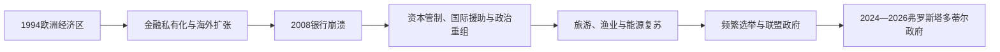

# 当代冰岛

## 时间

1991年至今

## 概括

当代冰岛通过欧洲经济区参与欧洲内部市场，但不是欧洲联盟成员国。渔业、可再生能源、旅游业和金融业先后影响经济结构；2008年银行危机成为制度与社会的重要转折。

## 历史走向

- 1994年欧洲经济区框架生效，冰岛与挪威等国在不加入欧洲联盟的情况下参与单一市场，并采纳大量相关规则。
- 渔业配额制度和海洋资源管理继续影响地区、企业与社会分配；渔业仍重要，但经济逐渐多元化。
- 地热和水电提供大量国内能源，支持居民供暖和高耗能产业，也引发环境保护与开发规模争论。
- 1990年代至2000年代金融业快速扩张。2008年国际金融危机导致主要银行体系崩溃、货币贬值和大规模社会抗议。
- 危机后实行资本管制、银行重组与财政调整，旅游业迅速增长，经济结构再次变化。
- 冰岛曾于2009年申请加入欧洲联盟，谈判后来暂停，申请未转化为成员身份。
- 冰岛继续作为北约成员参与安全合作；北极航道、海洋治理和北大西洋基础设施提升其战略重要性。
- 人口增长、住房、旅游承载力、火山风险、气候变化和语言文化维护构成当代治理议题。

## 关键辨析

- 冰岛属于欧洲经济区和申根合作，但不是欧洲联盟成员。
- 可再生电力占比较高不意味着交通、渔业和整体经济已经完全脱碳。
- 2008年危机不是冰岛共和国的起点，而是当代经济制度的一次重大重组。

## 演变关系

- 前一节点：[冰岛共和国、冷战与鳕鱼战争](/%E4%BA%BA%E6%96%87%E7%A7%91%E5%AD%A6/%E5%8E%86%E5%8F%B2/%E6%AC%A7%E6%B4%B2/%E5%8C%97%E6%AC%A7/%E5%86%B0%E5%B2%9B/%E5%85%B1%E5%92%8C%E5%9B%BD%E3%80%81%E5%86%B7%E6%88%98%E4%B8%8E%E9%B3%95%E9%B1%BC%E6%88%98%E4%BA%89.md)。
- 所属主线：[冰岛历史](/%E4%BA%BA%E6%96%87%E7%A7%91%E5%AD%A6/%E5%8E%86%E5%8F%B2/%E6%AC%A7%E6%B4%B2/%E5%8C%97%E6%AC%A7/%E5%86%B0%E5%B2%9B/README.md)、[北欧历史](/%E4%BA%BA%E6%96%87%E7%A7%91%E5%AD%A6/%E5%8E%86%E5%8F%B2/%E6%AC%A7%E6%B4%B2/%E5%8C%97%E6%AC%A7/README.md)。

## 演进图

## 金融危机与恢复

1990年代后市场自由化、银行私有化和欧洲资本流动支持冰岛银行迅速在海外扩张，其资产规模远超国家财政承受能力。2008年全球流动性枯竭，三大银行倒闭，克朗暴跌，政府实施资本管制并接受国际货币基金组织方案。居民债务、失业和物价上升引发“厨具革命”，哈尔德政府辞职。

国家将国内支付和存款业务置于新银行，旧银行进入清算；与英国、荷兰围绕Icesave存款赔付的协议两次被总统拒签并在公投中否决，最终由欧洲自由贸易联盟法院判决处理关键责任。特别检察、议会调查和前总理审判体现问责，但对危机责任的社会评价仍分歧。旅游增长、渔业、地热与水电、汇率调整促进复苏，住房、环境承载和收入分配成为新问题。

## 当代政治与社会

冰岛通过欧洲经济区和申根参与欧洲一体化，2009年申请加入欧盟，谈判后停滞；渔业管辖、主权与欧元问题是主要分歧。2016年“巴拿马文件”引发总理辞职和提前选举，之后多党联盟频繁。2017—2024年卡特琳·雅各布斯多蒂尔领导跨左右联盟，疫情、火山活动和生活成本成为治理重点。

雷克雅内斯半岛自2021年起火山活动反复，格林达维克疏散和基础设施防护显示自然灾害、能源和住房政策交织。2024年总统选举由哈德拉·托马斯多蒂尔胜出；同年议会选举后，克里斯特伦·弗罗斯塔多蒂尔于12月21日出任总理。截至2026年7月14日，两人分别为国家元首和政府首脑。

## 当代事件与权力结构

| 时间 | 事件 | 影响 |
|---|---|---|
| 2006年 | 美军常驻凯夫拉维克结束 | 防务改由轮换合作、北约安排与海岸警卫队配合 |
| 2008年 | 银行体系崩溃 | 深度衰退、资本管制和政治问责 |
| 2009—2015年 | 欧盟申请与谈判停滞 | 欧洲路线继续依托欧洲经济区 |
| 2010、2011年 | Icesave公投 | 总统拒签权和直接民主受到关注 |
| 2016年 | 离岸文件危机 | 总理辞职、政党体系碎片化 |
| 2017—2024年 | 雅各布斯多蒂尔政府 | 跨左右联盟维持较长稳定 |
| 2021年以后 | 雷克雅内斯火山活动 | 疏散、基础设施和旅游治理受考验 |
| 2024年8月 | 哈德拉·托马斯多蒂尔就任总统 | 第二位女性总统 |
| 2024年12月 | 弗罗斯塔多蒂尔就任总理 | 社会民主联盟领导新政府 |

| 角色 | 截至2026年7月14日 | 实际职能 |
|---|---|---|
| 国家元首 | 总统哈德拉·托马斯多蒂尔 | 宪法、礼仪及在特定情况下交付公投 |
| 政府首脑 | 总理克里斯特伦·弗罗斯塔多蒂尔 | 领导内阁、协调政策并对阿尔庭负责 |
| 议会 | 阿尔庭 | 立法、预算和政府信任 |
| 防务 | 政府、海岸警卫队和北约合作 | 无常备军，不存在本国军方最高行政首脑 |

总统和总理连续表见[冰岛国家元首与政府首脑表](/%E4%BA%BA%E6%96%87%E7%A7%91%E5%AD%A6/%E5%8E%86%E5%8F%B2/%E6%AC%A7%E6%B4%B2/%E5%8C%97%E6%AC%A7/%E5%86%B0%E5%B2%9B/%E5%86%B0%E5%B2%9B%E5%9B%BD%E5%AE%B6%E5%85%83%E9%A6%96%E4%B8%8E%E6%94%BF%E5%BA%9C%E9%A6%96%E8%84%91%E8%A1%A8.md)。
