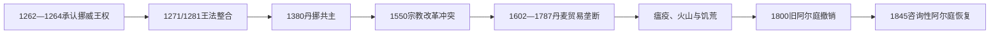

# 挪威与丹麦统治时期的冰岛

## 时间

1262／1264年—1874年

## 概括

冰岛接受挪威王权后进入北欧联合君主体系，1380年后随挪威与丹麦共戴君主，近世进一步由哥本哈根管理。宗教改革、贸易垄断、自然灾害和行政变化深刻影响社会；19世纪民族与自治运动则为宪政转型创造条件。

## 历史走向

- 接受挪威王权后，冰岛保留本地法律和阿尔庭，但贡赋、官员任命和对外关系纳入君主统治。
- 1380年丹麦与挪威共戴君主，1397年进入卡尔马联盟；1523年瑞典退出并未改变冰岛继续留在丹麦—挪威体系的事实。
- 16世纪宗教改革引发冲突，1550年最后一位天主教主教被处决后，路德宗和丹麦王权控制确立。
- 1602年以后丹麦实施贸易垄断，冰岛对外贸易受指定商港和商人控制；垄断在18世纪末逐步废除。
- 17—18世纪寒冷气候、牲畜疫病和火山活动加剧社会脆弱性。1783—1784年拉基火山喷发造成严重饥荒与人口损失。
- 1800年旧阿尔庭被取消，1845年以咨询机构形式恢复，成为民族文化复兴和自治政治的平台。
- 1814年丹麦失去挪威时，冰岛、法罗群岛和格陵兰仍由丹麦王权统治。
- 19世纪约恩·西于尔兹松等人推动民族权利和自治。1874年丹麦国王授予冰岛宪法和有限立法权。

## 关键辨析

- 冰岛先接受挪威王权，后因王朝联合进入丹麦中心的政治体系，并非在某一天被现代丹麦国家直接“吞并”。
- 阿尔庭在自由邦、中断前和19世纪恢复后的权力不同，不能视为制度完全不变。
- 冰岛历史与丹麦—挪威密切相关，但其本地社会、法律和文化发展具有连续性。

## 与北欧共同主线的关系

联合政治背景见[卡尔马联盟](/%E4%BA%BA%E6%96%87%E7%A7%91%E5%AD%A6/%E5%8E%86%E5%8F%B2/%E6%AC%A7%E6%B4%B2/%E5%8C%97%E6%AC%A7/%E5%8D%A1%E5%B0%94%E9%A9%AC%E8%81%94%E7%9B%9F.md)和[丹麦—挪威联合王国](/%E4%BA%BA%E6%96%87%E7%A7%91%E5%AD%A6/%E5%8E%86%E5%8F%B2/%E6%AC%A7%E6%B4%B2/%E5%8C%97%E6%AC%A7/%E4%B8%B9%E9%BA%A6-%E6%8C%AA%E5%A8%81%E8%81%94%E5%90%88%E7%8E%8B%E5%9B%BD.md)。

## 演变关系

- 前一节点：[定居时代与冰岛自由邦](/%E4%BA%BA%E6%96%87%E7%A7%91%E5%AD%A6/%E5%8E%86%E5%8F%B2/%E6%AC%A7%E6%B4%B2/%E5%8C%97%E6%AC%A7/%E5%86%B0%E5%B2%9B/%E5%AE%9A%E5%B1%85%E6%97%B6%E4%BB%A3%E4%B8%8E%E5%86%B0%E5%B2%9B%E8%87%AA%E7%94%B1%E9%82%A6.md)。
- 后一节点：[自治与冰岛王国](/%E4%BA%BA%E6%96%87%E7%A7%91%E5%AD%A6/%E5%8E%86%E5%8F%B2/%E6%AC%A7%E6%B4%B2/%E5%8C%97%E6%AC%A7/%E5%86%B0%E5%B2%9B/%E8%87%AA%E6%B2%BB%E4%B8%8E%E5%86%B0%E5%B2%9B%E7%8E%8B%E5%9B%BD.md)。

## 演进图

## 王权与地方社会的变化

承认挪威王权后，国王任命官员、征税并把挪威法典引入冰岛，地方酋长体制逐渐消失。阿尔庭继续作为法院和法律会议，主教、地主和王室官员共同治理。14世纪黑死病虽较晚到达冰岛，1402—1404年和1494—1495年瘟疫仍造成重大死亡；1380年挪威与丹麦共主后，冰岛行政和贸易逐渐以哥本哈根为中心。

宗教改革在冰岛比丹麦本土更具武力冲突。斯考尔霍特主教厄格蒙迪尔被捕，霍拉尔主教约恩·阿拉松抵抗路德宗改革，1550年与两子被处决。王室没收教产并控制主教任命，丹麦语行政影响增强；冰岛语圣经和路德宗读写又帮助本地语言延续。

1602年贸易垄断把指定冰岛港口交给特许丹麦商人，限制直接与英格兰、荷兰和德意志商人交易。垄断确保王室控制，却造成价格、供给和运输僵化；1787年放宽为丹麦臣民自由贸易，1855年才向各国开放。人口还承受海冰、天花、牲畜疫病和火山灾害。1783—1784年拉基喷发导致氟污染、牲畜死亡和饥荒，约五分之一人口死亡。

1800年旧阿尔庭被撤，最高法院设于雷克雅未克。拿破仑战争隔绝丹麦联系，冒险者约恩·约根森1809年曾短暂夺权，英国迅速结束其统治；这并非冰岛正式独立。19世纪民族运动以语言、历史和宪政为基础，1845年恢复咨询性阿尔庭，为自治政治重建舞台。

## 重要事件

| 时间 | 事件 | 影响 |
|---|---|---|
| 1271、1281年 | 王法引入 | 冰岛法律纳入挪威王国体系 |
| 1380年 | 丹挪共主 | 行政重心逐渐转向丹麦 |
| 1402—1404年 | 瘟疫 | 人口、土地和教会结构重创 |
| 1550年 | 约恩·阿拉松被处决 | 天主教政治抵抗终结，路德宗改革完成 |
| 1602年 | 贸易垄断 | 王室控制商贸，地方对价格和供给不满 |
| 1662年 | 承认绝对君主制 | 丹麦王权制度扩展到冰岛 |
| 1707—1709年 | 天花流行 | 高死亡率加剧人口危机 |
| 1783—1784年 | 拉基灾难 | 牲畜、粮食和人口遭严重损失 |
| 1787、1855年 | 贸易逐步自由化 | 垄断先向丹麦臣民、后向国际商人开放 |
| 1800年 | 旧阿尔庭撤销 | 司法行政重组 |
| 1845年 | 阿尔庭恢复 | 民族自治运动获得代表机构 |

君主、官员与自由邦职位的区别见[冰岛国家元首与政府首脑表](/%E4%BA%BA%E6%96%87%E7%A7%91%E5%AD%A6/%E5%8E%86%E5%8F%B2/%E6%AC%A7%E6%B4%B2/%E5%8C%97%E6%AC%A7/%E5%86%B0%E5%B2%9B/%E5%86%B0%E5%B2%9B%E5%9B%BD%E5%AE%B6%E5%85%83%E9%A6%96%E4%B8%8E%E6%94%BF%E5%BA%9C%E9%A6%96%E8%84%91%E8%A1%A8.md)。
