# 冰岛自治与冰岛王国

## 时间

1874年—1944年

## 概括

1874年宪法开启有限自治，1904年本地责任政府建立，1918年冰岛成为与丹麦共戴君主的主权王国。第二次世界大战切断同被占领丹麦的联系，最终推动1944年共和国成立。

## 历史走向

- 1874年宪法给予阿尔庭有限立法和财政权限，但行政权仍主要由丹麦政府掌握。
- 1904年地方自治扩大，冰岛事务大臣常驻雷克雅未克并向阿尔庭负责，责任政府由此形成。
- 教育、渔业、港口和城市化发展使雷克雅未克成为政治经济中心，现代政党和社会组织逐步出现。
- 1918年《丹麦—冰岛联合协定》承认冰岛为主权国家“冰岛王国”，与丹麦共戴君主；丹麦在协定下代办部分外交事务。
- 1940年德国占领丹麦后，冰岛宣布自行处理外交与国家事务。英国军队进入冰岛，1941年防务责任转交美国。
- 战时地缘位置、基础设施和经济迅速变化，也使冰岛与丹麦的实际政治联系中断。
- 1944年公投决定终止君主联合并建立共和国，冰岛共和国于6月成立。

## 统治结构

| 阶段 | 国家地位 | 实际行政 |
|---|---|---|
| 1874—1904年 | 丹麦王权下有限宪政 | 丹麦政府主导，阿尔庭有有限立法财政权 |
| 1904—1918年 | 扩大自治 | 本地部长和内阁向阿尔庭负责 |
| 1918—1944年 | 主权王国，与丹麦共戴君主 | 冰岛管理内政，丹麦代办部分外交至1940年 |
| 1940—1944年 | 战时自行行使国家权力 | 冰岛政府与摄政机构运作 |

## 演变关系

- 前一节点：[挪威与丹麦统治时期的冰岛](/%E4%BA%BA%E6%96%87%E7%A7%91%E5%AD%A6/%E5%8E%86%E5%8F%B2/%E6%AC%A7%E6%B4%B2/%E5%8C%97%E6%AC%A7/%E5%86%B0%E5%B2%9B/%E6%8C%AA%E5%A8%81%E4%B8%8E%E4%B8%B9%E9%BA%A6%E7%BB%9F%E6%B2%BB%E6%97%B6%E6%9C%9F.md)。
- 后一节点：[共和国、冷战与鳕鱼战争](/%E4%BA%BA%E6%96%87%E7%A7%91%E5%AD%A6/%E5%8E%86%E5%8F%B2/%E6%AC%A7%E6%B4%B2/%E5%8C%97%E6%AC%A7/%E5%86%B0%E5%B2%9B/%E5%85%B1%E5%92%8C%E5%9B%BD%E3%80%81%E5%86%B7%E6%88%98%E4%B8%8E%E9%B3%95%E9%B1%BC%E6%88%98%E4%BA%89.md)。
- 北欧比较：[北欧现代国家形成](/%E4%BA%BA%E6%96%87%E7%A7%91%E5%AD%A6/%E5%8E%86%E5%8F%B2/%E6%AC%A7%E6%B4%B2/%E5%8C%97%E6%AC%A7/%E5%8C%97%E6%AC%A7%E7%8E%B0%E4%BB%A3%E5%9B%BD%E5%AE%B6%E5%BD%A2%E6%88%90.md)。

## 演进图

```mermaid
flowchart LR
    Althing["1845阿尔庭恢复"] --> Constitution["1874宪法与有限自治"]
    Constitution --> HomeRule["1904本土责任政府"]
    HomeRule --> Flag["1915内阁与本国旗帜"]
    Flag --> UnionAct["1918《联合邦法》"]
    UnionAct --> Sovereign["冰岛主权王国"]
    Sovereign --> Occupation["1940丹麦被占、盟军进驻"]
    Occupation --> Regent["1941摄政"]
    Regent --> Republic["1944共和国"]
```

## 自治扩展的具体过程

约恩·西于尔兹松等民族自由派以冰岛语文化、古代法律和人民主权争取自治，反对把冰岛简单纳入丹麦宪制。1874年丹麦国王授予冰岛宪法，阿尔庭取得部分立法和财政权，但负责冰岛事务的大臣仍在哥本哈根且不向阿尔庭负责。1904年本土自治使冰岛大臣迁至雷克雅未克并对议会负责，汉内斯·哈夫斯泰因成为首任本地行政首脑。

1915年宪改扩大选举权并允许多大臣内阁，冰岛本国旗帜获得承认。第一次世界大战的供应危机和丹麦在外交上的有限能力加强主权要求。1918年《联合邦法》承认冰岛为主权国家，与丹麦仅共戴克里斯蒂安十世，并由丹麦在约定下代办部分外交；两国可在25年后重新审议关系。冰岛不是1920年代才“自治的丹麦省”，而是国际法上的王国。

## 战争、摄政与共和国

1940年德国占领丹麦后，冰岛政府自行承担外交与海岸管理。英国担心德国利用岛屿，于5月在未获事先同意下登陆；1941年美国在尚未参战时接管防务。驻军促进道路、机场、工资和城市化，也带来主权、社会关系和环境问题。冰岛宪法政府持续运作，盟军指挥官不是政府首脑。

阿尔庭1941年认定国王无法履职，选斯温·比约恩松为摄政。联合邦法25年期限在战争中届满，1944年公投支持终止联合和建立共和国；6月17日共和国成立。丹麦仍处占领，程序引起部分丹麦方面不满，但新国家很快获承认。

## 重要事件

| 时间 | 事件 | 结果 |
|---|---|---|
| 1845年 | 咨询性阿尔庭复会 | 自治政治与公共辩论恢复 |
| 1874年 | 宪法 | 取得有限立法财政权 |
| 1904年 | 本土自治 | 大臣驻雷克雅未克并向阿尔庭负责 |
| 1915年 | 宪改和旗帜 | 选举权、内阁与国家象征扩展 |
| 1918年12月1日 | 《联合邦法》生效 | 冰岛成为主权王国，与丹麦个人联合 |
| 1920年 | 王国宪法 | 议会君主制制度化 |
| 1940年4月 | 丹麦被占 | 冰岛政府接管外交 |
| 1940年5月 | 英军进驻 | 战略占领与经济社会转型 |
| 1941年 | 美国接防、选举摄政 | 国王职权由本国摄政代行 |
| 1944年 | 公投和共和国 | 个人联合终止 |

王国唯一君主、摄政和政府首脑见[冰岛国家元首与政府首脑表](/%E4%BA%BA%E6%96%87%E7%A7%91%E5%AD%A6/%E5%8E%86%E5%8F%B2/%E6%AC%A7%E6%B4%B2/%E5%8C%97%E6%AC%A7/%E5%86%B0%E5%B2%9B/%E5%86%B0%E5%B2%9B%E5%9B%BD%E5%AE%B6%E5%85%83%E9%A6%96%E4%B8%8E%E6%94%BF%E5%BA%9C%E9%A6%96%E8%84%91%E8%A1%A8.md)。
