# 北欧现代国家形成

[返回北欧历史总览](/%E4%BA%BA%E6%96%87%E7%A7%91%E5%AD%A6/%E5%8E%86%E5%8F%B2/%E6%AC%A7%E6%B4%B2/%E5%8C%97%E6%AC%A7/README.md)

## 时间

19世纪初—2026年7月14日

## 概括

北欧现代国家形成不是一条共同的“民族觉醒”直线，而是拿破仑战争后的领土重组、宪政与议会化、联合解体、独立战争或和平谈判、工业化、社会运动和福利制度共同作用的结果。丹麦、挪威、瑞典保留议会制君主国，芬兰和冰岛建立共和国；五国均为议会民主国家，但加入欧洲联盟、欧元区和北约的路径不同。

本篇比较国家形成和跨国制度，不列现任国家元首或政府首脑；具体人物与内阁更替留在五国专页。

## 建立背景

- [丹麦-挪威联合王国](/%E4%BA%BA%E6%96%87%E7%A7%91%E5%AD%A6/%E5%8E%86%E5%8F%B2/%E6%AC%A7%E6%B4%B2/%E5%8C%97%E6%AC%A7/%E4%B8%B9%E9%BA%A6-%E6%8C%AA%E5%A8%81%E8%81%94%E5%90%88%E7%8E%8B%E5%9B%BD.md)在1814年解体，挪威以宪法和短暂战争争取在瑞典联合内保留本国议会与法律。
- [瑞典帝国](/%E4%BA%BA%E6%96%87%E7%A7%91%E5%AD%A6/%E5%8E%86%E5%8F%B2/%E6%AC%A7%E6%B4%B2/%E5%8C%97%E6%AC%A7/%E7%91%9E%E5%85%B8%E5%B8%9D%E5%9B%BD.md)失去波罗的海霸权后，1809年又把芬兰割让给俄罗斯；瑞典宪制重组，芬兰则以大公国形式获得独特行政地位。
- 法国革命、浪漫主义与语言文化运动提供民族政治语言，但农民、城市资产阶级、劳工、妇女运动、王室和官僚的利益并不相同。
- 工业化、跨大西洋移民、教育普及和大众政党扩展政治参与，为普选、议会责任和社会保障创造条件。
- 萨米人的传统区域萨米横跨今日挪威、瑞典、芬兰和俄罗斯边界；现代国界和同化政策同时制造了新的政治共同体与少数族群问题。

## 五国形成路径

| 国家 | 19世纪国家重组 | 主权 / 政体关键点 | 20—21世纪制度路径 |
|---|---|---|---|
| 丹麦 | 1814年失去挪威；1849年宪法终止绝对君主制；1864年战败后失去石勒苏益格、荷尔斯泰因和劳恩堡 | 1901年确立议会责任惯例；1915年扩大包括妇女在内的选举权；1920年北石勒苏经公投并入 | 1940—1945年被德国占领；1949年加入北约；1973年加入欧洲共同体，保留本国货币和欧元选择退出 |
| 挪威 | 1814年制定宪法后与瑞典建立个人联合，保留议会、政府和法律；1884年议会制突破 | 1905年通过谈判和公投结束瑞挪联合，选立本国国王；1913年妇女普选 | 1940—1945年被德国占领；1949年加入北约；石油时代改变财政；两次公投未加入欧洲共同体 / 欧盟，1994年起经欧洲经济区参与内部市场 |
| 瑞典 | 1809年失去芬兰并制定新宪制；1814年与挪威联合；1866年以两院议会取代四等级议会 | 1905年和平结束瑞挪联合；1919—1921年议会制和普选制度定型 | 两次世界大战保持非交战立场但政策并非完全等距；20世纪建设福利国家；1995年加入欧盟、保留克朗；2024年加入北约 |
| 芬兰 | 1809年成为俄罗斯帝国自治大公国，保留并发展本地行政、法律和教会；19世纪末俄化政策激化对抗 | 1906年建立一院制议会并实行普选；1917年独立，1918年内战，1919年确立共和国 | 1939—1945年经历冬季战争、继续战争和拉普兰战争；战后在苏联压力下维持民主与谨慎外交；1995年加入欧盟，1999年进入欧元区，2023年加入北约 |
| 冰岛 | 1874年获本地宪法，1904年实现本土自治政府 | 1918年成为与丹麦共戴君主的主权王国；1944年经公投建立共和国 | 1949年加入北约但不设常备军；渔业管辖权争端强化经济主权；1970年加入欧洲自由贸易联盟，1994年起参加欧洲经济区 |

## 分阶段过程

### 拿破仑战争后的领土与宪制重组（1809—1864）

1809年瑞典把芬兰割让给俄罗斯，同时推翻古斯塔夫四世并制定新宪制；1814年丹麦在《基尔条约》中放弃挪威。挪威制宪会议宣布主权、制定《五月十七日宪法》，瑞典短期出兵后以《莫斯协定》接受挪威保留宪法的联合方案。这个阶段形成“同一君主、不同国家机关”的瑞挪联合，也形成俄罗斯皇帝兼任芬兰大公的自治安排。

1849年丹麦由绝对君主制转为宪政。围绕丹麦王国与石勒苏益格、荷尔斯泰因公国关系的民族和国际争议引发两次战争；1864年丹麦败于普鲁士、奥地利，失去公国，国家版图与政治认同被深刻重塑。

### 议会化、普选与联合解体（1864—1919）

工业化和城市化催生自由派、农民组织、工会、社会民主党和妇女运动。挪威1884年迫使国王接受由议会多数支持的政府；丹麦1901年形成类似惯例。瑞挪围绕外交代表和领事机构冲突，1905年经挪威议会决议、公投和卡尔斯塔德谈判和平解体。

芬兰1906年改革为一院制议会并实行普选，女性同时获得投票和参选权。俄国革命和帝国瓦解使芬兰1917年独立，但1918年红白内战造成严重伤亡与长期社会裂痕。冰岛则通过谈判逐步从自治走向1918年主权王国。

### 战争、民主巩固与福利国家（1919—1970年代）

一战后五国普选议会制度逐渐稳定，但二战经历不同：丹麦、挪威1940年遭德国占领；冰岛先由英国、后由美国驻军；芬兰与苏联进行冬季战争、继续战争，随后驱逐德军；瑞典保持非交战，却向交战方作出通行、贸易和人道援助等不同安排。

战间期和战后，劳资谈判、农业政党、社会民主主义、税收和地方自治共同推动养老、医疗、教育、失业保障与家庭政策。所谓“北欧模式”不是一套同时完成的制度，而是各国在市场经济、强工会、议会妥协和普遍社会保障之间形成的相近组合。

### 区域合作、欧洲一体化与安全转向（1952—2026）

1952年丹麦、冰岛、挪威和瑞典建立北欧理事会，芬兰1955年加入；共同劳动力市场、护照便利和1962年《赫尔辛基条约》使区域合作制度化。经济一体化却分流：丹麦加入欧洲共同体，芬兰和瑞典后来加入欧盟，挪威和冰岛通过欧洲自由贸易联盟及欧洲经济区参与单一市场。

安全政策也长期分流。丹麦、冰岛、挪威1949年成为北约创始成员，瑞典坚持军事不结盟，芬兰在战后对苏关系与西方合作间谨慎平衡。俄罗斯2022年全面入侵乌克兰后，芬兰于2023年4月4日、瑞典于2024年3月7日加入北约；截至2026年7月13日，北欧五国均为北约成员。

## 重要事件

| 时间 | 事件 | 结果与长期影响 |
|---|---|---|
| 1809年 | 瑞典割让芬兰、瑞典宪制危机 | 芬兰大公国形成，瑞典转向内部重组 |
| 1814年 | 《基尔条约》、挪威宪法与瑞挪联合 | 挪威离开丹麦体系，在联合中保留独立国家机关 |
| 1849年 | 丹麦宪法 | 绝对君主制结束，宪政国家形成 |
| 1864年 | 丹麦在第二次石勒苏益格战争战败 | 失去公国，丹麦国家范围和安全战略收缩 |
| 1874—1904年 | 冰岛宪法与自治政府 | 从丹麦直接治理走向本土政治责任 |
| 1884年 | 挪威议会制突破 | 政府须得到议会支持的原则确立 |
| 1905年 | 瑞挪联合和平解体 | 挪威成为完全独立国家，瑞典接受边界与王位分离 |
| 1906年 | 芬兰议会与普选改革 | 建立一院制议会，女性获得投票和参选权 |
| 1917—1919年 | 芬兰独立、内战和共和国建立 | 帝国边疆转为主权国家，内战影响长期政治和解 |
| 1918年 | 冰岛成为主权王国 | 与丹麦仅保留共同君主及约定事务 |
| 1920年 | 北石勒苏公投 | 部分原公国领土经表决回到丹麦 |
| 1939—1945年 | 芬兰连续战争 | 保住独立民主制度，但割地、赔偿并调整对苏外交 |
| 1940—1945年 | 丹麦、挪威被占领，冰岛被盟军驻防 | 战后安全政策由传统中立转向跨大西洋合作 |
| 1944年 | 冰岛共和国成立 | 与丹麦共同君主关系终结 |
| 1949年 | 丹麦、冰岛、挪威加入北约 | 三个北大西洋国家进入集体防务体系 |
| 1952—1962年 | 北欧理事会及区域制度形成 | 劳动力流动、旅行便利和议会合作深化 |
| 1973年 | 丹麦加入欧洲共同体 | 北欧欧洲一体化路径开始明显分流 |
| 1994—1995年 | 欧洲经济区实施，芬兰、瑞典加入欧盟 | 挪威、冰岛参与内部市场但不入欧盟；芬兰、瑞典成为成员国 |
| 2023年 | 芬兰加入北约 | 芬兰军事不结盟政策终结 |
| 2024年 | 瑞典加入北约 | 北欧五国首次全部处于同一集体防务组织 |

## 国家形成的共同机制

- **宪法与议会责任**：从国王授予或危机立宪逐步转向政府依赖议会多数，司法与行政同时专业化。
- **大众政治**：农民组织、工会、社会民主党、自由派和妇女运动扩大选举权，使国家合法性从王朝和等级转向公民。
- **地方自治与教育**：市镇、教区学校、识字和本国语言公共领域把福利、税收和政治参与落到地方。
- **妥协型制度**：劳资集中谈判、议会联盟和普遍福利减少阶级冲突，但并未消除财富、性别和地区差距。
- **外部危机**：战争、帝国解体和大国压力经常直接触发边界变化；小国的自主性始终受北海、波罗的海和北极战略环境影响。

## 内部差异与未完成问题

### 欧洲与货币制度

截至2026年7月13日，丹麦、瑞典、芬兰是欧盟成员；挪威、冰岛不是欧盟成员，但通过欧洲经济区参与内部市场。芬兰使用欧元；丹麦保留欧元选择退出并使用丹麦克朗，瑞典仍使用瑞典克朗。欧洲制度参与方式不能简单归结为“北欧共同政策”。

### 北大西洋自治地区

法罗群岛1948年实行自治，格陵兰1979年实行地方自治并于2009年扩大自我治理；两地属于丹麦王国共同体，却不是丹麦本土的普通地方行政区。格陵兰1985年退出欧洲共同体。其未来地位涉及当地自决、财政关系、语言文化和北极安全，不应由“丹麦民族国家形成”代替叙述。

### 奥兰与萨米

1921年国际安排确认奥兰群岛属于芬兰，同时保障自治、瑞典语和非军事化。萨米人则被国界分割，并经历土地挤压、寄宿教育、语言压制和种族分类等同化政策；20世纪后期挪威、瑞典、芬兰分别建立萨米议会或代表机构，但土地、水域、资源开发和跨境权利仍有争议。

## 当代制度比较

| 维度 | 丹麦 | 挪威 | 瑞典 | 芬兰 | 冰岛 |
|---|---|---|---|---|---|
| 政体 | 议会制君主国 | 议会制君主国 | 议会制君主国 | 议会制共和国 | 议会制共和国 |
| 北约 | 1949年创始成员 | 1949年创始成员 | 2024年加入 | 2023年加入 | 1949年创始成员 |
| 欧盟 | 1973年加入 | 非成员 | 1995年加入 | 1995年加入 | 非成员 |
| 欧洲经济区 | 通过欧盟参与 | 1994年起经欧洲自由贸易联盟参与 | 通过欧盟参与 | 通过欧盟参与 | 1994年起经欧洲自由贸易联盟参与 |
| 货币 | 丹麦克朗 | 挪威克朗 | 瑞典克朗 | 欧元 | 冰岛克朗 |

## 演变关系

本阶段承接[丹麦-挪威联合王国](/%E4%BA%BA%E6%96%87%E7%A7%91%E5%AD%A6/%E5%8E%86%E5%8F%B2/%E6%AC%A7%E6%B4%B2/%E5%8C%97%E6%AC%A7/%E4%B8%B9%E9%BA%A6-%E6%8C%AA%E5%A8%81%E8%81%94%E5%90%88%E7%8E%8B%E5%9B%BD.md)与[瑞典帝国](/%E4%BA%BA%E6%96%87%E7%A7%91%E5%AD%A6/%E5%8E%86%E5%8F%B2/%E6%AC%A7%E6%B4%B2/%E5%8C%97%E6%AC%A7/%E7%91%9E%E5%85%B8%E5%B8%9D%E5%9B%BD.md)的解体和收缩。各国更细的王室、政府、战争和社会史分别见[丹麦历史](/%E4%BA%BA%E6%96%87%E7%A7%91%E5%AD%A6/%E5%8E%86%E5%8F%B2/%E6%AC%A7%E6%B4%B2/%E5%8C%97%E6%AC%A7/%E4%B8%B9%E9%BA%A6/README.md)、[挪威历史](/%E4%BA%BA%E6%96%87%E7%A7%91%E5%AD%A6/%E5%8E%86%E5%8F%B2/%E6%AC%A7%E6%B4%B2/%E5%8C%97%E6%AC%A7/%E6%8C%AA%E5%A8%81/README.md)、[瑞典历史](/%E4%BA%BA%E6%96%87%E7%A7%91%E5%AD%A6/%E5%8E%86%E5%8F%B2/%E6%AC%A7%E6%B4%B2/%E5%8C%97%E6%AC%A7/%E7%91%9E%E5%85%B8/README.md)、[芬兰历史](/%E4%BA%BA%E6%96%87%E7%A7%91%E5%AD%A6/%E5%8E%86%E5%8F%B2/%E6%AC%A7%E6%B4%B2/%E5%8C%97%E6%AC%A7/%E8%8A%AC%E5%85%B0/README.md)和[冰岛历史](/%E4%BA%BA%E6%96%87%E7%A7%91%E5%AD%A6/%E5%8E%86%E5%8F%B2/%E6%AC%A7%E6%B4%B2/%E5%8C%97%E6%AC%A7/%E5%86%B0%E5%B2%9B/README.md)。

## 国家形成演进图

```mermaid
flowchart LR
    Napoleon["拿破仑战争重组"] --> Constitutions["1814后宪法与联合"]
    Constitutions --> National["19世纪民族、语言与议会运动"]
    National --> Independence["1905挪威、1917芬兰、1918/1944冰岛"]
    Independence --> Wars["两次世界大战与占领经验"]
    Wars --> Welfare["战后福利国家与北欧合作"]
    Welfare --> Europe["欧洲联盟、欧洲经济区的不同路线"]
    Europe --> Security["芬兰2023、瑞典2024加入北约"]
    Security --> Nordic2026["2026年北欧多层合作"]
```

