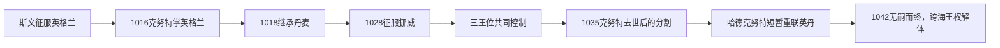

# 北海帝国

[返回北欧历史总览](/%E4%BA%BA%E6%96%87%E7%A7%91%E5%AD%A6/%E5%8E%86%E5%8F%B2/%E6%AC%A7%E6%B4%B2/%E5%8C%97%E6%AC%A7/README.md)

## 时间

1013—1042年；英格兰、丹麦与挪威三王位实际同时由克努特控制的核心阶段为1028—1035年。

## 别称与性质

“北海帝国”是后世史学概念，不是当时正式国号。它指斯文“叉须”、克努特及其子嗣以丹麦王族、征服军和婚姻继承为基础，在北海两岸建立的王朝性统治。三个王国共戴一君，却没有统一法律、议会、财政或首都，因而更接近以英格兰为财政核心的复合君主制和个人联合，而非单一民族国家。

## 建立背景与崛起机制

- [维京时代](/%E4%BA%BA%E6%96%87%E7%A7%91%E5%AD%A6/%E5%8E%86%E5%8F%B2/%E6%AC%A7%E6%B4%B2/%E5%8C%97%E6%AC%A7/%E7%BB%B4%E4%BA%AC%E6%97%B6%E4%BB%A3.md)后期，丹麦舰队从季节性袭击转为越冬、征收“丹麦金”和争夺英格兰王位。
- 英格兰王权内部的继承与贵族冲突削弱防御；斯文和克努特能够用征服所得支付职业舰队，并吸收英格兰伯爵和教会。
- 英格兰成熟的郡制、铸币和税收提供远高于斯堪的纳维亚诸地的财政能力，成为克努特维持跨海舰队和外交的基础。
- 克努特通过与诺曼底的艾玛结婚、扶植教会、确认地方习惯和重组伯爵领，把外来征服转化为可被英格兰精英接受的王权。
- 丹麦王位继承和挪威贵族对奥拉夫二世的不满，使他先后取得丹麦与挪威，而不是以一次海战建立全部统治。

## 三个王国的君主序列

各王国继承序列必须分开阅读；同一行出现相同君主才表示王位曾被联结。

### 英格兰王位

| 顺序 | 君主 | 王室 / 身份 | 在位 | 与前任关系 | 关键事件 / 备注 |
|---|---|---|---|---|---|
| 1 | 斯文“叉须” | 丹麦耶灵王朝 | 1013—1014 | 以征服迫使埃塞尔雷德二世流亡 | 1013年底获英格兰主要地区承认，数周后去世 |
| 2 | 埃塞尔雷德二世 | 威塞克斯王室 | 1014—1016（复位） | 斯文死后由英格兰贵族迎回 | 与克努特继续战争 |
| 3 | 埃德蒙二世“铁胁” | 威塞克斯王室 | 1016 | 埃塞尔雷德之子 | 阿桑顿战败后与克努特分治，11月去世 |
| 4 | **克努特** | 丹麦耶灵王朝 | 1016—1035 | 斯文之子、埃德蒙的征服对手 | 取得全英格兰，后来兼有丹麦、挪威王位 |
| 5 | 哈罗德一世“兔足” | 丹麦耶灵王朝 | 1035—1040 | 克努特之子 | 先在英格兰摄政并控制北部，1037年获承认为全境国王 |
| 6 | 哈德克努特 | 丹麦耶灵王朝 | 1040—1042 | 克努特与艾玛之子、哈罗德异母弟 | 已为丹麦王，哈罗德死后取得英格兰 |
| 7 | 忏悔者爱德华 | 威塞克斯王室 | 1042—1066 | 埃塞尔雷德与艾玛之子、哈德克努特异母兄 | 哈德克努特无嗣去世后，英格兰回归威塞克斯王室 |

### 丹麦王位

| 顺序 | 君主 | 王室 / 身份 | 在位 | 与前任关系 | 关键事件 / 备注 |
|---|---|---|---|---|---|
| 1 | 斯文“叉须” | 耶灵王朝 | 约986/987—1014 | 哈拉尔“蓝牙”之子 | 发动英格兰征服，是跨海王朝的奠基者 |
| 2 | 哈拉尔二世 | 耶灵王朝 | 1014—约1018 | 斯文之子、克努特兄长 | 克努特在英格兰作战期间统治丹麦 |
| 3 | **克努特** | 耶灵王朝 | 约1018—1035 | 哈拉尔二世之弟 | 兼英格兰王；1028年后又兼挪威王 |
| 4 | 哈德克努特 | 耶灵王朝 | 1035—1042 | 克努特之子 | 初期受挪威威胁，1040年后兼英格兰王 |
| 5 | “好人”马格努斯 | 挪威王族 | 1042—1047 | 与哈德克努特有继承约定，并非血缘直系 | 哈德克努特无嗣死后取得丹麦，北海王朝联结告终 |

### 挪威王位与实际治理

| 顺序 | 君主 / 统治者 | 身份 | 在位或掌权 | 关键事件 / 备注 |
|---|---|---|---|---|
| 1 | 奥拉夫二世·哈拉尔松 | 挪威国王 | 1015—1028 | 推动王权与基督教化；贵族反对和克努特舰队迫使其流亡 |
| 2 | **克努特** | 英格兰、丹麦国王 | 1028—1035 | 以舰队和贵族支持取得挪威王位，是三王位唯一完整联结者 |
| 3 | 哈康·埃里克松 | 拉德伯爵、克努特代理人 | 1028—约1029/1030 | 代表克努特治理，海难去世 |
| 4 | 斯文·克努特松与艾尔弗吉芙 | 克努特之子及其母 | 约1030—1035 | 推行征税和统治改革，引发强烈反弹；属于代理统治而非独立王系 |
| 5 | “好人”马格努斯 | 奥拉夫二世之子 | 1035—1047 | 挪威贵族迎立；1042年又取得丹麦，但未控制英格兰 |

## 统治结构

| 领域 | 制度与实际权力 | 与其他王国的边界 |
|---|---|---|
| 英格兰 | 国王依靠郡、百户区、铸币、地税、贤人会议和大伯爵治理 | 延续英格兰法律与税制，是跨海统治的财政核心 |
| 丹麦 | 国王与地方大会、贵族、舰队组织和新建教会合作 | 没有照搬英格兰郡制；王权在不同地区控制深浅不一 |
| 挪威 | 依靠沿海大会、地方贵族和代理人控制 | 克努特本人很少常驻，代理征税触发反抗 |
| 王朝中枢 | 巡回宫廷、王族婚姻、伯爵网络、舰队与教会 | 没有统一首都、中央议会或“帝国法”；君主去世后缺少超越个人的继承机制 |

## 分阶段发展

### 斯文征服与短暂统治（1013—1014）

斯文在多年征收贡金后于1013年发动全面进攻，埃塞尔雷德二世流亡，英格兰主要地区承认斯文。斯文次年突然去世，英格兰贵族迎回埃塞尔雷德；克努特一度撤退重组舰队，说明统治尚依赖军事威慑而未制度化。

### 克努特取得英格兰（1015—1018）

克努特重返英格兰，与埃德蒙“铁胁”长期作战。1016年阿桑顿战役后双方约定分治，埃德蒙不久去世，克努特成为全英格兰国王。他处决或排除部分对手，却也保留英格兰行政，任用本地伯爵，并与王后艾玛结婚以连接旧王室和诺曼底。

### 三国王位联结（1018—1035）

约1018年哈拉尔二世去世后，克努特继承丹麦。1026年前后的赫尔格河战役中，他面对挪威奥拉夫二世与瑞典阿农德·雅各布联盟，仍保住丹麦王位。1027年赴罗马参加皇帝康拉德二世加冕，借基督教外交提升合法性。1028年他率大舰队进入挪威，利用当地贵族不满驱逐奥拉夫，三王位由此联结。

### 继承分裂（1035—1042）

克努特1035年去世后，各国分别选择或接受继承者：哈德克努特守丹麦，哈罗德“兔足”控制英格兰，马格努斯返回挪威。哈德克努特1040年取得英格兰，却在1042年无嗣去世；英格兰迎立爱德华，丹麦由马格努斯取得，跨海王朝再未恢复。

## 重要事件

| 时间 | 事件 | 结果 |
|---|---|---|
| 1013年 | 斯文完成英格兰征服 | 首次把丹麦、英格兰王位短暂联结 |
| 1014年 | 斯文去世、埃塞尔雷德复位 | 克努特的初次继承失败 |
| 1016年 | 阿桑顿战役与埃德蒙去世 | 克努特取得全英格兰 |
| 约1018年 | 克努特继承丹麦 | 北海两岸财政和舰队资源合并 |
| 1026年前后 | 赫尔格河战役 | 丹麦王位在瑞典—挪威压力下得以保全；具体战况有争议 |
| 1027年 | 克努特赴罗马 | 通过帝国、教廷和朝圣外交强化基督教君主形象 |
| 1028年 | 克努特取得挪威 | 三国王位达到最大联结范围 |
| 1030年 | 斯蒂克莱斯塔德战役 | 复位的奥拉夫二世战死，后来的圣王崇拜反而削弱克努特代理统治合法性 |
| 1035年 | 克努特去世 | 英格兰、丹麦、挪威立即分由不同统治者控制 |
| 1040年 | 哈德克努特取得英格兰 | 丹麦—英格兰联合短暂恢复 |
| 1042年 | 哈德克努特无嗣去世 | 英格兰与丹麦分别转入不同王系，北海帝国终结 |

## 兴盛条件

- 英格兰稳定而高效的税收、铸币和地方行政，为舰队与外交提供财政。
- 丹麦海峡、北海港口和航海人力保证跨海交通，征服军可迅速调动。
- 克努特兼用武力、婚姻、教会赞助和本地精英合作，降低持续占领成本。
- 挪威及英格兰内部的贵族矛盾让他能以仲裁者、保护者或更有实力的王位竞争者进入。
- 欧洲基督教君主网络承认克努特，使其摆脱单纯“维京征服者”身份。

## 衰落与灭亡原因

### 结构因素

- 联结依赖同一君主和王族私产观念，没有共同继承法或跨国中央机构。
- 海路遥远，君主必须把实权交给伯爵、王后和王子；代理统治的征税与任命容易激化地方抵抗。
- 克努特诸子的继承资格来自不同母系与政治集团，英格兰、丹麦各自利益不愿服从统一安排。

### 外部与地方压力

- 挪威贵族迎回马格努斯，奥拉夫二世的圣王崇拜为反克努特王朝提供合法性。
- 丹麦面对挪威和瑞典压力，哈德克努特难以同时赴英格兰争位。
- 英格兰贵族能够在王族候选人之间选择，说明地方制度从未被跨海帝国吞并。

### 直接触发

1035年克努特突然去世且未留下可被三国共同接受的成年继承人，使联合立即分裂；1042年哈德克努特无嗣去世则切断丹麦王族继续统治英格兰的直接继承线。

## 演变关系

北海帝国是维京远征王权国家化的高峰，却没有建立持久统一国家。其瓦解后，英格兰、丹麦和挪威分别发展；北欧跨国王位联结后来以不同制度条件在[卡尔马联盟](/%E4%BA%BA%E6%96%87%E7%A7%91%E5%AD%A6/%E5%8E%86%E5%8F%B2/%E6%AC%A7%E6%B4%B2/%E5%8C%97%E6%AC%A7/%E5%8D%A1%E5%B0%94%E9%A9%AC%E8%81%94%E7%9B%9F.md)和[丹麦-挪威联合王国](/%E4%BA%BA%E6%96%87%E7%A7%91%E5%AD%A6/%E5%8E%86%E5%8F%B2/%E6%AC%A7%E6%B4%B2/%E5%8C%97%E6%AC%A7/%E4%B8%B9%E9%BA%A6-%E6%8C%AA%E5%A8%81%E8%81%94%E5%90%88%E7%8E%8B%E5%9B%BD.md)中再次出现。

## 演进图

