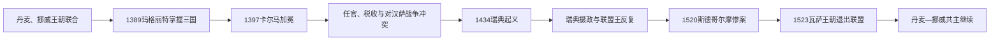

# 卡尔马联盟

[返回北欧历史总览](/%E4%BA%BA%E6%96%87%E7%A7%91%E5%AD%A6/%E5%8E%86%E5%8F%B2/%E6%AC%A7%E6%B4%B2/%E5%8C%97%E6%AC%A7/README.md)

## 时间

1389/1397—1523年。玛格丽特于1389年已实际联结三国，1397年卡尔马会议确立共同王权；瑞典自1521年起事实脱离，1523年古斯塔夫·瓦萨当选国王标志联盟终结。

## 概括

卡尔马联盟把丹麦、挪威、瑞典三个王国置于共同君主之下。瑞典当时包括今日芬兰的大部，挪威王冠还关联冰岛、法罗群岛、格陵兰及北大西洋属地。联盟不是统一国家：三国保留各自法律、王国议会、贵族团体、税收惯例和行政职位，共同君主主要协调王位、战争和对外关系。其成败取决于君主能否在丹麦宫廷、瑞典矿区与贵族、挪威地方利益以及汉萨城市之间维持平衡。

## 建立背景与崛起机制

- 14世纪黑死病、王族绝嗣和贵族争权重创三国。丹麦王女玛格丽特先以其幼子奥拉夫的名义联结丹麦、挪威，奥拉夫早逝后又分别获得两国承认。
- 瑞典贵族反对梅克伦堡的阿尔布雷克特，邀请玛格丽特干预。1389年奥斯勒战役后阿尔布雷克特被俘，玛格丽特成为三国实际统治者。
- 波罗的海贸易与德意志诸侯、汉萨同盟的影响，使北欧贵族认为共同防务和王朝稳定具有吸引力。
- 玛格丽特选择外甥孙波美拉尼亚的埃里克为继承人，通过收回王室土地、安插忠诚官员和协调各国议会建立共同王权。
- 1397年埃里克在卡尔马加冕。会议文件一方面设想共同君主与共同对外行动，另一方面承认各国按本国法律治理；具体文本的法律效力和当时认可范围仍有争议。

## 共同君主完整序列

表中“在位”按各王国分别列出，因为联盟君主往往没有同时、持续控制三国。空缺期不是遗漏，而是瑞典另立国王或摄政。

| 顺序 | 共同君主 | 王室 | 丹麦 | 挪威 | 瑞典 | 继承关系与备注 |
|---|---|---|---|---|---|---|
| 1 | **玛格丽特一世** | 埃斯特里德森王室后裔 | 1387—1412，实际统治者 | 1388—1412，实际统治者 | 1389—1412，实际统治者 | 丹麦国王瓦尔德马四世之女、挪威国王哈康六世遗孀；埃里克已为名义国王时，她仍掌实权 |
| 2 | 埃里克（波美拉尼亚的埃里克） | 格里芬王朝 | 1396/1397—1439 | 1389/1397—1442 | 1396/1397—1439 | 玛格丽特外甥孙及养子；1397年三国加冕，玛格丽特死后亲政；先后被三国废黜 |
| 3 | 克里斯托弗（巴伐利亚的克里斯托弗） | 普法尔茨-诺伊马克特支系 | 1440—1448 | 1442—1448 | 1441—1448 | 埃里克的外甥；三国分次选立，任内恢复共同君主但权力受王国议会限制 |
| 4 | 克里斯蒂安一世 | 奥尔登堡王朝 | 1448—1481 | 1450—1481 | 1457—1464 | 丹麦议会选立；与卡尔·克努特松争夺挪威、瑞典，只短暂控制瑞典 |
| 5 | 汉斯（约翰） | 奥尔登堡王朝 | 1481—1513 | 1483—1513 | 1497—1501 | 克里斯蒂安一世之子；击败老斯滕·斯图雷后入主瑞典，四年后被驱逐 |
| 6 | **克里斯蒂安二世** | 奥尔登堡王朝 | 1513—1523 | 1513—1524 | 1520—1521 | 汉斯之子；1520年征服瑞典并加冕，斯德哥尔摩惨案促成全面反抗；1523年又失去丹麦王位 |

## 瑞典中断期的国王与摄政

这些人物是瑞典王国自己的国王或“护国摄政”，不是另一套“卡尔马联盟皇帝”。任期交叠和短暂共治反映联盟争夺。

| 统治者 | 身份与任期 | 说明 |
|---|---|---|
| 恩格尔布雷克特·恩格尔布雷克特松 | 护国摄政，1435—1436 | 矿区起义领袖；与贵族议会合作反对埃里克的税收和外来官员，1436年遇刺 |
| 卡尔·克努特松（邦代） | 摄政，1438—1440；瑞典国王，1448—1457、1464—1465、1467—1470 | 以卡尔八世之名三度为王，并于1449—1450年争夺挪威王位；多次被贵族集团废立 |
| 延斯·本特松与埃里克·阿克塞尔松 | 共同摄政，1457年 | 卡尔首次被废后主持过渡，随后迎立克里斯蒂安一世 |
| 凯蒂尔·卡尔松 | 摄政，1464—1465 | 反对克里斯蒂安一世，迎回卡尔；死后权力再度转手 |
| 延斯·本特松 | 摄政，1465—1466 | 与卡尔及其他贵族派系冲突 |
| 埃里克·阿克塞尔松 | 摄政，1466—1467 | 后与卡尔和解，卡尔第三次复位 |
| **老斯滕·斯图雷** | 摄政，1470—1497、1501—1503 | 1471年布伦克贝里获胜；1497年向汉斯让位，1501年复任 |
| 斯万特·尼尔松 | 摄政，1504—1512 | 延续反联盟路线，同时与议会和港市协调 |
| 埃里克·特罗勒 | 摄政，1512年 | 贵族议会妥协候选人，任期很短 |
| 小斯滕·斯图雷 | 摄政，1512—1520 | 与主张联盟的教会—贵族集团内战，1520年伤重去世 |
| 古斯塔夫·埃里克松·瓦萨 | 摄政，1521—1523；1523年起为国王 | 领导反克里斯蒂安二世起义，1523年当选国王，瑞典退出联盟 |

## 统治结构与三国边界

| 领域 | 联盟层面 | 各王国保留的权力 |
|---|---|---|
| 王位 | 原则上选择同一君主，但继承仍须各国接受 | 王国议会和贵族可分别选立、废黜或拒绝君主 |
| 法律 | 没有统一联盟法典 | 丹麦、挪威、瑞典各按本国法律审判 |
| 财政 | 战争和宫廷需要跨国资源 | 税种、征收方式和对拨款的同意依各国制度而异 |
| 官职 | 君主任命城堡长官、地方官和教会高层 | “外来官员”是否可任职是瑞典反对派的核心争议 |
| 外交与战争 | 理想上共同对外 | 各国受战争成本不同，瑞典和汉萨城市常拒绝丹麦中心的政策 |
| 领土 | 王冠下包含多个法律共同体 | 芬兰是瑞典王国的一部分；冰岛、法罗与格陵兰关联挪威王冠，不是独立联盟成员 |

## 分阶段发展

### 玛格丽特整合期（1387—1412）

玛格丽特利用王朝继承和瑞典贵族邀请取得权力，再以埃里克为共同继承人。她谨慎平衡各国贵族，回收被抵押的王室土地，避免把联盟公开改造成丹麦的兼并；这一时期共同王权最稳定。

### 埃里克亲政与反抗（1412—1442）

埃里克继续争夺石勒苏益格并与汉萨城市作战，为舰队和宫廷增加税负；他偏用丹麦、德意志背景官员掌管瑞典城堡，也激化瑞典矿工和贵族的不满。1429年厄勒海峡税增强丹麦财政，却使对外贸易冲突加重。1434年恩格尔布雷克特起义把地方经济不满转为王位危机，埃里克最终被三国分次废黜。

### 恢复与反复共主（1440—1501）

克里斯托弗被各国分别选立，但1448年无嗣去世后共同王权再次断裂。丹麦选克里斯蒂安一世，瑞典选卡尔·克努特松，挪威王位也一度有两个竞争者。1450年后丹麦—挪威的共同君主较稳定，瑞典则在联盟君主、卡尔和摄政集团之间反复转换。

### 最终危机（1501—1523）

汉斯1501年被瑞典反对派驱逐。其子克里斯蒂安二世1520年以军事胜利重夺瑞典，并在加冕后的斯德哥尔摩审判和处决大批反对者。以异端审判名义进行的清洗摧毁妥协空间，古斯塔夫·瓦萨获得达拉纳及吕贝克支持，起义由地方反抗发展为另立王权。

## 重要事件

| 时间 | 事件 | 结果与影响 |
|---|---|---|
| 1387—1389年 | 玛格丽特先后获三国承认 | 共同统治在卡尔马会议前已成事实 |
| 1397年 | 埃里克在卡尔马加冕 | 联盟获得共同王权的象征和制度文本 |
| 1410年代—1430年代 | 石勒苏益格战争与汉萨冲突 | 税负和贸易损失放大各国利益分歧 |
| 1429年 | 厄勒海峡税常态化 | 丹麦王权财政增强，海上商贸矛盾加深 |
| 1434—1436年 | 恩格尔布雷克特起义 | 瑞典议会与地方武装开始反复决定君主去留 |
| 1439—1442年 | 埃里克被三国分次废黜 | 证明联盟没有统一废立程序 |
| 1448—1450年 | 克里斯托弗去世与挪威王位争夺 | 丹麦—挪威重新共主，瑞典另立卡尔 |
| 1471年 | 布伦克贝里战役 | 老斯滕·斯图雷击败克里斯蒂安一世，瑞典保持事实自治 |
| 1497—1501年 | 汉斯短暂统治瑞典 | 共同君主一度恢复，随后因军事和政治失利再被逐 |
| 1520年 | 克里斯蒂安二世征服瑞典、斯德哥尔摩惨案 | 贵族、教会和地方社会的反联盟力量汇合 |
| 1521—1523年 | 古斯塔夫·瓦萨起义 | 瑞典建立本国世袭王朝，联盟终结 |

## 兴盛条件

- 王朝绝嗣和跨国婚姻为共同君主提供合法继承链。
- 北欧需要共同应对汉萨商业力量、德意志诸侯和波罗的海竞争。
- 玛格丽特以协商、王室土地和精英轮换维持平衡，没有强行废除各王国制度。
- 共主能调动丹麦海峡、挪威北大西洋资源以及瑞典—芬兰矿产与人力，潜在实力可观。

## 衰落与解体原因

### 结构因素

- 三国均保留选王和议会传统，没有共同继承法、常设财政或跨国代表机构；每次君主去世都可能重新谈判。
- 宫廷和海军资源越来越集中于丹麦，瑞典精英担心税收、城堡和矿产被外来官员控制。
- 距离和交通使挪威较难参与核心决策，而其贵族和人口又受黑死病打击，逐渐处于弱势。
- 瑞典内部也并非“全民对丹麦”：联盟派、摄政派和不同贵族家族长期竞争，冲突首先是复合王权内的权力分配。

### 外部压力

- 汉萨城市尤其吕贝克可用贷款、舰队和贸易封锁支持不同阵营。
- 石勒苏益格、荷尔斯泰因和波罗的海战争持续消耗共同王权，却给三国带来不均等收益。

### 直接触发

1520年斯德哥尔摩惨案使原本可谈判的王权冲突变成生存危机；1521年起义获得地方税源、矿区和吕贝克支持，克里斯蒂安二世又在1523年失去丹麦王位，已无力恢复联盟。古斯塔夫·瓦萨于1523年当选瑞典国王是最终制度断点。

## 演变关系

联盟解体后，丹麦与挪威继续在共同君主下发展为[丹麦-挪威联合王国](/%E4%BA%BA%E6%96%87%E7%A7%91%E5%AD%A6/%E5%8E%86%E5%8F%B2/%E6%AC%A7%E6%B4%B2/%E5%8C%97%E6%AC%A7/%E4%B8%B9%E9%BA%A6-%E6%8C%AA%E5%A8%81%E8%81%94%E5%90%88%E7%8E%8B%E5%9B%BD.md)；瑞典在瓦萨王朝下强化国家能力，17世纪进入[瑞典帝国](/%E4%BA%BA%E6%96%87%E7%A7%91%E5%AD%A6/%E5%8E%86%E5%8F%B2/%E6%AC%A7%E6%B4%B2/%E5%8C%97%E6%AC%A7/%E7%91%9E%E5%85%B8%E5%B8%9D%E5%9B%BD.md)阶段。

## 演进图

