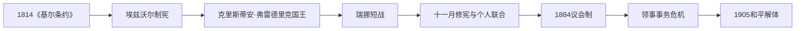

# 1814年宪法与瑞典—挪威联合

## 时间

1814年—1905年

## 概括

1814年挪威拒绝被当作领土直接转让，召开制宪会议并制定宪法。短暂战争后，挪威与瑞典共戴君主，但保留宪法、议会和大部分内部制度；这为1905年和平解体和完全独立奠定基础。

## 历史走向

- 《基尔条约》公布后，克里斯蒂安·弗雷德里克召集代表在艾兹沃尔制宪。1814年5月17日宪法确立主权、权力分立和有限选举制度。
- 瑞典军队进攻后，双方达成《莫斯公约》。挪威接受与瑞典共戴君主，同时以修改后的宪法保留本国议会、政府、法律和财政。
- 联合外交主要由瑞典国王及共同外交机构掌握，挪威内部政治则围绕扩大议会权力和官僚责任展开。
- 1884年国王接受由议会多数支持的政府，议会制取得决定性突破；自由派、保守派、农民与工人政治逐步制度化。
- 挪威航运和商业发展后，对独立领事机构的要求增强。1905年围绕领事问题的宪政冲突导致议会宣布联合解体。
- 经公投和谈判，瑞典承认解体。挪威选择丹麦王子卡尔为国王哈康七世，建立独立君主立宪国家。

## 统治结构

| 层面 | 挪威地位 |
|---|---|
| 君主 | 与瑞典共戴一位国王 |
| 宪法与议会 | 保留1814年宪法和挪威议会 |
| 内政 | 由挪威机构管理，19世纪后期趋向议会责任制 |
| 外交 | 主要由共同君主和瑞典主导的机构处理 |

## 演变关系

- 前一节点：[联合王权与丹麦统治时期](/%E4%BA%BA%E6%96%87%E7%A7%91%E5%AD%A6/%E5%8E%86%E5%8F%B2/%E6%AC%A7%E6%B4%B2/%E5%8C%97%E6%AC%A7/%E6%8C%AA%E5%A8%81/%E8%81%94%E5%90%88%E7%8E%8B%E6%9D%83%E4%B8%8E%E4%B8%B9%E9%BA%A6%E7%BB%9F%E6%B2%BB%E6%97%B6%E6%9C%9F.md)。
- 后一节点：[独立、世界大战与战后重建](/%E4%BA%BA%E6%96%87%E7%A7%91%E5%AD%A6/%E5%8E%86%E5%8F%B2/%E6%AC%A7%E6%B4%B2/%E5%8C%97%E6%AC%A7/%E6%8C%AA%E5%A8%81/%E7%8B%AC%E7%AB%8B%E3%80%81%E4%B8%96%E7%95%8C%E5%A4%A7%E6%88%98%E4%B8%8E%E6%88%98%E5%90%8E%E9%87%8D%E5%BB%BA.md)。
- 北欧比较：[北欧现代国家形成](/%E4%BA%BA%E6%96%87%E7%A7%91%E5%AD%A6/%E5%8E%86%E5%8F%B2/%E6%AC%A7%E6%B4%B2/%E5%8C%97%E6%AC%A7/%E5%8C%97%E6%AC%A7%E7%8E%B0%E4%BB%A3%E5%9B%BD%E5%AE%B6%E5%BD%A2%E6%88%90.md)。

## 演进图

## 1814年的具体过程

《基尔条约》要求丹麦国王把挪威交给瑞典国王，但驻挪王子克里斯蒂安·弗雷德里克先主张继承权。在本地官员和商人压力下，他改以人民主权召集代表。1814年4—5月埃兹沃尔会议在独立派和倾向与瑞典协商者之间妥协，5月17日通过宪法并选他为国王。宪法建立议会、权力分立和有限选举权，同时保留路德宗国家、财产与性别限制。

瑞典王储卡尔·约翰在夏季发动短战，海军封锁和军事优势迫使挪威签订莫斯公约。克里斯蒂安·弗雷德里克退位，议会修改宪法后选择瑞典卡尔十三世为挪威王。由此形成的是共同君主和共同外交下的两个国家：挪威保留宪法、议会、法律、财政、军队和政府，而非并入瑞典。

## 联合内部的权力演变

国王可任命大臣、否决法律并通过驻斯德哥尔摩机构处理联合事务，挪威议会则以三次通过克服暂缓否决，并逐步控制预算。1816年中央银行和货币制度、地方自治法、商业和航运扩张提高国家能力。农民代表、自由派城市精英和后来的工人运动改变议会构成。

围绕大臣是否必须到议会答辩的冲突在1884年以塞尔默内阁被弹劾结束，约翰·斯韦德鲁普组织议会政府。随后挪威要求独立领事机构，以服务庞大商船和海外贸易；瑞典担忧共同外交被掏空。1905年挪威政府因国王拒绝批准领事法集体辞职，议会宣称国王已无法组成挪威政府，联合因而解体。公投压倒性支持解体，卡尔斯塔德谈判解决边境堡垒和争端；第二次公投选择君主制，丹麦王子卡尔成为哈康七世。

## 重要事件

| 时间 | 事件 | 结果 |
|---|---|---|
| 1814年1月 | 《基尔条约》 | 丹麦放弃挪威，激发本地制宪 |
| 1814年5月17日 | 宪法通过 | 建立代表制国家并选出本国国王 |
| 1814年7—8月 | 瑞挪战争与莫斯公约 | 挪威接受共主但保存宪法 |
| 1814年11月 | 修宪与联合成立 | 两国法律和政府分立，共享君主、外交 |
| 1837年 | 地方自治法 | 市镇政治扩大社会参与 |
| 1884年 | 弹劾与议会制突破 | 内阁须以议会支持为基础 |
| 1898年 | 男性普选 | 选举权显著扩大 |
| 1905年6月7日 | 议会宣布联合终止 | 领事危机转化为宪政解体 |
| 1905年8、11月 | 解体与政体公投 | 民众确认独立并选择君主制 |
| 1905年11月 | 哈康七世即位 | 新王朝以议会与公投合法性建立 |

共同君主、政府首脑职位演变见[挪威君主与政府首脑表](/%E4%BA%BA%E6%96%87%E7%A7%91%E5%AD%A6/%E5%8E%86%E5%8F%B2/%E6%AC%A7%E6%B4%B2/%E5%8C%97%E6%AC%A7/%E6%8C%AA%E5%A8%81/%E6%8C%AA%E5%A8%81%E5%90%9B%E4%B8%BB%E4%B8%8E%E6%94%BF%E5%BA%9C%E9%A6%96%E8%84%91%E8%A1%A8.md)。
