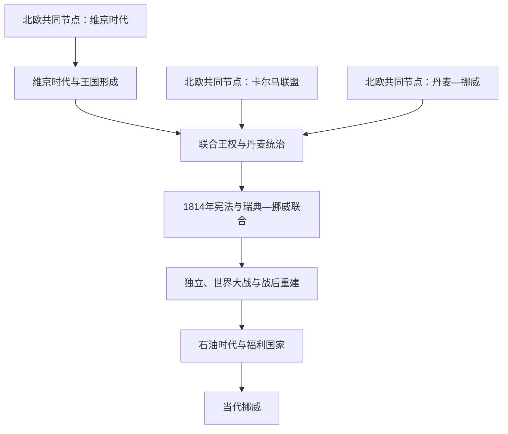

# 挪威历史

## 概括

挪威历史从分散的峡湾与沿岸社会出发，经维京海上扩张、基督教化和中世纪王权整合形成王国；14世纪后长期处于联合王权，1814年宪法重建本国政治制度，1905年完全独立。20世纪的占领经验、北约选择、福利国家和北海石油共同塑造当代挪威。

## 历史演进图

## 历史主线

王国形成、联合王权和现代独立是挪威史的三个长时段。联合时期并非挪威历史的“空白”：本土法律、地方农民社会、经济网络和王国身份持续演变。1814年的宪法也没有立即带来完全独立，而是在与瑞典联合的框架下逐步发展议会政治。1905年后的国家路线又经历中立失败、北约结盟和资源型福利国家治理。

## 按时间导航

| 顺序 | 阶段 | 时间 | 历史走向 |
|---:|---|---|---|
| 1 | [维京时代与王国形成](/%E4%BA%BA%E6%96%87%E7%A7%91%E5%AD%A6/%E5%8E%86%E5%8F%B2/%E6%AC%A7%E6%B4%B2/%E5%8C%97%E6%AC%A7/%E6%8C%AA%E5%A8%81/%E7%BB%B4%E4%BA%AC%E6%97%B6%E4%BB%A3%E4%B8%8E%E7%8E%8B%E5%9B%BD%E5%BD%A2%E6%88%90.md) | 约800—1319年 | 海上扩张、基督教化和多世纪王权整合。 |
| 2 | [联合王权与丹麦统治时期](/%E4%BA%BA%E6%96%87%E7%A7%91%E5%AD%A6/%E5%8E%86%E5%8F%B2/%E6%AC%A7%E6%B4%B2/%E5%8C%97%E6%AC%A7/%E6%8C%AA%E5%A8%81/%E8%81%94%E5%90%88%E7%8E%8B%E6%9D%83%E4%B8%8E%E4%B8%B9%E9%BA%A6%E7%BB%9F%E6%B2%BB%E6%97%B6%E6%9C%9F.md) | 1319—1814年 | 黑死病、卡尔马联盟与哥本哈根中心的复合王国。 |
| 3 | [1814年宪法与瑞典—挪威联合](/%E4%BA%BA%E6%96%87%E7%A7%91%E5%AD%A6/%E5%8E%86%E5%8F%B2/%E6%AC%A7%E6%B4%B2/%E5%8C%97%E6%AC%A7/%E6%8C%AA%E5%A8%81/1814%E5%B9%B4%E5%AE%AA%E6%B3%95%E4%B8%8E%E7%91%9E%E5%85%B8-%E6%8C%AA%E5%A8%81%E8%81%94%E5%90%88.md) | 1814—1905年 | 保留宪法和议会，在联合中发展自治与议会制。 |
| 4 | [独立、世界大战与战后重建](/%E4%BA%BA%E6%96%87%E7%A7%91%E5%AD%A6/%E5%8E%86%E5%8F%B2/%E6%AC%A7%E6%B4%B2/%E5%8C%97%E6%AC%A7/%E6%8C%AA%E5%A8%81/%E7%8B%AC%E7%AB%8B%E3%80%81%E4%B8%96%E7%95%8C%E5%A4%A7%E6%88%98%E4%B8%8E%E6%88%98%E5%90%8E%E9%87%8D%E5%BB%BA.md) | 1905—1969年 | 完全独立、德国占领、北约选择和福利扩展。 |
| 5 | [石油时代与福利国家](/%E4%BA%BA%E6%96%87%E7%A7%91%E5%AD%A6/%E5%8E%86%E5%8F%B2/%E6%AC%A7%E6%B4%B2/%E5%8C%97%E6%AC%A7/%E6%8C%AA%E5%A8%81/%E7%9F%B3%E6%B2%B9%E6%97%B6%E4%BB%A3%E4%B8%8E%E7%A6%8F%E5%88%A9%E5%9B%BD%E5%AE%B6.md) | 1969—1994年 | 国家管理北海资源并两度否决加入欧洲共同体／欧盟。 |
| 6 | [当代挪威](/%E4%BA%BA%E6%96%87%E7%A7%91%E5%AD%A6/%E5%8E%86%E5%8F%B2/%E6%AC%A7%E6%B4%B2/%E5%8C%97%E6%AC%A7/%E6%8C%AA%E5%A8%81/%E5%BD%93%E4%BB%A3%E6%8C%AA%E5%A8%81.md) | 1994年至今 | 欧洲经济区、石油基金、北极安全和绿色转型。 |

## 北欧共同节点

| 共同主题 | 入口 | 本国阅读重点 |
|---|---|---|
| 海上扩张 | [维京时代](/%E4%BA%BA%E6%96%87%E7%A7%91%E5%AD%A6/%E5%8E%86%E5%8F%B2/%E6%AC%A7%E6%B4%B2/%E5%8C%97%E6%AC%A7/%E7%BB%B4%E4%BA%AC%E6%97%B6%E4%BB%A3.md) | 挪威向北大西洋的移民、贸易和王权形成。 |
| 北海王权 | [北海帝国](/%E4%BA%BA%E6%96%87%E7%A7%91%E5%AD%A6/%E5%8E%86%E5%8F%B2/%E6%AC%A7%E6%B4%B2/%E5%8C%97%E6%AC%A7/%E5%8C%97%E6%B5%B7%E5%B8%9D%E5%9B%BD.md) | 克努特时期挪威被纳入跨海统治。 |
| 三国联合 | [卡尔马联盟](/%E4%BA%BA%E6%96%87%E7%A7%91%E5%AD%A6/%E5%8E%86%E5%8F%B2/%E6%AC%A7%E6%B4%B2/%E5%8C%97%E6%AC%A7/%E5%8D%A1%E5%B0%94%E9%A9%AC%E8%81%94%E7%9B%9F.md) | 挪威在联合中的地位及本土精英衰落。 |
| 复合君主国 | [丹麦—挪威联合王国](/%E4%BA%BA%E6%96%87%E7%A7%91%E5%AD%A6/%E5%8E%86%E5%8F%B2/%E6%AC%A7%E6%B4%B2/%E5%8C%97%E6%AC%A7/%E4%B8%B9%E9%BA%A6-%E6%8C%AA%E5%A8%81%E8%81%94%E5%90%88%E7%8E%8B%E5%9B%BD.md) | 丹麦统治和挪威法律社会的延续。 |
| 现代国家比较 | [北欧现代国家形成](/%E4%BA%BA%E6%96%87%E7%A7%91%E5%AD%A6/%E5%8E%86%E5%8F%B2/%E6%AC%A7%E6%B4%B2/%E5%8C%97%E6%AC%A7/%E5%8C%97%E6%AC%A7%E7%8E%B0%E4%BB%A3%E5%9B%BD%E5%AE%B6%E5%BD%A2%E6%88%90.md) | 1814年宪法、1905年独立和其他北欧国家重组。 |

## 关键辨析

- 挪威王国统一是长期过程，不应只归因于哈拉尔一世的一次军事行动。
- 1814年既是与丹麦联合终结、挪威制宪的年份，也是与瑞典新联合开始的年份。
- 1905年联合解体没有取消1814年宪法传统，而是在既有国家制度上取得完整外交主权。
- 挪威不属于欧洲联盟，但通过欧洲经济区深度参与欧洲内部市场。
- 战后福利制度在北海石油发现前已经发展；资源收益扩大而非凭空创造了福利国家。

## 上级

- [北欧历史](/%E4%BA%BA%E6%96%87%E7%A7%91%E5%AD%A6/%E5%8E%86%E5%8F%B2/%E6%AC%A7%E6%B4%B2/%E5%8C%97%E6%AC%A7/README.md)
