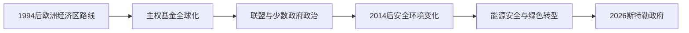

# 当代挪威

## 时间

1994年至今

## 概括

当代挪威在不加入欧洲联盟的前提下，通过欧洲经济区参与欧洲内部市场，同时以北约、北极政策和北欧合作处理安全与区域事务。石油财富、绿色转型和福利制度之间的平衡构成长期议题。

## 历史走向

- 欧洲经济区协定使挪威、冰岛等欧洲自由贸易联盟国家参与货物、服务、人员和资本流动，并吸收大量内部市场规则，但不取得欧盟成员国的完整决策权。
- 政府石油基金在1990年代后获得持续注资，后来形成以海外投资和财政支出规则约束为核心的长期管理模式。
- 石油和天然气仍是出口与财政的重要来源；减排承诺、海上能源、生态保护和产业转型因此存在持续张力。
- 挪威保持北约成员身份，北部边境、斯瓦尔巴和北大西洋航道使其安全政策具有明显北极维度。
- 萨米议会、语言文化保护和土地资源权利使原住民族政治成为国家治理的重要组成部分。
- 多党议会、地方政府、劳资协商和普遍公共服务继续支撑福利国家，同时面对人口老龄化、地区差异和移民融合问题。

## 关键辨析

- 挪威不是欧洲联盟成员国，但属于欧洲经济区和申根合作，不能简单称为“脱离欧洲一体化”。
- 石油基金属于公共财富管理工具，不等于国家可以无限制使用当期石油收入。
- 现代挪威王国包含本土及不同法律地位的北极、北大西洋领地；这些地位不能互相等同。

## 演变关系

- 前一节点：[挪威的石油时代与福利国家](/%E4%BA%BA%E6%96%87%E7%A7%91%E5%AD%A6/%E5%8E%86%E5%8F%B2/%E6%AC%A7%E6%B4%B2/%E5%8C%97%E6%AC%A7/%E6%8C%AA%E5%A8%81/%E7%9F%B3%E6%B2%B9%E6%97%B6%E4%BB%A3%E4%B8%8E%E7%A6%8F%E5%88%A9%E5%9B%BD%E5%AE%B6.md)。
- 所属主线：[挪威历史](/%E4%BA%BA%E6%96%87%E7%A7%91%E5%AD%A6/%E5%8E%86%E5%8F%B2/%E6%AC%A7%E6%B4%B2/%E5%8C%97%E6%AC%A7/%E6%8C%AA%E5%A8%81/README.md)、[北欧历史](/%E4%BA%BA%E6%96%87%E7%A7%91%E5%AD%A6/%E5%8E%86%E5%8F%B2/%E6%AC%A7%E6%B4%B2/%E5%8C%97%E6%AC%A7/README.md)。

## 演进图

## 1990年代以来的具体进程

冷战结束后挪威继续以北约为安全核心，同时通过欧洲经济区和申根深度参与欧洲。1994年第二次入欧公投失败，没有终止欧洲化：单一市场法规广泛进入国内法，而农业、渔业和资源管理保留较多例外。外交上，奥斯陆进程、发展援助和和平斡旋形成“小国调停者”形象，但参与北约在巴尔干、阿富汗和利比亚的行动也显示其联盟义务。

国内长期由工党、中右翼及中间党联盟轮替。2011年7月22日奥斯陆爆炸和于特岛屠杀造成重大伤亡，社会随后围绕极右翼暴力、警务和民主韧性反思。政府石油基金规模扩张使公共财政具备缓冲能力，住房、地区人口、医疗等待、移民融合和生活成本仍构成分配争议。

俄乌战争和北溪供应变化提升挪威作为欧洲油气供应者的地位，也加大设施保护、北极军事和对俄关系压力。政府支持乌克兰、加强与盟国协作，同时继续处理斯瓦尔巴条约、巴伦支海渔业和高北地区治理。气候政策必须同时面对油气出口、海上风电、碳捕集和驯鹿牧场权利；福森风电争议表明绿色项目也可能侵犯萨米权利。

截至2026年7月14日，国王哈拉尔五世为宪法国家元首，约纳斯·加尔·斯特勒为首相。王储哈康在国王暂不能履职时可主持国务会议或摄政，但这与王位正式更替不同。行政权由对议会负责的政府行使。

## 当代制度与事件

| 时间 | 事件 | 意义 |
|---|---|---|
| 1994年 | 第二次拒绝加入欧盟 | 挪威选择欧洲经济区式一体化 |
| 1996年起 | 石油基金持续注资 | 将资源租转为海外金融资产 |
| 2005—2013年 | 红绿联盟 | 工党、中间党和社会主义左翼长期联合执政 |
| 2011年7月22日 | 恐怖袭击 | 极右翼暴力、警务能力和开放社会面临考验 |
| 2013—2021年 | 索尔贝格政府 | 中右翼联盟、税制与公共服务改革 |
| 2021年 | 斯特勒政府成立 | 工党与中间党组织政府，后按议会条件执政 |
| 2022年以后 | 欧洲战争与能源危机 | 对乌援助、北约威慑和油气供应重要性上升 |
| 2023年 | 福森权利争议持续 | 最高法院判决后的补救凸显萨米土地权 |
| 2024—2026年 | 高北与基础设施安全加强 | 北极战略、海底设施和盟军协作更紧密 |

## 现任权力结构

| 角色 | 截至2026年7月14日 | 实际职能 |
|---|---|---|
| 国家元首 | 国王哈拉尔五世 | 礼仪、任命与国务会议等宪法职能 |
| 政府首脑 | 首相约纳斯·加尔·斯特勒 | 领导内阁并对议会负责 |
| 议会 | 大议会 | 立法、预算和监督；政府须避免不信任多数 |
| 原住民代表 | 萨米议会 | 就语言、文化、土地与政策协商，不是领土主权政府 |
| 地方层 | 市镇与郡 | 承担医疗、教育、交通等大量公共服务 |

完整王位、共治、占领期双重权力和历任首相见[挪威君主与政府首脑表](/%E4%BA%BA%E6%96%87%E7%A7%91%E5%AD%A6/%E5%8E%86%E5%8F%B2/%E6%AC%A7%E6%B4%B2/%E5%8C%97%E6%AC%A7/%E6%8C%AA%E5%A8%81/%E6%8C%AA%E5%A8%81%E5%90%9B%E4%B8%BB%E4%B8%8E%E6%94%BF%E5%BA%9C%E9%A6%96%E8%84%91%E8%A1%A8.md)。
