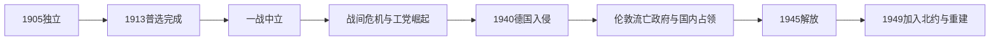

# 独立、世界大战与战后重建时期的挪威

## 时间

1905年—1969年

## 概括

1905年独立后的挪威巩固议会君主制，并在两次世界大战中经历中立政策的局限。1940—1945年的德国占领促使战后挪威加入北约；重建、工业化和社会政策扩展为福利国家奠定基础。

## 历史走向

- 哈康七世即位后，君主制与议会民主逐渐稳定。1900年代至1910年代选举权继续扩大，1913年妇女获得与男子同等的全国选举权。
- 第一次世界大战中挪威保持中立，但庞大商船队遭受损失，航运与物资供应深受战争影响。
- 战间期工人运动壮大，经济危机推动劳工党从革命性纲领转向议会治理和社会改革。
- 1940年4月德国入侵。国王和政府流亡伦敦，国内出现占领政权、合作机构与抵抗运动；商船队成为盟军运输的重要力量。
- 1945年以后，战时中立经验和苏联邻接压力使挪威选择北大西洋安全框架，1949年成为北约创始成员国。
- 战后政府以重建、充分就业、工业和水电开发、社会保险与地区政策为重点，国家能力和公共福利显著扩展。
- 1969年北海埃科菲斯克油田发现，标志经济与国家治理即将进入石油时代。

## 关键辨析

- 挪威一战时期的中立和冷战时期的北约成员身份属于不同安全战略。
- 德国占领时期的流亡政府、国内行政和抵抗网络并存，不能只用单一政权线概括。
- 福利制度早于石油开发；石油收入扩大了制度能力，但不是福利国家的唯一起源。

## 演变关系

- 前一节点：[1814年宪法与瑞典—挪威联合](/%E4%BA%BA%E6%96%87%E7%A7%91%E5%AD%A6/%E5%8E%86%E5%8F%B2/%E6%AC%A7%E6%B4%B2/%E5%8C%97%E6%AC%A7/%E6%8C%AA%E5%A8%81/1814%E5%B9%B4%E5%AE%AA%E6%B3%95%E4%B8%8E%E7%91%9E%E5%85%B8-%E6%8C%AA%E5%A8%81%E8%81%94%E5%90%88.md)。
- 后一节点：[石油时代与福利国家](/%E4%BA%BA%E6%96%87%E7%A7%91%E5%AD%A6/%E5%8E%86%E5%8F%B2/%E6%AC%A7%E6%B4%B2/%E5%8C%97%E6%AC%A7/%E6%8C%AA%E5%A8%81/%E7%9F%B3%E6%B2%B9%E6%97%B6%E4%BB%A3%E4%B8%8E%E7%A6%8F%E5%88%A9%E5%9B%BD%E5%AE%B6.md)。

## 演进图

## 独立国家的制度建立

哈康七世明确表示须经公投才接受王位，使新君主制与议会主权结合。挪威建立独立外交体系，依靠商船、渔业、水电工业和资源出口进入世界经济。1907年女性有限选举权、1913年平等普选扩大政治共同体；萨米人、贫困者和殖民式同化政策下的少数群体仍未获得同等文化权利。

一战期间挪威名义中立，却因商船为协约国运输而被称为“中立盟友”；德国潜艇战造成大量船只和海员损失。战后通胀、债务、劳资冲突和恢复金本位造成紧缩。1928年首个工党政府仅存数周，1935年工党与农民党达成危机协议，尼高斯沃尔政府以就业、农业支持和社会改革稳定政治。

## 占领与双重权力

1940年4月9日德军突袭奥斯陆、卑尔根、特隆赫姆、纳尔维克等地。奥斯卡堡击沉“布吕歇尔”号，为国王、政府和议会撤离赢得时间。哈康七世拒绝德国要求任命吉斯林；政府获议会授权后转往伦敦，控制庞大商船队并组织盟军部队。国内由德国帝国专员特博文掌最高权力，吉斯林1942年起任合作政权“部长主席”；两者均不构成合法政府连续性。

抵抗包括民政不合作、地下报刊、情报、逃亡网络和武装破坏；教师、教会与工会也抵制纳粹化。德军焚毁北挪威、关押政治犯，挪威犹太人被捕并遭驱逐屠杀。1944—1945年苏军解放东芬马克后撤离，流亡政府回国。战后法律清算包括处决吉斯林，也引发追溯立法和“德军女友”遭歧视等争议。

## 战后重建

工党凭计划、配给、住房和产业政策主导重建；马歇尔援助支持进口和现代化。1949年挪威因对苏安全担忧加入北约，但限制和平时期外国基地和核武部署，以平衡联盟与北方邻国关系。社会保险、教育、医疗和区域政策逐步扩展，为石油时代前的福利国家奠基。

## 重要事件

| 时间 | 事件 | 结果 |
|---|---|---|
| 1905年 | 独立与新王朝 | 议会君主制获得公投确认 |
| 1913年 | 女性平等普选 | 全国政治公民权显著扩展 |
| 1914—1918年 | 一战中立 | 商船损失严重，国家更依赖海运和国际市场 |
| 1935年 | 危机协议 | 工党长期执政与社会改革起点 |
| 1940年4月9日 | 德国入侵 | 政府流亡，国内进入占领 |
| 1942年 | 吉斯林合作政权 | 实际受特博文和德军控制 |
| 1943年 | 挪威犹太人遭驱逐 | 占领迫害的核心罪行之一 |
| 1944—1945年 | 芬马克解放与强制疏散 | 北部遭焦土破坏，苏军后撤 |
| 1945年5月 | 解放 | 合法政府回国，开始清算和重建 |
| 1949年 | 加入北约 | 放弃战前中立，进入集体防务 |

领导连续性、占领者与合作政权区分见[挪威君主与政府首脑表](/%E4%BA%BA%E6%96%87%E7%A7%91%E5%AD%A6/%E5%8E%86%E5%8F%B2/%E6%AC%A7%E6%B4%B2/%E5%8C%97%E6%AC%A7/%E6%8C%AA%E5%A8%81/%E6%8C%AA%E5%A8%81%E5%90%9B%E4%B8%BB%E4%B8%8E%E6%94%BF%E5%BA%9C%E9%A6%96%E8%84%91%E8%A1%A8.md)。
