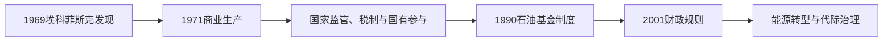

# 挪威的石油时代与福利国家

## 时间

1969年—1994年

## 概括

北海石油把挪威从以航运、渔业和水电工业为主的经济带入能源出口时代。国家通过资源主权、许可制度、国有企业和长期储蓄管理收益，同时继续扩展普遍福利与地方均衡政策。

## 历史走向

- 1969年埃科菲斯克油田发现后，北海大陆架开发迅速扩大。挪威以国家监管而非单纯私营特许方式塑造石油产业。
- 1972年成立国家石油公司，并逐步形成税收、国有持股和专业监管相结合的治理体系。
- 石油收益支持就业、基础设施和公共财政，但政策重点也包括控制通胀、避免经济过度依赖单一资源。
- 1972年公投否决加入欧洲共同体。挪威随后通过贸易与制度安排维持同欧洲市场的紧密关系。
- 性别平等、劳动参与、教育、医疗和地方服务继续扩展；萨米人权利与北部资源开发冲突逐渐进入全国政治议程。
- 1990年设立政府石油基金的法律框架，为把部分资源收益转化为长期金融财富奠定制度基础。
- 1994年第二次公投再次否决加入欧洲联盟；同年欧洲经济区框架开始运行，使挪威在不入盟情况下参与内部市场。

## 治理结构

| 工具 | 作用 |
|---|---|
| 大陆架主权与许可 | 国家决定勘探和生产条件 |
| 税收和国有参与 | 让资源租金更多进入公共财政 |
| 专业监管 | 区分商业经营、安全监管和政策制定 |
| 长期储蓄 | 平滑石油收入并兼顾代际分配 |

## 演变关系

- 前一节点：[独立、世界大战与战后重建](/%E4%BA%BA%E6%96%87%E7%A7%91%E5%AD%A6/%E5%8E%86%E5%8F%B2/%E6%AC%A7%E6%B4%B2/%E5%8C%97%E6%AC%A7/%E6%8C%AA%E5%A8%81/%E7%8B%AC%E7%AB%8B%E3%80%81%E4%B8%96%E7%95%8C%E5%A4%A7%E6%88%98%E4%B8%8E%E6%88%98%E5%90%8E%E9%87%8D%E5%BB%BA.md)。
- 后一节点：[当代挪威](/%E4%BA%BA%E6%96%87%E7%A7%91%E5%AD%A6/%E5%8E%86%E5%8F%B2/%E6%AC%A7%E6%B4%B2/%E5%8C%97%E6%AC%A7/%E6%8C%AA%E5%A8%81/%E5%BD%93%E4%BB%A3%E6%8C%AA%E5%A8%81.md)。

## 演进图

## 资源国家的形成机制

1962年挪威声明大陆架主权，随后与丹麦、英国按中线原则划界。1969年埃科菲斯克油田发现、1971年投产改变财政前景。国家没有把地下资源完全交给私人公司，而是通过许可证、税收、国家直接持股、1972年成立国家石油公司和独立监管建立“主权—专业—商业”分工。海上工人、供应链和沿岸城市形成新产业，同时事故风险促使安全监管提高。

1970年代石油收入、女性就业与税基增长支持养老金、医疗、教育、育儿和地方服务。1972年选民拒绝加入欧洲共同体，政府辞职；1994年再次拒绝加入欧盟，但通过欧洲经济区参与单一市场。资源繁荣也带来汇率、工资和非石油产业竞争压力，1980年代银行危机说明国家并非免于经济周期。

1990年设立政府石油基金，1996年首次注资；资金主要投资海外，以隔离国内经济并为后代储蓄。2001年财政规则以基金长期预期实际回报约束年度使用，后随估值调整。基金治理、伦理排除与透明度成为国际关注重点。它并非“只花利息”的机械账户，预算仍由议会决定并受经济周期影响。

## 社会妥协与争议

| 领域 | 机制 | 长期矛盾 |
|---|---|---|
| 资源所有权 | 国家许可、税收、直接持股与国有企业 | 效率、公共收益和企业自主之间平衡 |
| 福利制度 | 普遍服务、社会保险、地方执行 | 老龄化、区域差异和劳动力供给 |
| 劳资关系 | 集中谈判与出口部门工资标杆 | 石油业高工资可能推高整体成本 |
| 欧洲关系 | 欧洲经济区、申根与双边协议 | 接受大量欧盟规则但缺少欧盟表决权 |
| 原住民权利 | 萨米议会、语言和土地程序 | 风电、采矿、驯鹿放牧与国家发展冲突 |
| 气候政策 | 电气化、碳定价和海上风电 | 继续出口油气与减排目标之间张力 |

## 重要事件

| 时间 | 事件 | 影响 |
|---|---|---|
| 1969年 | 发现埃科菲斯克 | 北海石油时代开始 |
| 1971年 | 商业生产 | 财政、就业和国际收支结构改变 |
| 1972年 | 国家石油公司成立；拒绝加入欧共体 | 国家参与资源开发，欧洲路线分流 |
| 1977年 | 埃科菲斯克井喷 | 暴露海上安全与环境风险 |
| 1986年 | 油价崩跌 | 资源依赖与财政周期性显现 |
| 1988—1989年 | 萨米法与萨米议会 | 原住民政治代表制度化 |
| 1990、1996年 | 石油基金设立并首次注资 | 资源收入转为长期金融资产 |
| 1994年 | 再次否决加入欧盟 | 以欧洲经济区代替正式成员资格 |
| 2001年 | 财政规则 | 约束基金收入进入本土预算 |
| 2010年代以来 | 气候与能源转型 | 石油经济、减排和新产业政策并行 |

政策时期首相连续表见[挪威君主与政府首脑表](/%E4%BA%BA%E6%96%87%E7%A7%91%E5%AD%A6/%E5%8E%86%E5%8F%B2/%E6%AC%A7%E6%B4%B2/%E5%8C%97%E6%AC%A7/%E6%8C%AA%E5%A8%81/%E6%8C%AA%E5%A8%81%E5%90%9B%E4%B8%BB%E4%B8%8E%E6%94%BF%E5%BA%9C%E9%A6%96%E8%84%91%E8%A1%A8.md)。
