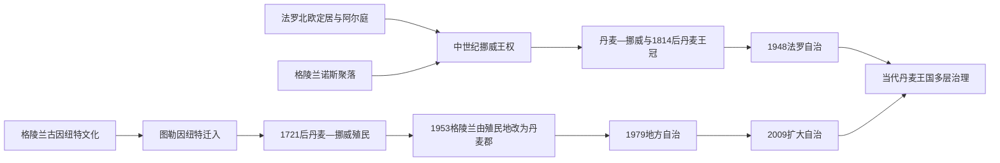

# 法罗群岛与格陵兰历史

[返回北欧历史总览](/%E4%BA%BA%E6%96%87%E7%A7%91%E5%AD%A6/%E5%8E%86%E5%8F%B2/%E6%AC%A7%E6%B4%B2/%E5%8C%97%E6%AC%A7/README.md)

## 范围与关键辨析

法罗群岛和格陵兰均属于丹麦王国，但历史人群、语言、殖民经验、自治法律和对外制度不同。法罗社会主要由北欧定居传统发展，格陵兰主体民族为因纽特人，古因纽特文化（考古文献旧称“古爱斯基摩”）、图勒文化、诺斯聚落和丹麦殖民是多条并行历史。两地都不属于欧洲联盟；自治不等于独立，丹麦王国也不等于由哥本哈根对全部内部事务直接管理。

## 法罗群岛

### 定居、阿尔庭与挪威王权

考古显示北欧人大规模定居前可能已有短期人类活动，爱尔兰修士传说是否对应持续聚落仍有争议。约9世纪北欧定居者及不列颠群岛来源人口建立农牧、捕鱼和海鸟利用社会。廷加内斯的阿尔庭传统约可追溯至维京时代，地方法律和土地制度逐渐形成。1035年前后法罗接受挪威王权，地方议会和教会仍继续运作。

1380年丹麦、挪威共主后，法罗随挪威王冠进入哥本哈根体系。宗教改革没收教产并确立路德宗，贸易由王室和特许商人垄断；1709年起丹麦王室贸易垄断延续至1856年。1814年丹麦失去挪威，法罗与冰岛、格陵兰留在丹麦。1816年旧议会被撤，群岛作为丹麦行政区治理；1852年议会以咨询机构恢复。

### 民族政治、战争与自治

19世纪末法罗语运动把口语、书写、教会和教育权与自治诉求结合。1906年议会选举后，主张联盟和自治的政党竞争成形。二战中德国占领丹麦，英国于1940年占领法罗以防其被利用；法罗船只向英国供应鱼类，人员和船舶损失严重。英国承认法罗旗用于航运，地方政府在与哥本哈根中断时承担更多权力。

1946年独立公投以微弱差距支持脱离，但无效票、低差距、议会解散和丹麦国王决定引发宪政争议；新选举后并未立即独立。1948年《自治法》把法罗确认为王国内自治共同体，事务分为本地接管和王国共同领域。此后教育、税收、渔业、商业等大部分内部事务由法罗议会与政府负责。法罗未随丹麦加入欧洲共同体，渔业与对外经贸安排具有特殊性。

### 1948年以来法罗政府首脑完整表

| 顺序 | 总理（Løgmaður） | 任期 | 党派 / 关键事件 |
|---:|---|---|---|
| 1 | 安德拉斯·萨穆埃尔森 | 1948—1950 | 联盟党；首届自治政府 |
| 2 | 克里斯蒂安·杜尔胡斯 | 1950—1959、1968—1970 | 联盟党；两次任职 |
| 3 | 彼得·莫尔·达姆 | 1959—1963、1967—1968 | 社会民主党；第二任内去世 |
| 4 | 哈昆·杜尔胡斯 | 1963—1967 | 人民党 |
| 5 | 阿特利·达姆 | 1970—1981、1985—1989、1991—1993 | 社会民主党，三次任职 |
| 6 | 保利·埃勒夫森 | 1981—1985 | 联盟党 |
| 7 | 约恩·松斯泰因 | 1989—1991 | 人民党 |
| 8 | 玛丽塔·彼得森 | 1993—1994 | 社会民主党；首位女性总理 |
| 9 | 埃德蒙·约恩森 | 1994—1998 | 联盟党 |
| 10 | 安芬·卡尔斯贝格 | 1998—2004 | 人民党；自治谈判加深 |
| 11 | 约阿内斯·艾德斯高 | 2004—2008 | 社会民主党 |
| 12 | 卡伊·莱奥·约翰内森 | 2008—2015 | 联盟党 |
| 13 | 阿克塞尔·V. 约翰内森 | 2015—2019、2022—2026 | 社会民主党，两次任职 |
| 14 | 巴尔杜尔·奥·斯泰格·尼尔森 | 2019—2022 | 联盟党 |
| 15 | **贝伊尼尔·约翰内森** | 2026年4月13日—至今 | 人民党；截至2026年7月14日任总理，领导人民党、联盟党、社会民主党广泛联盟 |

### 法罗权力结构

| 角色 | 截至2026年7月14日 | 权限 |
|---|---|---|
| 王国国家元首 | 丹麦国王弗雷德里克十世 | 共同君主，主要礼仪和宪法象征 |
| 法罗政府首脑 | 贝伊尼尔·约翰内森 | 领导对法罗议会负责的自治政府 |
| 法罗议会 | Løgting | 本地立法、预算和政府信任 |
| 丹麦高级专员 | 王国代表 | 联络、报告和共同事务，不是法罗行政首脑 |
| 王国政府 | 丹麦政府 | 处理尚未移交的防务、宪制等共同事务，并须与法罗协商 |

## 格陵兰

### 古因纽特文化、图勒人与诺斯聚落

格陵兰最早已知人群来自北美北极。萨卡克文化约前2500—前800年分布在西部和南部；独立一文化在高北活动，多塞特文化后来以海冰狩猎技术适应北极环境。各文化之间存在时间间断与区域差异，不能直接连成单一连续民族谱系。

约1200年前后，图勒文化祖先由阿拉斯加—加拿大方向进入，使用大型皮船、狗橇、捕鲸和复杂海兽技术，是现代格陵兰因纽特人的主要文化祖源。地方群体在海岸间迁徙、交换并适应小冰期。东部部分群体与西部长期联系有限。

985年前后埃里克“红发”带领诺斯人在南部建立东、西聚落，接受挪威王权和教会，依靠畜牧、海兽牙与欧洲交换。诺斯人与因纽特可能有接触，但材料有限，不能假定持续和平或全面战争。西聚落约14世纪消失，东聚落至15世纪中叶前后终结；气候变冷、贸易衰退、劳动力、生态压力和社会选择可能共同作用，没有单一确定原因。

### 殖民统治、整合与现代化

1721年传教士汉斯·埃格德到达西岸，试图寻找诺斯后裔并转向对因纽特传教，丹麦—挪威殖民据点由此重建。1774年王室格陵兰贸易局取得垄断，通过商站、价格和航运控制对外贸易；殖民官员与传教士依赖因纽特猎人的知识和产品，同时改变定居、疾病和权力结构。南北监察区、地方议事机关与教会教育逐步形成，格陵兰语书写和报刊也发展。

1814年格陵兰留在丹麦王冠。1953年丹麦修宪把格陵兰由殖民地改为丹麦郡，居民取得形式平等公民地位；随后集中化和“丹麦化”政策建设住房、医疗、学校和港口，却推动小聚落迁移、丹麦语教育和家庭分离。1951—1960年代儿童实验、强制或缺乏充分同意的避孕措施、图勒居民迁移等成为后来的责任与赔偿议题。快速现代化改善部分健康和基础设施，也制造社会创伤与不平等。

### 地方自治与扩大自治

1979年地方自治建立格陵兰议会和政府，内部事务逐步接管；1985年格陵兰退出欧洲共同体，继续以渔业协定联系欧洲。2009年《自治法》承认格陵兰人民的自决权，格陵兰语成为官方语言，并提供接管司法、警务、资源等更多领域的路径。丹麦仍负责或共同负责外交、防务和货币等未移交事务，国家拨款与渔业收入支撑财政。

独立讨论围绕政治自决、财政可持续、语言、人口和资源开发。矿产、稀土、铀、油气、旅游和机场可能扩大收入，也带来环境、社区和外国资本风险。北极军事地位使美国皮图菲克太空基地、丹麦防务与格陵兰政府协商成为王国政治核心。

### 1979年以来格陵兰政府首脑完整表

| 顺序 | 政府主席 | 任期 | 党派 / 关键事件 |
|---:|---|---|---|
| 1 | **约纳坦·莫茨费尔特** | 1979—1991、1997—2002 | 前进党；首任地方自治政府主席，两次任职 |
| 2 | 拉尔斯-埃米尔·约翰森 | 1991—1997 | 前进党 |
| 3 | 汉斯·埃诺克森 | 2002—2009 | 前进党；后创立纳莱拉克党 |
| 4 | 库皮克·克莱斯特 | 2009—2013 | 因纽特共同体党；扩大自治实施初期 |
| 5 | 阿莱卡·哈蒙德 | 2013—2014 | 前进党；首位女性政府主席，因开支争议离任 |
| 6 | 金·基尔森 | 2014—2021 | 前进党；先代理后正式组阁 |
| 7 | 穆特·博鲁普·埃格德 | 2021—2025 | 因纽特共同体党 |
| 8 | **延斯-弗雷德里克·尼尔森** | 2025—至今 | 民主党；截至2026年7月14日任政府主席 |

### 格陵兰权力结构

| 角色 | 截至2026年7月14日 | 权限 |
|---|---|---|
| 王国国家元首 | 丹麦国王弗雷德里克十世 | 共同君主；不主持格陵兰日常行政 |
| 格陵兰政府主席 | 延斯-弗雷德里克·尼尔森 | 领导 Naalakkersuisut，对格陵兰议会负责 |
| 格陵兰议会 | Inatsisartut | 自治领域立法、预算和政府信任 |
| 丹麦高级专员 | 王国代表 | 联络王国机构，不是殖民总督或政府首脑 |
| 丹麦政府 | 王国共同事务 | 防务、货币等未移交领域；涉格陵兰外交与安全应有实质协商 |

## 两地比较与重要事件

| 时间 | 法罗群岛 | 格陵兰 |
|---|---|---|
| 约9世纪 | 北欧定居和议会传统 | 多塞特文化时期，图勒文化尚未进入 |
| 约1200年 | 挪威王权与教会整合 | 图勒因纽特扩展；诺斯聚落仍存在 |
| 1380年 | 随挪威与丹麦共主 | 诺斯聚落属挪威王权，因纽特社会自治 |
| 1721年 | 丹麦王冠和贸易体系 | 丹麦—挪威传教与殖民重建 |
| 1814年 | 留在丹麦王冠 | 留在丹麦王冠 |
| 1940—1945年 | 英国占领，地方权力增强 | 与被占丹麦隔绝，美国承担防务并建基地 |
| 1948年 | 《自治法》 | 仍为殖民地 |
| 1953年 | 丹麦行政区内自治讨论 | 殖民地改为丹麦郡 |
| 1979年 | 已有自治 | 地方自治成立 |
| 1985年 | 从未加入欧洲共同体 | 退出欧洲共同体 |
| 2009年 | 自治继续扩大 | 《自治法》承认自决并扩大接管权 |
| 2026年 | 贝伊尼尔·约翰内森任总理 | 延斯-弗雷德里克·尼尔森任政府主席 |

### 兴衰与因果辨析

- 法罗自治由语言民族运动、战时自主管理、1946年争议公投和丹麦—法罗妥协逐步形成，并非一次独立革命。
- 格陵兰从殖民地到自治的转型包含正式权利扩展，也须面对现代化强制、语言等级、人口迁移和未充分追责的历史伤害。
- 两地渔业都是财政和外交支柱；资源单一会放大价格、配额和生态波动。
- 独立的直接法律路径、财政条件和民意不同；不能把扩大自治自动写成既定独立倒计时。
- 王国共同外交与防务不应被理解为地方无发言权，地方自治也不意味着已经取得完整国家主权。
