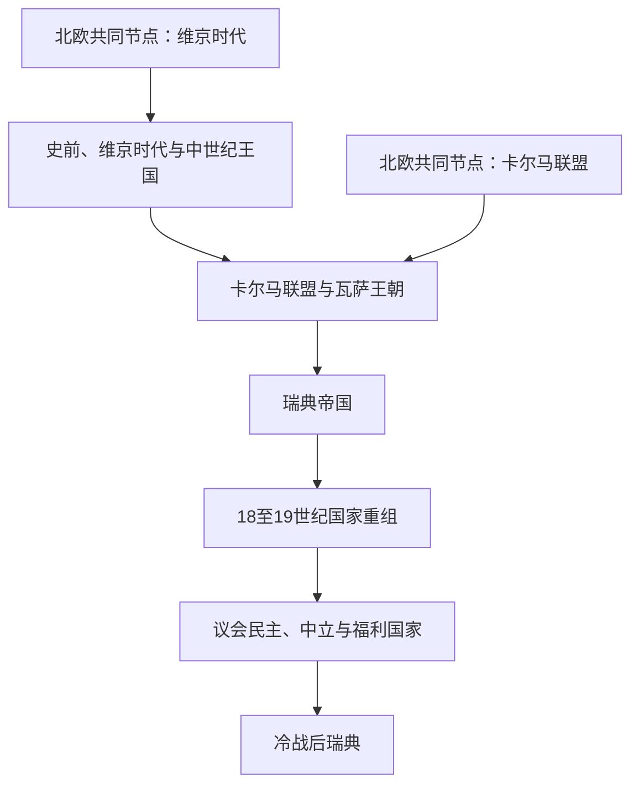

# 瑞典历史

## 概括

瑞典历史从斯韦阿、约塔等区域社会，经维京时代的波罗的海网络和中世纪王国整合，进入卡尔马联盟；1523年瓦萨王朝建立独立而集中的国家，17世纪成为波罗的海强权。大国时代结束后，瑞典经历宪制重组、工业化、议会民主与福利国家建设，并在冷战后先后加入欧洲联盟和北约。

## 历史演进图

## 历史主线

瑞典的国家整合和疆域变化必须分开理解：中世纪王国形成并无单一完成时点；卡尔马联盟是三国共戴君主而不是瑞典被并入丹麦；17世纪帝国又是多省份、多制度的军事财政强权。1809年失去芬兰和1905年挪威联合解体，使疆域趋近现代范围。20世纪的民主化、非交战路线和福利制度构成另一条制度主线，2024年加入北约则结束了长期军事不结盟。

## 按时间导航

| 顺序 | 阶段 | 时间 | 历史走向 |
|---:|---|---|---|
| 1 | [史前、维京时代与中世纪王国](/%E4%BA%BA%E6%96%87%E7%A7%91%E5%AD%A6/%E5%8E%86%E5%8F%B2/%E6%AC%A7%E6%B4%B2/%E5%8C%97%E6%AC%A7/%E7%91%9E%E5%85%B8/%E5%8F%B2%E5%89%8D%E3%80%81%E7%BB%B4%E4%BA%AC%E6%97%B6%E4%BB%A3%E4%B8%8E%E4%B8%AD%E4%B8%96%E7%BA%AA%E7%8E%8B%E5%9B%BD.md) | 史前—1397年 | 区域社会、东向维京网络、基督教化与王权整合。 |
| 2 | [卡尔马联盟与瓦萨王朝](/%E4%BA%BA%E6%96%87%E7%A7%91%E5%AD%A6/%E5%8E%86%E5%8F%B2/%E6%AC%A7%E6%B4%B2/%E5%8C%97%E6%AC%A7/%E7%91%9E%E5%85%B8/%E5%8D%A1%E5%B0%94%E9%A9%AC%E8%81%94%E7%9B%9F%E4%B8%8E%E7%93%A6%E8%90%A8%E7%8E%8B%E6%9C%9D.md) | 1397—1611年 | 联盟冲突、1523年独立、宗教改革和中央国家形成。 |
| 3 | [瑞典帝国](/%E4%BA%BA%E6%96%87%E7%A7%91%E5%AD%A6/%E5%8E%86%E5%8F%B2/%E6%AC%A7%E6%B4%B2/%E5%8C%97%E6%AC%A7/%E7%91%9E%E5%85%B8%E5%B8%9D%E5%9B%BD.md) | 1611—1721年 | 军事财政改革、三十年战争和波罗的海强权兴衰。 |
| 4 | [18至19世纪国家重组](/%E4%BA%BA%E6%96%87%E7%A7%91%E5%AD%A6/%E5%8E%86%E5%8F%B2/%E6%AC%A7%E6%B4%B2/%E5%8C%97%E6%AC%A7/%E7%91%9E%E5%85%B8/18%E8%87%B319%E4%B8%96%E7%BA%AA%E5%9B%BD%E5%AE%B6%E9%87%8D%E7%BB%84.md) | 1718—1905年 | 自由时代、1809年宪制、失去芬兰及挪威联合。 |
| 5 | [议会民主、中立与福利国家](/%E4%BA%BA%E6%96%87%E7%A7%91%E5%AD%A6/%E5%8E%86%E5%8F%B2/%E6%AC%A7%E6%B4%B2/%E5%8C%97%E6%AC%A7/%E7%91%9E%E5%85%B8/%E8%AE%AE%E4%BC%9A%E6%B0%91%E4%B8%BB%E3%80%81%E4%B8%AD%E7%AB%8B%E4%B8%8E%E7%A6%8F%E5%88%A9%E5%9B%BD%E5%AE%B6.md) | 1905—1991年 | 普选、两次世界大战、冷战不结盟和福利制度。 |
| 6 | [冷战后瑞典](/%E4%BA%BA%E6%96%87%E7%A7%91%E5%AD%A6/%E5%8E%86%E5%8F%B2/%E6%AC%A7%E6%B4%B2/%E5%8C%97%E6%AC%A7/%E7%91%9E%E5%85%B8/%E5%86%B7%E6%88%98%E5%90%8E%E7%91%9E%E5%85%B8.md) | 1991年至今 | 金融调整、欧洲联盟和2024年加入北约。 |

## 北欧共同节点

| 共同主题 | 入口 | 本国阅读重点 |
|---|---|---|
| 史前背景 | [史前北欧](/%E4%BA%BA%E6%96%87%E7%A7%91%E5%AD%A6/%E5%8E%86%E5%8F%B2/%E6%AC%A7%E6%B4%B2/%E5%8C%97%E6%AC%A7/%E5%8F%B2%E5%89%8D%E5%8C%97%E6%AC%A7.md) | 瑞典各区域并不同时形成统一政治共同体。 |
| 海上网络 | [维京时代](/%E4%BA%BA%E6%96%87%E7%A7%91%E5%AD%A6/%E5%8E%86%E5%8F%B2/%E6%AC%A7%E6%B4%B2/%E5%8C%97%E6%AC%A7/%E7%BB%B4%E4%BA%AC%E6%97%B6%E4%BB%A3.md) | 波罗的海、罗斯水道与瑞典方向的活动。 |
| 三国联合 | [卡尔马联盟](/%E4%BA%BA%E6%96%87%E7%A7%91%E5%AD%A6/%E5%8E%86%E5%8F%B2/%E6%AC%A7%E6%B4%B2/%E5%8C%97%E6%AC%A7/%E5%8D%A1%E5%B0%94%E9%A9%AC%E8%81%94%E7%9B%9F.md) | 瑞典反联盟政治和1523年退出。 |
| 北欧重组 | [北欧现代国家形成](/%E4%BA%BA%E6%96%87%E7%A7%91%E5%AD%A6/%E5%8E%86%E5%8F%B2/%E6%AC%A7%E6%B4%B2/%E5%8C%97%E6%AC%A7/%E5%8C%97%E6%AC%A7%E7%8E%B0%E4%BB%A3%E5%9B%BD%E5%AE%B6%E5%BD%A2%E6%88%90.md) | 1809年、1814年和1905年的疆域与联合变化。 |

## 关键辨析

- “斯韦阿”“约塔”等古代或中世纪群体不能直接等同于固定边界内的现代瑞典民族。
- 卡尔马联盟保留三国法律和政治共同体，不是丹麦吞并瑞典。
- 瑞典帝国的海外省份具有不同法律与等级结构，不应画成现代瑞典国家的简单扩张。
- 20世纪瑞典在战争中的中立、冷战军事不结盟和2024年后的北约成员身份是不同政策阶段。
- 瑞典加入欧洲联盟但未采用欧元。

## 上级

- [北欧历史](/%E4%BA%BA%E6%96%87%E7%A7%91%E5%AD%A6/%E5%8E%86%E5%8F%B2/%E6%AC%A7%E6%B4%B2/%E5%8C%97%E6%AC%A7/README.md)

## 君主、摄政与政府首脑专表

[瑞典君主、摄政与政府首脑表](/%E4%BA%BA%E6%96%87%E7%A7%91%E5%AD%A6/%E5%8E%86%E5%8F%B2/%E6%AC%A7%E6%B4%B2/%E5%8C%97%E6%AC%A7/%E7%91%9E%E5%85%B8/%E7%91%9E%E5%85%B8%E5%90%9B%E4%B8%BB%E3%80%81%E6%91%84%E6%94%BF%E4%B8%8E%E6%94%BF%E5%BA%9C%E9%A6%96%E8%84%91%E8%A1%A8.md)列明早期争议王、共治和复位、卡尔马联盟时期全部全国摄政、瓦萨以后连续王位，并连续整理1876年以来首相及截至2026年7月14日的权力结构。
