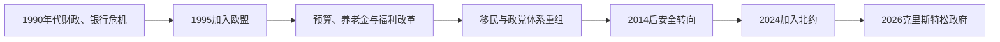

# 冷战后瑞典

## 时间

1991年至今

## 概括

冷战结束后，瑞典经历金融危机、福利和财政制度调整，并在1995年加入欧洲联盟。长期军事不结盟政策在2022年后发生根本转折，瑞典于2024年加入北约。

## 历史走向

- 1990年代初银行与房地产危机导致经济衰退，政府实施银行处置、财政规则和公共部门改革。
- 1995年瑞典加入欧洲联盟，进一步进入欧洲单一市场和共同政治合作；2003年公投否决采用欧元，瑞典继续使用克朗。
- 福利国家没有被简单取消，而是在预算约束、地方服务、市场机制和普遍福利之间不断调整。
- 移民、城市分化、就业融合、人口老龄化和公共服务能力成为国内政治的重要议题。
- 瑞典继续发展出口工业、数字经济和气候政策，同时面对能源结构、地区差异与全球供应链变化。
- 俄罗斯于2022年全面入侵乌克兰后，瑞典与芬兰共同申请加入北约。瑞典于2024年3月7日正式成为北约成员，持续两百余年的不结盟传统由集体防务取代。
- 瑞典加入北约后，欧洲联盟、北欧防务合作和北约构成相互交叠的安全框架。

## 关键辨析

- 加入欧洲联盟没有使瑞典自动采用欧元。
- 20世纪中立、冷战军事不结盟和2024年后的北约成员身份是三个不同阶段。
- “冷战后瑞典”既包含福利制度改革，也包含制度延续，不能只概括为福利国家衰退。

## 演变关系

- 前一节点：[瑞典的议会民主、中立与福利国家](/%E4%BA%BA%E6%96%87%E7%A7%91%E5%AD%A6/%E5%8E%86%E5%8F%B2/%E6%AC%A7%E6%B4%B2/%E5%8C%97%E6%AC%A7/%E7%91%9E%E5%85%B8/%E8%AE%AE%E4%BC%9A%E6%B0%91%E4%B8%BB%E3%80%81%E4%B8%AD%E7%AB%8B%E4%B8%8E%E7%A6%8F%E5%88%A9%E5%9B%BD%E5%AE%B6.md)。
- 所属主线：[瑞典历史](/%E4%BA%BA%E6%96%87%E7%A7%91%E5%AD%A6/%E5%8E%86%E5%8F%B2/%E6%AC%A7%E6%B4%B2/%E5%8C%97%E6%AC%A7/%E7%91%9E%E5%85%B8/README.md)、[北欧历史](/%E4%BA%BA%E6%96%87%E7%A7%91%E5%AD%A6/%E5%8E%86%E5%8F%B2/%E6%AC%A7%E6%B4%B2/%E5%8C%97%E6%AC%A7/README.md)。

## 演进图

## 经济与欧洲路线

1990年代初固定汇率、信贷自由化和房地产泡沫共同引发银行危机、失业和财政赤字。国家担保、接管问题资产、浮动汇率与预算改革稳定金融，但福利削减和失业扩大社会代价。1994年公投支持加入欧洲联盟，1995年正式成为成员；2003年公投拒绝欧元，因此保留克朗。

预算上限、独立央行和跨党派养老金制度提高财政稳定。出口工业、数字技术和绿色产业发展，住房短缺、城乡差异、学校分化和医疗可及性持续争论。移民从劳工和难民流入逐步成为党争中心；2015年接收大量寻求庇护者后，边境与居留政策收紧。瑞典民主党崛起打破传统左右联盟模式，2022年克里斯特松政府通过《蒂德协议》获得其议会支持，但该党不入阁。

## 从军事不结盟到北约

冷战后瑞典加入欧盟、参加北约和平伙伴关系和海外行动，形式上仍保留军事不结盟。2014年俄罗斯吞并克里米亚后恢复国防投入，2017年恢复征兵。2022年俄军全面入侵乌克兰后，瑞典与芬兰共同申请北约；土耳其、匈牙利批准过程使入盟延迟，瑞典最终于2024年3月成为成员。

加入北约结束公开的不结盟身份，但不自动取消议会对驻军、核政策和国防预算的决定。瑞典加强波罗的海、哥特兰和总防御，也继续欧盟安全合作及对乌援助。

## 现任制度与事件

截至2026年7月14日，卡尔十六世·古斯塔夫仍为礼仪性国家元首；乌尔夫·克里斯特松自2022年10月18日起为首相，领导温和党、基督教民主党和自由党政府。政府由瑞典民主党通过议会协议支持。君主不任命首相，首相由议会议长提名、议会依消极多数规则表决。

| 时间 | 事件 | 长期影响 |
|---|---|---|
| 1991—1994年 | 银行与财政危机 | 形成新预算、货币和监管框架 |
| 1995年 | 加入欧盟 | 法规、市场和外交深度欧洲化 |
| 2003年 | 拒绝欧元 | 保留克朗和本国货币政策 |
| 2010年 | 瑞典民主党进入议会 | 移民与联盟政治结构重组 |
| 2015年 | 难民接收高峰 | 庇护、融合和边境政策明显收紧 |
| 2017年 | 恢复征兵 | 总防御与安全政策转向 |
| 2022年 | 申请北约 | 军事不结盟路线终结 |
| 2022年10月 | 克里斯特松政府成立 | 中右翼内阁依赖瑞典民主党外部支持 |
| 2024年3月 | 正式加入北约 | 瑞典进入集体防务条约 |
| 2024—2026年 | 总防御与乌克兰支持扩大 | 波罗的海安全成为国家优先事项 |

完整国家元首、摄政与首相表见[瑞典君主、摄政与政府首脑表](/%E4%BA%BA%E6%96%87%E7%A7%91%E5%AD%A6/%E5%8E%86%E5%8F%B2/%E6%AC%A7%E6%B4%B2/%E5%8C%97%E6%AC%A7/%E7%91%9E%E5%85%B8/%E7%91%9E%E5%85%B8%E5%90%9B%E4%B8%BB%E3%80%81%E6%91%84%E6%94%BF%E4%B8%8E%E6%94%BF%E5%BA%9C%E9%A6%96%E8%84%91%E8%A1%A8.md)。
