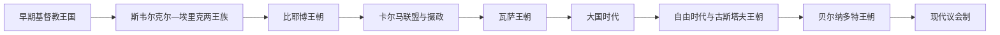

# 瑞典君主、摄政与政府首脑表

[返回瑞典历史](/%E4%BA%BA%E6%96%87%E7%A7%91%E5%AD%A6/%E5%8E%86%E5%8F%B2/%E6%AC%A7%E6%B4%B2/%E5%8C%97%E6%AC%A7/%E7%91%9E%E5%85%B8/README.md)

## 表格口径

约1000年前后的国王在位年和全国控制范围存在争议，斯韦阿兰与约塔兰也可能支持不同统治者。12—13世纪的斯韦尔克尔、埃里克两家相互争位，卡尔马联盟时期瑞典又多次由本国摄政而非联盟君主实际治理。本表因此把公认君主、共治者、复位和实际全国摄政按时间列明；短期地方争位者只在备注中说明。1876年设现代首相职位，此后政府首脑另表连续列全。

## 早期王国与两王族竞争

| 顺序 | 君主 / 共治者 | 约在位 | 王室 / 关系 | 关键事件 / 备注 |
|---:|---|---|---|---|
| 1 | **胜利者埃里克** | 约970—995 | 蒙索王族传统 | 首位较可靠的瑞典国王之一；势力核心在梅拉伦地区 |
| 2 | **奥洛夫·舍特康努格** | 约995—1022 | 埃里克之子 | 首位明确受洗的瑞典王，铸币并与教会联系 |
| 3 | 阿农德·雅各布 | 约1022—1050 | 奥洛夫之子 | 基督教王权继续发展 |
| 4 | “老王”埃蒙德 | 约1050—1060 | 奥洛夫之子或异母弟 | 无存活男性继承，旧王族终结 |
| 5 | 斯滕希尔 | 约1060—1066 | 与埃蒙德家族联姻 | 斯滕希尔王朝开端 |
| 6a | 埃里克七世 | 约1066—1067 | 身份不详 | 与另一埃里克争位，两者均战死 |
| 6b | 埃里克八世 | 约1066—1067 | 身份不详 | 同期敌对王 |
| 7 | 哈尔斯滕 | 约1067—1070、约1079—1080 | 斯滕希尔之子 | 可能两度统治，年代不确定 |
| 8 | 阿农德·戈尔斯克 | 约1070—1075 | 可能来自罗斯 | 史料很少，统治真实性和范围有争议 |
| 9 | “红王”哈康 | 约1075—1079 | 王族关系不明 | 可能与哈尔斯滕时期重叠 |
| 10 | **英格一世** | 约1079—1084、约1087—1110 | 斯滕希尔之子 | 拒绝主持传统祭祀被逐，复位后推进基督教化 |
| 11 | “祭祀王”斯文 | 约1084—1087 | 英格一世姻亲 | 传统宗教反对派拥立；被英格击败 |
| 12 | 菲利普 | 约1105—1118 | 哈尔斯滕之子 | 一度与英格二世共治 |
| 13 | 英格二世 | 约1110—1125 | 哈尔斯滕之子 | 无嗣，斯滕希尔男性主线终结 |
| 14 | 拉格瓦尔德·克纳普赫夫德 | 约1125—1126 | 王族关系不明 | 在西约特兰遇害，统治范围有限 |
| 15 | 马格努斯一世 | 约1125—1134 | 丹麦王子、英格一世外孙 | 主要获西约特兰支持，未必统治全瑞典 |
| 16 | **斯韦尔克尔一世** | 约1130—1156 | 斯韦尔克尔王族 | 在东约特兰兴起，被刺杀 |
| 17 | **埃里克九世** | 约1156—1160 | 埃里克王族 | 后世称圣埃里克；远征芬兰的传统细节有争议，遇害 |
| 18 | 马格努斯二世 | 1160—1161 | 丹麦王族后裔 | 击杀埃里克九世后短暂称王，被卡尔七世击败 |
| 19 | 卡尔七世 | 约1161—1167 | 斯韦尔克尔一世之子 | 被克努特一世杀害 |
| 20a | 科尔 | 1167—约1173 | 斯韦尔克尔王族 | 与克努特一世争位，部分地区统治 |
| 20b | 布里斯莱夫 | 约1167—1169 | 斯韦尔克尔王族 | 与科尔并立，史料有限 |
| 21 | 克努特一世 | 1167/1173—1195/1196 | 埃里克九世之子 | 击败对手后长期统治 |
| 22 | 斯韦尔克尔二世 | 1196—1208 | 卡尔七世之子 | 被埃里克十世击败流亡，复国再败 |
| 23 | 埃里克十世 | 1208—1216 | 克努特一世之子 | 与丹麦王室联姻，首次明确加冕传统之一 |
| 24 | 约翰一世 | 1216—1222 | 斯韦尔克尔二世之子 | 无嗣，斯韦尔克尔主线终结 |
| 25 | 埃里克十一世 | 1222—1229、1234—1250 | 埃里克十世之子 | 幼年即位，被废后复位；比耶尔·亚尔掌实际军政 |
| 26 | 克努特二世 | 1229—1234 | 王族旁支 | 废黜埃里克十一世，后被推翻 |

## 比耶博王朝、共治与卡尔马联盟

| 顺序 | 君主 / 摄政 | 在位 / 掌权 | 性质 | 关键事件 / 备注 |
|---:|---|---|---|---|
| 27 | 瓦尔德马 | 1250—1275 | 埃里克十一世外甥，比耶尔·亚尔之子 | 幼年由父亲实际摄政；后被弟马格努斯废黜 |
| 28 | **马格努斯三世** | 1275—1290 | 瓦尔德马之弟 | 贵族与骑士制度发展 |
| 29 | 比耶尔 | 1290—1318 | 马格努斯三世之子 | 幼年摄政；与两弟冲突及尼雪平宴会导致被废 |
| 30 | **马格努斯四世** | 1319—1364 | 比耶尔之侄、兼挪威王 | 幼年摄政；购买斯科讷后财政紧张，与贵族和儿子冲突 |
| 31 | 埃里克十二世 | 1356—1359 | 马格努斯四世之子 | 反父共治，死于瘟疫 |
| 32 | 哈康 | 1362—1364 | 马格努斯四世之子、挪威王 | 瑞典共治王，后被贵族拥立阿尔布雷希特取代 |
| 33 | 阿尔布雷希特 | 1364—1389 | 梅克伦堡王室 | 依贵族支持即位；与玛格丽特战争中被俘 |
| — | **玛格丽特一世** | 1389—1412 | 丹麦、挪威实际君主 | 击败阿尔布雷希特，建立卡尔马联盟 |
| 34 | 埃里克十三世 | 1396—1434、1435—1436、1436—1439 | 联盟君主 | 瑞典控制多次中断；恩格尔布雷克起义后摄政兴起 |
| — | 恩格尔布雷克·恩格尔布雷克松 | 1435—1436 | 全国统帅 / 摄政 | 矿区起义领袖，遇刺 |
| — | 卡尔·克努特松 | 1438—1440 | 摄政 | 后三度成为国王 |
| 35 | 克里斯托弗 | 1441—1448 | 联盟君主 | 无嗣 |
| 36 | **卡尔八世·克努特松** | 1448—1457、1464—1465、1467—1470 | 本国国王，三次在位 | 与联盟派贵族、丹麦王反复争夺 |
| 37 | 克里斯蒂安一世 | 1457—1464 | 丹麦联盟君主 | 被瑞典反抗推翻 |
| — | 延斯·本特松、埃里克·阿克塞尔松 | 1457年 | 共同摄政 | 卡尔八世被废后的过渡 |
| — | 克蒂尔·卡尔松 | 1464—1465 | 摄政 | 领导反丹麦起义 |
| — | 延斯·本特松 | 1465—1466 | 摄政 | 大主教兼政权首脑 |
| — | 埃里克·阿克塞尔松 | 1466—1467 | 摄政 | 促成卡尔八世复位 |
| — | **老斯滕·斯图雷** | 1470—1497、1501—1503 | 摄政 | 1471年布伦克贝里战胜丹麦；创建乌普萨拉大学时期 |
| 38 | 汉斯 | 1497—1501 | 丹麦联盟君主 | 短暂恢复联盟统治，被起义推翻 |
| — | 斯万特·尼尔松 | 1504—1512 | 摄政 | 继续抗丹麦路线 |
| — | 埃里克·特罗勒 | 1512年1—7月 | 摄政 | 联盟派短暂掌权 |
| — | **小斯滕·斯图雷** | 1512—1520 | 摄政 | 与大主教和克里斯蒂安二世斗争，战伤去世 |
| 39 | 克里斯蒂安二世 | 1520—1521 | 丹麦联盟君主 | 斯德哥尔摩惨案后瓦萨起义，实际控制迅速崩溃 |
| — | 古斯塔夫·瓦萨 | 1521—1523 | 摄政 | 领导起义，后当选国王 |

## 瓦萨王朝、大国时代与18世纪

| 顺序 | 君主 | 王室 | 在位 | 关键事件 / 备注 |
|---:|---|---|---|---|
| 40 | **古斯塔夫一世·瓦萨** | 瓦萨 | 1523—1560 | 脱离联盟、宗教改革、世袭王权与税役整合 |
| 41 | 埃里克十四世 | 瓦萨 | 1560—1568 | 利沃尼亚扩张；精神危机和贵族冲突，被弟弟废黜 |
| 42 | 约翰三世 | 瓦萨 | 1568—1592 | 对波兰联姻，调整宗教政策 |
| 43 | 西吉斯蒙德 | 瓦萨 | 1592—1599 | 兼波兰王、天主教；被叔父卡尔及议会废黜 |
| 44 | 卡尔九世 | 瓦萨 | 1604—1611；1599年起摄政 | 对丹麦、波兰、俄罗斯战争 |
| 45 | **古斯塔夫二世·阿道夫** | 瓦萨 | 1611—1632 | 行政和军事改革，三十年战争中阵亡 |
| 46 | 克里斯蒂娜 | 瓦萨 | 1632—1654 | 1632—1644年摄政；1648年大国地位高峰，主动退位 |
| 47 | 卡尔十世·古斯塔夫 | 普法尔茨 | 1654—1660 | 对波兰、丹麦战争，1658年取得斯科讷等地 |
| 48 | 卡尔十一世 | 普法尔茨 | 1660—1697 | 1660—1672年摄政；土地收回、军事编制和绝对王权 |
| 49 | 卡尔十二世 | 普法尔茨 | 1697—1718 | 大北方战争，1709年波尔塔瓦败，进攻挪威时阵亡 |
| 50 | 乌尔丽卡·埃利奥诺拉 | 普法尔茨 | 1718—1720 | 接受议会限制，退位给丈夫 |
| 51 | 弗雷德里克一世 | 黑森 | 1720—1751 | “自由时代”君主，实权主要在等级议会 |
| 52 | 阿道夫·弗雷德里克 | 荷尔斯泰因-戈托普 | 1751—1771 | 王室与帽子党、便帽党议会政治并存 |
| 53 | **古斯塔夫三世** | 荷尔斯泰因-戈托普 | 1771—1792 | 1772年政变加强王权；文化改革，后遇刺 |
| 54 | 古斯塔夫四世·阿道夫 | 荷尔斯泰因-戈托普 | 1792—1809 | 1792—1796年摄政；芬兰战争失败后被政变废黜 |
| 55 | 卡尔十三世 | 荷尔斯泰因-戈托普 | 1809—1818 | 接受1809年宪法；无存活合法子嗣，收养贝尔纳多特 |

## 贝尔纳多特王朝与现代君主

| 顺序 | 君主 | 在位 | 与前任关系 | 关键事件 / 备注 |
|---:|---|---|---|---|
| 56 | 卡尔十四世·约翰 | 1818—1844 | 卡尔十三世养子，原法国元帅贝尔纳多特 | 1810年起王储掌实权；建立挪威联合并维持和平外交 |
| 57 | 奥斯卡一世 | 1844—1859 | 卡尔十四世之子 | 自由化和斯堪的纳维亚主义时期 |
| 58 | 卡尔十五世 | 1859—1872 | 奥斯卡一世之子 | 议会改革前后 |
| 59 | 奥斯卡二世 | 1872—1907 | 卡尔十五世之弟 | 1876年首相职位建立；1905年失去挪威王位，仍为瑞典王至1907年 |
| 60 | 古斯塔夫五世 | 1907—1950 | 奥斯卡二世之子 | 1914年宫廷危机后王权政治作用衰退；经历两次世界大战 |
| 61 | 古斯塔夫六世·阿道夫 | 1950—1973 | 古斯塔夫五世之子 | 接受议会化，1974年新政府法前夕去世 |
| 62 | **卡尔十六世·古斯塔夫** | 1973—至今 | 古斯塔夫六世之孙 | 1974年后仅礼仪和代表职能；截至2026年7月14日在位 |

## 1876年以来首相完整表

| 顺序 | 首相 | 任期 | 政治阶段 / 备注 |
|---:|---|---|---|
| 1 | 路易·德·耶尔 | 1876—1880 | 首任现代首相 |
| 2 | 阿尔维德·波瑟 | 1880—1883 | 农业与国防争议 |
| 3 | C. J. 蒂塞利乌斯 | 1883—1884 | 官僚过渡政府 |
| 4 | 罗伯特·滕普坦德 | 1884—1888 | 自由贸易路线 |
| 5 | 吉利斯·比尔特 | 1888—1889 | 保守政府 |
| 6 | 古斯塔夫·奥克耶尔姆 | 1889—1891 | 因外交言论辞职 |
| 7 | E. G. 博斯特伦 | 1891—1900、1902—1905 | 两次任职；挪威联合危机 |
| 8 | 弗雷德里克·冯·奥特 | 1900—1902 | 国防改革 |
| 9 | 约翰·拉姆斯泰特 | 1905年4—8月 | 挪威联合解体时辞职 |
| 10 | 克里斯蒂安·伦德贝里 | 1905年8—11月 | 联合政府完成卡尔斯塔德谈判 |
| 11 | 卡尔·斯塔夫 | 1905—1906、1911—1914 | 自由派；两次任职 |
| 12 | 阿尔维德·林德曼 | 1906—1911、1928—1930 | 保守派，两次任职 |
| 13 | 亚尔马·哈马舍尔德 | 1914—1917 | 一战中立、物资危机，属王室支持的官僚政府 |
| 14 | 卡尔·斯瓦茨 | 1917年3—10月 | 议会化过渡 |
| 15 | 尼尔斯·埃登 | 1917—1920 | 自由—社民联合，完成普选改革 |
| 16 | **亚尔马·布兰廷** | 1920、1921—1923、1924—1925 | 首位社会民主党首相，三次任职 |
| 17 | 小路易·德·耶尔 | 1920—1921 | 少数政府 |
| 18 | 奥斯卡·冯·叙多 | 1921年2—10月 | 官僚过渡 |
| 19 | 恩斯特·特吕格 | 1923—1924 | 保守政府 |
| 20 | 里卡德·桑德勒 | 1925—1926 | 社会民主党 |
| 21 | C. G. 埃克曼 | 1926—1928、1930—1932 | 自由人民党，两次任职 |
| 22 | 费利克斯·哈姆林 | 1932年8—9月 | 短期看守 |
| 23 | **佩尔·阿尔宾·汉松** | 1932—1936、1936—1946 | 社民“人民之家”；二战联合政府，任内去世 |
| 24 | A. 佩尔松-布拉姆斯托普 | 1936年6—9月 | 农民联盟短期政府 |
| 25 | **塔格·埃兰德** | 1946—1969 | 社民党，战后福利国家长期建设 |
| 26 | **奥洛夫·帕尔梅** | 1969—1976、1982—1986 | 两次任职；1986年遇刺 |
| 27 | 图尔比约恩·费尔丁 | 1976—1978、1979—1982 | 中间党，核能争议 |
| 28 | 奥拉·乌尔斯滕 | 1978—1979 | 自由党少数政府 |
| 29 | 英瓦尔·卡尔松 | 1986—1991、1994—1996 | 社民党，两次任职 |
| 30 | 卡尔·比尔特 | 1991—1994 | 中右翼联盟；欧盟谈判 |
| 31 | 约兰·佩尔松 | 1996—2006 | 社民党 |
| 32 | 弗雷德里克·赖因费尔特 | 2006—2014 | 温和党联盟 |
| 33 | 斯特凡·勒文 | 2014—2021 | 社民党，联盟与少数政府 |
| 34 | 玛格达莱娜·安德松 | 2021—2022 | 首位女性首相 |
| 35 | **乌尔夫·克里斯特松** | 2022—至今 | 温和党；截至2026年7月14日为现任首相 |

## 截至2026年7月14日的权力结构

| 角色 | 人物 / 机构 | 实际权力 |
|---|---|---|
| 国家元首 | 卡尔十六世·古斯塔夫 | 代表和礼仪职能；不任命政府、不否决法律 |
| 政府首脑 | 乌尔夫·克里斯特松 | 由议会议长提名、议会表决后领导内阁 |
| 政府 | 温和党、基督教民主党、自由党联盟 | 依与瑞典民主党的议会合作取得政策支持 |
| 议会 | 一院制瑞典议会 | 立法、预算和监督，实行“消极议会制” |
| 原住民代表 | 萨米议会 | 民选代表兼国家行政机关，权限不等同领土自治政府 |

## 相关阶段

- [史前、维京时代与中世纪王国](/%E4%BA%BA%E6%96%87%E7%A7%91%E5%AD%A6/%E5%8E%86%E5%8F%B2/%E6%AC%A7%E6%B4%B2/%E5%8C%97%E6%AC%A7/%E7%91%9E%E5%85%B8/%E5%8F%B2%E5%89%8D%E3%80%81%E7%BB%B4%E4%BA%AC%E6%97%B6%E4%BB%A3%E4%B8%8E%E4%B8%AD%E4%B8%96%E7%BA%AA%E7%8E%8B%E5%9B%BD.md)
- [卡尔马联盟与瓦萨王朝](/%E4%BA%BA%E6%96%87%E7%A7%91%E5%AD%A6/%E5%8E%86%E5%8F%B2/%E6%AC%A7%E6%B4%B2/%E5%8C%97%E6%AC%A7/%E7%91%9E%E5%85%B8/%E5%8D%A1%E5%B0%94%E9%A9%AC%E8%81%94%E7%9B%9F%E4%B8%8E%E7%93%A6%E8%90%A8%E7%8E%8B%E6%9C%9D.md)
- [18至19世纪国家重组](/%E4%BA%BA%E6%96%87%E7%A7%91%E5%AD%A6/%E5%8E%86%E5%8F%B2/%E6%AC%A7%E6%B4%B2/%E5%8C%97%E6%AC%A7/%E7%91%9E%E5%85%B8/18%E8%87%B319%E4%B8%96%E7%BA%AA%E5%9B%BD%E5%AE%B6%E9%87%8D%E7%BB%84.md)
- [冷战后瑞典](/%E4%BA%BA%E6%96%87%E7%A7%91%E5%AD%A6/%E5%8E%86%E5%8F%B2/%E6%AC%A7%E6%B4%B2/%E5%8C%97%E6%AC%A7/%E7%91%9E%E5%85%B8/%E5%86%B7%E6%88%98%E5%90%8E%E7%91%9E%E5%85%B8.md)
