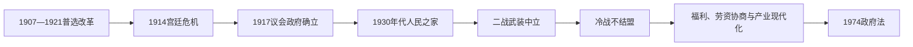

# 瑞典的议会民主、中立与福利国家

## 时间

1905年—1991年

## 概括

20世纪瑞典在两次世界大战中维持非交战路线，逐步完成普选和议会民主，并通过劳资协商、社会民主党长期执政和公共服务扩展形成福利国家。冷战时期实行军事不结盟，同时加强国防和西方经济联系。

## 历史走向

- 1905年与挪威联合解体后，瑞典集中处理本国议会化、工业劳资冲突和选举制度改革。
- 1917年国王接受由议会多数支持的政府，议会制原则稳定；1918—1921年改革确立普遍而平等的男女选举权。
- 第一次世界大战中瑞典保持中立，但粮食短缺、贸易和国内政治受到冲击。
- 1930年代经济危机推动社会民主党与农民政治合作；劳资组织通过集体谈判降低冲突，社会保险和住房政策扩展。
- 第二次世界大战期间瑞典保持非交战国地位，同时在对德贸易、过境安排、人道援助和后期支持邻国之间不断调整。中立不等于完全脱离战争压力。
- 战后“人民之家”理念转化为养老金、医疗、教育、育儿和住房等普遍福利制度；高就业和出口工业支撑财政基础。
- 冷战期间瑞典正式实行军事不结盟，维持较强国防，并与西方市场和北欧合作保持紧密联系。
- 1974年新政府法令确立议会制原则，君主不再承担实际政治权力；一院制议会已经在1971年运行。
- 1980年代金融与经济制度变化、冷战结束和国内财政压力，为1990年代政策转型创造条件。

## 关键辨析

- 瑞典的“中立”在不同战争和冷战阶段含义不同，不能理解为对外关系完全等距。
- 福利国家由工会、雇主、地方政府、政党与中央财政共同塑造，并非单一政党的孤立产物。
- 君主制延续不等于君主掌握行政权；当代瑞典的政府对议会负责。

## 演变关系

- 前一节点：[18至19世纪瑞典的国家重组](/%E4%BA%BA%E6%96%87%E7%A7%91%E5%AD%A6/%E5%8E%86%E5%8F%B2/%E6%AC%A7%E6%B4%B2/%E5%8C%97%E6%AC%A7/%E7%91%9E%E5%85%B8/18%E8%87%B319%E4%B8%96%E7%BA%AA%E5%9B%BD%E5%AE%B6%E9%87%8D%E7%BB%84.md)。
- 后一节点：[冷战后瑞典](/%E4%BA%BA%E6%96%87%E7%A7%91%E5%AD%A6/%E5%8E%86%E5%8F%B2/%E6%AC%A7%E6%B4%B2/%E5%8C%97%E6%AC%A7/%E7%91%9E%E5%85%B8/%E5%86%B7%E6%88%98%E5%90%8E%E7%91%9E%E5%85%B8.md)。

## 演进图

## 民主化的具体过程

1907—1909年男性选举权扩大并对比例代表制作出安排，女性全国选举权于1919年通过、1921年首次完整实施。1914年古斯塔夫五世在“庭院演说”中公开反对政府国防政策，斯塔夫内阁辞职；一战物资短缺、饥饿示威和俄国革命冲击迫使保守派接受改革。1917年国王接受由议会多数支撑的埃登—布兰廷政府，此后君主不得自行选择违背议会的内阁。

1932年社会民主党执政，1933年与农民联盟危机协议，以就业、农业支持和社会政策应对大萧条。“人民之家”并非一次建成：养老金、住房、医疗、教育和育儿制度在战前、战后数十年逐步扩展。1938年萨尔茨舍巴登协议由工会和雇主组织建立集中协商与劳资和平框架。

## 战争中立与冷战路线

二战中瑞典宣布中立，在德国占领邻国和盟军压力下作出铁矿石贸易、德军过境和难民接收等相互矛盾政策。1941年前后对德国让步最大，战局转变后加强对盟国合作并训练挪威、丹麦警察部队。政府保护本土免于战争，但“中立”不等于在每个阶段等距离或无道德争议。

冷战时期瑞典以和平时期不结盟、战争时争取中立为公开路线，建设强大总防御和军工产业，并秘密与西方共享情报和准备合作。外交支持联合国、裁军和反殖民议题。1950—1970年代出口工业、住房建设、女性就业与高税收支撑普遍福利；强制绝育、优生政策和对萨米人的种族化治理则揭示福利国家的排斥面。

1974年《政府法》把君主正式排除在政府形成和政策决策之外，议会议长主导首相提名。1976年社民党结束44年连续执政，此后联盟竞争正常化。

## 重要事件

| 时间 | 事件 | 影响 |
|---|---|---|
| 1907—1909年 | 男性普选改革 | 比例代表和更广选民基础形成 |
| 1914年 | 宫廷危机 | 王权与议会政府最后一次重大公开冲突 |
| 1917年 | 埃登—布兰廷政府 | 议会制确立 |
| 1921年 | 女性参与全国大选 | 平等普选完成 |
| 1932—1933年 | 社民执政与危机协议 | “人民之家”政治联盟形成 |
| 1938年 | 萨尔茨舍巴登协议 | 劳资自治协商制度化 |
| 1939—1945年 | 二战中立 | 避免占领但作出多重战略妥协 |
| 1946—1969年 | 埃兰德长期政府 | 福利、住房、教育和产业扩张 |
| 1952年 | 卡塔利娜事件 | 苏联击落瑞典飞机，冷战情报关系暴露 |
| 1969—1976年 | 帕尔梅首段执政 | 福利改革与积极国际主义 |
| 1974年 | 新政府法 | 君主礼仪化、议长主导政府形成 |
| 1976年 | 中右翼轮替 | 长期单党主导结束 |

历任首相连续表见[瑞典君主、摄政与政府首脑表](/%E4%BA%BA%E6%96%87%E7%A7%91%E5%AD%A6/%E5%8E%86%E5%8F%B2/%E6%AC%A7%E6%B4%B2/%E5%8C%97%E6%AC%A7/%E7%91%9E%E5%85%B8/%E7%91%9E%E5%85%B8%E5%90%9B%E4%B8%BB%E3%80%81%E6%91%84%E6%94%BF%E4%B8%8E%E6%94%BF%E5%BA%9C%E9%A6%96%E8%84%91%E8%A1%A8.md)。
