# 瑞典帝国

[返回北欧历史总览](/%E4%BA%BA%E6%96%87%E7%A7%91%E5%AD%A6/%E5%8E%86%E5%8F%B2/%E6%AC%A7%E6%B4%B2/%E5%8C%97%E6%AC%A7/README.md)

## 时间

1611—1721年

## 别称与范围

常称瑞典“大国时代”。瑞典在17世纪凭借军事财政改革、铜铁出口、外国补贴和连续战争成为波罗的海强权。帝国由不同法律共同体组成：瑞典本土与芬兰是王国的核心区域，爱沙尼亚、利沃尼亚、英格里亚等波罗的海省份保有不同程度的地方特权，波美拉尼亚等德意志领地则兼具神圣罗马帝国封地身份。它不是一个制度完全一致的单一民族国家。

## 建立背景与崛起机制

- 1523年瓦萨王朝脱离[卡尔马联盟](/%E4%BA%BA%E6%96%87%E7%A7%91%E5%AD%A6/%E5%8E%86%E5%8F%B2/%E6%AC%A7%E6%B4%B2/%E5%8C%97%E6%AC%A7/%E5%8D%A1%E5%B0%94%E9%A9%AC%E8%81%94%E7%9B%9F.md)后，把教会财产、税籍、铸币和军事动员逐渐纳入王权。16世纪取得爱沙尼亚北部，已开始在波罗的海东岸扩张。
- 古斯塔夫二世·阿道夫即位时同时面对丹麦、俄罗斯和波兰—立陶宛战争。1613年对丹麦议和代价沉重，却迫使王室改进税收、军队和外交。
- 省级登记、征兵轮换、火器训练和较灵活的战术提高军队效率；铜、铁、焦油等出口及荷兰资本为战争提供现金。
- 大法官阿克塞尔·乌克森谢纳建立中央官署和省长体系，1634年《政府组织法》把国王缺席或幼主时期的行政分工制度化。
- 瑞典以控制波罗的海港口和河口为目标，试图让贸易经过己方关税点；这一“波罗的海支配”从未完全实现，却持续塑造战争方向。
- 三十年战争期间，法国补贴、德意志盟友和新教政治合法性使人口有限的瑞典能在欧洲大陆维持远征军。

## 完整君主序列

| 顺序 | 君主 | 王室 | 在位 | 生卒 | 与前任关系 | 关键事件 / 备注 |
|---|---|---|---|---|---|---|
| 1 | **古斯塔夫二世·阿道夫** | 瓦萨王朝 | 1611—1632 | 1594—1632 | 卡尔九世之子 | 军事、财政和行政改革；1630年进入三十年战争，1632年吕岑战死 |
| 2 | 克里斯蒂娜 | 瓦萨王朝 | 1632—1654 | 1626—1689 | 古斯塔夫二世独女 | 1632—1644年由乌克森谢纳主导的摄政政府执政；1648年帝国达到欧洲权势高峰，1654年退位 |
| 3 | **卡尔十世·古斯塔夫** | 普法尔茨-茨韦布吕肯王朝 | 1654—1660 | 1622—1660 | 克里斯蒂娜表兄及指定继承人 | 北方战争和冰上进军迫使丹麦签订《罗斯基勒条约》；围攻哥本哈根失败 |
| 4 | 卡尔十一世 | 普法尔茨-茨韦布吕肯王朝 | 1660—1697 | 1655—1697 | 卡尔十世之子 | 1660—1672年由摄政政府统治；1680年后土地收回、军事编制和绝对王权改革 |
| 5 | **卡尔十二世** | 普法尔茨-茨韦布吕肯王朝 | 1697—1718 | 1682—1718 | 卡尔十一世之子 | 大北方战争早期获胜，1709年波尔塔瓦惨败；1718年进攻挪威时在弗雷德里克斯滕阵亡 |
| 6 | 乌尔丽卡·埃利奥诺拉 | 普法尔茨-茨韦布吕肯王朝 | 1718—1720 | 1688—1741 | 卡尔十二世之妹 | 放弃绝对王权主张并接受等级议会限制；1720年让位于丈夫 |
| 7 | 弗雷德里克一世 | 黑森-卡塞尔王朝 | 1720—1751；本篇涉及至1721 | 1676—1751 | 乌尔丽卡·埃利奥诺拉之夫 | 在议会限制下当选；1721年签订《尼斯塔德和约》，帝国阶段终结 |

## 统治结构

| 层次 / 区域 | 主要制度 | 权力与边界 |
|---|---|---|
| 君主与枢密院 | 国王统领战争、外交和任官；枢密院及各中央署分管财政、军务、司法等 | 幼主摄政时枢密院权力上升，1680年后国王压制贵族委员会 |
| 四等级议会 | 贵族、教士、市民、农民分别开会 | 对税收、继承和宪制具有作用；瑞典农民作为一个等级参与是本区重要特征 |
| 瑞典—芬兰核心区 | 省长、地方司法、教区、税籍和征兵体系 | 芬兰是王国东部核心与重要兵源，不是海外殖民地 |
| 斯科讷等原丹麦省份 | 初期保留部分旧法，随后推广瑞典行政、教会和法律 | 战争与同化政策并行，忠诚转换并非即时完成 |
| 波罗的海省份 | 德意志语贵族、庄园和城市特权影响较大 | 王室在赋税、司法、教育和农民地位改革上与地方精英反复博弈 |
| 德意志领地 | 作为帝国封地保留本地等级与法律 | 瑞典君主同时以德意志诸侯身份参与神圣罗马帝国政治 |
| 军事财政体系 | 征兵、土地配给制、税收、矿业和出口收入 | 小人口国家可维持强军，但长期动员把成本转嫁给农户和省份 |

## 分阶段发展

### 奠基与波罗的海突破（1611—1630）

1611年古斯塔夫二世继位后先后结束与丹麦、俄罗斯及波兰—立陶宛的战争。1617年《斯托尔博沃和约》使瑞典取得英格里亚与凯克斯霍尔姆，暂时切断俄罗斯通往波罗的海的直接出口；1621年占领里加，1629年《阿尔特马克停战协定》又使其控制利沃尼亚重要港口和部分关税。

### 三十年战争与大国地位（1630—1648）

瑞典军1630年登陆德意志，1631年布赖滕费尔德胜利扩大新教联盟。1632年古斯塔夫二世在吕岑战死，但摄政政府、将领和法国补贴使战争继续。1645年对丹麦的《布勒姆瑟布鲁和约》取得耶姆特兰、海里耶达伦、哥特兰等地；1648年《威斯特伐利亚和约》确认瑞典在西波美拉尼亚、维斯马、不来梅—费尔登等地的权利和帝国议席。

### 领土高峰与过度扩张（1648—1679）

克里斯蒂娜退位后，卡尔十世进攻波兰—立陶宛，引发俄国、勃兰登堡、丹麦等多方介入。1658年瑞典军越过结冰海峡迫使丹麦签订《罗斯基勒条约》，取得斯科讷、布莱金厄、哈兰、布胡斯等地；继续围攻哥本哈根却失败，1660年归还博恩霍尔姆和特伦德拉格。1675—1679年斯科讷战争暴露海军与财政弱点，瑞典主要依靠法国外交保住大部分领土。

### 集权整顿与大北方战争（1680—1721）

卡尔十一世自1680年起大规模收回贵族领地，整顿税收，以土地配给制维持常备军，并强化绝对王权。改革给继承人留下训练有素的军队，却也把战略决定过度集中于君主。1700年丹麦—挪威、萨克森—波兰—立陶宛和俄罗斯结盟进攻；卡尔十二世先在纳尔瓦获胜并迫使敌手暂退，随后深入波兰和俄罗斯。1709年波尔塔瓦失败摧毁主力，俄罗斯逐步占领波罗的海省份并侵入芬兰。1718年卡尔十二世阵亡后，议会重建权力并寻求分别议和。

## 重要事件

| 时间 | 事件 | 过程与影响 |
|---|---|---|
| 1611年 | 古斯塔夫二世·阿道夫即位 | 军事财政和中央行政改革加速 |
| 1617年 | 《斯托尔博沃和约》 | 取得英格里亚与凯克斯霍尔姆，俄罗斯暂失波罗的海出口 |
| 1629年 | 《阿尔特马克停战协定》 | 控制利沃尼亚港口和关税，获得大陆战争资源 |
| 1630—1632年 | 进入三十年战争、布赖滕费尔德与吕岑 | 瑞典成为新教军事强权；国王战死后制度仍能维持战争 |
| 1634年 | 《政府组织法》 | 中央官署与地方省长分工定型 |
| 1645年 | 《布勒姆瑟布鲁和约》 | 从丹麦—挪威取得北欧关键领土，海峡地位改善 |
| 1648年 | 《威斯特伐利亚和约》 | 获德意志领地与帝国政治影响，进入权势高峰 |
| 1658年 | 冰上进军与《罗斯基勒条约》 | 取得斯科讷等地，领土达到高峰 |
| 1675—1679年 | 斯科讷战争 | 保住大部分领地，却暴露依赖法国与海军不足 |
| 1680年代 | 土地收回、绝对王权和军事编制改革 | 王室财政与动员能力提高，贵族土地和议会权力下降 |
| 1700年 | 大北方战争爆发、纳尔瓦战役 | 瑞典击退俄军，但未能把早期胜利转化为持久和约 |
| 1709年 | 波尔塔瓦战役 | 主力军覆灭，战争主动权转向俄罗斯 |
| 1714—1721年 | 俄罗斯占领芬兰大部 | 王国核心承受战争与占领，瑞典难以恢复东部防线 |
| 1718年 | 卡尔十二世阵亡 | 绝对王权终止，议会主导的“自由时代”开始 |
| 1719—1720年 | 分别与汉诺威、普鲁士、丹麦议和 | 放弃部分德意志领地，承认旧霸权不可恢复 |
| 1721年 | 《尼斯塔德和约》 | 割让爱沙尼亚、利沃尼亚、英格里亚及卡累利阿东南部，俄罗斯成为波罗的海主导强权 |

## 兴盛条件

- **可持续征兵与行政**：税籍、省长和教区网络把人口、粮食与兵役转为国家资源。
- **矿业与外贸**：铜铁出口、荷兰信贷和港口关税为现金军费提供来源。
- **外交补贴**：法国等盟友承担部分大陆战争成本，德意志盟友提供驻地和补给。
- **对手暂时分散**：俄罗斯、波兰—立陶宛、丹麦—挪威和德意志诸侯经常彼此冲突，瑞典得以逐个议和。
- **制度延续性**：古斯塔夫二世战死和克里斯蒂娜幼年继位后，官署、枢密院与摄政政府仍能运转。

## 衰落与帝国终结原因

### 结构因素

- 瑞典—芬兰核心区人口和税源有限，海外驻军、舰队及多条边界长期超过财政承载能力。
- 波罗的海和德意志省份法律、贵族利益不同，帝国难以建立完全统一的税役体系。
- 土地收回和军事编制提高短期动员，却让农户、庄园和地方经济长期承担固定战争成本。
- 绝对王权使快速决策成为优势，也把战略风险集中于卡尔十二世个人，缺少有效制衡与退出战争机制。

### 外部压力

- 俄罗斯在彼得一世时期进行军政改革并建立圣彼得堡，获得更大人口、纵深和补充能力。
- 丹麦—挪威、萨克森—波兰—立陶宛、俄罗斯及后来普鲁士、汉诺威可从不同方向轮番参战。
- 英国、荷兰和法国的利益转移使瑞典难以持续获得决定性海上与财政援助。

### 直接转折与灭亡过程

1709年波尔塔瓦失败使瑞典野战主力和盟友体系崩溃，俄军随后夺取东部省份；1718年卡尔十二世阵亡，国内终止绝对王权并改以结束战争为优先。1719—1721年瑞典分别议和，最终以《尼斯塔德和约》放弃关键波罗的海领土。“瑞典帝国”并非国家灭亡，而是跨海霸权和大国地位阶段结束。

## 区域影响与演变关系

- 对[瑞典历史](/%E4%BA%BA%E6%96%87%E7%A7%91%E5%AD%A6/%E5%8E%86%E5%8F%B2/%E6%AC%A7%E6%B4%B2/%E5%8C%97%E6%AC%A7/%E7%91%9E%E5%85%B8/README.md)而言，本阶段连接瓦萨国家形成与[18至19世纪国家重组](/%E4%BA%BA%E6%96%87%E7%A7%91%E5%AD%A6/%E5%8E%86%E5%8F%B2/%E6%AC%A7%E6%B4%B2/%E5%8C%97%E6%AC%A7/%E7%91%9E%E5%85%B8/18%E8%87%B319%E4%B8%96%E7%BA%AA%E5%9B%BD%E5%AE%B6%E9%87%8D%E7%BB%84.md)。
- 对[芬兰历史](/%E4%BA%BA%E6%96%87%E7%A7%91%E5%AD%A6/%E5%8E%86%E5%8F%B2/%E6%AC%A7%E6%B4%B2/%E5%8C%97%E6%AC%A7/%E8%8A%AC%E5%85%B0/README.md)而言，芬兰是王国核心部分和重要兵源，后续见[瑞典统治时期的芬兰](/%E4%BA%BA%E6%96%87%E7%A7%91%E5%AD%A6/%E5%8E%86%E5%8F%B2/%E6%AC%A7%E6%B4%B2/%E5%8C%97%E6%AC%A7/%E8%8A%AC%E5%85%B0/%E7%91%9E%E5%85%B8%E7%BB%9F%E6%B2%BB%E6%97%B6%E6%9C%9F.md)与[芬兰大公国](/%E4%BA%BA%E6%96%87%E7%A7%91%E5%AD%A6/%E5%8E%86%E5%8F%B2/%E6%AC%A7%E6%B4%B2/%E5%8C%97%E6%AC%A7/%E8%8A%AC%E5%85%B0/%E8%8A%AC%E5%85%B0%E5%A4%A7%E5%85%AC%E5%9B%BD.md)。
- 对[波罗的海历史](/%E4%BA%BA%E6%96%87%E7%A7%91%E5%AD%A6/%E5%8E%86%E5%8F%B2/%E6%AC%A7%E6%B4%B2/%E6%B3%A2%E7%BD%97%E7%9A%84%E6%B5%B7/README.md)而言，瑞典统治是爱沙尼亚和利沃尼亚多重帝国统治中的一段。
- 帝国终结后，北欧国家继续经历宪政、联合重组和独立，见[北欧现代国家形成](/%E4%BA%BA%E6%96%87%E7%A7%91%E5%AD%A6/%E5%8E%86%E5%8F%B2/%E6%AC%A7%E6%B4%B2/%E5%8C%97%E6%AC%A7/%E5%8C%97%E6%AC%A7%E7%8E%B0%E4%BB%A3%E5%9B%BD%E5%AE%B6%E5%BD%A2%E6%88%90.md)。

## 演进图

```mermaid
flowchart LR
    Vasa["瓦萨财政、宗教与军政整合"] --> Baltic["1617—1629波罗的海扩张"]
    Baltic --> Germany["1630进入三十年战争"]
    Germany --> Westphalia["1648威斯特伐利亚地位"]
    Westphalia --> Roskilde["1658《罗斯基勒条约》领土高峰"]
    Roskilde --> Reduction["1680年代土地收回与绝对王权"]
    Reduction --> GreatNorthern["1700大北方战争"]
    GreatNorthern --> Poltava["1709波尔塔瓦转折"]
    Poltava --> Nystad["1721《尼斯塔德和约》帝国终结"]
```

