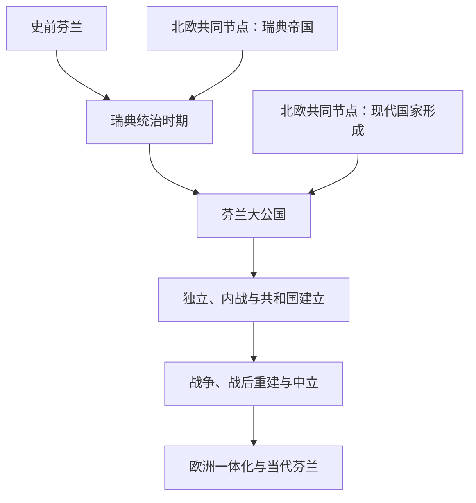

# 芬兰历史

## 概括

芬兰历史不能从现代民族国家倒推为单线起源。史前人口、语言与文化长期多元；约12世纪以后今芬兰大部分地区逐步成为瑞典王国东部，1809年转为俄罗斯帝国内的自治大公国，1917年独立。内战、三次战争、战后中立、福利工业化、欧洲联盟和2023年加入北约构成现代主线。

## 历史演进图

## 历史主线

芬兰的地区史先后嵌入瑞典王国和俄罗斯帝国，但每次转变都保存并重组部分既有法律、宗教和行政制度。大公国时期形成的自治机关、语言运动和议会为独立提供基础，却没有避免1918年内战。1939—1945年的战争和冷战地缘约束塑造谨慎的对苏路线。1991年以后，芬兰从军事不结盟的欧盟成员逐步转为同时属于欧盟与北约的国家。

## 按时间导航

| 顺序 | 阶段 | 时间 | 历史走向 |
|---:|---|---|---|
| 1 | [史前芬兰](/%E4%BA%BA%E6%96%87%E7%A7%91%E5%AD%A6/%E5%8E%86%E5%8F%B2/%E6%AC%A7%E6%B4%B2/%E5%8C%97%E6%AC%A7/%E8%8A%AC%E5%85%B0/%E5%8F%B2%E5%89%8D%E8%8A%AC%E5%85%B0.md) | 史前—约12世纪 | 多方向人口、语言和贸易网络，没有统一现代国家。 |
| 2 | [瑞典统治时期](/%E4%BA%BA%E6%96%87%E7%A7%91%E5%AD%A6/%E5%8E%86%E5%8F%B2/%E6%AC%A7%E6%B4%B2/%E5%8C%97%E6%AC%A7/%E8%8A%AC%E5%85%B0/%E7%91%9E%E5%85%B8%E7%BB%9F%E6%B2%BB%E6%97%B6%E6%9C%9F.md) | 约12世纪—1809年 | 教会与王国整合、东西边疆和多语言社会。 |
| 3 | [芬兰大公国](/%E4%BA%BA%E6%96%87%E7%A7%91%E5%AD%A6/%E5%8E%86%E5%8F%B2/%E6%AC%A7%E6%B4%B2/%E5%8C%97%E6%AC%A7/%E8%8A%AC%E5%85%B0/%E8%8A%AC%E5%85%B0%E5%A4%A7%E5%85%AC%E5%9B%BD.md) | 1809—1917年 | 帝国内自治、本地制度、民族运动和一院议会。 |
| 4 | [独立、内战与共和国建立](/%E4%BA%BA%E6%96%87%E7%A7%91%E5%AD%A6/%E5%8E%86%E5%8F%B2/%E6%AC%A7%E6%B4%B2/%E5%8C%97%E6%AC%A7/%E8%8A%AC%E5%85%B0/%E7%8B%AC%E7%AB%8B%E3%80%81%E5%86%85%E6%88%98%E4%B8%8E%E5%85%B1%E5%92%8C%E5%9B%BD%E5%BB%BA%E7%AB%8B.md) | 1917—1939年 | 独立、内战、共和国宪法和战间期民主。 |
| 5 | [战争、战后重建与中立](/%E4%BA%BA%E6%96%87%E7%A7%91%E5%AD%A6/%E5%8E%86%E5%8F%B2/%E6%AC%A7%E6%B4%B2/%E5%8C%97%E6%AC%A7/%E8%8A%AC%E5%85%B0/%E6%88%98%E4%BA%89%E3%80%81%E6%88%98%E5%90%8E%E9%87%8D%E5%BB%BA%E4%B8%8E%E4%B8%AD%E7%AB%8B.md) | 1939—1991年 | 三次战争、领土人口调整、对苏外交和福利工业化。 |
| 6 | [欧洲一体化与当代芬兰](/%E4%BA%BA%E6%96%87%E7%A7%91%E5%AD%A6/%E5%8E%86%E5%8F%B2/%E6%AC%A7%E6%B4%B2/%E5%8C%97%E6%AC%A7/%E8%8A%AC%E5%85%B0/%E6%AC%A7%E6%B4%B2%E4%B8%80%E4%BD%93%E5%8C%96%E4%B8%8E%E5%BD%93%E4%BB%A3%E8%8A%AC%E5%85%B0.md) | 1991年至今 | 欧盟、欧元、经济转型和2023年加入北约。 |

## 北欧共同节点

| 共同主题 | 入口 | 本国阅读重点 |
|---|---|---|
| 史前背景 | [史前北欧](/%E4%BA%BA%E6%96%87%E7%A7%91%E5%AD%A6/%E5%8E%86%E5%8F%B2/%E6%AC%A7%E6%B4%B2/%E5%8C%97%E6%AC%A7/%E5%8F%B2%E5%89%8D%E5%8C%97%E6%AC%A7.md) | 芬兰与斯堪的纳维亚既联系又存在语言文化差异。 |
| 瑞典强权 | [瑞典帝国](/%E4%BA%BA%E6%96%87%E7%A7%91%E5%AD%A6/%E5%8E%86%E5%8F%B2/%E6%AC%A7%E6%B4%B2/%E5%8C%97%E6%AC%A7/%E7%91%9E%E5%85%B8%E5%B8%9D%E5%9B%BD.md) | 芬兰作为王国核心东部而非单纯海外殖民地。 |
| 现代国家比较 | [北欧现代国家形成](/%E4%BA%BA%E6%96%87%E7%A7%91%E5%AD%A6/%E5%8E%86%E5%8F%B2/%E6%AC%A7%E6%B4%B2/%E5%8C%97%E6%AC%A7/%E5%8C%97%E6%AC%A7%E7%8E%B0%E4%BB%A3%E5%9B%BD%E5%AE%B6%E5%BD%A2%E6%88%90.md) | 1809年自治、1917年独立与北欧政治接近。 |
| 瑞典国家线 | [瑞典历史](/%E4%BA%BA%E6%96%87%E7%A7%91%E5%AD%A6/%E5%8E%86%E5%8F%B2/%E6%AC%A7%E6%B4%B2/%E5%8C%97%E6%AC%A7/%E7%91%9E%E5%85%B8/README.md) | 1809年前共同王国及此后不同国家走向。 |

## 关键辨析

- 史前考古文化、语言扩散、萨米人历史和现代芬兰民族认同不能合并为一条直系谱系。
- 1809年前的芬兰地区属于瑞典王国，不宜简单称为一个制度统一的海外殖民地。
- 芬兰大公国保有广泛自治，但最高权力仍属于俄国皇帝。
- 1917年独立、1918年内战和1919年共和国建立是不同转折。
- 战后中立、欧盟成员身份和北约成员身份分别对应不同安全与一体化阶段。

## 上级

- [北欧历史](/%E4%BA%BA%E6%96%87%E7%A7%91%E5%AD%A6/%E5%8E%86%E5%8F%B2/%E6%AC%A7%E6%B4%B2/%E5%8C%97%E6%AC%A7/README.md)
