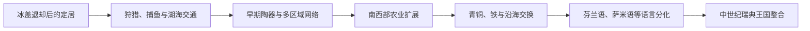

# 史前芬兰

## 时间

史前—约12世纪

## 概括

冰盖消退后，不同人群陆续进入今芬兰地区，形成适应森林、湖泊、海岸和北部环境的社会。语言扩散、农业传播、金属贸易与萨米人和芬兰语族群体的形成均经历漫长过程，不能用现代国界或民族直接回推。

## 历史走向

- 末次冰期后，聚落随生态环境变化逐步扩展。狩猎、捕鱼和采集长期占重要地位，沿海和南部后来发展农业。
- 石器、陶器和墓葬传统显示今芬兰地区与波罗的海东岸、斯堪的纳维亚和俄罗斯内陆存在多方向联系。
- 乌拉尔语系语言的传播是长期迁徙、接触和语言替代过程，考古文化不能直接一一对应某一现代民族。
- 萨米语使用者及其祖先曾分布于比今日更广的芬兰地区，后来在经济、政治和语言变化中更多集中于北部。
- 铁器时代的西南海岸和内陆社群参与毛皮、金属与海上贸易，地方权力中心发展，但没有形成覆盖现代芬兰疆域的统一国家。
- 12世纪以后，瑞典王权、天主教会和诺夫哥罗德等力量在芬兰地区的竞争与接触增强，历史进入有更多文字记录的阶段。

## 关键辨析

- “芬兰史前文化”不等于现代芬兰民族国家的早期阶段。
- 语言、考古器物和遗传人口各自记录不同类型的历史变化，不能机械画成一条直系谱系。
- 瑞典统治的形成是多个世纪的教会化、战争、移民和行政整合过程，不宜归结为单次“十字军征服”。

## 与北欧共同主线的关系

区域考古和北日耳曼世界背景见[史前北欧](/%E4%BA%BA%E6%96%87%E7%A7%91%E5%AD%A6/%E5%8E%86%E5%8F%B2/%E6%AC%A7%E6%B4%B2/%E5%8C%97%E6%AC%A7/%E5%8F%B2%E5%89%8D%E5%8C%97%E6%AC%A7.md)；芬兰语言和族群背景与斯堪的纳维亚王国形成并不完全相同。

## 演变关系

- 前一节点：无。
- 后一节点：[瑞典统治时期的芬兰](/%E4%BA%BA%E6%96%87%E7%A7%91%E5%AD%A6/%E5%8E%86%E5%8F%B2/%E6%AC%A7%E6%B4%B2/%E5%8C%97%E6%AC%A7/%E8%8A%AC%E5%85%B0/%E7%91%9E%E5%85%B8%E7%BB%9F%E6%B2%BB%E6%97%B6%E6%9C%9F.md)。

## 演进图

## 史前过程与人群

芬兰地区在冰盖退却后约前9000年起逐渐有人定居，最早居民沿湖泊、河道和海岸移动，依赖捕鱼、狩猎和采集。波罗的海水域从冰湖、咸水海到现代海况的变化不断改写海岸线。陶器很早进入渔猎社会，说明陶器不等同农业；梳状陶器等考古类型也不能直接等同现代民族。

约前3000—前2000年，绳纹陶文化、畜牧与少量农业进入南部和西部，但北部渔猎持续。青铜多由外部输入，沿海与斯堪的纳维亚相连，内陆则面向卡累利阿和伏尔加网络。铁器时代农业、墓葬和堡山在西南增长，毛皮、铁和海上贸易把地区连接至瑞典、波罗的海东岸和罗斯。

现代芬兰语属于乌拉尔语系，其形成涉及长期迁徙、语言转移和接触；不能把某种器物文化直接贴上“芬兰人”标签。萨米语言和文化曾分布在比今日更南的地区，后来在农业定居、征税、贸易和国家扩张中北移或被同化。沿海日耳曼语、波罗的语和斯拉夫语接触也塑造词汇与社会。

## 重要节点

| 时间 | 节点 | 说明 |
|---|---|---|
| 约前9000年 | 冰后定居 | 海岸与湖区渔猎网络形成 |
| 前5200年左右 | 陶器广泛使用 | 定居和储存加强，不代表全面农业化 |
| 前3200年以后 | 绳纹陶与畜牧农业 | 南西部生计多样化 |
| 前1500—前500年 | 青铜时代 | 沿海斯堪的纳维亚联系与内陆交换并存 |
| 前500年—公元500年 | 铁器技术扩展 | 地方生产、贸易与聚落差异扩大 |
| 约500—800年 | 墓葬、堡山和长途贸易增长 | 西南精英和区域防御增强 |
| 约800—1050年 | 维京时代网络 | 芬兰湾、奥兰和西海岸参与东西贸易，但不存在统一“芬兰维京国” |
| 11—13世纪 | 教会、贸易和王国竞争 | 瑞典、诺夫哥罗德和本地社会互动，书面史逐渐增加 |

## 解释边界

- 考古文化、语言群体、基因谱系和政治共同体是不同分析层次。
- “芬兰人”“塔瓦斯特人”“卡累利阿人”等中世纪称呼可能兼有地域、贡赋和外部命名含义。
- 萨米历史不是芬兰国家史的附录；其传统地域横跨今日多国。
- 后续瑞典整合不是一次“十字军征服”完成，而是教区、城堡、税收、贸易和战争长期叠加。
