# 芬兰的战争、战后重建与中立

## 时间

1939年—1991年

## 概括

1939—1945年芬兰先后经历冬季战争、继续战争和拉普兰战争。战后在保持议会民主的同时割让领土、安置迁徙人口并支付赔款；对苏谨慎外交、北欧合作、工业化与福利扩展共同构成冷战时期路线。

## 历史走向

- 1939年苏联进攻芬兰，冬季战争爆发。芬兰保持国家独立，但1940年和约割让卡累利阿等地，大量居民撤离。
- 1941年德国进攻苏联后，芬兰在“继续战争”中与德国协同对苏作战，但保有本国政府、战争目标和指挥体系；其地位不宜用简单同盟标签概括。
- 1944年芬兰与苏联停战，接受进一步领土调整，并按条件驱逐境内德军，由此发生拉普兰战争。
- 约40万卡累利阿等失地居民被重新安置。土地分配、住房、赔款生产和出口迫使农业与工业结构迅速调整。
- 帕锡基维—吉科宁外交路线强调承认苏联安全关切、维持双边关系并避免卷入大国冲突，同时保存议会民主和市场经济。
- 1948年芬苏条约构成冷战对苏关系框架；“中立”受到地缘约束，却不是苏联政治制度的复制。
- 芬兰1955年加入联合国和北欧理事会，随后逐步扩大同西欧经济合作，并在1975年主办欧洲安全与合作会议。
- 战后教育、医疗、养老金、城市化和女性就业发展，芬兰逐步形成北欧型福利国家和出口工业经济。
- 1991年苏联解体与双边贸易崩溃使旧安全经济框架终结，也加剧芬兰经济危机。

## 关键辨析

- 冬季战争、继续战争和拉普兰战争是相互连接但交战组合不同的三个阶段。
- “芬兰化”多为外部政治术语，能够描述对苏政策限制，却不能概括芬兰全部内政和社会发展。
- 战后中立并非孤立；芬兰同时参与北欧、联合国和欧洲经济合作。

## 演变关系

- 前一节点：[芬兰独立、内战与共和国建立](/%E4%BA%BA%E6%96%87%E7%A7%91%E5%AD%A6/%E5%8E%86%E5%8F%B2/%E6%AC%A7%E6%B4%B2/%E5%8C%97%E6%AC%A7/%E8%8A%AC%E5%85%B0/%E7%8B%AC%E7%AB%8B%E3%80%81%E5%86%85%E6%88%98%E4%B8%8E%E5%85%B1%E5%92%8C%E5%9B%BD%E5%BB%BA%E7%AB%8B.md)。
- 后一节点：[欧洲一体化与当代芬兰](/%E4%BA%BA%E6%96%87%E7%A7%91%E5%AD%A6/%E5%8E%86%E5%8F%B2/%E6%AC%A7%E6%B4%B2/%E5%8C%97%E6%AC%A7/%E8%8A%AC%E5%85%B0/%E6%AC%A7%E6%B4%B2%E4%B8%80%E4%BD%93%E5%8C%96%E4%B8%8E%E5%BD%93%E4%BB%A3%E8%8A%AC%E5%85%B0.md)。

## 演进图

```mermaid
flowchart LR
    Winter["1939—1940冬季战争"] --> Peace["《莫斯科和约》割地"]
    Peace --> Continuation["1941—1944继续战争"]
    Continuation --> Armistice["1944停战"]
    Armistice --> Lapland["1944—1945拉普兰战争"]
    Lapland --> Reparations["赔款、重建与流离人口安置"]
    Reparations --> YYA["1948对苏友好合作互助条约"]
    YYA --> Neutrality["谨慎中立与西方贸易"]
    Neutrality --> Helsinki["1975赫尔辛基会议"]
```

## 三场战争的连续过程

苏联以列宁格勒安全为由要求边界、基地和领土交换，谈判失败后于1939年11月入侵。芬兰依靠动员、地形和防御迟滞红军，但人口、装备和补充差距无法消除；1940年3月和约割让卡累利阿地峡、拉多加沿岸等地，大批居民撤离。国际同情并未转化为足以改变战局的军事援助。

1941年德国进攻苏联，芬兰为收复失地参战并推进东卡累利阿。芬兰保有本国政府和军事目标，不是被德国直接占领的卫星国，但与纳粹德国共同作战、占领东卡累利阿并拘禁平民构成不可回避责任。1944年苏军大攻势迫使芬兰求和；总统吕蒂先以个人承诺向德国换取援助，辞职后曼纳海姆摆脱承诺并签停战。

停战要求割地、赔款、裁军和驱逐德军，遂引发拉普兰战争。德军撤退实行焦土，北部城镇和基础设施严重损毁。盟国监督委员会以苏联为主监督执行；芬兰合法政府、议会和市场制度得以保留。

## 战后生存与“中立”

约42万卡累利阿流离人口通过土地和住房政策重新安置。以工业品偿付赔款迫使造船、金属和机械业扩张，反而促进工业化。战争责任审判和共产党合法化体现苏联压力，芬兰仍维持多党选举。巴锡基维、吉科宁强调承认力量现实、建立对苏信任，同时发展北欧和西方贸易。

1948年友好合作互助条约规定在特定攻击情形下与苏协商，但芬兰没有加入华约。外交中立为自主留出空间，也使苏联可能影响总统、组阁与媒体自我约束，“芬兰化”一词因此兼具务实生存和主权受限两面。1955年加入联合国、北欧理事会并收回波卡拉基地；1975年欧洲安全与合作会议把赫尔辛基塑造成东西方对话中心。

## 重要事件

| 时间 | 事件 | 影响 |
|---|---|---|
| 1939年11月30日 | 冬季战争爆发 | 苏联入侵，国际联盟将苏联除名 |
| 1940年3月 | 《莫斯科和约》 | 芬兰保住独立但割让领土，居民大撤离 |
| 1941年6月 | 继续战争 | 与德国共同对苏作战，收复并越过旧边界 |
| 1944年6—9月 | 苏军攻势、吕蒂辞职与停战 | 芬兰退出战争并接受严厉条件 |
| 1944—1945年 | 拉普兰战争 | 驱逐德军，北部遭焦土破坏 |
| 1944—1952年 | 赔款与安置 | 工业化、土地改革和社会整合 |
| 1948年 | 对苏友好合作互助条约 | 冷战安全政策制度化 |
| 1955年 | 加入联合国、收回波卡拉 | 国际空间扩大 |
| 1956—1982年 | 吉科宁长期总统 | 总统外交权和对苏关系高度集中 |
| 1973年 | 与欧洲共同体自由贸易安排 | 西方经济联系加强 |
| 1975年 | 赫尔辛基会议 | 中立调停地位达到高点 |

战时总统、总理和职权更替见[芬兰大公、总督、国家元首与政府首脑表](/%E4%BA%BA%E6%96%87%E7%A7%91%E5%AD%A6/%E5%8E%86%E5%8F%B2/%E6%AC%A7%E6%B4%B2/%E5%8C%97%E6%AC%A7/%E8%8A%AC%E5%85%B0/%E8%8A%AC%E5%85%B0%E5%A4%A7%E5%85%AC%E3%80%81%E6%80%BB%E7%9D%A3%E3%80%81%E5%9B%BD%E5%AE%B6%E5%85%83%E9%A6%96%E4%B8%8E%E6%94%BF%E5%BA%9C%E9%A6%96%E8%84%91%E8%A1%A8.md)。
