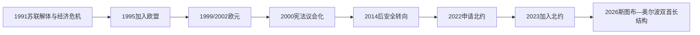

# 欧洲一体化与当代芬兰

## 时间

1991年至今

## 概括

苏联解体后，芬兰通过经济重组和1995年加入欧洲联盟重新定位。欧元、数字产业和北欧福利制度塑造内政；俄罗斯于2022年全面入侵乌克兰后，芬兰结束军事不结盟并于2023年加入北约。

## 历史走向

- 1990年代初金融危机、苏联贸易崩溃和高失业迫使银行、财政和产业结构调整。
- 芬兰1995年加入欧洲联盟，进一步嵌入单一市场；1999年参与欧元体系，2002年开始流通欧元纸币和硬币。
- 通信与数字产业一度成为出口转型象征，教育、研发和地方公共服务继续支持福利国家，但全球竞争和人口老龄化带来压力。
- 2000年宪法整合既有宪法文件，强化议会制和政府责任；总统在外交政策中仍与政府共同发挥作用。
- 芬兰语和瑞典语具有国家语言地位，萨米人在北部的语言文化与土地资源权利仍是重要议题。
- 冷战结束后芬兰参加欧盟共同安全合作并深化与北约伙伴关系，但长期保持军事不结盟。
- 俄罗斯于2022年全面入侵乌克兰后，芬兰社会和政府迅速重新评估安全路线，并与瑞典共同申请加入北约。
- 2023年4月4日芬兰正式成为北约成员。欧盟成员、北欧合作和北约集体防务由此共同构成当代国际框架。
- 对俄边界、安全、能源转型、公共财政和区域人口变化成为新的长期治理议题。

## 关键辨析

- 芬兰1945年后的中立与1995年后的欧盟成员身份可以并存一段时期；2023年北约成员身份则标志军事不结盟终结。
- 芬兰加入欧盟和采用欧元是两个相关但时间不同的制度步骤。
- 现代芬兰认同不能被写成史前人群或单一语言群体的直系延续。

## 演变关系

- 前一节点：[芬兰的战争、战后重建与中立](/%E4%BA%BA%E6%96%87%E7%A7%91%E5%AD%A6/%E5%8E%86%E5%8F%B2/%E6%AC%A7%E6%B4%B2/%E5%8C%97%E6%AC%A7/%E8%8A%AC%E5%85%B0/%E6%88%98%E4%BA%89%E3%80%81%E6%88%98%E5%90%8E%E9%87%8D%E5%BB%BA%E4%B8%8E%E4%B8%AD%E7%AB%8B.md)。
- 所属主线：[芬兰历史](/%E4%BA%BA%E6%96%87%E7%A7%91%E5%AD%A6/%E5%8E%86%E5%8F%B2/%E6%AC%A7%E6%B4%B2/%E5%8C%97%E6%AC%A7/%E8%8A%AC%E5%85%B0/README.md)、[北欧历史](/%E4%BA%BA%E6%96%87%E7%A7%91%E5%AD%A6/%E5%8E%86%E5%8F%B2/%E6%AC%A7%E6%B4%B2/%E5%8C%97%E6%AC%A7/README.md)。

## 演进图

## 后冷战转型

苏联解体使双边贸易骤降，金融自由化和国内泡沫又加重1990年代初衰退、银行危机与失业。政府重组银行、削减开支并推动出口技术产业。1994年公投支持加入欧洲联盟，芬兰1995年入盟；1999年进入欧元第三阶段、2002年流通欧元。欧盟成员身份把农业、地区、市场和外交政策嵌入欧洲制度，也引发主权与财政纪律争议。

2000年宪法整合旧宪法文件，强化议会和总理，减少总统对组阁和内政的直接权力。外交由总统与政府共同领导，欧盟事务由总理和内阁主导；两者并非平行竞争的两个政府。教育、数字化和创新支持高收入经济，人口老龄化、医疗地区改革、公共债务、产业转型和地区差异仍是长期挑战。

## 从军事不结盟到北约

冷战后芬兰加入欧盟、北约和平伙伴关系并深化西方军备兼容，同时保留军事不结盟。2014年后国防合作和战备加强。2022年俄军全面侵乌改变民意与战略判断，芬兰与瑞典共同申请北约；芬兰因批准较快，于2023年4月4日先行加入。漫长俄芬边界、混合威胁和基础设施安全成为优先事项。

加入北约不抹去芬兰自身征兵、全面安全和国防决策。芬兰同时在欧盟、北欧、北约与双边关系中布局。萨米权利、林业、采矿和风电冲突说明国家安全与绿色转型也须面对原住民土地和文化延续。

## 截至2026年7月14日

亚历山大·斯图布自2024年3月1日起任总统，彼得里·奥尔波自2023年6月20日起任总理。总统主持外交与国防中的宪法职能，总理领导政府、内政和欧盟政策；两者均受宪法和议会监督。芬兰没有“现任君主”或总督。

| 时间 | 事件 | 影响 |
|---|---|---|
| 1991—1994年 | 深度经济危机 | 银行与财政改革、产业结构转型 |
| 1995年 | 加入欧盟 | 后冷战西方制度归属确立 |
| 1999/2002年 | 加入并启用欧元 | 货币政策转交欧洲中央银行体系 |
| 2000年 | 新宪法 | 总理与议会权力增强，总统内政权缩减 |
| 2008年后 | 金融危机和产业冲击 | 增长、债务和福利可持续性争议 |
| 2014年以后 | 对俄安全担忧上升 | 国防、储备和西方协作加强 |
| 2019—2023年 | 马林政府 | 新冠应对、北约申请和联盟政治 |
| 2023年4月4日 | 加入北约 | 军事不结盟路线结束 |
| 2023年6月 | 奥尔波政府成立 | 中右翼联盟推动财政和劳动市场改革 |
| 2024年3月 | 斯图布就任总统 | 北约时代首位新任总统 |

完整总统、政府首脑和过渡摄政见[芬兰大公、总督、国家元首与政府首脑表](/%E4%BA%BA%E6%96%87%E7%A7%91%E5%AD%A6/%E5%8E%86%E5%8F%B2/%E6%AC%A7%E6%B4%B2/%E5%8C%97%E6%AC%A7/%E8%8A%AC%E5%85%B0/%E8%8A%AC%E5%85%B0%E5%A4%A7%E5%85%AC%E3%80%81%E6%80%BB%E7%9D%A3%E3%80%81%E5%9B%BD%E5%AE%B6%E5%85%83%E9%A6%96%E4%B8%8E%E6%94%BF%E5%BA%9C%E9%A6%96%E8%84%91%E8%A1%A8.md)。
