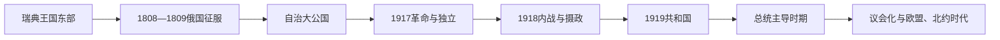

# 芬兰大公、总督、国家元首与政府首脑表

[返回芬兰历史](/%E4%BA%BA%E6%96%87%E7%A7%91%E5%AD%A6/%E5%8E%86%E5%8F%B2/%E6%AC%A7%E6%B4%B2/%E5%8C%97%E6%AC%A7/%E8%8A%AC%E5%85%B0/README.md)

## 表格口径

瑞典统治时期，今日芬兰大部分地区是瑞典王国的东部，不另有“芬兰国王”；完整瑞典君主见[瑞典君主、摄政与政府首脑表](/%E4%BA%BA%E6%96%87%E7%A7%91%E5%AD%A6/%E5%8E%86%E5%8F%B2/%E6%AC%A7%E6%B4%B2/%E5%8C%97%E6%AC%A7/%E7%91%9E%E5%85%B8/%E7%91%9E%E5%85%B8%E5%90%9B%E4%B8%BB%E3%80%81%E6%91%84%E6%94%BF%E4%B8%8E%E6%94%BF%E5%BA%9C%E9%A6%96%E8%84%91%E8%A1%A8.md)。1809—1917年俄罗斯皇帝兼芬兰大公，是国家元首；总督代表皇帝，但日常行政由芬兰元老院、国务秘书体系和地方官共同运行。1917—1919年国家元首称号多次变化，王位候选人未实际就任；1919年以后总统和总理严格分表。

## 1809—1917年芬兰大公

| 顺序 | 芬兰大公 / 俄罗斯皇帝 | 任期 | 与前任关系 | 芬兰统治关键事件 |
|---:|---|---|---|---|
| 1 | **亚历山大一世** | 1809—1825 | 俄国征服后首任 | 波尔沃议会确认宗教、法律和等级权利；设政府委员会，1812年赫尔辛基为首府 |
| 2 | 尼古拉一世 | 1825—1855 | 亚历山大一世之弟 | 维持制度性自治但政治保守；克里米亚战争波及海岸 |
| 3 | **亚历山大二世** | 1855—1881 | 尼古拉一世之子 | 1863年重召等级议会，语言、货币、地方和经济改革 |
| 4 | 亚历山大三世 | 1881—1894 | 亚历山大二世之子 | 帝国统一政策加强，自治矛盾上升 |
| 5 | **尼古拉二世** | 1894—1917 | 亚历山大三世之子 | 1899年宣言与俄罗斯化、1905年危机和1906年议会改革；二月革命后大公权力终止 |

## 俄罗斯帝国任命的总督完整表

| 顺序 | 总督 | 任期 | 实际角色 / 备注 |
|---:|---|---|---|
| 1 | 约兰·马格努斯·斯普伦特波滕 | 1808—1809 | 芬兰出身的俄军将领，征服和制度过渡初期 |
| 2 | 米哈伊尔·巴克莱·德·托利 | 1809—1810 | 俄军统帅，短任总督 |
| 3 | 法比安·施泰因海尔 | 1810—1824 | 长期协调圣彼得堡与芬兰行政 |
| 4 | 阿尔谢尼·扎克列夫斯基 | 1823/1824—1831 | 强化警务与帝国监督；起始年因任命和到任口径略异 |
| 5 | 亚历山大·缅希科夫 | 1831—1855 | 长期兼任，日常工作多由副职和元老院处理 |
| 6 | 弗里德里希·威廉·冯·贝格 | 1855—1861 | 克里米亚战争后改革初期 |
| 7 | 普拉东·罗卡索夫斯基 | 1861—1866 | 亚历山大二世改革时期 |
| 8 | 尼古拉·阿德勒贝格 | 1866—1881 | 铁路、议会和行政扩展时期 |
| 9 | 费奥多尔·海登 | 1881—1898 | 初期调和，后帝国统一压力增强 |
| 10 | **尼古拉·博布里科夫** | 1898—1904 | 第一轮俄罗斯化的执行者；1904年遇刺 |
| 11 | 伊万·奥博连斯基 | 1904—1905 | 革命和大罢工前夕 |
| 12 | 尼古拉·杰拉德 | 1905—1908 | 1906年议会改革后相对缓和 |
| 13 | 弗拉基米尔·博克曼 | 1908—1909 | 第二轮俄罗斯化初期 |
| 14 | **弗兰茨·阿尔贝特·赛因** | 1909—1917 | 推动帝国法优先和俄罗斯化；二月革命后被捕 |

## 1917—1919年国家元首过渡

| 顺序 | 国家元首 / 权力机构 | 任期 | 性质与关键说明 |
|---:|---|---|---|
| — | 议会与元老院争夺最高权力 | 1917年3—12月 | 皇帝退位后主权归属不明；俄临时政府、芬兰议会和元老院相互争权 |
| — | 芬兰议会宣布独立 | 1917年12月6日 | 独立宣言获议会通过，国际承认随后展开 |
| 1 | **佩尔·埃温德·斯温胡武德** | 1918年5—12月 | 内战后任“国家护国者 / 摄政”，倾向建立德国式君主制 |
| — | 弗里德里希·卡尔（黑森亲王） | 1918年10—12月 | 被议会选为芬兰国王但未赴任、未宣誓、未实际统治；德国战败后放弃 |
| 2 | **卡尔·古斯塔夫·曼纳海姆** | 1918年12月—1919年7月 | 摄政，转向协约国并主持共和国宪制过渡 |
| — | 1919年宪法 | 1919年7月 | 建立共和国总统制与议会内阁，不再保留王位 |

## 共和国总统完整表

| 顺序 | 总统 | 任期 | 与前任关系 / 关键事件 |
|---:|---|---|---|
| 1 | **卡洛·尤霍·斯托尔贝里** | 1919—1925 | 议会选出的首任总统，建立共和国惯例 |
| 2 | 劳里·克里斯蒂安·雷兰德 | 1925—1931 | 选举人团选出，联盟政治频繁 |
| 3 | 佩尔·埃温德·斯温胡武德 | 1931—1937 | 前摄政；1932年压制曼采莱极右翼叛乱 |
| 4 | 屈厄斯蒂·卡利奥 | 1937—1940 | 冬季战争时期，因健康辞职，当日返乡前去世 |
| 5 | **里斯托·吕蒂** | 1940—1944 | 战时总统；为争取德国援助作个人承诺，停战前辞职 |
| 6 | **卡尔·古斯塔夫·曼纳海姆** | 1944—1946 | 由特别法选出；完成对苏停战和驱逐德军 |
| 7 | 尤霍·库斯蒂·巴锡基维 | 1946—1956 | 对苏务实外交和战后重建 |
| 8 | **乌尔霍·吉科宁** | 1956—1982 | 长期总统；外交与政府形成影响强，1973年任期获特别延长 |
| 9 | 毛诺·科伊维斯托 | 1982—1994 | 推动总统权力受议会规则约束，经历苏联解体 |
| 10 | 马尔蒂·阿赫蒂萨里 | 1994—2000 | 首次总统直接普选；欧盟加入 |
| 11 | 塔里娅·哈洛宁 | 2000—2012 | 首位女性总统；新宪法下内政权力缩减 |
| 12 | 绍利·尼尼斯托 | 2012—2024 | 对俄关系转折、北约申请与加入 |
| 13 | **亚历山大·斯图布** | 2024—至今 | 2024年3月1日就任；截至2026年7月14日为现任总统 |

## 1917年以来政府首脑完整表

| 顺序 | 总理 / 元老院经济部副主席 | 任期 | 政治阶段 / 备注 |
|---:|---|---|---|
| 1 | 佩尔·埃温德·斯温胡武德 | 1917—1918 | 独立元老院政府首脑 |
| 2 | 尤霍·库斯蒂·巴锡基维 | 1918 | 内战后、君主制方案时期 |
| 3 | 劳里·英曼 | 1918—1919、1924—1925 | 两次任职，宪制过渡与中间联盟 |
| 4 | 卡洛·卡斯特伦 | 1919年4—8月 | 共和国宪法通过时期 |
| 5 | 尤霍·文诺拉 | 1919—1920、1921—1922 | 两次任职 |
| 6 | 拉斐尔·埃里希 | 1920—1921 | 中间联盟 |
| 7 | 艾莫·卡扬德 | 1922、1924、1937—1939 | 三次任职；第三任至冬季战争爆发 |
| 8 | 屈厄斯蒂·卡利奥 | 1922—1924、1925—1926、1929—1930、1936—1937 | 四次任职，后任总统 |
| 9 | 安蒂·图伦海莫 | 1925 | 短期政府 |
| 10 | 韦伊诺·坦纳 | 1926—1927 | 首位社会民主党长期政府首脑 |
| 11 | 尤霍·苏尼拉 | 1927—1928、1931—1932 | 两次任职 |
| 12 | 奥斯卡里·曼泰雷 | 1928—1929 | 进步党 |
| 13 | 佩尔·埃温德·斯温胡武德 | 1930—1931 | 拉普阿运动危机期，后任总统 |
| 14 | 托伊沃·基维迈基 | 1932—1936 | 当时任期最长政府之一 |
| 15 | **里斯托·吕蒂** | 1939—1940 | 冬季战争政府，后当选总统 |
| 16 | J. W. 兰格尔 | 1941—1943 | 继续战争时期 |
| 17 | 埃德温·林科米斯 | 1943—1944 | 退出战争谈判时期 |
| 18 | 安蒂·哈克采尔 | 1944年8—9月 | 停战政府，任内中风 |
| 19 | 乌尔霍·卡斯特伦 | 1944年9—11月 | 短期过渡 |
| 20 | 尤霍·库斯蒂·巴锡基维 | 1944—1946 | 停战执行和对苏关系重建 |
| 21 | 毛诺·佩卡拉 | 1946—1948 | 人民民主联盟领导联合政府 |
| 22 | 卡尔-奥古斯特·法格霍尔姆 | 1948—1950、1956—1957、1958—1959 | 三次任职 |
| 23 | 乌尔霍·吉科宁 | 1950—1953、1954—1956 | 五届内阁连续组合，后任总统 |
| 24 | 萨卡里·图奥米奥亚 | 1953—1954 | 看守性质联盟 |
| 25 | 拉尔夫·特恩格伦 | 1954 | 瑞典人民党 |
| 26 | V. J. 苏克塞莱宁 | 1957、1959—1961 | 两次任职 |
| 27 | 赖纳·冯·菲安特 | 1957—1958 | 官僚政府 |
| 28 | 雷诺·库斯科斯基 | 1958 | 看守政府 |
| 29 | 马尔蒂·米耶图宁 | 1961—1962、1975—1977 | 两次任职 |
| 30 | 阿赫蒂·卡尔亚莱宁 | 1962—1963、1970—1971 | 两次任职 |
| 31 | 雷诺·莱赫托 | 1963—1964 | 看守政府 |
| 32 | 约翰内斯·维罗莱宁 | 1964—1966 | 中间党 |
| 33 | 拉斐尔·帕西奥 | 1966—1968、1972 | 两次任职 |
| 34 | 毛诺·科伊维斯托 | 1968—1970、1979—1982 | 两次任职，后任总统 |
| 35 | 特沃·奥拉 | 1970、1971—1972 | 两届看守政府 |
| 36 | 卡莱维·索尔萨 | 1972—1975、1977—1979、1982—1987 | 四届政府组合，社会民主党 |
| 37 | 凯约·利纳马 | 1975年6—11月 | 看守政府 |
| 38 | 哈里·霍尔克里 | 1987—1991 | 保守党 |
| 39 | 埃斯科·阿霍 | 1991—1995 | 经济危机与欧盟谈判 |
| 40 | 帕沃·利波宁 | 1995—2003 | 两届“彩虹”联盟，欧盟与欧元时期 |
| 41 | 安内莉·耶滕迈基 | 2003年4—6月 | 首位女性总理，短期辞职 |
| 42 | 马蒂·万哈宁 | 2003—2010 | 两届中间党政府 |
| 43 | 玛丽·基维涅米 | 2010—2011 | 中间党 |
| 44 | 于尔基·卡泰宁 | 2011—2014 | 广泛联盟 |
| 45 | 亚历山大·斯图布 | 2014—2015 | 后任总统 |
| 46 | 尤哈·西比莱 | 2015—2019 | 中间党领导中右翼政府 |
| 47 | 安蒂·林内 | 2019年6—12月 | 社会民主党，因邮政争议辞职 |
| 48 | 桑娜·马林 | 2019—2023 | 新冠疫情、北约申请时期 |
| 49 | **彼得里·奥尔波** | 2023—至今 | 民族联合党；截至2026年7月14日任总理 |

## 截至2026年7月14日的权力结构

| 角色 | 人物 / 机构 | 权力范围 |
|---|---|---|
| 总统 | 亚历山大·斯图布 | 共和国元首；与政府共同领导外交，总统为国防军最高统帅 |
| 总理 | 彼得里·奥尔波 | 领导内阁与欧盟政策，对议会负责 |
| 议会 | 一院制芬兰议会 | 立法、预算、政府信任和总统选举法规 |
| 政府 | 奥尔波内阁 | 联盟行政；总统不主持日常内政 |
| 奥兰自治 | 奥兰议会与政府 | 在自治法内立法，非独立国家；国家元首仍是芬兰总统 |

## 相关阶段

- [瑞典统治时期](/%E4%BA%BA%E6%96%87%E7%A7%91%E5%AD%A6/%E5%8E%86%E5%8F%B2/%E6%AC%A7%E6%B4%B2/%E5%8C%97%E6%AC%A7/%E8%8A%AC%E5%85%B0/%E7%91%9E%E5%85%B8%E7%BB%9F%E6%B2%BB%E6%97%B6%E6%9C%9F.md)
- [芬兰大公国](/%E4%BA%BA%E6%96%87%E7%A7%91%E5%AD%A6/%E5%8E%86%E5%8F%B2/%E6%AC%A7%E6%B4%B2/%E5%8C%97%E6%AC%A7/%E8%8A%AC%E5%85%B0/%E8%8A%AC%E5%85%B0%E5%A4%A7%E5%85%AC%E5%9B%BD.md)
- [独立、内战与共和国建立](/%E4%BA%BA%E6%96%87%E7%A7%91%E5%AD%A6/%E5%8E%86%E5%8F%B2/%E6%AC%A7%E6%B4%B2/%E5%8C%97%E6%AC%A7/%E8%8A%AC%E5%85%B0/%E7%8B%AC%E7%AB%8B%E3%80%81%E5%86%85%E6%88%98%E4%B8%8E%E5%85%B1%E5%92%8C%E5%9B%BD%E5%BB%BA%E7%AB%8B.md)
- [欧洲一体化与当代芬兰](/%E4%BA%BA%E6%96%87%E7%A7%91%E5%AD%A6/%E5%8E%86%E5%8F%B2/%E6%AC%A7%E6%B4%B2/%E5%8C%97%E6%AC%A7/%E8%8A%AC%E5%85%B0/%E6%AC%A7%E6%B4%B2%E4%B8%80%E4%BD%93%E5%8C%96%E4%B8%8E%E5%BD%93%E4%BB%A3%E8%8A%AC%E5%85%B0.md)
