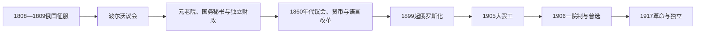

# 芬兰大公国

## 时间

1809年—1917年

## 概括

1809年芬兰从瑞典王国转入俄罗斯帝国，成为由俄国皇帝兼任大公的自治政治实体。既有法律、路德宗教会和等级制度得到保留，随后发展出本地行政、货币、议会和民族运动；帝国整合与自治冲突最终汇入1917年独立。

## 历史走向

- 1809年波尔沃议会中，亚历山大一世确认芬兰的宗教、法律和等级权利，芬兰大公国由此形成。
- 1812年赫尔辛基成为首都，行政中心从图尔库转移并更接近圣彼得堡；本地参议院承担行政和司法职能。
- 19世纪民族文化运动以历史、民间诗歌、教育和语言为基础发展。“芬兰人派”和瑞典语自由派对国家与语言方向有不同理解。
- 1860年芬兰马克建立，1863年以后等级议会较规律召开；芬兰语逐步取得行政和教育地位。
- 工业化、林业、铁路和城市发展连接大公国与俄罗斯和西欧市场，社会阶级和工人运动出现。
- 1899年以后俄国政府推动军事、法律和行政统一，芬兰社会称之为“俄化时期”；请愿、消极抵抗与激进活动并存。
- 1905年革命后，旧等级议会改为一院制议会。1906年改革建立普遍而平等的选举权，妇女同时获得选举和被选举资格。
- 1917年俄国革命使帝国权力崩解，芬兰议会和各政治力量围绕最高权力发生冲突。芬兰于12月宣布独立。

## 统治结构

| 角色 | 地位 |
|---|---|
| 俄国皇帝／芬兰大公 | 国家元首，掌握最终行政与外交权 |
| 总督 | 皇帝在芬兰的最高代表 |
| 芬兰参议院 | 负责本地行政与司法，逐渐形成政府核心 |
| 等级议会／议会 | 从不定期等级会议转为1906年后一院制民选议会 |
| 本地制度 | 保留独立法律、货币、教会和相当程度行政自治 |

## 演变关系

- 前一节点：[瑞典统治时期的芬兰](/%E4%BA%BA%E6%96%87%E7%A7%91%E5%AD%A6/%E5%8E%86%E5%8F%B2/%E6%AC%A7%E6%B4%B2/%E5%8C%97%E6%AC%A7/%E8%8A%AC%E5%85%B0/%E7%91%9E%E5%85%B8%E7%BB%9F%E6%B2%BB%E6%97%B6%E6%9C%9F.md)。
- 后一节点：[独立、内战与共和国建立](/%E4%BA%BA%E6%96%87%E7%A7%91%E5%AD%A6/%E5%8E%86%E5%8F%B2/%E6%AC%A7%E6%B4%B2/%E5%8C%97%E6%AC%A7/%E8%8A%AC%E5%85%B0/%E7%8B%AC%E7%AB%8B%E3%80%81%E5%86%85%E6%88%98%E4%B8%8E%E5%85%B1%E5%92%8C%E5%9B%BD%E5%BB%BA%E7%AB%8B.md)。
- 区域比较：[北欧现代国家形成](/%E4%BA%BA%E6%96%87%E7%A7%91%E5%AD%A6/%E5%8E%86%E5%8F%B2/%E6%AC%A7%E6%B4%B2/%E5%8C%97%E6%AC%A7/%E5%8C%97%E6%AC%A7%E7%8E%B0%E4%BB%A3%E5%9B%BD%E5%AE%B6%E5%BD%A2%E6%88%90.md)。

## 演进图

## 自治建立与实际权力

亚历山大一世在1809年波尔沃议会确认当地宗教、法律和等级权利，并以芬兰大公身份统治。所谓“国家地位”是后世概括：大公国没有独立外交，却逐渐形成单独财政、海关、邮政、货币、元老院和国务秘书体系。总督代表皇帝并监督军政，元老院由本地官员办理日常行政；皇帝可通过诏令、任命和帝国机关改变权力边界。

1812年赫尔辛基成为首府，靠近圣彼得堡且便于建设新行政中心；大学1828年从图尔库迁来。长时间不召等级议会使行政官僚主导政治。亚历山大二世1863年重召议会，随后定期会议、地方自治、芬兰马克、商业改革和语言法令共同创造现代制度。芬兰语运动主张把多数人口语言提升为行政和文化语言，瑞典语自由派和芬兰派之间的分化塑造政党。

## 俄罗斯化与议会革命

19世纪末俄国政府认为芬兰特殊法律妨碍帝国军事和行政统一。1899年《二月宣言》扩大帝国立法优先，1901年征兵法、俄语行政和总督博布里科夫的强制措施引发请愿、消极抵抗、流亡和激进化。政策既有帝国安全动机，也破坏既有自治契约；“俄罗斯化”并非全时期强度相同。

1905年俄国革命和芬兰大罢工迫使皇帝让步，1906年以一院制议会取代四等级会议，实行包括女性在内的平等普选。芬兰女性1907年成为世界最早一批当选国会议员者。皇帝仍可解散议会并阻止法案，1908年后第二轮俄罗斯化恢复。1917年二月革命废除皇权，芬兰议会、元老院和俄临时政府争夺最高权力；十月革命后独立派取得机会。

## 重要事件与兴衰因素

| 时间 | 事件 | 结果 |
|---|---|---|
| 1809年 | 波尔沃议会与《弗雷德里克斯哈姆和约》 | 瑞典割让芬兰，自治大公国建立 |
| 1812年 | 赫尔辛基为首府；“旧芬兰”并入 | 行政和领土整合 |
| 1828年 | 大学迁赫尔辛基 | 官僚和民族文化中心形成 |
| 1860年 | 芬兰马克创设 | 独立货币制度发展 |
| 1863年 | 等级议会复会、语言改革 | 代表政治与芬兰语地位提高 |
| 1878年 | 本地征兵法 | 自治军事制度，后来成为帝国争议 |
| 1899年 | 《二月宣言》 | 第一轮俄罗斯化与大请愿 |
| 1904年 | 博布里科夫遇刺 | 激进反抗象征，强制政策未立即结束 |
| 1905年 | 大罢工 | 帝国危机迫使改革 |
| 1906—1907年 | 一院制、平等普选与首届选举 | 现代群众民主建立 |
| 1908—1917年 | 第二轮俄罗斯化 | 自治冲突深化，世界大战加重 |
| 1917年 | 两次俄国革命 | 大公权力消失，主权争议转向独立 |

完整大公和总督连续表见[芬兰大公、总督、国家元首与政府首脑表](/%E4%BA%BA%E6%96%87%E7%A7%91%E5%AD%A6/%E5%8E%86%E5%8F%B2/%E6%AC%A7%E6%B4%B2/%E5%8C%97%E6%AC%A7/%E8%8A%AC%E5%85%B0/%E8%8A%AC%E5%85%B0%E5%A4%A7%E5%85%AC%E3%80%81%E6%80%BB%E7%9D%A3%E3%80%81%E5%9B%BD%E5%AE%B6%E5%85%83%E9%A6%96%E4%B8%8E%E6%94%BF%E5%BA%9C%E9%A6%96%E8%84%91%E8%A1%A8.md)。
