# 萨米人的跨境历史

[返回北欧历史总览](/%E4%BA%BA%E6%96%87%E7%A7%91%E5%AD%A6/%E5%8E%86%E5%8F%B2/%E6%AC%A7%E6%B4%B2/%E5%8C%97%E6%AC%A7/README.md)

## 时间与范围

史前语言、考古与生计网络—2026年7月14日。萨米人的传统地域萨米横跨今日挪威、瑞典、芬兰和俄罗斯科拉半岛，内部包含北萨米、吕勒萨米、南萨米、伊纳里萨米、斯科尔特萨米等语言与地区群体。萨米历史既属于北欧各国史，也不能被切割成四条互不相干的少数民族附录。

```mermaid
flowchart LR
    Pre["北方史前多种人群与生计"] --> Sami["萨米语言、身份与贸易网络形成"]
    Sami --> Tax["多国重叠征税与传教"]
    Tax --> Borders["1751边界与《拉普法典》"]
    Borders --> Closure["1852、1889边境关闭"]
    Closure --> Assimilation["同化、寄宿学校与种族化研究"]
    Assimilation --> Mobilisation["1917跨境政治动员"]
    Mobilisation --> Institutions["萨米理事会、议会与权利法"]
    Institutions --> Reconciliation["真相调查、土地与绿色转型争议"]
```

## 起源、语言与生计的形成

考古器物、语言与遗传证据不能机械对应同一民族。北芬诺斯坎迪亚冰后已有多种渔猎人群，后来又与伏尔加—乌拉尔、波罗的海、斯堪的纳维亚农业和海岸网络接触。原始萨米语言大约在铁器时代前后向北方扩散并取代若干更早语言，但确切年代和路线仍有争议。历史时期萨米分布曾远及今日挪威、瑞典和芬兰中南部，国家农业、征税和语言同化才逐步压缩传统地域。

萨米生计从来不只等同大规模驯鹿游牧。沿海捕鱼、海兽捕猎、河湖渔业、狩猎、采集、小规模畜养、贸易、手工艺和后来工资劳动共同存在。部分群体在中世纪至近世由捕猎野生驯鹿转向更大群的驯养迁徙，地区与家庭差异很大。把所有萨米人想象成跨境游牧者，会遮蔽沿海萨米、定居农业和城市萨米历史。

## 多重征税、传教与国界

中世纪以来，挪威、瑞典、诺夫哥罗德及其继承者在北方重叠征收毛皮、鱼类和货币贡赋。商人和国家官员依赖萨米向导、运输和知识，边疆并非无人地带。16—17世纪国家加强教会、矿业和法庭，巫鼓被没收，传统宗教遭刑罚；传教也带来萨米语教义文本和学校，但常服务于国家规训。

1751年丹麦—挪威与瑞典划定边界，附属《拉普法典》确认萨米跨境迁徙和使用土地的权利，是重要保障。1809年瑞典失去芬兰后，传统路线穿越新国界。1852年挪俄边界关闭，1889年瑞典—芬兰边界进一步限制迁徙，驯鹿群、家庭和牧场被迫改道。国家通过迁移政策把北萨米牧民安置到更南地区，造成与本地南萨米用地冲突。

## 同化政策与社会创伤

### 挪威

19世纪后半叶“挪威化”把挪威语作为学校、土地购买和行政的重要条件，沿海萨米与克文人受到强烈压力。寄宿学校将儿童与家庭、语言和生计分离。1852年考托凯诺起义包含宗教复兴、债务、酒类贸易与殖民权力冲突，国家以处决和监禁镇压。二战焦土撤离又破坏北部聚落。1970—1980年代阿尔塔水电争议推动全国萨米权利政治，最终促成1987年萨米法、1988年宪法条款和1989年萨米议会。

### 瑞典

瑞典国家曾推行“拉普人应保持拉普生活”的隔离政策，把驯鹿牧民视为“真正萨米”，同时让其他萨米人更易同化。游牧学校教育时间和内容受限，国家种族生物学机构测量、收集遗骨并强化等级观。驯鹿放牧权长期与特定萨米村社成员资格绑定，导致村社内外萨米权利不均。1993年萨米议会建立，兼具民选代表与国家行政机关双重性质；土地、狩猎、采矿和森林权仍持续诉讼。

### 芬兰

芬兰民族国家提升芬兰语的同时，学校、教会和行政也压缩萨米语。二战后斯科尔特萨米因佩察莫割让被重新安置，传统社区与土地关系重建。1996年萨米议会取代早期代表机关，宪法承认萨米作为原住民维护语言文化的权利；选民名册、土地所有、林业、矿业和驯鹿制度仍有政治争议。

### 俄罗斯

科拉半岛萨米经历俄国传教、边界关闭和苏联集体化。20世纪聚落集中、驯鹿业国营化、语言教育中断和政治镇压造成社区迁移，洛沃泽罗成为重要中心。苏联解体后文化组织复兴，但人口少、语言濒危和公民社会空间受限，使跨境合作更困难。

## 跨境政治与制度

1917年2月6日特隆赫姆举行首届跨国萨米会议，埃尔莎·劳拉·伦贝里等女性组织者把教育、土地和政治代表带入公共议程；2月6日后来成为萨米民族日。1956年北欧萨米理事会成立，1986年采用萨米旗帜，1992年确定民族日。跨境语言规范、文化节、广播、议会合作和教育逐步发展。

| 国家 / 层级 | 主要制度 | 权力边界 |
|---|---|---|
| 挪威 | 1989年萨米议会；宪法义务；2005年《芬马克法》 | 议会管理部分文化资金和行政事务；芬马克地产由新机构管理，但并非萨米主权领土 |
| 瑞典 | 1993年萨米议会 | 民选机构兼国家行政机关；驯鹿、林业和矿业决定权仍分散 |
| 芬兰 | 1996年现行萨米议会 | 文化自治与协商权；土地与选民资格争议未完全解决 |
| 俄罗斯 | 地方协会与跨境组织参与 | 无与三国相同的民选萨米议会，组织空间和资源有限 |
| 跨境 | 萨米理事会、议会会议、语言机构 | 促进共同政策和文化，不是超国家政府 |

## 重要事件

| 时间 | 事件 | 过程与长期影响 |
|---|---|---|
| 16—17世纪 | 重叠征税、传教与矿业扩张 | 国家边疆行政深入，传统宗教和土地使用受压 |
| 1751年 | 边界条约及《拉普法典》 | 在新国界中承认季节迁徙和土地使用 |
| 1852年 | 挪俄边界关闭；考托凯诺起义 | 迁徙路线断裂，同年反抗遭严厉镇压 |
| 1889年 | 瑞典—芬兰驯鹿边界关闭 | 跨境牧场进一步分割 |
| 1917年2月6日 | 特隆赫姆萨米会议 | 现代跨境政治组织里程碑 |
| 1920—1930年代 | 种族生物学与寄宿教育 | 身体、语言和家庭遭国家分类与同化 |
| 1944—1945年 | 北方焦土与撤离 | 挪威、芬兰北部社区和生计破坏 |
| 1956年 | 萨米理事会成立 | 跨国民间合作制度化 |
| 1979—1981年 | 阿尔塔抗争 | 环保与原住民权利结合，推动挪威制度改革 |
| 1989年 | 挪威萨米议会开会 | 民选代表机构进入国家政治 |
| 1993、1996年 | 瑞典、芬兰萨米议会 | 三国均形成民选萨米代表 |
| 2005年 | 挪威《芬马克法》 | 土地管理和既有使用权认定改革 |
| 2021年 | 挪威最高法院福森判决 | 风电许可侵犯驯鹿牧民文化权，补救成为绿色转型争议 |
| 2023年 | 挪威真相与和解委员会报告 | 系统梳理挪威化、语言和社会后果 |
| 2020年代 | 各国真相调查、遗骨归还和语言复兴 | 和解推进不均，资源项目和土地权仍是核心矛盾 |

## 兴衰与因果分析

萨米社会没有可以套用的“王朝灭亡”。其历史压力应区分：

- **结构因素**：国家将流动、共有和季节性土地使用转写为固定产权；学校和行政以多数语言运作；小语种人口分散。
- **外部压力**：采矿、林业、水电、风电、铁路、旅游和军事设施进入传统地域；国界切断跨境生计。
- **直接触发**：边境关闭、寄宿学校、强制迁移、具体工程许可和战争撤离会在短期造成社区断裂。
- **持续复兴条件**：家庭语言传承、跨境组织、媒体和学校、民选机构、司法诉讼、文化艺术及国际原住民法共同扩大行动空间。

## 截至2026年7月14日的关键辨析

- 四国萨米议会或组织不是同一机构，也不构成统一领土国家。
- “协商”不等于萨米机构拥有对所有项目的否决权；国家法律、判决和地区制度不同。
- 驯鹿放牧是重要文化权利，却不能代表全部萨米人的身份和经济。
- 绿色能源不天然等于无害发展；土地累积占用、迁徙路线和补救程序决定其权利影响。
- 现代国家边界不能倒投到史前人群，考古文化也不能直接等同现代萨米民族。
