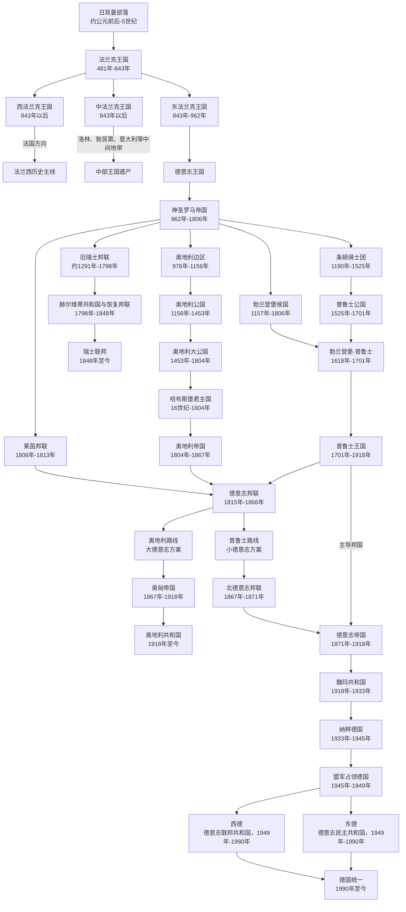

# 德意志历史

[返回欧洲历史](/%E4%BA%BA%E6%96%87%E7%A7%91%E5%AD%A6/%E5%8E%86%E5%8F%B2/%E6%AC%A7%E6%B4%B2/README.md)

这个目录按“德意志世界”来组织：早期的日耳曼部落、法兰克王国、东法兰克王国属于更广义的欧洲通史和西欧共同史；神圣罗马帝国、莱茵邦联、德意志邦联则直接放在本目录下，作为跨越现代国界的共同主线。普鲁士主导的德国国家史放在 [德国](/%E4%BA%BA%E6%96%87%E7%A7%91%E5%AD%A6/%E5%8E%86%E5%8F%B2/%E6%AC%A7%E6%B4%B2/%E5%BE%B7%E6%84%8F%E5%BF%97/%E5%BE%B7%E5%9B%BD/README.md)，奥地利和哈布斯堡分支放在 [奥地利](/%E4%BA%BA%E6%96%87%E7%A7%91%E5%AD%A6/%E5%8E%86%E5%8F%B2/%E6%AC%A7%E6%B4%B2/%E5%BE%B7%E6%84%8F%E5%BF%97/%E5%A5%A5%E5%9C%B0%E5%88%A9/README.md)，从帝国政治空间逐渐分化的邦联国家史放在 [瑞士](/%E4%BA%BA%E6%96%87%E7%A7%91%E5%AD%A6/%E5%8E%86%E5%8F%B2/%E6%AC%A7%E6%B4%B2/%E5%BE%B7%E6%84%8F%E5%BF%97/%E7%91%9E%E5%A3%AB/README.md)。瑞士在这里依据早期政治演进归类，不等同于德国国家史或单一德意志民族国家；德意志邦联之后，德国走向小德意志统一，奥地利走向奥匈帝国和现代奥地利共和国。

## 德意志共同背景与主线

日耳曼部落、法兰克王国、东法兰克王国等更早阶段已归入欧洲通史目录，本页保留为德意志历史的前史引用；神圣罗马帝国、莱茵邦联、德意志邦联为本目录下的共同主线笔记。

| 顺序 | 阶段 | 时间 | 简要概括 |
| --- | --- | --- | --- |
| 1 | [日耳曼部落](/%E4%BA%BA%E6%96%87%E7%A7%91%E5%AD%A6/%E5%8E%86%E5%8F%B2/%E6%AC%A7%E6%B4%B2/_%E9%80%9A%E5%8F%B2/%E5%90%8E%E7%BD%97%E9%A9%AC%E6%97%B6%E4%BB%A3%E7%9A%84%E6%97%A5%E8%80%B3%E6%9B%BC%E8%AF%B8%E5%9B%BD/README.md) | 约公元前后-5世纪 | 德意志历史的族群和地域源头之一。 |
| 2 | [法兰克王国](/%E4%BA%BA%E6%96%87%E7%A7%91%E5%AD%A6/%E5%8E%86%E5%8F%B2/%E6%AC%A7%E6%B4%B2/_%E9%80%9A%E5%8F%B2/%E5%90%8E%E7%BD%97%E9%A9%AC%E6%97%B6%E4%BB%A3%E7%9A%84%E6%97%A5%E8%80%B3%E6%9B%BC%E8%AF%B8%E5%9B%BD/%E6%B3%95%E5%85%B0%E5%85%8B%E7%8E%8B%E5%9B%BD/README.md) | 481年-843年 | 法兰克人建立的西欧强权，后来分裂出东西两条历史路径。 |
| 3 | [东法兰克王国](/%E4%BA%BA%E6%96%87%E7%A7%91%E5%AD%A6/%E5%8E%86%E5%8F%B2/%E6%AC%A7%E6%B4%B2/_%E9%80%9A%E5%8F%B2/%E5%90%8E%E7%BD%97%E9%A9%AC%E6%97%B6%E4%BB%A3%E7%9A%84%E6%97%A5%E8%80%B3%E6%9B%BC%E8%AF%B8%E5%9B%BD/%E6%B3%95%E5%85%B0%E5%85%8B%E7%8E%8B%E5%9B%BD/%E4%B8%9C%E6%B3%95%E5%85%B0%E5%85%8B%E7%8E%8B%E5%9B%BD.md) | 843年-962年 | 德意志王国和神圣罗马帝国形成前的关键阶段。 |
| 4 | [神圣罗马帝国](/%E4%BA%BA%E6%96%87%E7%A7%91%E5%AD%A6/%E5%8E%86%E5%8F%B2/%E6%AC%A7%E6%B4%B2/%E5%BE%B7%E6%84%8F%E5%BF%97/%E7%A5%9E%E5%9C%A3%E7%BD%97%E9%A9%AC%E5%B8%9D%E5%9B%BD/README.md) | 962年-1806年 | 以德意志地区为核心的中欧帝国结构。 |
| 5 | [莱茵邦联](/%E4%BA%BA%E6%96%87%E7%A7%91%E5%AD%A6/%E5%8E%86%E5%8F%B2/%E6%AC%A7%E6%B4%B2/%E5%BE%B7%E6%84%8F%E5%BF%97/%E8%8E%B1%E8%8C%B5%E9%82%A6%E8%81%94.md) | 1806年-1813年 | 神圣罗马帝国终结后的德意志诸邦重组。 |
| 6 | [德意志邦联](/%E4%BA%BA%E6%96%87%E7%A7%91%E5%AD%A6/%E5%8E%86%E5%8F%B2/%E6%AC%A7%E6%B4%B2/%E5%BE%B7%E6%84%8F%E5%BF%97/%E5%BE%B7%E6%84%8F%E5%BF%97%E9%82%A6%E8%81%94.md) | 1815年-1866年 | 奥地利和普鲁士竞争主导权的共同政治框架。 |

## 分支

| 分支 | 入口 | 时间 | 简要概括 |
| --- | --- | --- | --- |
| 德国 | [德国](/%E4%BA%BA%E6%96%87%E7%A7%91%E5%AD%A6/%E5%8E%86%E5%8F%B2/%E6%AC%A7%E6%B4%B2/%E5%BE%B7%E6%84%8F%E5%BF%97/%E5%BE%B7%E5%9B%BD/README.md) | 1157年至今 | 勃兰登堡、条顿骑士团、普鲁士、北德意志邦联、德意志帝国、东西德和统一德国。 |
| 奥地利 | [奥地利](/%E4%BA%BA%E6%96%87%E7%A7%91%E5%AD%A6/%E5%8E%86%E5%8F%B2/%E6%AC%A7%E6%B4%B2/%E5%BE%B7%E6%84%8F%E5%BF%97/%E5%A5%A5%E5%9C%B0%E5%88%A9/README.md) | 976年至今 | 奥地利边区、奥地利公国、哈布斯堡君主国、奥地利帝国、奥匈帝国和奥地利共和国。 |
| 瑞士 | [瑞士](/%E4%BA%BA%E6%96%87%E7%A7%91%E5%AD%A6/%E5%8E%86%E5%8F%B2/%E6%AC%A7%E6%B4%B2/%E5%BE%B7%E6%84%8F%E5%BF%97/%E7%91%9E%E5%A3%AB/README.md) | 约13世纪末至今 | 旧瑞士邦联从神圣罗马帝国政治空间中形成，经历宗教分裂、法国重组和1848年联邦建国。 |

## 相关欧洲历史

- 德意志前史与[后罗马时代的日耳曼诸国](/%E4%BA%BA%E6%96%87%E7%A7%91%E5%AD%A6/%E5%8E%86%E5%8F%B2/%E6%AC%A7%E6%B4%B2/_%E9%80%9A%E5%8F%B2/%E5%90%8E%E7%BD%97%E9%A9%AC%E6%97%B6%E4%BB%A3%E7%9A%84%E6%97%A5%E8%80%B3%E6%9B%BC%E8%AF%B8%E5%9B%BD/README.md)、[法兰克王国](/%E4%BA%BA%E6%96%87%E7%A7%91%E5%AD%A6/%E5%8E%86%E5%8F%B2/%E6%AC%A7%E6%B4%B2/_%E9%80%9A%E5%8F%B2/%E5%90%8E%E7%BD%97%E9%A9%AC%E6%97%B6%E4%BB%A3%E7%9A%84%E6%97%A5%E8%80%B3%E6%9B%BC%E8%AF%B8%E5%9B%BD/%E6%B3%95%E5%85%B0%E5%85%8B%E7%8E%8B%E5%9B%BD/README.md)、[东法兰克王国](/%E4%BA%BA%E6%96%87%E7%A7%91%E5%AD%A6/%E5%8E%86%E5%8F%B2/%E6%AC%A7%E6%B4%B2/_%E9%80%9A%E5%8F%B2/%E5%90%8E%E7%BD%97%E9%A9%AC%E6%97%B6%E4%BB%A3%E7%9A%84%E6%97%A5%E8%80%B3%E6%9B%BC%E8%AF%B8%E5%9B%BD/%E6%B3%95%E5%85%B0%E5%85%8B%E7%8E%8B%E5%9B%BD/%E4%B8%9C%E6%B3%95%E5%85%B0%E5%85%8B%E7%8E%8B%E5%9B%BD.md)直接相连。
- 神圣罗马帝国同时牵涉德意志、[意大利](/%E4%BA%BA%E6%96%87%E7%A7%91%E5%AD%A6/%E5%8E%86%E5%8F%B2/%E6%AC%A7%E6%B4%B2/%E6%84%8F%E5%A4%A7%E5%88%A9/README.md)、[法国](/%E4%BA%BA%E6%96%87%E7%A7%91%E5%AD%A6/%E5%8E%86%E5%8F%B2/%E6%AC%A7%E6%B4%B2/%E6%B3%95%E5%9B%BD/README.md)、[奥地利](/%E4%BA%BA%E6%96%87%E7%A7%91%E5%AD%A6/%E5%8E%86%E5%8F%B2/%E6%AC%A7%E6%B4%B2/%E5%BE%B7%E6%84%8F%E5%BF%97/%E5%A5%A5%E5%9C%B0%E5%88%A9/README.md)和教皇政治。
- 瑞士早期与帝国和哈布斯堡关系密切，现代多语言联邦的发展应同时与[中欧历史空间](/%E4%BA%BA%E6%96%87%E7%A7%91%E5%AD%A6/%E5%8E%86%E5%8F%B2/%E6%AC%A7%E6%B4%B2/_%E9%80%9A%E5%8F%B2/%E4%B8%AD%E6%AC%A7%E5%8E%86%E5%8F%B2%E7%A9%BA%E9%97%B4.md)、法国和意大利历史对读。
- 普鲁士、奥地利和俄国在中东欧竞争时，可与[东斯拉夫](/%E4%BA%BA%E6%96%87%E7%A7%91%E5%AD%A6/%E5%8E%86%E5%8F%B2/%E6%AC%A7%E6%B4%B2/%E6%96%AF%E6%8B%89%E5%A4%AB/%E4%B8%9C%E6%96%AF%E6%8B%89%E5%A4%AB/README.md)及[波兰-立陶宛联邦](/%E4%BA%BA%E6%96%87%E7%A7%91%E5%AD%A6/%E5%8E%86%E5%8F%B2/%E6%AC%A7%E6%B4%B2/%E6%96%AF%E6%8B%89%E5%A4%AB/%E8%A5%BF%E6%96%AF%E6%8B%89%E5%A4%AB/%E6%B3%A2%E5%85%B0-%E7%AB%8B%E9%99%B6%E5%AE%9B%E8%81%94%E9%82%A6.md)对读。
- 拿破仑重组德意志诸邦与莱茵邦联，应与[法国](/%E4%BA%BA%E6%96%87%E7%A7%91%E5%AD%A6/%E5%8E%86%E5%8F%B2/%E6%AC%A7%E6%B4%B2/%E6%B3%95%E5%9B%BD/README.md)和[法兰西第一帝国](/%E4%BA%BA%E6%96%87%E7%A7%91%E5%AD%A6/%E5%8E%86%E5%8F%B2/%E6%AC%A7%E6%B4%B2/%E6%B3%95%E5%9B%BD/%E6%B3%95%E5%85%B0%E8%A5%BF%E7%AC%AC%E4%B8%80%E5%B8%9D%E5%9B%BD.md)对读。

## 前史、共同空间与国家分化

罗马作者所称“日耳曼人”包含多个语言和政治群体，并不是一个已经自觉统一的民族。民族大迁徙后，法兰克王国把莱茵两岸、基督教会和罗马行政遗产连接起来。843年《凡尔登条约》分出东法兰克，911年加洛林东支绝嗣后，公爵推举康拉德一世；919年亨利一世与936年奥托一世继位，萨克森王朝在击败马扎尔人、控制主教任命与取得意大利王位的过程中发展为德意志王权。962年皇帝加冕开启以德意志为核心却跨越意大利、波希米亚和勃艮第的神圣罗马帝国。

中世纪“德意志”首先是语言、王国和帝国政治空间，不是现代民族国家。帝国内的奥地利、勃兰登堡、巴伐利亚、萨克森、教会领和自由市形成各自制度；瑞士邦联逐渐脱离，哈布斯堡建立跨中欧复合君主国，普鲁士又以帝国内外领地结合崛起。宗教改革和三十年战争把教派与邦国结构固定下来，1648年后的帝国仍通过议会、法院和行政圈运作。

拿破仑时代终结旧帝国并整并小领地。1815年德意志邦联恢复共同安全框架，却无法同时解决宪政、民族统一与普奥双强竞争。1848年法兰克福国民议会尝试以公民权和议会建立国家失败；1866年普鲁士击败奥地利后，小德意志路线通过北德意志邦联与1871年帝国完成国家化，奥地利转为奥匈双元制。瑞士则经1847年短战建立1848年联邦，呈现另一种从帝国邦联空间走向现代国家的道路。

## 跨分支关键转折

| 时间 | 共同转折 | 德国、奥地利与瑞士方向 |
| --- | --- | --- |
| 843—962 | 法兰克分裂、东法兰克与奥托帝国 | 德意志王权与跨区域帝国形成。 |
| 1156 / 1157 | 奥地利公国与勃兰登堡侯国 | 帝国内两条后来的王朝国家核心出现。 |
| 1291—1499 | 瑞士盟约与实际独立 | 山地、城市州建立邦联并脱离帝国直接控制。 |
| 1517—1648 | 宗教改革、三十年战争与威斯特伐利亚 | 教派邦国、哈布斯堡复合君主国与瑞士法律独立同时定型。 |
| 1701—1763 | 普鲁士称王与普奥战争 | 德意志世界形成普鲁士—奥地利双强。 |
| 1803—1815 | 帝国重组、解体与维也纳秩序 | 莱茵邦联后建立德意志邦联；瑞士中立获承认；奥地利主持保守秩序。 |
| 1847—1849 | 瑞士建联与德意志革命 | 瑞士完成联邦宪制，法兰克福统一失败。 |
| 1866—1871 | 普奥战争、奥匈折衷和德国统一 | 德国与奥地利国家线正式分开。 |
| 1918 | 两大帝国瓦解 | 德国、奥地利转为共和国，瑞士维持联邦中立。 |
| 1933—1945 | 法西斯与战争 | 纳粹德国吞并奥地利并发动战争；瑞士武装中立。 |
| 1949—1990 | 两德分裂与欧洲整合 | 西德、东德对峙；奥地利1955恢复主权；三国走不同中立 / 联盟道路。 |
| 1990—2026 | 德国统一与欧洲化 | 德国、奥地利在欧盟内发展，瑞士以双边协定维持深度联系。 |
